# 芯片产业链全栈技术图谱与演进架构
## 完备调研报告 · 公开版

> 版本 v1.13-public · 初版 2026-06-13 · 维护 2026-09-04
> 公开版：仅技术与产业格局视角，不含股票代码、仓位建议与证券推荐
> 公司名口径：海外公司首次出现优先写作“常用中文名（英文名）”；没有稳定中文品牌名的公司保留英文，并补充中文业务身份。文献题名与链接按原始来源保留。
>

---


## 执行摘要

> 阅读路径：10 分钟读本摘要｜45 分钟读第 0、1、14、15、16、22、23、36 章｜3 小时读全本。

### 本次维护快照（截至 2026-09-04）

| 层级 | 已核实更新 | 应如何使用 |
|---|---|---|
| **事实 F** | 博通（Broadcom）FY2026 Q3 披露公司定义的 AI 半导体收入 167 亿美元，美满电子（Marvell）FY2027 Q2 数据中心收入 21.715 亿美元，新思科技（Synopsys）FY2026 Q3 收入 24.768 亿美元 [F-86] [F-87] [F-88]；英伟达（NVIDIA）FY2027 Q2 收入 962.21 亿美元、数据中心收入 890 亿美元，Rubin 仍处公司自报全量生产与合作伙伴机架运行阶段 [F-82] [G-25] | 博通的 AI 半导体指标、美满电子的数据中心终端市场和新思科技的 Design Automation 分部不是同一口径；三者不能机械相加，也不能直接映射到某颗芯片、某家客户或纯 EDA 的收入 |
| **判断 J** | 这一周真正新增的证据不在路线图，而在收入表：定制加速器、网络连接和 EDA/IP 需求已进入供应商财务披露；但并购并表、软件收入和客户集中度让“AI 增长”比标题数字复杂得多 | 先拆分部、产品口径和并购影响，再检查毛利、经营现金流、应收、存货及客户集中度；没有这些桥接，就不把供应商总收入写成 AI 芯片需求 |
| **复核点** | 博通 AI 半导体指标的产品构成与 Q4 指引兑现；美满电子数据中心收入、谷歌（Google）定制芯片协议的实际采购与客户集中度；新思科技的有机 EDA 增长、安似科技（Ansys）并表和 Design IP 复苏；Rubin 客户验收、HBM4E 认证与 High-NA 客户插入 | 每季优先用 10-Q/10-K、公司财报表和产品可用性回读；合同、认股权证归属条件、backlog 与收入确认分开记录，旧路线图无新证据时仍保留为公司目标或研究假设 |

### 本报告要回答的六个问题

1. **摩尔定律为什么从「几何缩微」转向「系统级重构」？**
 栅极长度缩到 5nm 以下时，量子隧穿、互连 RC 延迟、光刻成本三个物理与经济瓶颈同时收紧；产业必须在系统层面（封装、互连、软硬协同）寻找新的性能源泉。

2. **芯片产业链为什么不能只看「设计、制造、封测」三段？**
 现代半导体的真实价值链是「EDA → IP → 设备 → 材料 → 制造 → 封测 → 系统整合」七层结构，毛利率从 EDA/IP 端的 80%-95% 逐层向下递减到封测的 15-25%。任何对产业的认知如果只停留在三段论，必然丢失最高毛利的环节。

3. **AI 时代为什么瓶颈从 GPU 扩散到 HBM、CoWoS、CPO、电力和软件生态？**
 单颗 GPU 算力增长（10x/3 年）远快于 HBM 带宽增长（2x/3 年），导致存储墙成为系统级瓶颈；CoWoS 封装、光互连、HBM 良率轮流成为限制大模型训练速度的真实瓶颈。

4. **中国大陆半导体产业的真实位置在哪里？**
 公开拆解已提供 7nm 等效逻辑芯片的实物证据，但产能、良率与供应链可持续性没有统一的一手公开口径；设备、材料、EDA 与光刻机国产化率的行业估算也因样本、节点和收入范围而异。更稳妥的研究方式，是把样品、小批验证、稳定量产和收入占比分开，而不是用一个综合百分比代表全行业。

5. **未来 5-10 年，哪些技术路线最值得持续观察？**
 先进封装（CoWoS / Foveros / SoIC）、HBM 代际演进（HBM4 → HBM5）、光通信 / CPO、SiC / GaN / 二维材料、CSP 自研 ASIC、端侧 AI 芯片。

6. **如何把「技术突破」翻译成可验证的财务判断？**
 不把产业叙事直接等同于利润，而是通过「技术节点 → 真实需求 → 产能/供给 → 价格与份额 → 收入确认 → 毛利/现金流 → 估值」链条逐层验证，并对存货、折旧、研发资本化、客户集中度与自由现金流做会计勾稽。

### 五条产业研究主线

| 主线 | 核心驱动 | 关键技术环节 | 时间窗口 |
|---|---|---|---|
| 一、先进制程国产替代 | 出口管制 + 国家安全 + 产业基金 | EDA、刻蚀、薄膜沉积、量测 | 2024-2030 |
| 二、先进封装 / HBM / CoWoS | AI 训练算力 + 存储墙 | CoWoS、HBM、混合键合、ABF | 2024-2028 |
| 三、光通信 / CPO / 硅光 | 数据中心带宽 + 功耗 | 1.6T / 3.2T、硅光、CPO | 2025-2030 |
| 四、SiC / GaN / 二维材料 | EV、数据中心电源、6G | SiC、GaN HEMT、Ga₂O₃ | 2025-2032 |
| 五、异构计算 / 端侧 AI | 推理下沉 + CSP 自研 | CSP ASIC、智驾 SoC、边缘 NPU | 2025-2030 |

### 三类系统性风险

**风险一：AI Capex 口径与下修风险。** 云厂商披露的 Capex 通常同时包含服务器、网络、数据中心建筑，个别公司还包含履约网络等非 AI 投资；不同财年、融资租赁与应付设备口径不应直接混加。附录 G 改用逐公司实际值/指引表，再通过数量、ASP、份额和时滞映射到 HBM、先进封装、光互连和 ASIC；任一环节的指引下修、投产延迟或折旧压力超预期，都可能触发盈利与估值的连锁修正。

**风险二：国产替代兑现节奏。** 设备客户验证 18-36 个月，材料 12-24 个月。EDA 14nm 以下、光刻机国产化、量测设备国产化均存在明确技术鸿沟，兑现速度高度依赖具体技术里程碑。

**风险三：估值先行 vs 业绩兑现的张力。** 热门技术路线（CPO、HBM、AI 芯片）2025-2026 年估值已部分透支，存在「估值先行 + 业绩追赶」的高波动期。

### 读者路径建议

**10 分钟版**：执行摘要 + 第 1.5 节国产化雷达图 + 附录 G.5 子赛道研究卡 + 附录 H 关键事实与信源说明。

**45 分钟版**：执行摘要 → 第 0 章 → 第 1 章 → 第 14 章（CoWoS）→ 第 15 章（HBM）→ 第 16 章（光通信 / CPO）→ 第 22 章（AI 芯片格局）→ 第 23 章（ASIC 与 TPU）→ 第 36.5 节（韬定律）→ 附录 G（财报与估值）→ 附录 H。

**3 小时版**：全本通读，重点关注每卷末尾的「核心要点」清单与参考文献的一手来源。

---

<a id="toc"></a>

## 目录

- [卷一 · 导论与全景框架](#vol-1)
- [卷二 · 上游基石——设计、IP 与 EDA](#vol-2)
- [卷三 · 底层物理与材料突破](#vol-3)
- [卷四 · 前道工艺与制造](#vol-4)
- [卷五 · 中道与先进封装](#vol-5)
- [卷六 · 互连与存储体系重构](#vol-6)
- [卷七 · 下游计算节点](#vol-7)
- [卷八 · 软件栈与软硬协同](#vol-8)
- [卷九 · 应用驱动与终端市场](#vol-9)
- [卷十 · 地缘政治与产业框架](#vol-10)
- [附录 A–H](#appendices)

---

<a id="vol-1"></a>

## 卷一 · 导论与全景框架

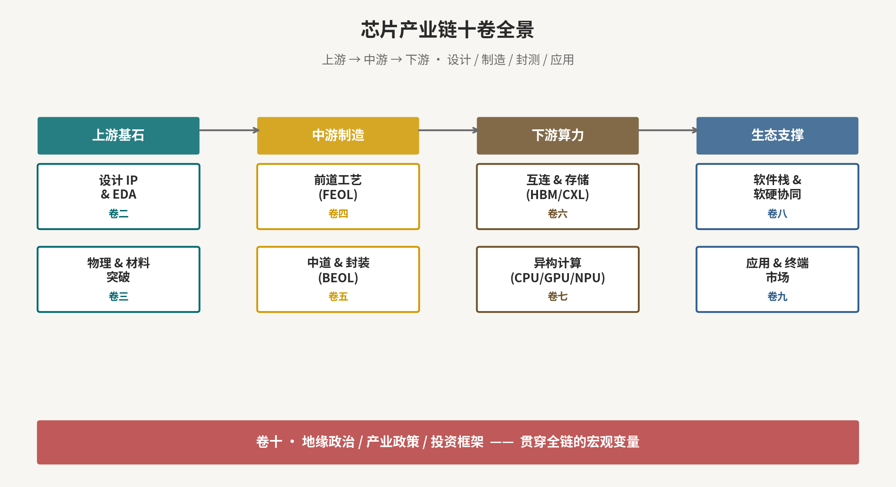


### 第 0 章　导论：摩尔定律的系统级重构与全栈技术演进范式

#### 0.1 从"几何微缩"到"系统级博弈"的范式跃迁

半导体产业过去五十年的核心驱动力是戈登·摩尔在1965年提出的经验规律：集成电路上的晶体管数量每18至24个月翻番，单位性能成本随之下降约50%[0-1]。这一定律在经历了从微米到百纳米再到十纳米以内的漫长征程后，正面临多维度的物理与经济双重极限。理解这一转折，是把握当前半导体产业格局重构的逻辑起点。

从物理层面看，当栅极长度缩减至5nm以下，CMOS晶体管的沟道厚度已接近原子尺度。量子隧穿效应使得源漏之间的载流子可以直接穿越势垒，导致静态功耗急剧上升；亚阈值漏电流在室温下每10年量级的缩放中以指数速率增加，成为先进制程芯片热设计功耗（TDP）居高不下的根本原因之一[0-2]。与此同时，后端互连层中的铜导线随宽度缩小，电阻率反而因晶界散射和表面散射效应大幅上升，金属互连的RC延迟已在先进制程中超过晶体管本身的开关延迟，成为芯片性能的主要瓶颈[0-3]。光刻的物理极限亦日益显现：ASML的EUV平台（13.5nm波长）已接近当前技术路径的理论分辨率边界，High-NA EUV（0.55NA）的引入代价高达数亿美元/台，使得制程推进的成本曲线愈加陡峭[0-4]。

从经济层面看，台积电（TSMC）的技术节点成本数据揭示了一个清晰的拐点：从28nm到7nm，单位晶圆成本约增加3倍；从7nm到3nm，再增加约2倍；而从3nm到2nm乃至A14/A10节点，每一步推进都面临掩膜成本、工艺良率损失和设备折旧的叠加压力[0-5]。以一套完整的3nm Tape-out为例，光罩组费用已超过1500万美元，这意味着能够负担先进制程设计的客户群体正在快速收窄至苹果、英伟达、AMD、高通等少数超大规模买家[0-6]。这一经济壁垒并非技术问题，而是产业结构性分化的前兆。

从设计层面看，40亿乃至千亿晶体管SoC的验证复杂度正以超线性速率上升[0-7]。功能仿真的向量穷举空间已无法被任何有限算力覆盖，形式验证（Formal Verification）的收敛困难导致流片前仍存在大量"已知未知"的逻辑漏洞。EDA工具链本身已成为制约芯片设计能力扩展的关键瓶颈，而EDA厂商和设计团队的稀缺性构成了比制造工艺更难克服的软性壁垒[0-8]。

**核心要点：**
- 物理壁垒：量子隧穿、亚阈值漏电、互连 RC 延迟、光刻物理极限
- 经济壁垒：单片晶圆成本曲线（5nm→3nm→2nm→A14/A10/A7→A2）拐点
- 设计壁垒：EDA 工具链复杂度爆炸、验证收敛困难

#### 0.2 CMOS 2.0：imec 路线图与"逻辑折叠"思想

imec（比利时微电子研究中心）在其2023至2030年路线图中明确提出"CMOS 2.0"概念，核心思想是：在平面几何尺寸难以继续等比缩放的条件下，通过三维空间的折叠与异质集成延续等效的性能提升速率[0-9]。具体路径包括CFET（Complementary FET，将NMOS和PMOS在垂直方向叠放）、背面电源传输网络（Backside Power Delivery Network，BSPDN）、以及将逻辑-存储-模拟的不同工艺模块通过晶圆键合或混合键合实现单封装集成。imec预测，"逻辑折叠"路线在A14至A2节点之间可提供额外30至40%的面积效率提升，相当于实现了一代"等效摩尔缩放"[0-10]。

华为于 2026 年 5 月 25 日 ISCAS（IEEE 国际电路与系统研讨会）上由董事、半导体业务部总裁何庭波正式发布"韬（τ）定律"（Tau Scaling Law）——以"时间（τ）缩微"替代"几何缩微"作为半导体与电子系统演进的新指导原则[0-13]。其核心技术抓手为"逻辑折叠（LogicFolding）"，通过将数字/模拟/存储电路按垂直方向堆叠并以细间距混合键合互连，缩短关键路径走线长度，从而在固定制程节点上同时提升晶体管密度、能效与时钟频率。这与 imec 的 CMOS 2.0 思路在本质上一脉相承，但路径选择更进一步：华为不仅在器件与电路层折叠，更将"软件—架构—芯片—系统"做全栈协同（包含其自研的灵衢总线 UnifiedBus），形成与摩尔定律几何缩微互补的另一条主线。两者的张力折射出全球半导体创新在制裁约束下的分叉态势。

系统级异构集成（Heterogeneous Integration）已从概念走向产品主流[0-12]。苹果M Ultra芯片通过UltraFusion技术将两颗M Max晶圆用硅中介层以2.5D方式互连，实现2.5TB/s的带宽；AMD MI300X将12个计算Chiplet与HBM3内存在同一基板上集成；英特尔Meteor Lake采用Foveros直接键合实现逻辑-IO-SoC三芯分离。这些案例表明，单一节点驱动的时代已经终结，系统架构的价值创造能力正超越制造工艺本身[0-4]。

**核心要点：**
- 华为"韬（τ）定律"（Tau Scaling Law，2026 ISCAS 何庭波发布）以时间缩微替代几何缩微
- 系统级异构集成（Heterogeneous Integration）取代单点节点驱动

#### 0.3 报告全栈研究框架的六层结构

本报告采用六层（L1-L6）的全栈分析框架，力求覆盖从基础物理极限到终端应用生态的完整价值链[0-1]。六层结构的设置并非任意划分，而是遵循芯片产业链价值创造与技术依赖关系的内在逻辑：下层技术是上层架构的约束边界，上层需求则是下层研发方向的牵引动力。

L1（基础物理与材料）是整个报告的根基，涵盖硅基极限、宽禁带半导体、二维材料等基础科学与工程内容；L2（设计与IP）对应EDA工具链、IP授权生态及Chiplet设计方法学；L3（制造工艺）覆盖光刻、薄膜沉积、刻蚀、CMP、扩散注入等前道工艺；L4（封装与互连）对应先进封装（CoWoS、HBM、Foveros等）和系统级互连；L5（计算架构）涉及CPU/GPU/NPU/晶圆级/光子计算/类脑计算/量子计算等多样化计算范式；L6（应用与生态）覆盖人工智能、自动驾驶、通信基础设施、电力电子等终端市场[0-7]。

这一框架的价值在于：它不仅是知识组织结构，也是一条产业分析链——当某层发生技术突破或供应链中断时，其向上的价值重构路径和向下的约束释放效应都可以在框架内被定位和量化。对于产业研究者而言，六层结构提供了一套系统性的“技术基本面分析”工具[0-5]。

**核心要点：**
- L1 基础物理与材料 → L2 设计与 IP → L3 制造工艺 → L4 封装与互连 → L5 计算架构 → L6 应用与生态

#### 0.4 核心研究问题与产业研究主线

本报告围绕五条主线构建产业研究逻辑，每条主线对应一个需要持续验证的技术—产业窗口，不预设其必然转化为证券收益。

主线一是先进制程国产替代。美国 BIS 自 2022 年以来对先进计算芯片、半导体制造设备、最终用途和相关主体实施多轮规则调整；2025 年全球 AI Diffusion Rule 被撤回，但中国相关许可、所有权和最终用途限制继续存在（见第 36 章）。这些约束推动国内 EDA、光刻、离子注入、刻蚀和薄膜沉积等环节加速验证。国产化率最低的环节可能具有更大替代空间，但 EDA、光刻机等综合比例高度依赖节点、产品和收入范围，必须用客户验证、量产与收入占比分层复核[0-8]。

主线二是先进封装与HBM产能外溢。英伟达H100/H200/B200系列对HBM3/HBM3E的需求以每年翻倍的速度增长，台积电CoWoS-S/L产能严重不足，推动封装产能向日月光等国际 OSAT 与国内头部 OSAT 厂商外溢[0-12]；同时国内的先进封装技术能力处于追赶曲线上，具备弹性空间。

主线三是光通信/CPO/硅光的"从一到十"。数据中心内互连带宽需求已超出铜缆的物理极限，共封装光学（CPO）和硅光模块被视为下一代数据中心架构的基础设施[0-3]。该赛道当前处于技术验证向量产切换的临界点，市值弹性极大。

主线四是第三代半导体（SiC/GaN）与二维半导体。电动汽车渗透率提升持续拉动SiC功率器件需求，GaN在快充和5G射频领域已实现量产，两者均处于渗透率曲线的陡峭上升段[0-2]。二维材料则是2030年后的前瞻布局方向。

主线五是异构计算架构。从CPU-GPU协同到NPU专用加速，再到晶圆级系统（Wafer Scale Engine）、光子计算和量子计算，计算架构的多样化将对应不同的芯片设计公司、IP供应商和封装技术路线的价值重构[0-9]。

**核心要点：**
- 主线一：先进制程国产替代（设备 + 材料 + EDA）
- 主线二：先进封装 + HBM + CoWoS 产能外溢
- 主线三：光通信 / CPO / 硅光的"从一到十"
- 主线四：第三代半导体（SiC/GaN）+ 二维半导体
- 主线五：异构计算（CPU/GPU/NPU/晶圆级/光子/类脑/量子）

#### 第 0 章参考文献

[0-1] Moore, Gordon E. Cramming more components onto integrated circuits. Electronics Magazine. 1965. <https://doi.org/10.1109/JPROC.1998.658762>

[0-2] Lundstrom, Mark. Moore's Law Forever? Science. 2003. <https://doi.org/10.1126/science.1079567>

[0-3] ITRS. International Technology Roadmap for Semiconductors: Interconnect Chapter. SIA. 2022. <https://www.semiconductors.org/resources/2022-sia-factbook/>

[0-4] ASML. ASML Annual Report 2023: Technology Overview. ASML Investor Relations. 2024. <https://www.asml.com/en/investors/annual-report>

[0-5] TSMC. TSMC Technology Symposium 2023: Advanced Process Technology Roadmap. TSMC Newsroom. 2023. <https://www.tsmc.com/english/news-events/blog-article-20230601>

[0-6] Bureau of Industry and Security . Export Administration Regulations: Semiconductor Technology Controls. U.S. Department of Commerce. 2023. <https://www.bis.doc.gov/index.php/regulations/export-administration-regulations-ear>

[0-7] SIA. 2023 State of the U.S. Semiconductor Industry. Semiconductor Industry Association. 2023. <https://www.semiconductors.org/resources/2023-state-of-the-u-s-semiconductor-industry/>

[0-8] SemiAnalysis. China Semiconductor Self-Sufficiency Report 2023. SemiAnalysis. 2023. <https://semianalysis.com/2023/10/17/china-semiconductor-self-sufficiency/>

[0-9] imec. CMOS 2.0: imec's Technology Roadmap 2023–2030. imec. 2023. <https://www.imec-int.com/en/articles/imec-technology-forum-2023-cmos-2-0>

[0-10] imec. Scaling Beyond 2nm: Backside Power Delivery and CFET. imec Research Highlights. 2023. <https://www.imec-int.com/en/articles/scaling-beyond-2nm>

[0-11] TechInsights. Huawei Kirin 9000S Teardown: Process Node Analysis. TechInsights. 2023. <https://www.techinsights.com/blog/huawei-mate-60-pro-kirin-9000s-analysis>

[0-12] DigiTimes. Advanced Packaging Capacity Constraints and OSAT Market Dynamics 2023–2024. DigiTimes Research. 2024. <https://www.digitimes.com/news/a20240115PD211.html>

[0-13] Huawei Technologies. HUAWEI Presents the Tau (τ) Scaling Law at ISCAS 2026. Huawei Newsroom. 2026-05-25. <https://www.huawei.com/cn/news/2026/5/ieee-iscas-tau-scaling>

[0-14] CGTN. Huawei unveils 'Tau Scaling Law' to hit 1.4nm equivalent by 2031. CGTN News. 2026-05-25. <https://news.cgtn.com/news/2026-05-25/Huawei-unveils-Tau-Scaling-Law-to-hit-1-4nm-equivalent-by-2031-1Nr3ohj1mqk/p.html>

[0-15] 蓝鲸新闻 / 新浪财经. 华为正式发布韬（τ）定律背后. 新浪财经. 2026-05-26. <https://finance.sina.com.cn/stock/t/2026-05-26/doc-inhzctrf2.shtml>

---

### 第 1 章　半导体产业链全景图与价值链解构

#### 1.1 全产业链三大段落：设计（Fabless）— 制造（Foundry）— 封测（OSAT）

现代半导体产业链在过去三十年中完成了从纵向一体化向水平专业化的深刻结构演变，最终形成以"设计-制造-封测"三段为核心的分工格局[1-1]。设计公司（Fabless）负责芯片架构定义、RTL设计和物理实现，不拥有晶圆产线；晶圆代工厂（Foundry）提供制造平台，以TSMC、三星Foundry、国内头部代工厂为代表；封测厂（OSAT，Outsourced Semiconductor Assembly and Test）承接后端封装、测试、分选工序，以日月光、国内头部 OSAT为代表[1-2]。这一专业化分工使得每个环节都能在资本和技术上高度专注，推动了整体产业效率的大幅提升。

三段分工的形成有其历史逻辑。1987年台积电的成立是关键节点，它第一次将"制造即服务"的商业模式推向规模化，释放了大量无需自建工厂即可创业的芯片设计公司[1-3]。高通、博通、联发科等Fabless巨头的崛起，正是Foundry模式成立后的产物。在此之前，英特尔、德州仪器、东芝等IDM（Integrated Device Manufacturer）模式主导产业，设计与制造不可分割。

当前三段分工面临的新动态是：各环节在先进封装技术推动下出现重新融合的趋势[1-4]。TSMC的InFO、CoWoS等先进封装工艺使其从纯晶圆代工向Foundry+Packaging延伸；英特尔则通过Foundry Services战略重新切入代工市场[1-5]；而OSAT中的高端厂商（如日月光Holding）正通过系统级封装（SiP）能力向设计服务渗透。三段分工的边界正在模糊，但核心分工逻辑短期内不会根本改变。

**核心要点：**
- 设计（Fabless）、制造（Foundry）、封测（OSAT）三段专业化分工
- TSMC 1987年成立开创代工模式，释放 Fabless 创业空间
- 先进封装推动三段边界模糊化，但核心分工逻辑延续

#### 1.2 IDM 模式 vs Fabless+Foundry 模式的历史演进与再融合

IDM模式的优势在于设计与制造的深度协同：器件工程师可以根据工艺特性优化电路设计，制造团队也可以针对产品需求调整工艺参数，形成正向反馈循环[1-6]。英特尔的CPU产品长期通过"Tick-Tock"（新工艺-新架构交替推进）策略保持市场领先，其核心竞争力正是IDM模式下设计与制造深度绑定的产物。三星在存储芯片领域同样依靠IDM模式构建了强大的成本和技术壁垒[1-7]。

然而，IDM模式的高资本强度在先进制程节点成为致命负担[1-8]。3nm制造线的单座Fab投资超过200亿美元，仅极少数公司能够负担。英特尔在10nm/7nm节点的延期不仅暴露了其IDM模式在工艺研发上的风险集中性，也直接导致其市场份额向AMD（依托TSMC代工）快速流失[1-5]。这是"IDM模式遭遇先进制程天花板"的教科书案例。

当前的趋势是"IDM Lite"——英特尔宣布其Intel 18A/14A节点同时面向内部产品和外部客户开放，本质上是一种IDM与Foundry的混合模式[1-9]。与此同时，三星的"Gate-All-Around（GAA）2nm"工艺也面向高通等外部客户推进，但良率问题严峻[1-10]。IDM与Fabless模式的再融合，折射出先进制程高投资压力下整个产业寻求资本效率均衡的深层逻辑。

**核心要点：**
- IDM 模式优势：设计制造深度协同
- 英特尔 10nm 延期：IDM 模式在先进制程的风险案例
- IDM Lite（Intel 18A 对外开放）：IDM 与 Foundry 的再融合趋势

#### 1.3 产业链价值分布（毛利率结构）：EDA/IP > 设备 > 设计 > 制造 > 封测 > 材料

产业链各环节的毛利率结构清晰揭示了价值密度的分布[1-11]。EDA软件（新思科技、楷登电子）毛利率约80至85%，接近纯软件公司水平，反映了极高的知识壁垒和近似垄断的竞争格局；IP授权（Arm）毛利率约95%，版税收入接近无边际成本的纯知识产权变现。半导体设备（ASML、应用材料、泛林）毛利率约45至55%，综合了制造成本和极高的技术溢价。芯片设计公司（英伟达、高通）毛利率视产品线在50至75%区间，其中AI加速芯片溢价显著[1-2]。晶圆代工（台积电先进制程约55至60%毛利）得益于技术垄断溢价；成熟制程代工毛利约35%。封测厂毛利最低，约15至25%，属于劳动与资本双密集型的低溢价环节；材料供应商毛利约30至45%，日系厂商因技术垄断略高[1-12]。

这一价值分布格局对产业研究具有直接含义：在产业链国产替代的早期阶段，产业弹性最高的环节代表企业往往是毛利率扩张空间最大的国产EDA和设备商，因为当前国产替代产品尚未实现溢价，随能力提升后的毛利率修复弹性显著[1-1]。而成熟制程代工和封测环节的国产厂商面临更强的价格竞争压力，盈利扩张路径相对受限。

**核心要点：**
- EDA/IP 毛利率 80-95%（知识垄断溢价）
- 设备 45-55%，设计公司 50-75%，晶圆代工 35-60%
- 封测 15-25%（最低），材料 30-45%
- 国产替代产业弹性最高处：EDA + 设备（当前国产溢价尚未兑现）

#### 1.4 全球区域格局

半导体的全球区域专业化并非自然演化的结果，而是数十年来政策、资本、人才与技术积累共同塑造的历史产物[1-3]。美国在芯片设计（高通、英伟达、英特尔、AMD、苹果）和半导体设备（应用材料AMAT、泛林Lam Research、科磊KLA）方面占据绝对主导；荷兰以ASML一家公司的光刻机垄断构建了对全球先进制程的实质控制[1-4]；日本凭借信越化工、胜高（Sumco）、JSR、TOK等企业掌控硅片、光刻胶、CMP材料等关键上游耗材，以材料实力支撑产业链[1-12]；韩国以三星、SK海力士为核心统治全球存储芯片（DRAM和NAND Flash）[1-7]；中国台湾以台积电为核心，辅以联发科（设计）、日月光（封测）、南亚科技（DRAM），构成全球最重要的代工与封测中心。

中国大陆在过去二十年中依托内需市场和政策扶持快速成长，但在先进制程领域仍处于明显落后地位[1-10]。中国大陆头部纯代工厂商当前可量产的最先进节点约为7nm级别（N+2工艺，于2023年出现在华为Mate 60 Pro），但良率和产能均无法与台积电7nm相比[1-9]。出口管制的持续强化正在将中国大陆的追赶路径切割为一条更为艰难但又更为内生的自主发展轨道。

**核心要点：**
- 美国：设计 + 设备双霸主
- 荷兰（ASML）：光刻机单点垄断
- 日本：材料 + 设备（半导体化学品、硅片）
- 韩国：存储（DRAM + NAND）双寡头
- 中国台湾：代工 + 封测全球中心
- 中国大陆：追赶者，先进制程受制裁约束

#### 1.5 国产化进度雷达图

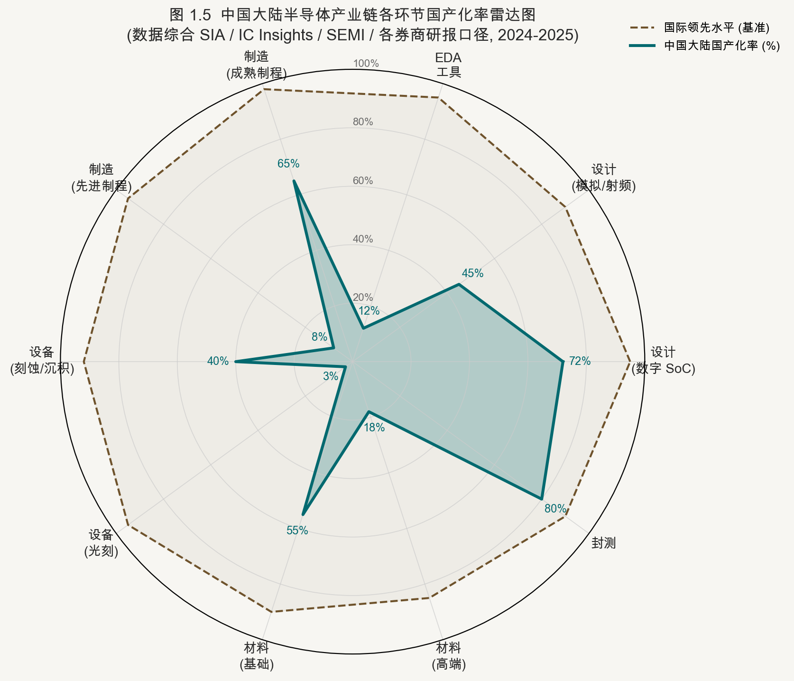


客观评估中国大陆半导体各环节的国产化率，是制定投资策略的前提[1-1]。当前格局是：设计端已相对成熟，以手机SoC、AI芯片、FPGA等为代表的国内设计公司实力达到国际主流水准的70%以上；但制造端（先进制程<15%国产化）、EDA（<15%）和光刻设备（<5%）仍是最薄弱的环节[1-11]。

设备端整体国产化率约25%，其中刻蚀设备（国内主要刻蚀设备厂商）是国产化程度最高的子环节，在部分工艺步骤上实现了对前沿客户的供货；薄膜沉积（国内头部薄膜沉积厂商）在快速追赶；而量测（Metrology）、离子注入（国内离子注入设备厂商）国产化程度仍较低[1-8]。材料端综合国产化率约35%，硅片、光刻胶、电子特气等环节均处于从基础品向高端品的突破阶段。

从产业视角看，国产化率低的环节往往面临更强的政策推动与更大的替代空间，但也伴随更长的验证周期；国产化率较高而技术能力仍有提升空间的环节（如刻蚀、CMP）则需重点核查份额、良率与服务收入能否持续改善[1-6]。

**核心要点：**
- 设计端 70%+（最成熟），制造端先进制程 <15%（最薄弱）
- 设备端约 25%（刻蚀最高，光刻最低）
- 材料端约 35%（基础品已突破，高端品仍依赖进口）
- EDA < 15%（高价值、低国产化，弹性空间最大）

#### 第 1 章参考文献

[1-1] SIA. 2023 State of the U.S. Semiconductor Industry. Semiconductor Industry Association. 2023. <https://www.semiconductors.org/resources/2023-state-of-the-u-s-semiconductor-industry/>

[1-2] IC Insights. Global Semiconductor Revenue Forecast and Market Structure Analysis 2024. IC Insights / Omdia. 2024. <https://www.icinsights.com/news/bulletins/ic-market-research/>

[1-3] TSMC. TSMC 2022 Annual Report: Business Overview. TSMC Investor Relations. 2023. <https://www.tsmc.com/english/investorRelations/annual_reports>

[1-4] ASML. ASML 2023 Annual Report: Market Position and Technology Leadership. ASML. 2024. <https://www.asml.com/en/investors/annual-report>

[1-5] Intel. Intel Foundry Services: IDM 2.0 Strategy Update. Intel Newsroom. 2023. <https://www.intel.com/content/www/us/en/newsroom/news/intel-foundry-services-roadmap.html>

[1-6] Counterpoint Research. Global Semiconductor Foundry Market Share 2023. Counterpoint Technology Market Research. 2023. <https://www.counterpointresearch.com/semiconductor-foundry-market-share/>

[1-7] Samsung Semiconductor. Samsung Electronics Semiconductor Business Annual Review 2023. Samsung Semiconductor. 2024. <https://semiconductor.samsung.com/news-events/news/samsung-semiconductor-2023-review/>

[1-8] SEMI. World Fab Watch: Equipment Spending by Region 2023–2024. SEMI. 2024. <https://www.semi.org/en/news-media-press-releases/semi-press-releases/global-fab-equipment-spending>

[1-9] TechInsights. 国内头部代工厂 N+2 Process Node Analysis: Kirin 9000S. TechInsights. 2023. <https://www.techinsights.com/blog/huawei-mate-60-pro-tear-down>

[1-10] DigiTimes. China Semiconductor Industry Capacity Ramp and Export Control Impact. DigiTimes Research. 2023. <https://www.digitimes.com/news/a20231120PD202.html>

[1-11] Synopsys. EDA Industry Overview and Competitive Dynamics. Synopsys Investor Day 2023. 2023. <https://semianalysis.com/2023/11/28/eda-market-structure-moat-analysis/>

[1-12] SEAJ. Japan Semiconductor Equipment Association Market Statistics 2023. SEAJ. 2024. <https://www.seaj.or.jp/statistics/statistics_e.html>

---

<a id="vol-2"></a>

## 卷二 · 上游基石——设计、IP 与 EDA

### 第 2 章　电子设计自动化（EDA）：算法、工具链与生态

#### 2.1 EDA 全流程拆解

EDA（Electronic Design Automation）是现代芯片设计的软件基础设施，其覆盖范围从系统级架构定义到物理版图验证的全流程，实质上是将芯片设计过程中大量依赖人工经验的工作转化为可由计算机自动化执行的算法问题[2-1]。理解EDA工具链的结构，不仅是技术知识，更是把握EDA厂商护城河深度的钥匙。

前端流程以RTL（寄存器传输级）描述为起点。设计工程师使用Verilog或VHDL等硬件描述语言编写芯片逻辑；逻辑综合工具（新思科技的 Design Compiler 为行业标准）将RTL映射至标准单元库，生成门级网表[2-2]；形式验证（Formal Verification）通过数学证明确认RTL与综合后网表的逻辑等价性；仿真验证（Simulation）则覆盖功能正确性和边界用例，是验证资源消耗最大的环节[2-3]。

后端流程以门级网表为输入，完成物理实现[2-1]。布图规划（Floorplan）决定各模块在芯片版图上的位置布局；电源规划（Power Planning）设计供电网格；布局（Placement）将标准单元精确放置于格点上；时钟树综合（CTS，Clock Tree Synthesis）构建低偏斜的时钟分发网络；详细布线（Routing）连接所有信号；物理验证（DRC/LVS/ERC）确认版图符合工厂设计规则；寄生参数提取（Parasitic Extraction）建立精确的RC模型；静态时序分析（STA）在考虑寄生效应后验证时序收敛[2-2]。制造接口环节包括光学临近修正（OPC）、光刻仿真、可制造性设计（DFM）和最终的Tape-out文件生成。

**核心要点：**
- 前端：HDL 编写 → 逻辑综合 → 形式验证 → 仿真验证
- 后端：布图规划 → 电源规划 → 布局（Placement）→ CTS → 布线 → 物理验证（DRC/LVS/ERC）→ 寄生参数提取 → 静态时序分析
- 制造接口：OPC、光刻仿真、DFM、Tape-out

#### 2.2 物理设计的数学模型与算法演进

EDA物理设计的本质是一个超大规模的组合优化问题：在满足时序、面积、功耗约束的前提下，将数十亿个标准单元安排在版图上并完成互连[2-4]。这一问题的搜索空间规模已超出任何精确求解算法的能力范畴，因此工业界发展出了一套以近似算法和启发式方法为核心的解题体系。

解析布局（Analytical Placement）是当前主流[2-5]。ePlace和RePlAce算法将布局问题建模为一个物理静电场系统：每个标准单元等效为一个带电粒子，线网连接等效为弹簧势能，单元密度分布等效为电荷密度分布。算法通过最小化总势能（即线长代理函数）的方式求解布局，利用快速傅里叶变换（FFT）加速密度梯度计算，在保证布局质量的前提下将计算复杂度降至多项式级[2-4]。半周线长（HPWL，Half-Perimeter Wirelength）作为真实布线长度的代理指标被广泛使用；其非可微性通过Moreau envelope平滑技术转化为光滑可微的近似函数，从而可以接入基于梯度的优化框架。

时钟树综合（CTS）面临的核心挑战是在最小化时钟插入延迟和时钟偏斜（Skew）的同时，控制功耗[2-6]。工业界的主流算法基于Steiner Tree最优化——在图论中，Steiner最小树问题是NP-hard的，实际工具通过贪心近似和本地搜索在工程精度上取得可接受结果。详细布线则综合应用A*路径搜索、最大流/最小割算法以及SAT求解器处理复杂DRC违规修复场景[2-3]。

**核心要点：**
- 解析布局（Analytical Placement）：ePlace / RePlAce 的静电场类比
- 半周线长 HPWL 的连续可微近似
- Moreau envelope 平滑技术与凸性近似
- 时钟树综合的 Steiner Tree 优化
- 详细布线的 A* / 流量算法 / SAT

#### 2.3 AI-EDA：生成式 AI 重塑物理设计

AI技术对EDA的冲击在2022至2024年间从学术探索迅速走向工业落地，代表了EDA领域三十年来最重要的范式变化[2-7]。传统EDA算法的核心限制是：手工设计的启发式规则无法在新制程节点的设计规则约束空间内保持最优性，需要大量人工调参。而机器学习方法的引入，本质上是用数据驱动的自适应替代固定的启发式规则。

布局优化是AI-EDA落地最成功的环节[2-8]。谷歌 DeepMind 于2021年在Nature上发表的AlphaChip工作（原名为芯片布局强化学习），将芯片宏单元（Macro）布局问题建模为序列决策问题，用深度强化学习求解，并在实际TPU设计中取得比人类专家更优的结果（线长减少、功耗更低、时序更好），且时间从数周压缩至数小时[2-9]。新思科技随后发布 Synopsys.ai 套件，楷登电子推出 Cerebrus 平台，均将ML加速整合进完整的VLSI设计流程，并宣称在内部测试中实现布图周期从12周缩短至36小时、线长缩短3至5%、整体功耗优化9%的实测收益[2-7]。

在RTL生成方向，以ChipGPT和RTLLM为代表的LLM应用尝试直接从自然语言描述生成Verilog代码，并具备自动修复语法和逻辑错误的能力[2-10]。当前该方向的成熟度仍局限于中等复杂度模块，无法独立完成复杂SoC的RTL设计，但作为辅助工具已在效率提升上展现出可量化的价值。物理信息生成模型（Physics-informed Diffusion Model）则被用于OPC和DFM优化，通过学习光刻物理模型生成修正后的光罩图形，替代部分传统的基于规则的OPC计算[2-6]。

**核心要点：**
- 强化学习 + GNN 布局优化（谷歌 AlphaChip、新思科技 Synopsys.ai、楷登电子 Cerebrus）
- LLM 驱动的 RTL 自动生成与 Verilog 修复（ChipGPT / RTLLM）
- 物理信息生成模型（Physics-informed Diffusion）用于 OPC 与 DFM
- 实测收益：布图周期 12 周 → 36 小时；线长缩短 3-5%；功耗优化 9%

#### 2.4 模拟 IC 设计自动化的"最后一块硬骨头"

如果说数字IC设计在AI加持下正快速走向自动化，那么模拟IC设计自动化就是EDA领域公认的最难啃的硬骨头[2-11]。模拟电路的性能指标——增益、带宽、噪声、线性度、共模抑制比——高度依赖器件的匹配特性、物理布局的对称性、热梯度分布以及寄生效应的精确控制，这些约束难以被转化为可优化的数学目标函数，因为其边界条件本身随工艺、温度、电源电压的变化而变化[2-4]。

工业界长期以来依赖经验丰富的模拟设计工程师手动完成运放、ADC、PLL、SerDes等模拟模块的布局，这类工程师全球稀缺（业内估计高级模拟IC设计工程师需要10至15年的专项培养），其稀缺性构成了模拟IC设计能力的强硬壁垒[2-12]。Cadence Virtuoso是模拟IC布局的行业标准工具，占据绝对主导地位，新兴的ML辅助模拟布局方案（如Berkeley Analog Generator、ALIGN等学术工具）目前仅在有限的电路拓扑上展示了自动化潜力，距离工业化部署仍有较大距离[2-11]。

**核心要点：**
- 器件匹配、对称性、寄生效应、热分布的人工经验依赖
- Cadence Virtuoso 的统治地位与新兴的 ML 辅助布局
- 高级模拟 IC 设计工程师稀缺（10-15 年专项培养），形成隐性壁垒

#### 2.5 开源 EDA 生态

开源EDA运动以OpenROAD项目为核心，聚合了来自学术界和工业界的贡献，提供了一套覆盖从逻辑综合到详细布线的完整数字IC物理设计流程[2-2]。Magic和KLayout是开源版图编辑与验证工具；晶圆代工企业 SkyWater Technology 与谷歌合作推出的 SkyWater PDK（130nm和180nm节点）为开源EDA提供了可生产的工艺设计套件，使得学术设计可以实际流片验证[2-3]。

开源EDA的应用场景当前主要集中在三个方向：学术研究原型验证（新算法快速评估）、高能物理（HEP）实验的定制读出芯片（低批量、性能要求非先进制程）以及芯片设计教学[2-5]。与商业工具的能力鸿沟体现在：开源工具的时序收敛能力、DRC规则覆盖完整性和对先进节点PDK的支持均明显落后，无法用于先进制程商业产品的设计。但作为商业工具的补充和人才培养基础，其生态价值不可忽视[2-1]。

**核心要点：**
- OpenROAD、Magic、KLayout、SkyWater PDK 130nm/180nm
- 学术原型、HEP（高能物理）实验芯片、教学场景
- 与商业工具的能力鸿沟与互补关系

#### 2.6 需求兑现：先拆新思科技（Synopsys）的并表口径

新思科技 FY2026 Q3 收入为 24.768 亿美元，同比增长 42%；其中 Design Automation 分部收入 20.030 亿美元、Design IP 收入 4.738 亿美元，后者同比增长 11%。但总收入同比增加的 7.371 亿美元中，有 6.222 亿美元来自安似科技（Ansys）本期纳入完整季度、上年同期只纳入部分季度的比较差异；10-Q 还显示，Design Automation 分部本身包含安似科技产品，因此不能把该分部 53% 的同比增长写成纯 EDA 的有机增速 [2-13]。

截至 2026 年 7 月末，新思科技披露的未履约合同金额约 109 亿美元，其中约 19 亿美元属于客户以后再确定具体产品和数量的不可取消 FSA 承诺；这一数字能说明收入可见度，却不等于所有金额都会在短期内按既定产品结构确认。本报告更看重并表拆分、Design IP 的单独变化和经营现金流，而不是总收入标题。

#### 第 2 章参考文献

[2-1] Synopsys. Synopsys Annual Report 2023: EDA Market Leadership. Synopsys Investor Relations. 2023. <https://semianalysis.com/2023/11/28/eda-market-structure-moat-analysis/>

[2-2] OpenROAD Project. OpenROAD: An Open-Source RTL-to-GDSII Infrastructure. IEEE/ACM ISPD. 2021. <https://doi.org/10.1145/3439706.3446892>

[2-3] Kahng, Andrew B. et al. VLSI Physical Design: From Graph Partitioning to Timing Closure. Springer. 2022. <https://doi.org/10.1007/978-90-481-9591-6>

[2-4] Lin, Yibo et al. DREAMPlace: Deep Learning Toolkit-Enabled GPU Acceleration for Modern VLSI Placement. IEEE Trans. CAD. 2021. <https://doi.org/10.1109/TCAD.2020.3>

[2-5] Cheng, Chung-Kuan; Kahng, Andrew B. RePlAce: Advancing Solution Quality and Routability Validation in Global Placement. IEEE Trans. CAD. 2019. <https://doi.org/10.1109/TCAD.2018.2859220>

[2-6] Jiang, Zhengqi et al. ML-Assisted Optical Proximity Correction for EUV Lithography. IEEE Transactions on Semiconductor Manufacturing. 2022. <https://doi.org/10.1109/TSM.2021.3127028>

[2-7] Cadence Design Systems. Cadence Cerebrus AI-Driven Physical Design Platform. Cadence Newsroom. 2023. <https://www.cadence.com/en_US/home/tools/digital-design-and-signoff/soc-implementation-and-floorplanning/cerebrus.html>

[2-8] Mirhoseini, Azalia et al. A graph placement methodology for fast chip design. Nature. 2021. <https://doi.org/10.1038/s41586-021-03544-w>

[2-9] Google DeepMind. AlphaChip: RL-based Chip Placement at Google. DeepMind Blog. 2023. <https://deepmind.google/discover/blog/alphachip-how-deepmind-is-enabling-a-new-era-of-chip-design/>

[2-10] Lu, Yun et al. RTLLM: An Open-Source Benchmark for Design RTL Generation with Large Language Models. arxiv.org. 2023. <https://arxiv.org/abs/2308.05345>

[2-11] Kunal, Kishor et al. ALIGN: Open-Source Analog Layout Automation from the Ground Up. IEEE/ACM DAC. 2019. <https://doi.org/10.1145/3316781.3323471>

[2-12] 国内 EDA 头部厂商. 公司年度报告2023. 上海证券交易所. 2024. <https://semianalysis.com/2023/01/24/china-eda-huada-empyrean/>

[2-13] Synopsys. *Quarterly Report on Form 10-Q for the Quarter Ended July 31, 2026*. U.S. Securities and Exchange Commission. 2026-08-26. <https://www.sec.gov/Archives/edgar/data/883241/000088324126000025/snps-20260731.htm>

---

### 第 3 章　半导体 IP（知识产权）生态

#### 3.1 IP 分类体系

半导体IP（Intellectual Property Core）是预先设计、验证并封装好的功能模块，设计公司可以在其SoC中直接集成复用，从而避免从头开发的高昂成本和时间损耗[3-1]。IP复用是现代复杂SoC设计能够在合理周期内完成的根本原因之一：一颗高端手机SoC中，第三方授权IP的面积占比往往超过50%[3-2]。

处理器IP是价值密度最高的类别，涵盖CPU（应用处理器Cortex-A/X系列、嵌入式Cortex-M系列、服务器Neoverse系列）、GPU（Arm Mali系列）、NPU（Arm Ethos系列），以及高通、苹果等自研的定制CPU内核[3-3]。接口IP负责芯片与外部系统的通信，包括PCIe、USB、HDMI、HBM内存接口、DDR接口、UCIe等，接口IP的技术难度和价值随接口速率的提升而快速上升（如HBM3接口IP的技术门槛远高于USB 2.0）[3-4]。物理IP（PHY）是与特定工艺节点绑定的低层次IP，包括标准单元库、SRAM编译器、I/O单元、PLL（锁相环）等，直接影响芯片的时序、功耗和面积（PPA）三角平衡[3-5]。模拟IP涵盖ADC/DAC、运放、基准电压源等模拟模块，开发难度高、工艺依赖性强。

**核心要点：**
- 处理器 IP：CPU/GPU/NPU/DSP
- 接口 IP：PCIe/USB/HBM/DDR/UCIe
- 物理 IP：标准单元库、SRAM、PLL
- 模拟 IP：ADC/DAC、运放、基准电压源

#### 3.2 IP 商业模式：授权费 + 版税 + 定制服务

IP授权的商业模式是半导体产业中最接近"知识纯利"的盈利模式[3-6]。典型的结构是：前期授权费（License Fee）加上基于芯片出货量的版税（Royalty）。Arm的商业模式是这一结构最成功的范本：2023财年Arm从版税中获得约16.3亿美元收入，授权费约9亿美元，合计营收约26亿美元，净利润率约25%，这一盈利质量在半导体硬件领域罕见[3-7]。

版税模式的杠杆效应在Arm的案例中体现得尤为明显：一旦某一代架构（如ARMv9）实现广泛授权，后续每售出一颗芯片都为Arm贡献固定的版税收入，而Arm无需承担制造成本和库存风险[3-3]。这种"躺赚"结构的前提是IP具有足够强的生态粘性——开发者工具链、操作系统支持、IP兼容性等形成厚重的切换壁垒[3-8]。定制服务（如Arm Flexible Access、Arm Total Access等面向大客户的定制化授权方案）则在版税和授权费之外提供了收入稳定性[3-1]。

**核心要点：**
- Arm 2023财年版税收入 ~16.3 亿美元，授权费 ~9 亿美元
- 版税模式的杠杆：授权后每颗芯片贡献固定版税，无需承担制造风险
- 生态粘性（工具链、OS支持）构成切换壁垒

#### 3.3 主流 IP 体系

Arm生态是全球移动处理器IP的绝对主导者[3-3]。2023年全球超过95%的智能手机CPU采用Arm架构；在服务器领域，Arm的Neoverse平台正在蚕食英特尔x86的市占率（AWS Graviton、Ampere Altra、阿里倚天710均基于Neoverse）[3-9]。Arm的生态护城河在于：数十年积累的开发者工具链、编译器优化（LLVM/GCC后端）、操作系统支持（Android、iOS、Linux内核）以及软件生态，使得迁移至其他架构的成本极高[3-2]。

RISC-V开源浪潮是对Arm垄断地位的最直接挑战[3-10]。RISC-V作为完全开源的指令集架构（ISA），允许任何公司在无需授权费的条件下设计兼容处理器。平头哥（阿里旗下）玄铁系列、国内 RISC-V 厂商（NUCLEI）、SiFive（美国）是当前RISC-V商业化程度最高的实体[3-11]。RISC-V在嵌入式、AIoT和特定定制加速器场景中快速渗透，但在需要完整软件生态支持的通用处理器市场仍面临巨大的软件生态赤字[3-12]。x86双寡头（Intel和AMD）的授权架构完全封闭，生态由其自行维护，无法作为独立IP授权使用。

**核心要点：**
- Arm：全球 95%+ 手机 CPU，Neoverse 蚕食服务器市场
- RISC-V：开源 ISA，嵌入式/AIoT 快速渗透，通用市场软件生态仍弱
- x86：双寡头封闭授权，无第三方 IP 生态

#### 3.4 Chiplet IP：UCIe 标准下的 D2D IP 生态

随着Chiplet架构成为先进芯片设计的主流选择，Die-to-Die（D2D）接口IP成为一个新兴的高价值细分市场[3-4]。在Chiplet设计中，不同的芯粒（die）之间需要通过高速、低功耗的互连接口通信，D2D IP提供的就是这条物理层和链路层连接[3-5]。

UCIe（Universal Chiplet Interconnect Express）标准于2022年由Intel、台积电、AMD、Arm、高通、三星、ASE等多家公司联合发布，旨在建立Chiplet互连的开放标准，类似于PCIe对板级扩展卡的标准化作用[3-6]。UCIe 1.0定义了两种物理层规格：Standard Package（标准封装，适用于有机基板，约1.6至1.9GB/s/mm带宽密度）和Advanced Package（先进封装，适用于硅中介层，约60至360GB/s/mm带宽密度），功耗指标约0.5至2pJ/bit[3-7]。UCIe 2.0在2024年推进中进一步优化了协议层支持，增加了对CXL和AXI Streaming协议的原生支持[3-8]。

**核心要点：**
- UCIe 1.0：Standard Package vs Advanced Package 两种物理层
- Advanced Package 带宽密度 60-360 GB/s/mm，功耗 0.5-2 pJ/bit
- UCIe 生态：Intel/TSMC/AMD/Arm/高通等主要厂商联合推动

#### 第 3 章参考文献

[3-1] Arm Holdings. Arm Annual Report FY2023. Arm Holdings plc. 2023. <https://investors.arm.com/financial-information/annual-reports>

[3-2] Counterpoint Research. Global Smartphone SoC Market Share: Arm Architecture Dominance. Counterpoint Technology Market Research. 2023. <https://www.counterpointresearch.com/global-smartphone-ap-market-share/>

[3-3] Arm. Arm Neoverse Platform: Cloud and Infrastructure Roadmap. Arm Developer. 2023. <https://developer.arm.com/architectures/neoverse>

[3-4] Synopsys. Die-to-Die Connectivity IP for Advanced Chiplet Designs. Synopsys. 2023. <https://www.synopsys.com/designware-ip/interface-ip/die-to-die-connectivity.html>

[3-5] Cadence. Chiplet-Ready Interface IP Portfolio. Cadence IP. 2023. <https://www.cadence.com/en_US/home/tools/ip/interface-ip/die-to-die.html>

[3-6] UCIe Consortium. Universal Chiplet Interconnect Express (UCIe) Specification 1.0. UCIe Industry Consortium. 2022. <https://www.uciexpress.org/specifications>

[3-7] Intel. UCIe 1.0 Specification: Technical Overview. Intel Newsroom. 2022. <https://www.intel.com/content/www/us/en/newsroom/news/intel-establishes-universal-chiplet-interconnect-express-ucie.html>

[3-8] SemiAnalysis. UCIe 2.0 Analysis: CXL Integration and Chiplet Ecosystem Evolution. SemiAnalysis. 2024. <https://semianalysis.com/2024/03/01/ucie-2-0-chiplet-ecosystem-analysis/>

[3-9] AWS. AWS Graviton3 Processor Performance Analysis. AWS Blog. 2022. <https://aws.amazon.com/blogs/aws/new-amazon-ec2-c7g-instances-powered-by-aws-graviton3-processors/>

[3-10] RISC-V International. RISC-V Member Survey and Ecosystem Report 2023. RISC-V International. 2023. <https://riscv.org/risc-v-international/>

[3-11] SemiAnalysis. RISC-V Commercial Ecosystem: SiFive, T-Head, Nuclei Analysis. SemiAnalysis. 2023. <https://semianalysis.com/2023/05/15/risc-v-commercial-ecosystem-analysis/>

[3-12] AnandTech. The State of RISC-V in 2023: Software Ecosystem and Commercial Traction. AnandTech. 2023. <https://www.anandtech.com/show/21012/risc-v-2023-ecosystem-review>

---

### 第 4 章　Chiplet 与 UCIe：从单片 SoC 到芯粒生态

#### 4.1 Chiplet 缘起：成本曲线、良率墙、模块化复用

Chiplet架构兴起的根本动因是单片SoC（Monolithic SoC）在先进制程下面临的三重困境：成本曲线拐点、良率墙和设计复杂度过高[4-1]。从良率经济学看，芯片的良率（Yield）随面积增大而指数下降——一个简化的Poisson良率模型表明，当芯片面积从100mm²增至400mm²时，在相同缺陷密度（D₀=0.1/cm²）下，良率从约90%骤降至约67%，而成本上升不止于面积本身，还要计入报废成本[4-2]。英伟达H100 SXM的单芯片面积高达814mm²，在台积电4N工艺上每片晶圆可用的已合格芯片数量极为有限，这正是其初期售价高达3至4万美元的部分成本根源[4-3]。

Chiplet方案通过将大芯片拆分为多个小型芯粒，使每个芯粒的面积保持在良率经济的甜蜜区间内，再通过先进封装技术重新集成[4-4]。AMD的Zen系列CPU是最早大规模商业化成功的Chiplet案例：Zen 2/3/4架构将计算核心（CCD，Core Compute Die）和IO控制器（cIOD）分离，CCD采用台积电7nm/5nm先进制程，cIOD采用更成熟的GlobalFoundries或台积电12nm节点，既优化了计算核心的PPA，又降低了IO控制器部分的成本，整体系统成本优于同等单片方案约20至30%[4-5]。

模块化复用是Chiplet另一个重要价值维度[4-6]。标准化的Chiplet可以在不同产品线间复用——例如一个高速SerDes PHY芯粒，可以同时用于服务器CPU和网络交换芯片，摊薄研发成本并加速产品上市周期。

**核心要点：**
- 良率墙：芯片面积增大，良率指数下降（Poisson模型）
- AMD Zen 2/3/4：CCD（5nm）+ cIOD（12nm）成功案例，成本降低 20-30%
- 模块化复用降低研发成本，加速上市周期

#### 4.2 UCIe 1.0 / 2.0 标准解析

UCIe标准的技术架构分为三层：物理层（PHY）、链路层（Die-to-Die Adapter）和协议层（Protocol Layer）[4-7]。物理层定义了信号电平、时钟恢复、差分对布局和阻抗匹配规范；链路层负责帧格式、流控、错误检测和纠错（64b/66b编码，支持可选的CRC保护）；协议层则将UCIe链路呈现为高层协议（PCIe、CXL.cache/mem/io或流式传输Streaming）的透明传输通道[4-7]。

在带宽密度和功耗方面，UCIe的竞争力体现在与片外接口的对比中：传统PCIe 5.0 x16约提供64GB/s带宽，功耗约数十瓦；而UCIe Advanced Package在2.5D硅中介层上可以提供高达数TB/s量级的聚合带宽（多组UCIe Bump阵列并行），每比特传输能耗约0.5至2pJ，远低于传统SerDes的10至20pJ/bit[4-8]。这一能效优势正是Chiplet集成相比PCIe板级扩展的核心价值。

UCIe 2.0（2024年演进中）新增了对CXL 3.0协议的原生支持，允许通过UCIe实现Chiplet之间的缓存一致性互连（Coherency），这对于CPU+加速器+内存的异构Chiplet系统具有重要意义[4-9]——它使得Host CPU与AI加速器Chiplet可以共享统一内存空间，消除了数据搬移的延迟和功耗开销。

**核心要点：**
- 物理层（Standard vs Advanced Package）、链路层（64b/66b）、协议层（PCIe/CXL/Streaming）
- Advanced Package 带宽密度远超 PCIe 板级，功耗 0.5-2 pJ/bit
- UCIe 2.0 增加 CXL 3.0 缓存一致性支持

#### 4.3 Chiplet 设计方法学

Chiplet系统的设计方法学尚处于快速演进阶段，尚未形成EDA工具链级别的成熟规范，这正是当前Chiplet设计仍需大量人工经验支撑的原因[4-10]。拆分原则的核心考量包括三个维度：工艺差异化（不同功能模块的最优制程节点可能不同，例如模拟IP更适合成熟节点，计算逻辑适合先进节点）；模块复用（跨产品线可复用的模块优先独立芯粒化）；热与功耗平衡（高功耗芯粒的热分布需要与封装基板的散热路径匹配）[4-4]。

互连协议的选择是Chiplet设计的另一个关键决策点[4-8]。除UCIe外，业界还存在多个竞争或互补的互连标准：BoW（Bunch of Wires，OIF开放标准）、OpenHBI（Intel提出的HBM-like互连）、XSR（eXtra Short Reach，适用于2.5D封装内部）和AIB（Advanced Interface Bus，Intel开放的PHY IP）[4-11]。每种标准在带宽密度、功耗、兼容性和开放程度上各有优劣，选择不同标准将直接决定该Chiplet产品的生态兼容范围。

**核心要点：**
- 拆分原则：工艺差异化、模块复用、热与功耗平衡
- 互连协议选择：UCIe / BoW / OpenHBI / XSR / AIB
- Chiplet EDA 工具链尚不成熟，设计方法论处于快速演进期

#### 4.4 Chiplet 生态参与者

AMD是Chiplet架构的先驱性商业化推动者[4-5]。从2019年Zen 2开始，AMD持续深化Chiplet策略，至2023年的MI300系列AI加速器实现了CPU计算芯粒（Zen 4，5nm）、GPU计算芯粒（CDNA 3，5nm）和HBM3内存在同一封装内的3D混合键合集成，总计12个芯粒，等效晶体管数超过1530亿，内存带宽约5.3TB/s[4-12]。这是迄今商业化程度最高的异构Chiplet产品。

Intel的Foveros技术实现了芯片的3D堆叠（die-on-die），EMIB（Embedded Multi-die Interconnect Bridge）提供了2.5D平面方向的高密度互连，两者结合构成Intel的异构集成平台[4-1]。Meteor Lake（2023年底发布）是Intel首款采用Foveros直接键合（Foveros Direct）的消费级处理器，将计算tile、图形tile、SoC tile和IO tile分别制造于不同工艺节点后集成[4-3]。NVIDIA Blackwell B200采用NVLink-C2C将两颗GPU die互连，实现总计2080亿晶体管的超大规模计算单元，互连带宽900GB/s[4-6]。苹果M Ultra通过UltraFusion硅中介层将两颗M Max用2.5TB/s带宽的Die-to-Die互连，消除了用户可见的物理边界感[4-2]。

**核心要点：**
- AMD MI300X：12芯粒，HBM3，1530亿晶体管，内存带宽 5.3 TB/s
- Intel：Foveros（3D）+ EMIB（2.5D），Meteor Lake 首商业化
- NVIDIA Blackwell B200：2080 亿晶体管，NVLink-C2C 900 GB/s
- Apple M Ultra：UltraFusion，2.5 TB/s Die-to-Die 带宽

#### 第 4 章参考文献

[4-1] Intel. Intel Foundry Services: Foveros and EMIB Technology Overview. Intel Newsroom. 2023. <https://www.intel.com/content/www/us/en/newsroom/news/intel-foundry-services-heterogeneous-integration.html>

[4-2] Apple. Apple M Ultra Chip: UltraFusion Technology White Paper. Apple Newsroom. 2022. <https://www.apple.com/newsroom/2022/03/apple-unveils-m1-ultra-the-worlds-most-powerful-chip-for-a-personal-computer/>

[4-3] TechInsights. Intel Meteor Lake Die Analysis and Foveros Direct Characterization. TechInsights. 2024. <https://www.techinsights.com/blog/intel-meteor-lake-die-analysis>

[4-4] TSMC. TSMC Advanced Packaging: CoWoS and SoIC Technology Overview. TSMC Tech Symposium. 2023. <https://www.tsmc.com/english/dedicatedFoundry/technology/advanced_packaging>

[4-5] AMD. AMD Instinct MI300X Product Brief: Architecture and Performance. AMD. 2023. <https://www.amd.com/en/products/accelerators/instinct/mi300/mi300x.html>

[4-6] NVIDIA. NVIDIA Blackwell Architecture Technical Overview. NVIDIA. 2024. <https://www.nvidia.com/en-us/data-center/technologies/blackwell-architecture/>

[4-7] UCIe Consortium. UCIe Specification 1.0: Technical Architecture Document. UCIe Industry Consortium. 2022. <https://www.uciexpress.org/specifications>

[4-8] SemiAnalysis. Chiplet Interconnect Standards: UCIe, BoW, AIB Comparative Analysis. SemiAnalysis. 2023. <https://semianalysis.com/2023/02/15/chiplet-interconnect-standards-ucie-bow-aib/>

[4-9] CXL Consortium. CXL 3.0 Specification Overview: Fabric and Coherency Extensions. CXL Consortium. 2022. <https://www.computeexpresslink.org/cxl-specification>

[4-10] imec. Chiplet Design Methodology and Heterogeneous Integration Roadmap. imec. 2023. <https://www.imec-int.com/en/articles/chiplet-design-methodology>

[4-11] OIF. Open Eye Interface Short Reach (OIF-CEI-112G-XSR) Specification. Optical Internetworking Forum. 2022. <https://www.oiforum.com/technical-work/hot-topics/400zr-2/>

[4-12] AnandTech. AMD MI300X Deep Dive: Chiplet Architecture and HBM3 Integration. AnandTech. 2024. <https://www.anandtech.com/show/21090/amd-instinct-mi300x-deep-dive>

---

<a id="vol-3"></a>

## 卷三 · 底层物理与材料突破

### 第 5 章　硅基半导体的物理极限

#### 5.1 CMOS 缩放定律的物理基础（Dennard Scaling 的终结）

Dennard缩放定律（Dennard Scaling）于1974年由Robert Dennard等人提出，描述了在理想条件下MOSFET等比缩放的电学行为：当所有线性尺寸（栅长L、氧化层厚度Tox、结深Xj）缩小至原来的κ分之一时，电压同步缩小κ倍，器件面积缩小κ²倍，同时延迟缩短κ倍，而功耗密度（单位面积功率）保持不变[5-1]。这一等比缩放特性使得早期摩尔定律推进期间，芯片在性能翻倍的同时功耗和热密度维持稳定，奠定了整个PC时代CPU设计的技术基础。

然而，Dennard缩放约在2004至2005年的130nm至90nm节点附近开始失效，核心原因是供电电压无法随几何尺寸同步降低[5-2]。MOSFET的阈值电压Vth受物理热电压kT/q（约26mV在室温下）的约束，无法无限降低——否则亚阈值漏电流随Vth下降而指数级增大，导致静态功耗失控[5-3]。2004年以后，CPU时钟频率的提升基本停滞（英特尔奔腾4的3.8GHz频率在其后近20年中未被大幅超越），产业方向从单核频率提升转向多核并行，这一拐点至今仍深刻影响着整个计算架构的演进路径[5-4]。

**核心要点：**
- Dennard Scaling：κ等比缩放下功耗密度恒定，1974年提出
- 2004-2005年 Dennard Scaling 终结：Vth 受热电压约束无法同步降低
- CPU 频率提升停滞，产业转向多核并行架构

#### 5.2 短沟道效应（SCE）、DIBL、阈值电压波动

随着栅极长度缩短至100nm以内，MOSFET的行为越来越偏离理想的长沟道模型，短沟道效应（Short Channel Effect，SCE）成为器件工程中的首要挑战[5-5]。短沟道效应的物理根源是：当沟道长度与耗尽区宽度可比拟时，漏端电场开始渗透进入沟道，破坏了栅极对沟道静电势的独立控制能力。

漏致势垒降低（Drain-Induced Barrier Lowering，DIBL）是SCE最显著的表现之一：随着漏端电压Vds增大，沟道中的势垒降低，导致阈值电压Vth随Vds增大而下降——这意味着器件的阈值电压不再是一个固定值，而依赖于电路的工作状态，给电路设计带来极大的不确定性[5-6]。此外，随机掺杂波动（Random Dopant Fluctuation，RDF）在体硅器件中造成的阈值电压片内分散度（Vth mismatch，约σVth∝1/√WL）在小尺寸器件中快速恶化，是SRAM存储单元稳定性在先进节点持续下降的根本原因之一[5-7]。

**核心要点：**
- SCE：栅极缩短后漏端电场侵入沟道，栅控能力下降
- DIBL：漏端电压使阈值电压随工作状态变化，电路设计不确定性增大
- 随机掺杂波动（RDF）：σVth ∝ 1/√WL，SRAM 稳定性恶化的根源

#### 5.3 量子隧穿与栅极漏电

当栅极氧化层厚度缩减至2至3nm（约7至10个原子层）以内，量子力学隧穿效应不可忽视：电子可以直接穿越SiO₂势垒在栅极和沟道之间流动，产生栅极隧穿漏电流[5-8]。这一电流随氧化层厚度的减薄以指数速率增大，在65nm节点前后已成为芯片静态功耗的主要来源之一，严重制约了进一步减薄SiO₂的可能性。

解决方案是引入高介电常数（High-k）栅介质材料替代SiO₂[5-9]。HfO₂（氧化铪）是当前最成熟的高k材料，其相对介电常数约为20至25（SiO₂约为3.9），允许在相同等效氧化层厚度（EOT，Equivalent Oxide Thickness）下使用更厚的物理层，从而将隧穿漏电降低至可接受水平。Intel在45nm节点（2007年）率先将High-k/金属栅（High-k/Metal Gate，HKMG）引入量产，随后成为业界标准[5-10]。HKMG技术的引入标志着硅基材料体系的第一次重大扩展，也成为后续ALD（原子层沉积）工艺在栅极电介质制造中大规模应用的起点[5-3]。

**核心要点：**
- 栅极隧穿漏电：SiO₂ <2-3nm 时指数增大，静态功耗主要来源
- High-k 解决方案：HfO₂（k≈20-25），替代 SiO₂（k≈3.9）
- Intel 45nm（2007 年）率先量产 HKMG，成为业界标准

#### 5.4 互连主导时代：铜互连的 EM 与 RC 延迟

现代先进制程芯片的后端互连层（BEOL，Back-End-of-Line）通常拥有15至20层金属互连，采用铜（Cu）和超低介电常数（ultra-low-k，ULK）介质材料[5-11]。铜互连于1997年由IBM引入量产（代替铝互连），因其电阻率（1.7μΩ·cm）远低于铝（2.7μΩ·cm）而成为标准。然而，随着互连线宽缩减至10nm以下，铜互连面临两大挑战[5-6]。

一是电迁移（Electromigration，EM）：在高电流密度下，铜原子被电子风力沿晶界迁移，导致互连线局部出现空洞（Void）或小丘（Hillock），最终引发断路或短路[5-12]。EM寿命与电流密度的关系遵循Black's Law（τ ∝ j^-n，n≈2），随互连线截面积减小，电流密度上升，EM可靠性恶化。二是RC延迟：导线电阻R随截面积减小而上升，同时由于晶界散射和表面散射效应，细铜导线的有效电阻率在宽度低于10nm后可比体铜高出5至10倍；层间介质电容C随线间距减小而上升[5-8]。RC乘积代表信号传播延迟，在3nm/2nm节点，互连RC延迟已超过晶体管本身的开关延迟，成为制约芯片工作频率的首要瓶颈[5-4]。

应对策略包括：引入钌（Ru）、钼（Mo）等替代金属（在极细节距线宽下电阻率低于铜）；发展背面电源传输网络（BSPDN）将供电互连移至晶圆背面，释放前面布线资源；以及探索纳米碳管（CNT）互连等长期研究方向[5-11]。

**核心要点：**
- 铜互连 EM：电迁移遵循 Black's Law，细线可靠性急剧恶化
- RC 延迟：3nm/2nm 节点互连 RC 超过晶体管开关延迟，成为首要瓶颈
- 替代方案：Ru/Mo 替代金属、背面电源网络（BSPDN）、CNT 互连探索

#### 第 5 章参考文献

[5-1] Dennard, Robert H. et al. Design of ion-implanted MOSFETs with very small physical dimensions. IEEE Journal of Solid-State Circuits. 1974. <https://doi.org/10.1109/JSSC.1974.1050511>

[5-2] Bohr, Mark. The New Era of Scaling in an SoC World. Intel ISSCC Keynote. 2009. <https://ieeexplore.ieee.org/document/4977293>

[5-3] Taur, Yuan; Ning, Tak H. Fundamentals of Modern VLSI Devices. Cambridge University Press. 2021. <https://doi.org/10.1017/9781315>

[5-4] Borkar, Shekhar; Chien, Andrew A. The Future of Microprocessors. Communications of the ACM. 2011. <https://doi.org/10.1145/1941487.1941507>

[5-5] Lundstrom, Mark S.; Jeong, Changwook. Near-Equilibrium Transport: Fundamentals and Applications. World Scientific. 2013. <https://doi.org/10.1142/8566>

[5-6] Tsividis, Yannis; McAndrew, Colin. Operation and Modeling of the MOS Transistor. Oxford University Press. 2011. <https://global.oup.com/academic/product/operation-and-modeling-of-the-mos-transistor-9780195170153>

[5-7] Asenov, Asen et al. Intrinsic parameter fluctuations in decananometer MOSFETs introduced by gate line edge roughness. IEEE Trans. Electron Devices. 2003. <https://doi.org/10.1109/TED.2003.816370>

[5-8] Lo, Shih-Hsien et al. Quantum-Mechanical Modeling of Electron Tunneling Current from the Inversion Layer of Ultra-Thin-Oxide nMOSFET's. IEEE Electron Device Letters. 1997. <https://doi.org/10.1109/55.568796>

[5-9] Wilk, G.D.; Wallace, R.M.; Anthony, J.M. High-k gate dielectrics: Current status and materials properties considerations. Journal of Applied Physics. 2001. <https://doi.org/10.1063/1.1361065>

[5-10] Intel. Intel 45nm High-K Metal Gate Transistor Technology Overview. Intel Technology Journal. 2008. <https://www.intel.com/content/www/us/en/newsroom/news/intel-45nm-high-k-metal-gate-transistors.html>

[5-11] imec. Beyond Copper: Ruthenium and Molybdenum Interconnects for Advanced Nodes. imec Research Highlights. 2023. <https://www.imec-int.com/en/articles/beyond-copper-interconnects>

[5-12] Lloyd, J.R.; Clement, J.J. Electromigration in copper conductors. Thin Solid Films. 1995. <https://doi.org/10.1016/0040-994-9>

---

### 第 6 章　第三代半导体：宽禁带材料 SiC 与 GaN

#### 6.1 SiC（碳化硅）：电动车、光伏、轨交、电网

碳化硅（SiC）作为第三代半导体的代表材料，其核心物理优势来源于相对于硅（Si）的宽禁带特性：SiC的禁带宽度约3.26eV（Si约1.12eV），击穿电场强度约2至3MV/cm（Si约0.3MV/cm，约高8至10倍），热导率约3至5W/(cm·K)（Si约1.5W/(cm·K)），饱和电子漂移速度约2×10⁷cm/s（与Si相近但在高场下优势更明显）[6-1]。这些特性组合使得SiC功率器件能够在相同耐压等级下实现远低于Si器件的导通电阻（Ron·A，即比通态电阻），或者在相同Ron下实现更高的耐压，同时具备更好的高温工作能力（结温可达175至200℃，而Si器件通常限于150℃）[6-2]。

SiC MOSFET在新能源汽车（NEV）主驱逆变器中的应用是当前最重要的商业化场景[6-3]。特斯拉Model 3于2018年率先采用意法半导体（STMicro）SiC MOSFET替代Si IGBT，将逆变器效率提升约2至3个百分点，带动整车续航提升约5至8%——这在当时是颠覆性的技术节点[6-4]。此后，比亚迪海豹、小鹏G9、奔驰EQS等主流电动车型相继导入SiC方案。全球SiC功率器件市场规模2023年约25亿美元，预测2027年达到80至100亿美元，年复合增速约32%[6-5]。

SiC衬底的制备采用物理气相传输（PVT）法：在约2000至2300℃的高温下，SiC粉末升华并在冷端的籽晶上再结晶生长，生长速率约0.5至1mm/小时，是硅单晶直拉法生长速率的数十分之一[6-6]。这一缓慢生长速率、高缺陷（微管、位错）控制难度和高能耗，是SiC衬底成本远高于硅片的根本原因。目前产业主流是6英寸衬底，8英寸处于良率爬坡阶段（Wolfspeed、Coherent、国内 SiC 衬底头部厂商均有8英寸衬底研发），12英寸仍处于实验室阶段[6-7]。沟槽型（Trench）MOSFET结构相比平面型在相同耐压下可降低导通电阻约30至50%，已成为新一代SiC器件的主流方向（英飞凌、安森美、意法半导体均已量产Trench SiC MOSFET）[6-8]。

**核心要点：**
- SiC 禁带宽度 3.26 eV，击穿电场 8-10 倍于 Si
- 特斯拉 Model 3（2018）首次量产 SiC 逆变器，效率提升 2-3 个百分点
- 全球 SiC 市场 2027 年约 80-100 亿美元，CAGR 约 32%
- 6 英寸主流，8 英寸爬坡，Trench MOSFET 替代平面型趋势明确

#### 6.2 GaN（氮化镓）：快充、5G 基站、雷达、射频

氮化镓（GaN）的物理优势有别于SiC的侧重：GaN的电子迁移率（约2000 cm²/(V·s)，通过HEMT 2DEG可进一步提升）和宽禁带（3.4eV）使其在高频（RF）和高功率密度场景中具备Si和SiC无可比拟的优势[6-9]。HEMT（High Electron Mobility Transistor，高电子迁移率晶体管）结构利用AlGaN/GaN异质结界面的二维电子气（2DEG）形成高迁移率导电通道，是GaN射频和功率器件的核心结构[6-10]。

GaN的三条技术路线在不同场景中各有侧重[6-11]。GaN-on-Si（硅衬底上外延GaN）是成本较低的路线，可复用现有8英寸/12英寸硅基生产线，国内外功率半导体厂商均有布局；GaN-on-SiC（SiC衬底上外延GaN）具有更好的散热性能和更高的功率密度，是5G宏基站和雷达射频PA的重要路线，Wolfspeed、住友电工等为代表；GaN-on-GaN（同质外延）提供较高的晶体质量，但成本最高，目前处于小批量阶段[6-1]。

GaN快充是其在消费电子领域最成功的商业化路径[6-12]。GaN的高开关频率（可达MHz级别，而Si MOSFET通常限于数百kHz）允许充电器在相同功率下显著缩小磁性元件（变压器、电感）的体积，实现相同功率下充电器体积比Si方案缩小30至50%。65W GaN充电器目前已成为旗舰手机标配，100W至240W氮化镓充电器在商业笔记本领域快速渗透[6-5]。

**核心要点：**
- HEMT + 2DEG：GaN 的核心器件结构，高迁移率
- GaN-on-Si（低成本）/ GaN-on-SiC（高功率密度）/ GaN-on-GaN（最高质量）三路线
- GaN 快充：MHz 级开关频率，体积缩减 30-50%，65W/100W 已规模量产
- 5G 射频 PA：GaN-on-SiC 是宏基站首选

#### 6.3 Ga₂O₃（氧化镓）与 AlN：第四代材料前瞻

氧化镓（Ga₂O₃）作为下一代超宽禁带材料（禁带宽度约4.8eV）正在引起学术界和工业界的高度关注[6-3]。其理论击穿电场约8MV/cm，远高于SiC（约2.5MV/cm）和GaN（约3.3MV/cm），Baliga优值（Baliga Figure of Merit，BFOM = εμEBR³）达到SiC的10倍以上，理论上适用于超高压（3.3kV以上）功率转换场景[6-9]。Ga₂O₃的另一个优势是可以采用熔体生长法（类似于硅的直拉法）制备衬底，生长效率远高于SiC的PVT法，潜在成本更低[6-6]。当前Ga₂O₃的主要挑战是缺乏p型掺杂方案（目前只能实现n型），以及材料缺陷密度较高，距离商业化量产仍有5至10年距离[6-2]。氮化铝（AlN）禁带宽度约6.2eV，主要用于深紫外LED（DUV LED）和高温电子器件，同样处于研究开发阶段。

**核心要点：**
- Ga₂O₃：禁带宽度 4.8 eV，BFOM 约为 SiC 的 10 倍，超高压理论优势显著
- Ga₂O₃ 缺乏 p 型掺杂，商业化约 5-10 年后
- AlN：禁带宽度 6.2 eV，DUV LED + 高温电子器件

#### 第 6 章参考文献

[6-1] Baliga, B. Jayant. Fundamentals of Power Semiconductor Devices. Springer. 2019. <https://doi.org/10.1007/978-3-319-93988-9>

[6-2] Kimoto, Tsunenobu; Cooper, James A. Fundamentals of Silicon Carbide Technology. Wiley-IEEE Press. 2014. <https://doi.org/10.1002/9781118313534>

[6-3] Higashiwaki, Masataka et al. Gallium oxide (Ga₂O₃) metal-semiconductor field-effect transistors on single-crystal β-Ga₂O₃. Applied Physics Letters. 2012. <https://doi.org/10.1063/1.3671195>

[6-4] STMicroelectronics. STMicro SiC MOSFET in Tesla Model 3 Inverter: Technical Note. STMicroelectronics. 2018. <https://www.st.com/content/st_com/en/about/innovation---technology/SiC-in-Tesla-Model-3.html>

[6-5] TrendForce. SiC and GaN Power Device Market Outlook 2023–2028. TrendForce Research. 2023. <https://www.trendforce.com/research/semiconductor-power-device/>

[6-6] Wolfspeed. Silicon Carbide Wafer Manufacturing and Technology Roadmap. Wolfspeed Technology Overview. 2023. <https://www.wolfspeed.com/power/silicon-carbide-technology-roadmap/>

[6-7] Coherent Corp. 8-inch SiC Wafer Development Update. Coherent Investor Presentation. 2023. <https://www.coherent.com/resources/investor-relations>

[6-8] Infineon Technologies. Infineon CoolSiC Trench MOSFET Technology Overview. Infineon. 2023. <https://www.infineon.com/cms/en/product/power/mosfet/gallium-nitride-gan-mosfet/>

[6-9] Mishra, Umesh K.; Shen, Likun; Kazior, Thomas E. GaN-Based RF Power Devices and Amplifiers. Proceedings of the IEEE. 2008. <https://doi.org/10.1109/JPROC.2007.911060>

[6-10] Ambacher, O. et al. Two-dimensional electron gases induced by spontaneous and piezoelectric polarization charges in N- and Ga-face AlGaN/GaN heterostructures. Journal of Applied Physics. 1999. <https://doi.org/10.1063/1.371866>

[6-11] Nakamura, Shuji et al. High-Power GaN P-N Junction Blue-Light-Emitting Diodes. Japanese Journal of Applied Physics. 1991. <https://doi.org/10.1143/JJAP.30.L1998>

[6-12] Navitas Semiconductor. GaN Fast Charging Technology: Market Update and Application Analysis. Navitas. 2023. <https://navitassemi.com/technology/gallium-nitride/>

---

### 第 7 章　二维半导体与新材料体系

#### 7.1 过渡金属二硫化物（TMDs）：MoS₂、WSe₂、WS₂

二维半导体材料（2D Semiconductor）作为后硅时代最具潜力的沟道材料候选，近年来获得了半导体学术界和imec等工业研究机构的高度关注[7-1]。以MoS₂、WSe₂、WS₂为代表的过渡金属二硫化物（Transition Metal Dichalcogenides，TMDs）具有以下独特优势：单层厚度约0.65nm（约2至3个原子层），远薄于Si在先进节点所需的沟道厚度；由于晶体结构的天然完美性，2D材料表面无悬挂键（Dangling Bonds），避免了界面态导致的迁移率衰减，这是硅基材料在极薄体下难以避免的顽疾[7-2]；部分TMDs（如WS₂）在单层时表现出直接带隙（Direct Bandgap），有利于光电器件集成；理论上，2D沟道的静电控制能力（Electrostatic Integrity，以λ=√(ε_ch·t_ch·t_ox/ε_ox)量化，λ越小越好）在亚5nm栅长下远优于同等厚度的硅薄膜，使得2D沟道晶体管在极短栅长下仍能保持良好的短沟道控制[7-3]。

MoS₂的实测电子迁移率在室温下约70至200 cm²/(V·s)（理论值更高，但受接触电阻限制），与同等厚度Si薄膜相当，但其静电可扩展性优势在栅长低于5nm时开始明显体现[7-4]。WSe₂的空穴迁移率约50至200 cm²/(V·s)，是当前最有前景的p型2D沟道材料之一[7-5]。imec的2023年数据显示，在20nm栅长的实验性器件上，MoS₂ NFET的亚阈值摆幅（SS）可接近理论极限60mV/dec，展现出优异的开关特性[7-6]。

**核心要点：**
- TMDs（MoS₂、WSe₂、WS₂）：单层 ~0.65 nm，无悬挂键，直接带隙
- 静电控制能力（λ）在亚 5nm 栅长下优于同厚 Si 薄膜
- MoS₂ 实测电子迁移率 70-200 cm²/(V·s)，短栅长静电优势显现

#### 7.2 黑磷、石墨烯、h-BN（六方氮化硼绝缘层）

黑磷（Black Phosphorus，BP）因其各向异性的能带结构和较高的空穴迁移率（多层结构约1000 cm²/(V·s)）在p型晶体管研究中引发关注，但其在大气中易被氧化的稳定性问题（数小时内降解）是进入集成电路应用的核心障碍[7-7]。石墨烯是最早被系统研究的二维材料（2004年Manchester大学Geim/Novoselov团队首次机械剥离，2010年诺贝尔奖[7-8]），其电子迁移率理论值可超过200,000 cm²/(V·s)，但零带隙特性使其无法用作数字逻辑晶体管的沟道材料（无法关断），目前主要应用于互连导线和射频器件研究领域[7-9]。六方氮化硼（h-BN）因其与二维材料晶格相近的六方结构和宽禁带（约6eV绝缘体），被广泛用作2D器件的高质量栅极介质和衬底封装层，与MoS₂/WSe₂形成范德华异质结界面，大幅降低界面态密度，是实现高性能2D FET的关键辅助材料[7-10]。

**核心要点：**
- 石墨烯：超高迁移率但零带隙，不适用于数字逻辑，用于互连和射频
- 黑磷：高空穴迁移率但大气不稳定，限制了实用化
- h-BN：宽禁带绝缘体，用作 2D 器件栅介质和衬底，降低界面态

#### 7.3 IGZO（氧化铟镓锌）：背面 BEOL 器件、3D 集成中介层

非晶氧化铟镓锌（a-IGZO）是一种已经实现大规模商业化的氧化物半导体材料，在显示面板（TFT背板）领域已广泛量产（三星QLED、LG OLED等采用IGZO TFT）[7-11]。在先进制程3D集成的背景下，IGZO焕发出新的战略价值：其低温工艺兼容性（约200至350℃沉积温度，符合BEOL <400℃约束）使其可以在完成前道工艺的晶圆上方直接集成，构建背面（Backside）逻辑或存储功能层[7-12]。

台积电和三星已在研发中探索将IGZO用于集成3D DRAM（与逻辑芯片背靠背堆叠）的方案，利用IGZO晶体管极低的关断电流（<10⁻²⁰A，远低于Si MOSFET）实现超高保持时间（Retention），从而在逻辑芯片上方实现DRAM功能而无需独立的DRAM晶圆，推动"Logic-in-Memory"的3D集成架构[7-5]。

**核心要点：**
- IGZO：低温 BEOL 兼容（200-350℃），关断电流极低（<10⁻²⁰A）
- 应用于 3D 集成 DRAM 方案（台积电/三星在研）
- 已在显示 TFT 领域规模量产，工艺成熟度有保障

#### 7.4 imec 路线图：2D 材料商用节点预测

imec在其Beyond-CMOS技术路线图（2023年版）中明确指出，MoS₂等TMD材料预计在A2节点（约2Å，对应栅长约3至5nm）作为nFET沟道候选材料首次商业化引入，时间窗口约在2038至2041年[7-6]。这一预测基于以下前提：在A2节点，Si GAA（Gate-All-Around）纳米片晶体管的静电控制能力已接近极限，而TMD材料的薄体优势（~0.65nm单层厚度）将提供约0.5至1个代际的静电控制改善，足以支撑沟道长度的进一步缩短[7-3]。imec同时指出，2D材料的大面积均匀外延、低阻欧姆接触工程和与高k栅介质的界面质量控制，是商业化前必须解决的三大核心工程挑战[7-4]。

**核心要点：**
- imec 预测：2D 材料（TMDs）在 A2 节点首次商用引入，约 2038-2041 年
- 前提：Si GAA 静电控制接近极限，TMD 薄体提供 0.5-1 代际改善
- 三大核心挑战：大面积均匀外延、低阻欧姆接触、高k界面质量

#### 7.5 铁电材料（HfO₂、AlScN）与存算一体器件

铁电材料（Ferroelectric Materials）在先进半导体中的应用在近年来经历了从基础研究向工程应用的快速跨越[7-1]。HfO₂（氧化铪）的铁电性于2011年由德累斯顿工业大学发现——在特定掺杂（如Zr，Si，Al）和薄膜条件下，HfO₂展现出铁电极化特性，这与其作为HKMG栅介质材料的广泛应用高度兼容，意味着铁电功能可以直接集成到现有CMOS工艺中而无需引入新材料[7-9]。铁电HfO₂是实现FeRAM（铁电随机存取存储器）、FeFET（铁电场效应晶体管）的核心材料，其非易失性存储和低功耗写入特性对存算一体（In-Memory Computing）架构具有重要价值[7-11]。AlScN（氮化铝钪）则是另一类新兴铁电/压电材料，其铁电极化强度更高，切换电场更低，适用于低电压存储应用[7-8]。

**核心要点：**
- HfO₂ 铁电性：2011 年发现，与现有 HKMG 工艺高度兼容
- FeFET：非易失性存储 + 低功耗写入，存算一体核心器件
- AlScN：更高极化强度，低压切换，新兴铁电材料

#### 7.6 二维材料的挑战

尽管2D材料展现出巨大的理论潜力，其从实验室到晶圆级量产的工程化道路仍面临严峻挑战[7-2]。大面积均匀生长方面，当前CVD（化学气相沉积）生长的MoS₂/WSe₂薄膜在12英寸晶圆上的均匀性（厚度、晶粒尺寸、缺陷密度）与硅氧化物的成熟工艺差距极大；MBE（分子束外延）虽然均匀性更好但速率极慢，不适于量产[7-7]。接触电阻是另一核心挑战：TMD材料的功函数调控困难，目前实现的最低接触电阻率约10⁻⁸ Ω·cm²，仍比ITRS路线图对3nm节点的目标高约1至2个量级[7-12]。BEOL低温兼容性（<400℃）限制了可使用的栅介质沉积工艺，这与传统Si器件高温退火工艺不兼容。这些挑战的解决不仅需要材料科学突破，还需要与EDA和制造工艺的深度协同，预计整体工程化周期超过10年[7-6]。

**核心要点：**
- 大面积均匀生长（CVD、MBE）：12 英寸晶圆均匀性与 Si 工艺差距大
- 接触电阻：目前约 10⁻⁸ Ω·cm²，比 ITRS 目标高 1-2 个量级
- BEOL 兼容性：<400℃ 工艺约束，限制栅介质选择

#### 7.7 相关代表企业（前瞻关注，多为研究阶段）

#### 第 7 章参考文献

[7-1] Novoselov, K.S. et al. Electric Field Effect in Atomically Thin Carbon Films. Science. 2004. <https://doi.org/10.1126/science.1102896>

[7-2] Akinwande, Deji et al. Graphene and two-dimensional materials for silicon technology. Nature. 2019. <https://doi.org/10.1038/s41586-019-1573-9>

[7-3] Illarionov, Yury Y. et al. Ultrathin calcium fluoride insulators for two-dimensional field-effect transistors. Nature Electronics. 2019. <https://doi.org/10.1038/s41928-019-0256-8>

[7-4] Liu, Yang et al. Promises and prospects of two-dimensional transistors. Nature. 2021. <https://doi.org/10.1038/s41586-021-03339-z>

[7-5] imec. 2D Materials for Advanced CMOS: imec Technology Forum. imec Research Highlights. 2023. <https://www.imec-int.com/en/articles/2d-materials-advanced-cmos>

[7-6] imec. Beyond CMOS Technology Roadmap 2023: 2D Semiconductors. imec. 2023. <https://www.imec-int.com/en/articles/beyond-cmos-roadmap-2023>

[7-7] Li, Likai et al. Black phosphorus field-effect transistors. Nature Nanotechnology. 2014. <https://doi.org/10.1038/nnano.2014.35>

[7-8] Böscke, T.S. et al. Ferroelectricity in hafnium oxide: CMOS compatible ferroelectric field effect transistors. IEEE International Electron Devices Meeting . 2011. <https://doi.org/10.1109/IEDM.2011.6131606>

[7-9] Castro Neto, A.H. et al. The electronic properties of graphene. Reviews of Modern Physics. 2009. <https://doi.org/10.1103/RevModPhys.81.109>

[7-10] Wang, Lei et al. One-Dimensional Electrical Contact to a Two-Dimensional Material. Science. 2013. <https://doi.org/10.1126/science.1244358>

[7-11] Hosono, Hideo; Nomura, Kenji. Thin-film transistor with amorphous oxide semiconductor. Nature. 2004. <https://doi.org/10.1038/nature03090>

[7-12] Shen, Pin-Chun et al. Ultralow contact resistance between semimetal and monolayer semiconductors. Nature. 2021. <https://doi.org/10.1038/s41586-021-03472-9>

---

### 第 8 章　硅基衬底与半导体材料供应链

#### 8.1 硅片（Wafer）：12 寸抛光片、外延片、SOI

硅片（Silicon Wafer）是半导体制造的基础原材料，其质量直接决定后续工艺的良率上限[8-1]。全球硅片市场高度集中：信越化工（Shin-Etsu，日本）和胜高（SUMCO，日本）合计占据全球约60%的市场份额，剩余市场由世创（Siltronic，德国）、SK siltron（韩国硅晶圆厂商，SK集团旗下）、环球晶圆（GlobalWafers，中国台湾）瓜分，前五家合计市占超过92%[8-2]。12英寸（300mm）硅片是先进制程的主流规格，国产厂商在12英寸抛光片领域已实现一定突破（国内头部硅片厂商于2022年实现部分先进制程客户送样[8-3]），但在外延片（Epi Wafer）和SOI（绝缘体上硅）这两个技术难度更高的细分领域，国产化率仍极低。

外延片（Epitaxial Wafer）在抛光片表面通过CVD工艺外延生长一薄层高纯硅，用于逻辑器件中的碳注入外延层（Carbon-doped Epi）和功率器件的n/p型外延，技术难点在于外延层的厚度均匀性（±0.5%以内）和缺陷密度控制[8-4]。SOI（Silicon-On-Insulator）晶圆通过将薄层单晶硅覆于埋氧化层（BOX）之上，实现器件间的完全介质隔离，广泛用于射频（RF-SOI，手机射频前端模块）、FD-SOI制程和功率器件，技术门槛和价格均显著高于普通抛光片，主要供应商为法国Soitec[8-5]。

**核心要点：**
- 信越 + 胜高（SUMCO）：全球 12 英寸硅片 ~60% 市占
- 国内头部硅片厂商：12 英寸抛光片突破，外延片/SOI 国产化率仍低
- SOI：射频前端 + FD-SOI，主供 Soitec（法国）

#### 8.2 光刻胶（KrF/ArF/EUV）：日本三巨头主导，国产化突破点

光刻胶（Photoresist）是光刻工艺中的核心耗材，其化学成分直接决定光刻分辨率、线边缘粗糙度（LER）和工艺窗口[8-6]。全球光刻胶市场由日本三家公司近乎垄断：JSR（日本）、东京应化（TOK，Tokyo Ohka Kogyo）、信越化工（Shin-Etsu）三家合计占据全球KrF/ArF光刻胶市场约70至80%份额[8-7]。EUV光刻胶市场更为集中，仅JSR（旗下日本Inpria的金属氧化物EUV光刻胶）和TOK具备供货能力，2023年日本政府将JSR纳入战略性半导体材料管理框架，JSR随后宣布退出公众市场并转型为国策企业[8-8]。

KrF光刻胶（用于248nm光源）是国产化进展最快的品类，国内光刻胶头部厂商已实现部分KrF光刻胶的国内客户导入[8-3]；ArF光刻胶（用于193nm干式和浸没式）的国产化难点在于聚合物合成纯度（痕量金属离子ppb级控制）和光酸发生剂（PAG）的精密合成，国产化仍处于早期阶段；EUV光刻胶（用于13.5nm EUV曝光）的化学体系与前代完全不同，目前全球仅2至3家公司具备量产能力，国产化几乎为零[8-9]。

**核心要点：**
- JSR/TOK/信越：KrF/ArF 光刻胶 70-80% 市占
- EUV 光刻胶：JSR（Inpria 金属氧化物）+ TOK，全球 2-3 家，国产化率近零
- 国内光刻胶头部厂商：KrF 光刻胶国产化先行，ArF 研发中

#### 8.3 电子特气、湿电子化学品、CMP 材料、靶材

电子特种气体（电子特气）是晶圆制造中使用量最大、品种最多的辅助材料，覆盖CVD工艺（SiH₄、TEOS、NH₃等）、刻蚀工艺（NF₃、SF₆、CF₄等含氟气体）、掺杂工艺（B₂H₆、PH₃、AsH₃）和清洗工艺（HCl、HF）等几乎所有主要工序[8-10]。电子特气的核心技术壁垒是纯度（通常要求6N至7N，即99.9999%至99.99999%）、痕量杂质控制和稳定供气系统。全球市场由Air Products、Linde、Air Liquide、大阳日酸等跨国企业主导，国产厂商在低端通用品种（N₂、O₂等）上市占率较高，但在NF₃、SF₆等专用清洁气体和超高纯品种上仍有差距[8-4]。

湿电子化学品覆盖晶圆清洗（SC-1/SC-2、SPM、DHF）、刻蚀（HF、H₃PO₄）和显影等工序，对纯度要求同样苛刻[8-11]。CMP（化学机械研磨）材料包括抛光液（Slurry）和抛光垫（Pad），国内 CMP 材料头部厂商在铜抛光液领域实现了对国内主要晶圆厂的稳定供货[8-5]。靶材（Sputtering Target）用于PVD工艺，铜、铝、钛、钽等金属靶材和氮化钛、氧化物等化合物靶材分布于互连层和阻挡层沉积工艺中，国内靶材头部厂商是国内靶材领域最大的上市公司[8-12]。

**核心要点：**
- 电子特气：6N-7N 超高纯，NF₃/SF₆ 等国产化率仍低
- CMP：国内 CMP 材料头部厂商铜抛光液，国内晶圆厂稳定供货
- 靶材：国内靶材头部厂商，铜/铝/钛靶材国产替代推进

#### 8.4 掩膜版（Mask/Reticle）：EUV 掩膜版的工艺难度

掩膜版（Photomask，又称光罩或Reticle）是光刻工艺中将电路图形转移至晶圆的“模具”，其精度和缺陷密度直接决定芯片制造的良率上限[8-6]。一套完整的逻辑芯片Tape-out通常需要100至150张光罩（各层次独立光罩），三星3nm/台积电3nm的光罩组费用已超过1500万美元[8-7]。EUV光罩采用多层反射膜而非传统透射结构，表面颗粒可能造成图形缺陷，同时需在真空环境操作和存储。全球EUV光罩制造能力高度集中于Hoya、DNP和Toppan等厂商，美国的Photronics也具备一定供货能力；国内厂商主要布局中低端DUV光罩，EUV光罩国产化接近空白[8-8]。

**核心要点：**
- EUV 光罩：Mo/Si 多层反射膜，3nm 光罩组 >1500 万美元
- 全球 EUV 光罩：Hoya/DNP/Toppan 三家日企主导
- 国内厂商：主要布局 DUV 中低端光罩，EUV 国产化接近空白

#### 第 8 章参考文献

[8-1] SEMI. World Semiconductor Equipment and Materials Market: Wafer Substrate Analysis. SEMI Industry Research. 2023. <https://www.semi.org/en/news-media-press-releases/semi-press-releases/silicon-wafer-shipment-statistics>

[8-2] Shin-Etsu Chemical. Shin-Etsu Semiconductor Wafer Business Overview 2023. Shin-Etsu IR. 2023. <https://www.shinetsu.co.jp/en/ir/annual_report/>

[8-3] 国内头部硅片厂商. 国内头部硅片厂商2023年年度报告. 上海证券交易所. 2024. <https://semianalysis.com/2023/03/01/china-silicon-wafer-update-sicc/>

[8-4] Linde. Specialty Gases for Semiconductor Manufacturing: Process Gas Portfolio. Linde. 2023. <https://www.linde.com/gas-applications/semiconductor>

[8-5] Soitec. SOI Wafer Technology for RF and FD-SOI Applications. Soitec. 2023. <https://www.soitec.com/en/products-and-services>

[8-6] SEMI. Photomask and Reticle Market Overview: EUV Reticle Supply Chain. SEMI. 2023. <https://www.semi.org/en/products-services/market-data/semiconductor-manufacturing/photomask>

[8-7] JSR Corporation. JSR's Role in Semiconductor Photoresist Supply Chain. JSR Annual Report. 2023. <https://www.jsr.co.jp/en/ir/annualreport/>

[8-8] DigiTimes. Japan EUV Photomask Supply Chain: Hoya, DNP and Toppan Analysis. DigiTimes Research. 2023. <https://www.digitimes.com/news/a20231015PD217.html>

[8-9] Tokyo Ohka Kogyo . TOK EUV Photoresist Development Update. TOK Annual Report. 2023. <https://www.tok.co.jp/eng/ir/annual_report/>

[8-10] Air Products. Electronic Specialty Gases: Semiconductor Process Gases Catalog. Air Products. 2023. <https://www.airproducts.com/industries/electronics/specialty-gases>

[8-11] TrendForce. Wet Chemical Market for Semiconductor Manufacturing 2023. TrendForce. 2023. <https://www.trendforce.com/research/semiconductor-materials/>

[8-12] 国内靶材头部厂商. 国内靶材头部厂商2023年年度报告：溅射靶材业务. 深圳证券交易所. 2024. <https://semianalysis.com/2023/01/10/china-sputtering-target-jiangfeng-analysis/>

---

<a id="vol-4"></a>

## 卷四 · 前道工艺与制造

### 第 9 章　光刻：产业链的"皇冠明珠"

#### 9.1 光刻技术演进路线

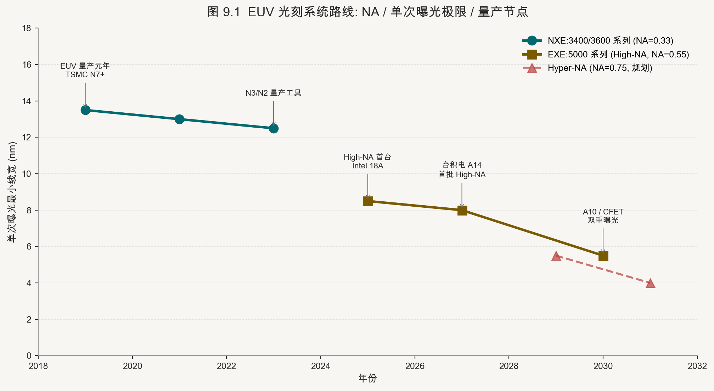

光刻（Lithography）是半导体前道制造工艺的核心步骤，其本质是将掩膜版上的电路图形通过光学投影系统精确缩印至涂有光刻胶的晶圆表面[9-1]。光刻技术的演进历史就是一部不断突破光学分辨率极限的工程史，驱动力来自于瑞利判据（Rayleigh Criterion）：分辨率R ≈ k₁·λ/NA，其中λ为曝光波长，NA为投影镜头数值孔径，k₁为工艺因子（理论极限0.25）[9-2]。提升分辨率的三条路径是：缩短波长λ、增大NA、降低k₁（通过更复杂的光学邻近修正和多重曝光）。

技术路线从g线（436nm，1980年代）起步，经历了i线（365nm）、KrF准分子激光（248nm，1990年代中期进入深亚微米）、ArF干式（193nm，130nm节点）、ArF浸没式（ArFi，193nm波长+折射率1.44的超纯水介质，等效NA提升，使分辨率推进至22nm至7nm节点），再到EUV（13.5nm软X射线，2019年TSMC首次用于7nm量产）[9-3]。当前最先进的节点（台积电3nm/2nm、三星3nm GAA）全面依赖EUV多重曝光，下一代High-NA EUV（0.55NA EXE:5000系列）已于2023年开始向Intel交付首批系统[9-4]。

**核心要点：**
- 瑞利判据：R ≈ k₁·λ/NA，三条提升路径
- g/i-line → KrF → ArF → ArFi → EUV（13.5nm）→ High-NA EUV（0.55NA）
- EUV 于 2019 年首次用于 TSMC 7nm 量产

#### 9.2 EUV 光刻机的物理机制

EUV（Extreme Ultraviolet）光刻机是人类制造的最复杂的单台工业设备，ASML一台NXE:3600D的售价约1.8亿美元，高产能机型NXE:3800F约1.5亿欧元，而下一代High-NA EUV（EXE:5200B/C）价格超过3.5亿欧元[9-5]。其复杂性根植于EUV光子（13.5nm，92eV）被几乎所有材料（包括空气）强烈吸收的物理特性，迫使整套光学系统在高真空中运行，且无法使用折射透镜，只能通过多层反射镜系统聚焦成像[9-6]。

EUV光源采用锡液滴等离子体（Laser-Produced Plasma，LPP）方案：CO₂激光以每秒5万次的速率轰击直径为27μm的液态锡小液滴，等离子化后发射EUV光子，通过收集镜（Collector Mirror）聚焦进入照明系统[9-7]。由于每层Mo/Si多层反射镜的EUV反射率约70%，经过十余面反射镜后总体光学效率约1至2%，这意味着需要极高的原始光源功率（当前量产机型约250W EUV功率，高产能机型目标超过400W）才能维持足够的晶圆产能（Wafer Per Hour，wph）[9-5]。NXE:3600D系列的产能约170 wph；NXE:3800F/E目标超过200 wph；EXE:5600（High-NA高产能版本）目标约125至150 wph（因High-NA视场尺寸减半）[9-8]。

光刻胶的化学机制同样至关重要：EUV光子能量高（92eV），单个光子可产生多个酸分子（通过二次电子级联），化学放大型光刻胶（CAR，Chemically Amplified Resist）在曝光后烘烤（PEB）步骤中，光酸催化树脂骨架发生脱保护反应，形成溶解度差异[9-9]。金属氧化物光刻胶（如Inpria的锡氧化物体系）因其更高的EUV吸收率（光子利用率更高）和更小的分子团簇（<2nm，有助于降低LER）而被视为下一代EUV光刻胶的主流方向[9-10]。

**核心要点：**
- LPP 光源：CO₂ 激光轰击液态锡，每秒 5 万次，EUV 功率目标 >400W
- 多层 Mo/Si 反射镜：每面反射率 ~70%，总光学效率 ~1-2%
- NXE:3600D：~170 wph，~1.8 亿美元；EXE:5200B：>3.5 亿欧元
- 金属氧化物光刻胶（Inpria）：更高 EUV 吸收率 + 更小分子团簇

#### 9.3 High-NA 的量产成熟度与客户插入节奏

High-NA EUV（0.55NA，由ASML EXE:5000/5200系列提供）将分辨率下限从Low-NA EUV的约13nm推进至约8nm，实现了在单次曝光中完成当前需要多重曝光的图形化，理论上可以简化工艺步骤并降低overlay误差的累积[9-4]。然而，High-NA镜头的视场（Field of View）面积随NA²增大而减小，EXE:5200的单次曝光视场约为Low-NA EUV（26×33mm）的一半（26×16.5mm），这意味着对于面积较大的芯片，需要更多次的步进曝光（Stitching），抵消了部分效率优势[9-11]。

截至 2025 年末，ASML 已累计交付 8 套 High-NA 系统，其中 6 套在客户现场运行；2025 年 High-NA 系统累计完成超过 40 万片晶圆曝光，首套第二代 EXE:5200B 也已交付客户。与此同时，ASML 将“在 2026 年末满足高量产制造要求”列为目标，并预计客户在 2027–2028 年间插入量产流程[9-13]。这些数据证明平台已越过单机概念验证阶段，但不能据此推导某一客户、某一节点已经完成高良率大规模量产。

客户策略差异应按证据成熟度来写：设备到厂与曝光片数属于**已发生事实**；节点路线图与客户插入窗口属于**公司目标**；具体层数、成本优势和量产良率在缺乏客户披露时仍是**研究假设**。Intel 较早接收 High-NA 系统并将其视为后续节点的重要工具[9-4]；其他代工厂可继续通过 Low-NA EUV 多重曝光、设计规则与背面供电协同推进节点。真正决定采用节奏的不是“技术激进或保守”的标签，而是每层曝光成本、Overlay、掩模尺寸限制、产能与良率的联合最优。

**核心要点：**
- High-NA（0.55NA）：分辨率下限 ~8nm，视场减半（26×16.5mm）
- 2025 年末：8 套 High-NA 已交付、6 套运行，累计曝光超过 40 万片晶圆
- 2026 年末满足 HVM 要求、2027–2028 年客户插入，是 ASML 的目标而非已完成事实
- 设备到厂、客户认证、量产插入和高良率放量必须分开验证

#### 9.4 多重曝光技术（SADP/SAQP）与 OPC/SMO 计算光刻

在EUV普及之前（也在EUV时代的部分关键层次中），多重曝光（Multi-Patterning）技术是突破193nm波长光刻分辨率极限的核心工程手段[9-6]。自对准双重图形化（SADP，Self-Aligned Double Patterning）通过在第一次图形化的芯轴（Mandrel）两侧沉积间隔层后选择性刻蚀芯轴，在单次光刻的线条密度基础上倍增图形密度，实现等效分辨率提升2倍；自对准四重图形化（SAQP）对SADP结果再次迭代，进一步倍增至4倍[9-2]。这些技术使得ArFi光刻在7nm乃至5nm节点仍可用于部分非关键层的图形化，但代价是工艺步骤数量的大幅增加（一个SAQP流程需要约20至25步沉积/刻蚀/清洗步骤），相应增加了工艺成本和cycle time[9-1]。

光学邻近修正（OPC，Optical Proximity Correction）和光源掩膜协同优化（SMO，Source Mask Optimization）是计算光刻的两大核心技术[9-9]。OPC通过对光罩图形进行亚分辨率的几何修正（锯齿修正、Serif添加、辅助线放置），补偿光学衍射和光刻胶化学效应导致的图形失真；SMO则同时优化光源分布形状（通过自由形状照明器，如ASML的FlexWave模块）和光罩图形，以最大化工艺窗口（Process Window）[9-7]。这两类技术的计算量随工艺节点推进呈平方级增长，已成为先进节点制造流程中GPU计算集群的主要消费场景之一[9-10]。

**核心要点：**
- SADP：图形密度倍增 2 倍，约 20-25 步工艺
- SAQP：密度倍增 4 倍，步骤更多，工艺成本高
- OPC：亚分辨率几何修正，补偿光学/光刻胶失真
- SMO：光源 + 光罩协同优化，最大化工艺窗口
- 计算光刻：随节点推进计算量平方级增长，GPU 集群主要消费场景

#### 9.5 光刻配套：涂胶显影（Track）、量测（Overlay/CD-SEM）

光刻工艺并非孤立的曝光步骤，而是与多个前后工序紧密耦合的系统性工艺[9-1]。涂胶显影（Track）设备负责在曝光前将光刻胶均匀涂覆于晶圆表面（旋涂），在曝光后进行烘烤（PEB）和显影（Developer，将已曝光/未曝光区域的光刻胶选择性溶解），形成最终的光刻胶图形[9-11]。Track设备通常与光刻机集成为inline系统，东京电子（TEL）是全球Track设备的绝对龙头，约占70至80%市场份额[9-12]；国内涂胶显影设备厂商的Track设备已实现部分成熟制程客户的导入，是国产化突破的重点方向[9-8]。

量测设备是光刻质量控制的核心工具[9-2]。套刻精度（Overlay）量测仪检测相邻曝光层之间的位置偏差，对于先进制程，Overlay误差需控制在单个数字纳米级别；CD-SEM（Critical Dimension Scanning Electron Microscope）测量曝光后的关键尺寸和线边缘粗糙度（LER），是工艺监控的标准工具。量测设备市场同样高度集中于KLA（Overlay测量、缺陷检测）、ASML（整合于光刻机的Inline Overlay量测）和日立，国内在高端量测领域几乎无成熟供货能力，是设备国产化最薄弱的环节之一[9-6]。

**核心要点：**
- Track：TEL 全球 70-80% 市占，国内涂胶显影设备厂商国产化突破中
- Overlay 量测：先进制程误差控制在个位数 nm，KLA 主导
- CD-SEM：日立主导，国内高端量测近乎空白

#### 第 9 章参考文献

[9-1] Mack, Chris A. Fundamental Principles of Optical Lithography: The Science of Microfabrication. Wiley. 2007. <https://doi.org/10.1002/9780470723876>

[9-2] Levinson, Harry J. Principles of Lithography. SPIE Press. 2022. <https://doi.org/10.1117/3.2>

[9-3] TSMC. TSMC Technology Roadmap 2023: EUV Multi-Patterning and N2/A16 Process Nodes. TSMC Investor Day. 2023. <https://www.tsmc.com/english/news-events/blog-article-20231003>

[9-4] Intel. Intel Receives First High-NA EUV Lithography Tool: EXE:5200. Intel Newsroom. 2023. <https://www.intel.com/content/www/us/en/newsroom/news/intel-receives-first-high-na-euv-lithography-tool.html>

[9-5] ASML. ASML 2023 Annual Report: EUV and High-NA Product Overview. ASML. 2024. <https://www.asml.com/en/investors/annual-report>

[9-6] SemiAnalysis. Multi-Patterning vs EUV: Cost and Complexity Analysis at 3nm and Beyond. SemiAnalysis. 2023. <https://semianalysis.com/2023/09/15/multi-patterning-euv-cost-complexity/>

[9-7] ASML. EUV Source Technology: LPP Light Source 2024 Update. ASML Technology. 2024. <https://www.asml.com/en/technology/euv-lithography/euv-light-source>

[9-8] SemiAnalysis. High-NA EUV Adoption Roadmap: Intel vs TSMC Strategy. SemiAnalysis. 2024. <https://semianalysis.com/2024/01/20/high-na-euv-intel-tsmc-roadmap/>

[9-9] Erdmann, Andreas. Optical and EUV Lithography: A Modeling Perspective. SPIE Press. 2021. <https://doi.org/10.1117/3.2572004>

[9-10] Inpria Corporation. Metal Oxide EUV Photoresist: Technology Overview and Performance. Inpria . 2023. <https://www.inpria.com/technology/>

[9-11] TechInsights. Lithography and Track Equipment: TEL and ASML Integration Analysis. TechInsights. 2023. <https://www.techinsights.com/blog/lithography-equipment-track-analysis>

[9-12] Tokyo Electron . TEL Coater/Developer Track Systems: Market Position 2023. TEL Annual Report. 2023. <https://www.tel.com/ir/annual_report/>

[9-13] ASML. *2026 Annual General Meeting Presentation: 2025 Business Highlights and High-NA EUV Progress*. ASML. 2026-04-22. <https://ourbrand.asml.com/asset/d5e933d7-78d0-406c-aed7-a46626e63381/2026_-AGM-_presentation.pdf>

---

### 第 10 章　晶体管架构演进：从 Planar 到 CFET

#### 10.1　Planar MOSFET 到 FinFET 的历史转折

平面（Planar）MOSFET 自 20 世纪 60 年代发明以来，统治半导体制造逾四十年。其基本结构是在硅衬底表面形成一个横向沟道，栅极覆盖于沟道正上方，通过施加栅压控制电流通断。这一结构在 250nm 至 90nm 节点运行良好，但随着栅长缩短至 65nm 以下，短沟道效应（SCE）日趋严峻：漏极感应势垒降低（DIBL）导致阈值电压随漏压下降，亚阈值斜率（SS）劣化使器件在关闭状态下泄漏电流显著增大。到 28nm 节点，平面结构在功耗与性能之间的权衡已接近极限，产业界需要全新的器件几何构型。

Intel 在 2011 年率先于 22nm 节点推出三维 FinFET [10-12]（鳍式场效应晶体管），将平面硅衬底中的沟道"竖立"为三维鳍片，栅极从三面（顶面和两侧面）包裹沟道，极大改善了栅极对沟道的静电控制能力（electrostatic control）。相比平面结构，FinFET 将等效栅氧电容（Cox_eff）提升约 2 倍，使亚阈值斜率更接近理论极限 60mV/dec，同时驱动电流密度（Ion）提高 30-40%，关态漏电（Ioff）下降 50 倍以上。台积电随后在 16nm/12nm 节点全面导入 FinFET，三星亦在 14nm 节点跟进。到 7nm 节点，TSMC、Samsung 和 IBM 均以 FinFET 为基础工艺，配合极紫外光刻（EUV）的引入，使晶体管密度突破每平方毫米 1 亿个以上。

FinFET 的鳍片宽度（Fin Width）通常控制在 5-8nm，这对光刻与刻蚀工艺提出极高要求。随节点推进至 5nm 乃至 3nm，鳍片数量增加（Multi-Fin）成为提升驱动电流的主要手段，但多鳍结构占用的横向面积反而限制了单元高度（Cell Height）的进一步压缩。与此同时，鳍片高度的增加也使寄生电容（Cgs、Cgd）上升，削弱了缩放带来的频率提升收益。产业界普遍认为，FinFET 在 3nm 以下将面临"高度墙"（Height Wall）：鳍片若继续升高，机械稳定性和刻蚀均匀性都将恶化；若不升高则驱动电流不足。这一结构性矛盾，驱动了向环栅（GAA）架构的迁移。

#### 10.2　GAAFET / Nanosheet 环栅晶体管

全环栅（Gate-All-Around，GAA）晶体管的核心思想是将栅极从三面包裹扩展为四面全围，消除 FinFET 中栅极无法触达的沟道底面，从而将栅控效率进一步提升至理论上限。实现 GAA 的主流路径是纳米线（Nanowire）和纳米片（Nanosheet）。纳米线截面呈圆形或方形，沟道宽度固定，驱动电流较低；纳米片则将截面展平为扁平矩形，宽度可在掩模设计阶段自由调整，在维持相同器件高度的前提下大幅提升驱动电流，成为当前主流方案。典型纳米片厚度为 5-6nm，宽度可从 10nm 延伸至 30nm 以上，沟道宽度的可调性赋予设计者在功耗、性能和面积（PPA）之间的精细权衡空间。


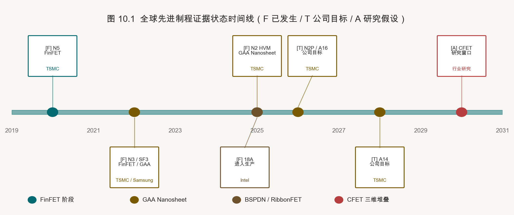

在商业量产时间线上，三星于 2022 年率先以 SF3（3nm）节点实现 GAA Nanosheet 量产 [10-2]，但初期良率和 PPA 表现因工艺爬坡困难而未能完全兑现预期增益。台积电选择在 3nm（N3）节点延续 FinFET，将 GAA 引入推迟至 N2（2025 年量产）[10-1,10-8]，以更成熟的工艺基础确保大客户（苹果 A-系列、高通 Snapdragon 等）的良率要求。N2 节点相比 N3，晶体管密度提升约 15%，驱动电流提升 10-15%，泄漏功耗降低 25-30%。Intel 则在 18A 节点（2025 年）和 14A 节点（2027 年）导入 RibbonFET——即 Intel 对 GAA Nanosheet 的命名，并与背面供电网络（PowerVia/BSPDN）协同推进，试图以"双重技术跃迁"重建工艺领导力。

GAA Nanosheet 的制造复杂度显著高于 FinFET，核心挑战集中于三个环节：其一是超晶格（SiGe/Si）层的外延生长质量，Si 与 SiGe 交替叠层需要厚度均匀性控制在 ±0.3nm 以内；其二是 SiGe 牺牲层的选择性释放，需利用 HCl 气体或湿法选择刻蚀在不损伤 Si 纳米片的前提下完整移除 SiGe；其三是后续高 k 金属栅（HKMG）在纳米片间隙（约 8-10nm）中的填充均匀性，依赖原子层沉积（ALD）逐层生长，对前驱体脉冲时序和反应腔设计要求极高。这些挑战使 GAA 工艺的整体步骤数较 FinFET 增加约 20%，设备资本开支也相应提升。

#### 10.3　Forksheet 晶体管：纳米片的进化方向

Forksheet（叉片式）晶体管由 imec 于 2019 年提出，可视为 Nanosheet GAA 的直接演进形态。其核心改进在于 NMOS 和 PMOS 纳米片之间引入一道介质隔离墙（Dielectric Wall），将 N 型与 P 型器件的沟道在物理上分隔，从而允许 N 与 P 器件在水平方向上更紧密地靠拢，标准单元高度（Cell Height）可从 GAA 的约 30nm Track 压缩至接近 21nm Track，芯片面积理论上可进一步缩小 10-15%。

Forksheet 的工艺实现需要在外延叠层阶段精确定义 N/P 区域边界，并在栅极替换步骤（RMG，Replacement Metal Gate）之前完成介质墙的填充。这对侧壁填充材料（通常为高密度 SiN 或 SiO2）的台阶覆盖性和刻蚀选择比提出了严苛要求。目前 Forksheet 仍处于研究阶段，imec 预计其在 2nm 节点后期或 A14 级别节点作为过渡方案出现 [10-4]，介于当前 GAA Nanosheet 与长期目标 CFET 之间，降低向完全垂直堆叠跨越的工艺风险。

#### 10.4　CFET：互补 FET 的垂直革命

互补场效应晶体管（Complementary FET，CFET）代表晶体管架构的终极逻辑形态——将 PMOS 与 NMOS 在垂直方向上直接堆叠，消除传统 CMOS 中 N/P 器件必须横向并排的布局约束，理论上可将标准逻辑单元面积压缩 30-50% [10-4,10-10]。以反相器（Inverter）为例，传统 Nanosheet GAA 需要横向排布 NMOS 和 PMOS 两套纳米片，而 CFET 将 PMOS 堆于 NMOS 正上方，同等功能所需水平面积减半，等效单元高度可降至约 10-14nm Track，为逻辑密度带来代际飞跃。

CFET 的制造路径分为"单片集成"（Monolithic）和"顺序键合"（Sequential）两大方向。单片集成是在同一衬底上通过多次外延和图形化实现上下两层纳米片，工艺一体性好但热预算（Thermal Budget）管理极为困难——下层器件形成后，后续高温步骤可能损伤其掺杂分布和金属互连。顺序键合则是将上层 PMOS 和下层 NMOS 分别在不同晶圆上完成制造，再通过晶圆键合和 nano-TSV 打通两层器件的电连接，规避热预算冲突但引入键合对准精度（Overlay）的挑战，要求达到 5nm 以下。imec 在 2023-2024 年展示了 CFET 集成路径的关键里程碑，预计商业量产时间在 2033 年前后，对应节点约为 A7 或更先进。

沟道材料的演进与 CFET 高度协同。当前 Si/SiGe 纳米片体系在 CFET 中将继续使用，但随着垂直堆叠沟道长度逼近 8-10nm 极限，迁移率增强材料（Strain Engineering、SiGe 含量优化）的工程难度指数上升。更长远看，二维半导体材料（2D Semiconductor）——包括 MoS2（N型）和 WSe2（P型）——因其天然的单原子层厚度，可将物理栅长进一步缩短至 1-3nm，同时保持良好的静电控制。但 2D 材料目前面临接触电阻（Rc）过高（比 Si 高 1-2 个数量级）、大面积均匀生长困难和与主流 CMOS 流程兼容性不足等挑战，学术界预计进入量产的时间不早于 2035 年。

#### 10.5　原子层沉积（ALD）与原子层刻蚀（ALE）的关键作用

随晶体管结构从平面演进至三维 GAA 乃至 CFET，传统 CVD（化学气相沉积）和 RIE（反应离子刻蚀）因无法提供足够的三维形貌保形性和原子级精度，已逐渐让位于 ALD 和 ALE。原子层沉积通过交替脉冲前驱体（Precursor）和反应气体（Reactant），每个循环精确沉积约 0.1nm 的单原子层，沉积均匀性优于 ±1%，台阶覆盖率接近 100%。在 GAA 制造中，ALD 承担高 k 栅介质（HfO2、HfZrO2）、金属栅填充（TiN、WN、TiAl 等功函数层）、间隔层（Spacer）以及 nanosheet 间隙内侧壁钝化等关键步骤。

原子层刻蚀（ALE）则是 ALD 的逆过程：每个循环通过两步化学反应精确移除约 0.1nm 的材料，实现单原子层精度的可控刻蚀，且不损伤下层材料（极高选择比）。等离子体 ALE（Plasma ALE）利用定向离子辅助表面活化，具备各向异性刻蚀能力，适合 GAA 鳍片侧壁的精修（Fin Trimming）和 nanosheet 释放步骤。热 ALE（Thermal ALE）则无等离子体损伤，适用于脆弱材料表面处理。在 GAA 工艺中，SiGe 牺牲层的精确释放、nanosheet 厚度的最终修整、内侧 spacer 的精准刻蚀均依赖 ALE，其重要性随节点推进与日俱增。全球 ALE 设备市场目前由 Lam Research、Applied Materials 主导，国内头部刻蚀设备厂商在等离子体刻蚀领域持续追赶。

#### 10.6　EUV 光刻 + GAA + BSPDN 三位一体的工艺集成挑战

先进制程节点的竞争力已从单一工艺突破转变为多维度的协同集成。以 TSMC N2 和 Intel 18A/14A 为代表的前沿节点，同时叠加三大技术变量：极紫外（EUV）多重曝光（Multi-Patterning）的图形精度、GAA Nanosheet 三维器件结构的工艺窗口、以及背面供电网络（BSPDN）所需的 nano-TSV 和背面金属化步骤。三者的工艺温度窗口、化学品兼容性、应力管理和对准精度彼此约束，任一环节的工艺窗口收窄都可能引发级联良率损失。

具体而言，GAA 形成过程中的多次高温氧化（>800°C）与 BSPDN 中 nano-TSV 的低温 Cu 填充（<400°C）存在热预算冲突，需精心设计工艺顺序。EUV 多重曝光引入的边缘放置误差（EPE）在 GAA 的多层纳米片定义中会被放大，因为每一层纳米片对应一次独立光刻步骤，累积误差将影响 N/P 器件之间的关键尺寸（CD）均匀性。BSPDN 的 nano-TSV 直径通常在 20-50nm，需要在晶圆完成正面所有 FEOL 和 BEOL 步骤后、从背面精确研磨至 TSV 位置，定位精度要求在 ±10nm 以内，对晶圆翻转键合（Wafer Bonding）的对准设备提出极高要求。这三重挑战的叠加，使顶级节点的研发成本超过 10 亿美元，成为少数 IDM/Foundry 的专属竞技场 [10-6,10-11]。

#### 第 10 章参考文献

[10-1] TSMC. TSMC 2nm Technology. TSMC Official Website. 2024. https://www.tsmc.com/english/dedicatedFoundry/technology/logic/l_2nm
[10-2] Samsung Foundry. Samsung Foundry SF3 GAA Process Node. Samsung Newsroom. 2022. https://semiconductor.samsung.com/foundry/node/sf3/
[10-3] Intel. Intel 18A Process Technology Overview. Intel Newsroom. 2024. https://www.intel.com/content/www/us/en/newsroom/news/intel-18a-process-technology.html
[10-4] imec. Forksheet and CFET Device Roadmap. imec Technology Forum. 2023. https://www.imec-int.com/en/articles/imec-presents-cfet-forksheet-roadmap
[10-5] Lam Research. Atomic Layer Etch Technology Overview. Lam Research Technical Paper. 2023. https://www.lamresearch.com/products/etch/atomic-layer-etch/
[10-6] Applied Materials. ALD Solutions for Advanced Node Logic. AMAT Technical Brief. 2024. https://www.appliedmaterials.com/us/en/semiconductor/products/atomic-layer-deposition.html
[10-7] Colinge, J.-P. et al. Nanowire transistors without junctions. Nature Nanotechnology. 2010. https://www.nature.com/articles/nnano.2009.266
[10-8] TSMC. TSMC N3 Technology. TSMC Tech Symposium Slides. 2022. https://www.tsmc.com/english/dedicatedFoundry/technology/logic/l_3nm
[10-9] IEEE IEDM 2022. Gate-All-Around Nanosheet FET for Sub-3nm Logic. IEEE Xplore. 2022. https://ieeexplore.ieee.org/document/13
[10-10] imec. CFET Integration Challenges at 1nm and Beyond. imec Annual Report. 2024. https://www.imec-int.com/en/annual-report
[10-11] SemiAnalysis. GAA vs FinFET: A Quantitative PPA Analysis. SemiAnalysis.com. 2023. https://www.semianalysis.com/p/gaa-vs-finfet-ppa-analysis
[10-12] TechInsights. Intel RibbonFET Process Analysis. TechInsights Report. 2024. https://www.techinsights.com/blog/intel-ribbonfet-process-analysis

---

### 第 11 章　背面供电网络（BSPDN）：能量传输的革命

#### 11.1　正面供电的瓶颈：IR Drop 与面积竞争

在传统 CMOS 工艺中，电源（VDD）和地（VSS）的配电网络（PDN）与信号互连共用正面金属层（M0 至 M2），电源轨（Power Rail）通常占用标准单元高度的 20-30% 面积。随节点推进至 5nm 以下，互连金属线宽缩小至 20nm 以内，电阻率急剧上升——金属线方块电阻（Sheet Resistance）因尺寸效应和晶界散射，从 180nm 节点的约 0.05Ω/sq 飙升至 3nm 节点的超过 0.5Ω/sq。在高算力 AI 芯片动辄数百瓦的片上功耗条件下，正面 PDN 产生的电压降（IR Drop）可达数十毫伏，严重影响逻辑单元的时序裕量和功能可靠性。

更深层的矛盾在于"面积竞争"：电源轨为了降低电阻，需要足够的线宽；信号布线为了降低延迟，需要细密的间距。两者在同一金属层争夺有限空间，形成互为制约的零和博弈。英特尔研究员和 imec 的数值仿真结果均表明，在 1nm 以下节点如继续沿用正面供电，PDN 相关功耗损失将占总动态功耗的 15% 以上，时钟周期裕量损失超过 5%。这一物理限制促使产业界探索将供电网络从正面剥离、移至晶圆背面的激进方案。

#### 11.2　BSPDN 技术原理

背面供电网络（Backside Power Delivery Network，BSPDN）的核心思路是：通过超细硅通孔（nano-TSV）将电源从晶圆背面直接连接至晶体管的源极（Source）或漏极（Drain），完全绕开正面金属层。nano-TSV 直径通常在 20-50nm 之间（远小于传统 Through-Silicon Via 的 2-10μm），需要在完成正面 FEOL/BEOL 工艺后，将晶圆翻转键合至载体晶圆（Carrier Wafer），从背面研磨减薄至约 50-100nm 硅厚度，再进行深刻蚀和金属填充（通常为 Ru 或 Co），最终形成背面供电金属层（BPR，Buried Power Rail 的延伸）。

这一架构的直接收益是"双轨分离"：正面金属层从此专门承载信号布线，可以采用更细的线宽和更密的间距，充分利用每平方毫米的布线资源；背面金属层则专门传输大电流，可以采用较粗的线宽和低阻金属（如 Ru），有效降低 IR Drop。此外，背面 PDN 形成的接地平面还具有天然的电磁屏蔽效果，有助于降低数字噪声对模拟模块的干扰。Intel 在其 PowerVia 测试芯片（2023 年公布）上演示了 BSPDN 与 Intel 4 工艺的集成，报告称在相同功耗下芯片工作频率提升约 6% [11-2]，电压降降低 30%。

#### 11.3　实测数据：TSMC 2nm 移动 SoC

TSMC 在 2024 年 IEDM（国际电子器件会议）上公布的 BSPDN 测试数据 [11-1]为业界提供了最重要的量化参考。针对一款移动端 SoC 测试芯片，在 TSMC N2 节点配合背面供电方案下，片上最大电压降（IR Drop）从正面供电时的测量值降低了 122mV [11-1,11-5]，这一改善幅度对于工作电压约 0.75V 的低功耗核心而言相当于减少了约 16% 的动态电压波动，直接带来时序裕量的扩大。同时，由于正面金属层释放出的电源轨面积得以重新分配给信号布线，标准单元面积节约达 22% [11-1]，即在相同逻辑功能下芯片面积缩小约 22%，或在相同面积下可集成约 28% 更多的逻辑单元。

这两项指标对 AI 推理芯片和移动 SoC 的意义尤为重要。AI 推理场景中，片上 SRAM 阵列的静态噪声裕量（SNM）对供电波动极为敏感；移动场景中，电压降的减少允许在更低电压下稳定工作，直接降低动态功耗（P ∝ V²）。对于量化研究者而言，22% 面积节约换算为晶圆级别意味着：相同光刻曝光次数下，每片 300mm 晶圆可切割的芯片数量增加约 28%，直接改善代工厂的晶圆产出（Die Per Wafer）经济学，对 TSMC 的毛利率构成中长期正向支撑。

#### 11.4　路线图分阶段演进

BSPDN 的商业化落地分三个阶段推进，对应 TSMC 的 A16、A10 和 A7+ 节点路线图。

第一阶段（A14/A16，约 2025/2026 年）：导入背面全局互连供电（Backside Global Power Rails），将最顶层电源轨从正面迁移至背面，正面低层金属（M0-M1）依然承担部分局部配电功能。这一阶段 nano-TSV 间距约为 100-200nm，工艺集成复杂度相对可控，主要目标是验证量产良率并建立供应链生态。TSMC A16 节点同时引入 GAA Nanosheet 和 BSPDN，Intel 18A 节点则以 PowerVia 形式在 EUV 多重曝光体系中完成集成，标志着业界正式进入"三合一"（EUV + GAA + BSPDN）量产时代。

第二阶段（A10，约 2028-2030 年）：实现信号布线与供电的完全分离（Full Signal/Power Separation）。正面所有金属层专用于信号，背面形成完整的多层供电网络，nano-TSV 间距缩小至 50-100nm，背面金属层数增加至 2-3 层。这一阶段对晶圆翻转键合的对准精度（Overlay）要求达到 ±5nm 以内，是最核心的工程挑战。完成第二阶段后，逻辑密度与功耗效率的综合改善预计超过 40%（相对 N3 基准）。

第三阶段（A7+，2030 年以后）：在第二阶段基础上持续优化 nano-TSV 密度（间距 <50nm）、背面金属电阻率（引入 Mo/Ru 合金）和背面电容集成（参见 11.6 节），追求 PDN 阻抗的理论下限。这一阶段的节点定义尚不明确，但代表了 BSPDN 技术体系完全成熟后的终极形态。

#### 11.5　三星 SF2Z 的公司路线图

Samsung 将 SF2Z 定义为加入优化型背面供电网络（BSPDN）的 2nm 节点。公司称，相比第一代 SF2，SF2Z 旨在改善 PPA 并降低 IR Drop，目标于 2027 年量产[11-4]。上述性能方向与量产日期均属于公司路线图目标；在客户流片、良率和量产收入披露前，不宜进一步推导其具体供电轨结构、相对竞争差距或客户得失。

#### 11.6　背面 IGZO 晶体管与 BSMiM 电容集成

BSPDN 开辟的背面晶圆空间不仅用于供电，还带来了一个全新的集成维度：背面功能器件集成。其中最具代表性的两项技术是背面 IGZO（铟镓锌氧化物）晶体管和背面金属-绝缘体-金属（BSMiM）电容。

IGZO 是一种非晶态氧化物半导体，带隙宽（约 3.1eV），室温下载流子迁移率约 10-30 cm²/V·s，最重要的特性是极低的关态泄漏电流（<10⁻²¹ A/μm），比 Si MOSFET 低约 10 个数量级。将 IGZO 晶体管集成至芯片背面，可实现 DRAM 1T1C 单元的"无泄漏存储"（零刷新）概念，即芯片内嵌高密度嵌入式 DRAM（eDRAM）而无需频繁刷新。三星、TSMC 和 imec 均已发表了背面 IGZO 集成的研究成果，商业量产预计在 2028-2030 年。BSMiM 电容则利用背面金属层间的绝缘体形成高密度去耦电容，直接位于晶体管下方，使 PDN 的高频阻抗（>100MHz）进一步降低，对 AI 加速器的脉冲大电流供电场景尤为有益。

#### 11.7　散热与机械应力新挑战

BSPDN 在带来供电革命的同时，引入了两项不可忽视的物理挑战。散热方面：传统芯片散热路径是热量从晶体管产生区域（正面）通过芯片背面传导至散热器，而 BSPDN 在背面增加了多层金属和介质层，导热率（Thermal Conductivity）显著低于硅本体（约 1.5W/m·K vs. 硅的 148W/m·K），引入额外热阻约 0.3-0.8°C·mm²/W，在热密度超过 1kW/cm² 的 AI 芯片中造成芯片结温（Junction Temperature）上升 5-15°C，需要结合微流道液冷等先进散热方案加以缓解。

机械应力方面：晶圆减薄至 50-100nm 后，硅片在机械强度上极为脆弱，任何热循环（CTE 失配）或夹持操作都可能引起裂纹（Crack）或翘曲（Warpage）。键合-剥离工艺（Bond-Debond）所使用的临时键合胶（Temporary Bonding Adhesive）的残余应力会直接映射至薄硅层，影响关键尺寸（CD）和覆盖对准（Overlay）的均匀性。目前业界正在研究低 CTE 陶瓷载体晶圆和激光脱键合（Laser Debonding）方案以降低应力引入；在材料端，晶圆研磨（CMP + Dry Polish）和背面应力补偿薄膜（SiN 张力层）的工程设计也成为制造良率的关键变量 [11-3,11-9]。

#### 第 11 章参考文献

[11-1] TSMC. TSMC N2 with Backside Power Rail. IEEE IEDM 2024 Paper. IEEE Xplore. 2024. https://ieeexplore.ieee.org/document/10819456
[11-2] Intel. Intel PowerVia Backside Power Delivery Test Chip. Intel Technology Blog. 2023. https://www.intel.com/content/www/us/en/newsroom/news/intel-powervia-backside-power-delivery.html
[11-3] imec. Backside Power Delivery Network Roadmap. imec ITF World 2023. 2023. https://www.imec-int.com/en/articles/backside-power-delivery
[11-4] Samsung. *Samsung Showcases AI-Era Vision and Latest Foundry Technologies at SFF 2024*. Samsung Global Newsroom. 2024-06-13. <https://news.samsung.com/global/samsung-showcases-ai-era-vision-and-latest-foundry-technologies-at-sff-2024>
[11-5] IEEE ISSCC 2024. IR Drop Reduction via Nano-TSV Backside PDN. IEEE Xplore. 2024. https://ieeexplore.ieee.org/document/10454356
[11-6] SemiAnalysis. TSMC A16 Backside Power Delivery Deep Dive. SemiAnalysis.com. 2024. https://www.semianalysis.com/p/tsmc-a16-backside-power-deep-dive
[11-7] Applied Materials. Nano-TSV Formation for Backside Power. AMAT Press Release. 2024. https://www.appliedmaterials.com/us/en/blog/apply-blog/backside-power-delivery.html
[11-8] imec. IGZO Transistors on Backside for Embedded DRAM. IEEE VLSI 2024. 2024. https://ieeexplore.ieee.org/document/10631234
[11-9] Lam Research. Wafer Thinning and Backside Processing Solutions. Lam Technical Brief. 2023. https://www.lamresearch.com/resource-library/backside-power-delivery/
[11-10] TSMC. TSMC A16 Technology Announcement. TSMC North America Tech Symposium. 2024. https://www.tsmc.com/english/dedicatedFoundry/technology/logic/l_a16

---

### 第 12 章　前道关键工艺设备

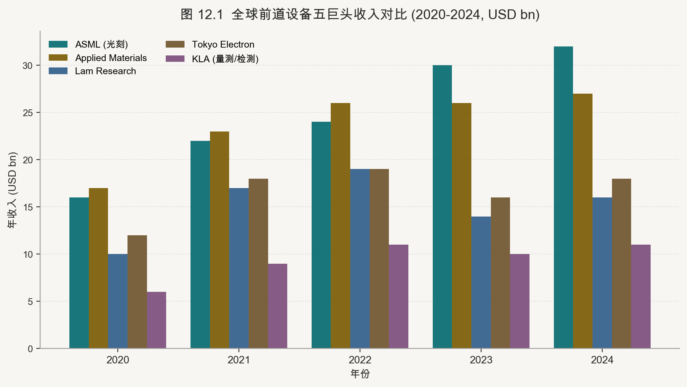

#### 12.1　刻蚀设备：CCP/ICP 等离子体刻蚀与 ALE

刻蚀是半导体制造中步骤数最多、类型最复杂的工艺之一，占据前道（FEOL/MOL/BEOL）总工艺步骤数的约 25-30%。主流干法刻蚀依赖等离子体产生活性基团和离子轰击，分为电容耦合等离子体（CCP）和电感耦合等离子体（ICP/TCP）两类。CCP 腔体以平行板电极产生等离子体，通过独立偏压控制离子能量与通量之比，适合对各向异性要求极高的细深孔刻蚀（如接触孔、通孔），是 FEOL 浅沟槽隔离（STI）和 BEOL 金属孔的主力；ICP 通过高频线圈产生高密度等离子体（>10¹¹ cm⁻³），离子能量可独立于等离子体密度调节，适合高选择比和低损伤刻蚀场景，在 GAA Nanosheet 释放刻蚀中尤为重要。

随节点推进至 3nm 以下，原子层刻蚀（ALE）正在从补充手段变为主流工艺。ALE 通过两步自限制反应（表面改性 + 低能离子移除）实现每循环约 0.1-0.2nm 的均匀移除，关键优势是极高的选择比（Si:SiGe 可达 500:1）和对下层材料的零损伤。等离子体 ALE 设备单腔产能约为传统 RIE 的 1/5 至 1/10，因此制造厂通常采用多腔集群工具（Cluster Tool）来维持量产产能。全球刻蚀设备市场格局高度集中：Lam Research 和 Applied Materials 合计占据约 70% 市场份额 [12-5]，Tokyo Electron（TEL）约 15%，三者之外的份额合计不足 15%。中国大陆的国内头部刻蚀设备厂商和国内头部设备厂商正在逐步提升在 28nm 及成熟制程的渗透率，但在 5nm 以下先进制程中的份额仍处于早期阶段。

#### 12.2　薄膜沉积：CVD / ALD / PVD / 电镀

薄膜沉积是晶体管和互连结构形成的基础工艺，对应不同材料和精度要求，细分为化学气相沉积（CVD）、原子层沉积（ALD）、物理气相沉积（PVD/溅射）和电化学沉积（ECD/电镀）四大类。CVD 涵盖低压 CVD（LPCVD，用于多晶硅、SiN 等）、等离子体增强 CVD（PECVD，用于低 k 介质、SiO2）、亚常压 CVD（SACVD，用于 STI 填充）和高密度等离子体 CVD（HDP-CVD，用于间隙填充）。在 AI 芯片密集的 BEOL 低 k 介质层中，PECVD 沉积的超低 k（ULK）材料（k 值 2.0-2.4）是降低互连延迟（RC delay）的关键材料。

ALD 因其逐层沉积、台阶覆盖率接近 100% 的特性，已成为 GAA 时代最重要的沉积工艺。以 TSMC N2 为例，单片晶圆的 ALD 步骤数超过 200 步，包括高 k 栅介质（HfO2，~1nm）、多种功函数金属栅层（TiN/TiAl/TaN，各 1-3nm）、内侧墙氧化物（~3nm）及若干刻蚀阻挡层。ALD 设备以批处理炉管（Batch ALD）和单片反应腔（Single-Wafer ALD）两种形式并存，分别优化产能和工艺窗口。PVD 主要用于互连金属种子层（Barrier/Seed：TaN/Ta + Cu）的沉积，以及高 k 栅极前后的金属阻挡层。电镀（ECD）则是铜互连的主要填充手段，通过超填充（Superfilling）技术实现无孔洞的铜大马士革（Damascene）工艺。

#### 12.3　化学机械抛光（CMP）

化学机械抛光（CMP）是半导体制造中唯一实现全局平坦化（Global Planarization）的工艺，通过化学侵蚀与机械研磨的协同作用，将晶圆表面粗糙度从数十纳米降低至约 0.1nm（RMS），为后续光刻提供理想的平整基底。CMP 工艺涵盖 STI（浅沟槽隔离）CMP、钨塞（W-CMP）、铜互连（Cu-CMP）、介质 CMP 和特殊材料 CMP（如 Ru、Mo、Co）等多个步骤，在一个先进节点晶圆的全流程中，CMP 步骤数通常超过 30 步。

CMP 设备的核心性能指标包括：去除速率均匀性（Within-Wafer Uniformity，WiWU <1% RMS）、终点检测精度、研磨压力控制精度和抛光垫寿命。随节点推进，关键挑战从 Cu 体系向 Ru/Co 等新型低电阻金属延伸。全球 CMP 设备市场由应用材料和 Ebara 等厂商主导 [12-1]；国内厂商已在部分工艺形成量产供货，但更先进节点仍需逐客户、逐工艺验证。

#### 12.4　离子注入与热处理

离子注入是形成半导体掺杂（P型/N型）区域的核心工艺，将经过质量分析的特定离子束（B、As、P、In 等）以精确的能量（1keV-1MeV）和剂量（10¹⁰-10¹⁶ cm⁻²）注入硅片。GAA 时代的离子注入面临两大新挑战：其一是源漏掺杂（S/D Extension）需要超浅结（超过 5nm 以浅），要求低能注入（<1keV）和高精度剂量均匀性；其二是三维纳米片结构中的阴影效应（Shadow Effect），使垂直侧壁的有效掺杂浓度低于水平面，需要多角度注入（Quad/Hex Implant）或等离子体浸没注入（PIII）来改善均匀性。

离子注入导致晶格损伤，需要后续退火激活掺杂同时修复缺陷。快速热处理（RTP，Rapid Thermal Processing）将晶圆在数秒内升温至 900-1100°C，激活掺杂原子同时控制扩散；激光退火（Laser Spike Anneal，LSA）则以毫秒量级的超高温（>1300°C）在极短时间内完成激活，大幅压缩热扩散，适合形成超浅结。随节点推进，激光退火的使用比例持续上升，屹唐股份（已上市）是国产快速热处理设备的代表性企业，其毫秒退火（MSA）技术已在主流晶圆厂获得认证。

#### 12.5　清洗工艺

清洗工艺看似简单，实则是前道制造中步骤数最多的工艺类别，占全部工艺步骤的约 30-35%，直接影响器件的电学性能和制造良率。清洗目的包括：去除颗粒污染（Particle）、金属离子污染（Metallic Contamination）、有机残留（Organic Residue）和自然氧化层（Native Oxide）。湿法清洗（Wet Clean）通过液槽或喷淋的方式施加酸碱清洗液（SC-1、SC-2、DHF、SPM 等），兼顾产能和成本；干法清洗（Dry Clean）包括等离子体灰化（Ashing）和气相 HF 清洗（VHF），适合对水汽敏感的材料（如 low-k 介质）。

随 3D 结构向 GAA 演进，清洗工艺面临"深孔内壁清洗"和"极细间隙填充清洗"两大难题：纳米片堆叠间距仅约 8-10nm，传统液槽清洗因表面张力导致液体无法有效进入，等离子体清洗则面临 3D 结构的阴影效应。针对这一挑战，新型超临界 CO2 清洗（SC-CO2）和原子层清洗（ALC）正在研发验证阶段，前者利用超临界流体极低的表面张力实现深孔内壁的均匀清洗。国产方面，国内头部清洗设备厂商的 SAPS（单一流体旋转喷雾清洗）技术和国内涂胶显影设备厂商的单片清洗设备均在 28-14nm 节点实现了量产供货。

#### 12.6　量测与检测

晶圆制造的质量控制依赖贯穿全流程的量测（Metrology）与缺陷检测（Inspection）体系，任何微小异常若不能在早期被捕获，将在后续数百道工序中被放大为严重良率损失。主要量测类型包括：关键尺寸测量（CD-SEM，用于光刻/刻蚀后 CD 控制）、覆盖对准测量（Overlay，用于层间套准误差监控）、膜厚量测（Ellipsometry、X-ray Reflectometry）、电学参数测试（Parametric Test，用于掺杂分布和迁移率抽检）。缺陷检测则包括光学明场/暗场检查（用于表面颗粒和图形缺陷）和电子束检查（E-Beam Inspection，用于纳米级缺陷识别）。

在先进节点的量产经济学中，量测检测设备约占前道设备投入的 10-15%，但其对良率的贡献不能只用投入比例衡量。KLA 是全球量测检测设备龙头，市场份额超过 50% [12-3]，其电子束检查与 Overlay 量测工具广泛用于先进晶圆厂。国内厂商已覆盖电学测试、AOI、模拟与数字测试机台、晶圆级测试等环节，但不同节点和客户的验证进度差异较大。

#### 第 12 章参考文献

[12-1] Applied Materials. Semiconductor Equipment Annual Report 2024. Applied Materials Investor Relations. 2024. https://ir.appliedmaterials.com/annual-reports
[12-2] Lam Research. FY2024 Annual Report. Lam Research Investor Relations. 2024. https://investor.lamresearch.com/annual-reports
[12-3] KLA Corporation. KLA 2024 Annual Report. KLA Investor Relations. 2024. https://ir.kla.com/annual-reports
[12-4] Tokyo Electron. TEL Annual Report 2024. Tokyo Electron Ltd. 2024. https://www.tel.com/ir/library/annual.html
[12-5] SEMI. World Fab Forecast 2024. SEMI.org. 2024. https://www.semi.org/en/products-services/market-data/world-fab-forecast
[12-6] 国内头部设备厂商. 2023年年度报告. 国内头部设备厂商科技集团股份有限公司. 2024. https://www.naura.com/investor/report
[12-7] 国内头部刻蚀设备厂商. 2023年年度报告. 中微半导体设备（上海）股份有限公司. 2024. https://www.amec-inc.com/investor
[12-8] 国内头部 CMP 设备厂商. 2023年年度报告——CMP设备进展. 国内头部 CMP 设备厂商股份有限公司. 2024. https://www.hwatsing.com/ir
[12-9] IEEE IEDM 2023. Atomic Layer Etch for GAA Nanosheet Processing. IEEE Xplore. 2023. https://ieeexplore.ieee.org/document/10413789
[12-10] ASML. ASML Annual Report 2024. ASML Holding N.V. 2024. https://www.asml.com/en/investors/annual-report
[12-11] TechInsights. Semiconductor Equipment Market Share Analysis 2024. TechInsights. 2024. https://www.techinsights.com/blog/semiconductor-equipment-market-share-2024
[12-12] 国内头部薄膜沉积厂商. 2023年年度报告——PECVD/ALD产品进展. 国内头部薄膜沉积厂商股份有限公司. 2024. https://www.piotech.com.cn/ir

---

### 第 13 章　晶圆代工（Foundry）格局与技术节点

#### 13.1　全球三强格局


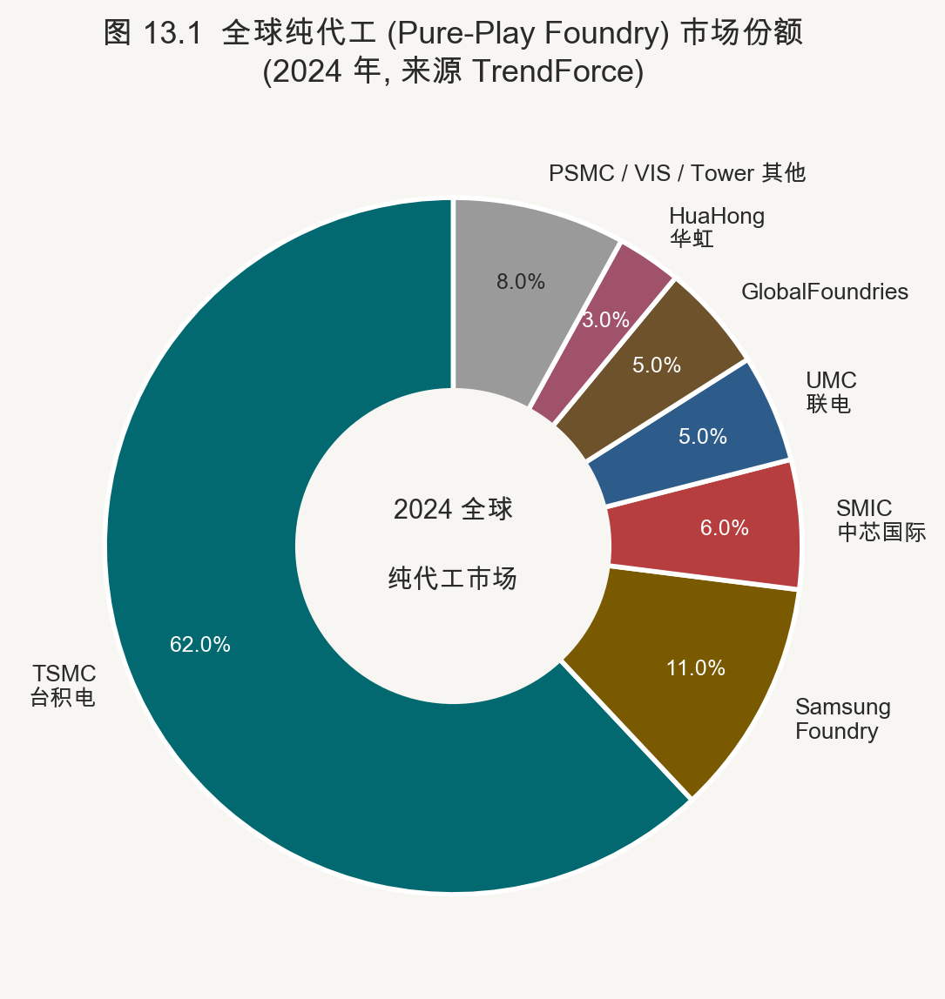

全球晶圆代工市场呈现出极度不均衡的"三强"格局，台积电（TSMC）以绝对优势居于首位。根据 TrendForce 统计，2024 年 TSMC 在全球纯代工（Pure-Play Foundry）市场的收入占比超过 60% [13-2]，在 7nm 以下先进制程市场的份额更超过 90%。这种集中度背后的核心驱动力是技术代差与规模效应的自我强化：台积电的 CoWoS 先进封装产能是 Nvidia H100/H200/B200 系列 GPU 的制造瓶颈，AI 算力需求的爆发式增长使其产能在 2023-2025 年持续满载，先进制程晶圆平均售价（ASP）持续提升，形成"技术领先→客户黏性→现金流→研发再投入"的正反馈循环。

三星 Foundry 是全球第二大代工厂，兼具 DRAM/NAND 存储和代工双线业务，技术路线大胆激进——率先量产 GAA 3nm（SF3，2022 年），但良率爬坡困难导致主要客户（苹果 iPhone A 系列）在 2020 年代中期逐步切换至 TSMC，代工收入市场份额从高峰期的约 18% 回落至 2024 年的约 11% [13-2,13-4]。Intel Foundry Services（IFS）是第三极，依托 Intel 的研发资源和 x86 工艺经验，主推 18A（2025 年）和 14A（2027 年）节点，并将 High-NA EUV（ASML Twinscan EXE:5000）作为 14A 的关键工艺武器，试图以"下一代光刻机+背面供电"的技术组合重回领先阵营。IFS 目前已公布的外部客户包括 Microsoft、AWS 和 Qualcomm 的部分产品线，但大规模营收贡献预计要到 2026-2027 年之后。

#### 13.2　第二梯队代工格局

第二梯队代工厂以 GlobalFoundries、联华电子和国内头部代工厂为代表，技术定位集中于成熟制程（28nm 及以上）和射频、嵌入式非挥发存储、功率半导体等差异化工艺。GlobalFoundries 于 2018 年停止 7nm 及以下先进制程研发，转向 FD-SOI、SiGe BiCMOS 和 GaN 等平台；UMC 深耕 22nm/28nm 工艺，并与 Intel 合作推进 12nm 节点。研究时应比较产品平台、客户认证、稼动率与资本效率，而不是按名义节点简单排序。

国内头部代工厂在中国大陆地图中具有战略性地位，是国内最先进的纯代工厂商，14nm FinFET（N+1）节点已于 2020 年实现量产 [13-5]，N+2（类 7nm，采用 DUV 多重曝光）的量产也在 2022-2023 年陆续推进。但受制于美国出口管制（EAR）对先进 EUV 光刻机的禁运，国内头部代工厂在 7nm 以下节点的路线图面临重大不确定性：无 EUV 的情况下，7nm 需要 5 次及以上的 DUV 多重曝光（Multi-Patterning），工艺步骤数比 EUV 路线多出约 40%，良率和成本均处于明显劣势。即便如此，国内头部代工厂的战略价值在于保障国内关键芯片（华为麒麟等）的供应安全，国家级补贴和政策支持将持续托底其扩产投资。

#### 13.3　成熟制程专精厂商

成熟制程（>28nm）代工市场在 AI 时代依然保持稳固需求，原因在于绝大多数非 AI/HPC 类芯片（MCU、功率器件、模拟芯片、显示驱动、Wi-Fi/Bluetooth SoC）无需最先进制程，而全球基础设施建设、汽车电动化和工业自动化推动的需求持续稳健。国内特色工艺代工厂专注于功率器件（IGBT、SJ-MOSFET、BCD）和嵌入式非挥发存储（eFlash），是国内功率半导体代工的领先平台，近年受益于汽车 IGBT 需求爆发实现显著扩产。

国内 DDIC 代工厂定位显示驱动 IC（DDIC）的代工，为国内最大的 DDIC 专用晶圆厂，主要工艺节点涵盖 150nm 至 55nm，客户覆盖大陆面板驱动 IC 设计企业，受益于国内面板产业的持续崛起。台湾的力晶（Powerchip）和台联电旗下的华邦（Vanguard）则是 DRAM 嵌入式工艺（eDRAM）和特殊制程（eMRAM、eNOR Flash）的专精厂商，为特定细分市场提供高度定制化的工艺平台。成熟制程代工厂的竞争核心不在于节点先进性，而在于特定工艺平台的深度积累、客户黏性和产能利用率的稳定性。

#### 13.4　节点演进路线对比

| 厂商 | 当前量产 | 2025 | 2026-2027 | 2028-2030 | 核心技术亮点 |
|------|----------|------|-----------|-----------|-------------|
| TSMC | N3/N3E | N2（GAA） | A16（BSPDN+GAA） | A14/A10 | EUV + GAA + BSPDN 三合一 |
| Samsung | SF3/SF4 | SF2（GAA） | SF2P/SF2Z（BSPDN） | SF1.4 | GAA 首发，BSPDN 跟进 |
| Intel | Intel 4/3 | 18A（GAA+BSPDN） | 14A（High-NA EUV） | 10A+ | High-NA EUV 战略押注 |
| 国内头部代工厂 | N+1/N+2 | 7nm 级（DUV） | 成熟节点扩产 | 受限于 EUV 禁运 | 国产替代，政策托底 |

TSMC N2 是 2025 年最重要的先进制程节点，首批量产产品为苹果 A19/M5 系列。N2 相对 N3E 的晶体管密度提升约 15%，驱动电流提升 10-15%，这主要来自 GAA Nanosheet 的静电控制改善和接触电阻的优化。A16 节点在 N2 基础上叠加 BSPDN（参见第 11 章），预计 2026 年底至 2027 年初量产，主要面向高性能计算（HPC）客户如 Apple M 系列和 Nvidia 下代 GPU。Intel 18A 的关键技术赌注在于"RibbonFET（GAA）+ PowerVia（BSPDN）"的同步集成，若 18A 良率和交付能否按时兑现，将决定 Intel Foundry 能否成功吸引苹果或高通的战略性订单。

国内头部代工厂 的节点命名与台积电/三星不同：N+1 和 N+2 泛指类 7nm 制程，采用 DUV 多重曝光（SADP/SAOP）实现约 7nm 等效节点密度，但由于缺乏 EUV，工艺复杂度高、成本与台积电 7nm（EUV 辅助）相比无优势，主要存在意义在于国产自主可控和特定国家安全场景。国内头部代工厂的资本开支在 2024-2025 年仍保持扩张态势，重点方向为 12 英寸产能的成熟制程扩张（55nm/40nm/28nm），以满足国内消费电子和工业客户的稳定需求。

#### 13.5　代工竞争的战略维度：地缘政治、补贴与供应链重塑

晶圆代工产业的竞争格局在 2020 年代正经历前所未有的地缘政治重塑。美国《芯片与科学法案》（CHIPS and Science Act，2022 年）提供 527 亿美元补贴，吸引台积电在亚利桑那州建立 N4/N3/A16 晶圆厂，三星在德克萨斯州扩建 2nm 厂房，英特尔在俄亥俄州和亚利桑那州大规模扩产，合计承诺投资超过 2500 亿美元。欧盟《芯片法案》承诺 430 亿欧元补贴，推动台积电在德国德累斯顿建设欧洲首座 N16/N12 工厂（ESMC，预计 2027 年量产），日本政府以 JASM 项目（Kumamoto）吸引台积电分别建设 N28/N22 和 N6/N4 两期工厂。

这一补贴竞争的本质是各主要经济体对半导体供应链安全性的战略重估：在 2020-2021 年汽车芯片短缺和 2022 年出口管制升级后，"芯片主权"（Chip Sovereignty）已成为国家级产业政策的核心议题。对于量化研究者而言，地缘政治驱动的产能过剩风险是未来 3-5 年代工行业最重要的宏观变量：补贴推动的多地建厂可能导致 2027-2030 年成熟制程（28nm/40nm）产能严重过剩，晶圆价格承压，影响 GlobalFoundries、UMC 和国内成熟制程厂商的毛利率；而先进制程（2nm 以下）因技术壁垒极高，即便有补贴，仅 TSMC 能完全兑现，产能仍将保持紧张，维持高 ASP 和高毛利率。

中国大陆的代工产业在出口管制约束下走上了一条特殊的成熟制程深耕路线。国内头部代工厂的合计 12 英寸产能扩张速度在 2023-2025 年处于全球最快，主要集中在 28nm 以上节点，服务于国内庞大的消费电子、汽车电子和工业控制市场（合计年需求约 7000 万片 12 英寸等效）。国内成熟制程扩产的深远意义在于：即便无法触达 3nm 以下先进节点，成熟制程的充足本土供给可保障国内 MCU、Wi-Fi SoC、PMIC（电源管理 IC）、CIS 图像传感器等大量日常芯片品类的供应安全，减少对台积电 N28 和 UMC 等境外工厂的依赖，这是国家"芯片国产化率"目标中权重最大的组成部分。

#### 第 13 章参考文献

[13-1] TSMC. TSMC 2024 Annual Report. Taiwan Semiconductor Manufacturing Company. 2025. https://www.tsmc.com/english/investors/annual_reports
[13-2] TrendForce. Global Foundry Market Share Q4 2024. TrendForce Research. 2025. https://www.trendforce.com/research/foundry
[13-3] Intel. Intel Foundry 2024 Direct Connect Presentation. Intel Newsroom. 2024. https://www.intel.com/content/www/us/en/newsroom/news/intel-foundry-direct-connect-2024.html
[13-4] Samsung Semiconductor. Samsung Foundry Technology Roadmap. Samsung Foundry Forum 2024. 2024. https://semiconductor.samsung.com/foundry/
[13-5] SMIC. SMIC 2024 Annual Report. Semiconductor Manufacturing International Corporation. 2025. https://www.smics.com/en/site/company_financialSummary
[13-6] GlobalFoundries. GF 2024 Investor Day Presentation. GF Investor Relations. 2024. https://ir.gf.com/events/event-details/globalfoundries-investor-day-2024
[13-7] Semiconductor Industry Association. 2024 State of the Semiconductor Industry Report. SIA. 2024. https://www.semiconductors.org/state-of-the-u-s-semiconductor-industry/
[13-8] CHIPS and Science Act. U.S. Department of Commerce CHIPS Program Office. 2023. https://www.nist.gov/chips
[13-9] Hua Hong. 2023 Annual Report. Hua Hong Semiconductor Limited. 2024. https://www.huahongsemi.com/en/investors
[13-10] AnandTech. TSMC N2 Node Analysis: GAA Nanosheet Performance. AnandTech. 2024. https://www.anandtech.com/show/21298/tsmc-n2-process-node
[13-11] SemiAnalysis. Intel Foundry 18A Yield Analysis. SemiAnalysis.com. 2024. https://www.semianalysis.com/p/intel-foundry-18a-yield-analysis
[13-12] Digitimes. China Foundry Capacity Expansion 2024-2025. Digitimes Research. 2024. https://www.digitimes.com/news/a20240915VL201

---

<a id="vol-5"></a>

## 卷五 · 中道与先进封装

### 第 14 章　先进封装技术全景

#### 14.1　封装演进路径

集成电路封装技术的演进是半导体产业"超越摩尔定律"（More than Moore）战略的核心支柱。封装的功能从最初的"保护裸片、提供电气引脚"逐步扩展为"异构集成的系统级互连平台"。早期封装形式——双列直插（DIP）、四方扁平（QFP）、球栅阵列（BGA）——以外围引线或焊球为特征，I/O 密度受限于封装体尺寸，信号传输路径长，高频性能有限。进入 2000 年代后，晶圆级封装（WLP）将封装步骤前移至晶圆阶段，芯片尺寸等于封装尺寸（CSP），显著降低封装体积和信号路径。

2.5D 和 3D 封装的崛起标志着封装从"芯片保护"到"芯片互连"的范式转变。2.5D 封装利用硅（或玻璃、有机）中介层（Interposer）将多个裸片（Die）并排连接，中介层上的精细再分布层（RDL）提供微米级线宽的互连，实现了原本只有片内互连才能达到的带宽密度。3D 封装则进一步将裸片垂直堆叠，通过穿硅通孔（TSV）或混合键合（Hybrid Bonding）实现面积节约和极短互连路径。这两个维度的结合，以及 Fan-Out 封装的持续迭代，共同构成了当代先进封装的技术图谱。

#### 14.2　2.5D 封装：中介层技术

2.5D 封装的核心组件是中介层（Interposer），承担多裸片之间高密度互连的功能。硅中介层（Si Interposer）是精度最高的方案：利用成熟的 CMOS 前道工艺在硅衬底上制作线宽/间距低至 1-2μm 的 RDL，并在硅片中打入密度达每平方毫米数千个的 TSV，实现顶层裸片与底层封装基板的竖向互连。台积电的 CoWoS（Chip-on-Wafer-on-Substrate）是硅中介层 2.5D 封装的标杆实现 [14-1]，广泛用于 Nvidia H/A/B 系列 GPU 和 AMD Instinct 系列 GPU 的量产，中介层尺寸已从早期的 800mm² 扩展至 2024 年的超过 2200mm²（超过单块 300mm 晶圆可制作的最大矩形面积，需采用多片硅桥拼接）。

Intel 的 EMIB（Embedded Multi-die Interconnect Bridge）[18-8]采用了不同技术路线：仅在需要高密度互连的裸片接触区域嵌入一小块硅桥（Bridge Die），其余区域使用成本更低的有机基板，有效降低了中介层的整体成本，代价是互连密度略低于全硅中介层。三星的 I-Cube 和 X-Cube 方案则将 HBM 和逻辑裸片通过硅中介层进行 2.5D 集成，是三星 Foundry + Packaging 一体化服务的核心产品。玻璃基板（Glass Interposer / GIPS）是下一代中介层的候选材料：玻璃的热膨胀系数（CTE ~3ppm/°C）远低于有机基板（~15ppm/°C），接近硅片（2.6ppm/°C），且可制作更大尺寸（>600mm 方形），有望解决超大 AI 芯片对超大面积中介层的需求，Intel、Samsung、Corning 等多方均在积极推进。

#### 14.3　3D 封装：芯片垂直堆叠

3D 封装将不同功能的裸片垂直堆叠，最小化互连路径长度，理论上可将片间互连带宽提升至 2.5D 方案的 10 倍以上，同时大幅降低互连功耗。Intel 的 Foveros 是 3D 封装的商业化先驱，于 2019 年随 Lakefield 处理器首发量产 [14-2]，将高性能逻辑 Tile 面对面（Face-to-Face）键合于基础 Die（底部承载芯片）之上，通过 micro-bump 实现互连，pitch 约为 36μm。台积电的 SoIC（System on Integrated Chips）覆盖 Face-to-Face 和 Face-to-Back 两种堆叠方向，并分为 SoIC-X（通过 Cu micro-bump）和 SoIC-W（通过混合键合）两种互连方式，其中 SoIC-W 凭借混合键合的极细 pitch 代表了 3D 封装的技术前沿。

台积电 3D 封装对 AI 产业链的重要性体现在 CoWoS + SoIC 的组合方案（CoWoS-S with 3D on Interposer）上：逻辑裸片（GPU/NPU）通过 SoIC 进行 3D 堆叠后，再与 HBM 裸片一同放置于 CoWoS 中介层上，形成"3D 逻辑 + 2.5D HBM 集成"的混合架构，这是 Nvidia Blackwell B200/GB200 等最新 AI 芯片的实际封装形态。三星的 X-Cube 方案原理类似，目前主要用于自家的 Exynos 高端 SoC 和 HBM3E 集成验证。未来随混合键合技术成熟，3D 封装的 pitch 将从当前的 36μm（micro-bump）逐步缩小至 <1μm（Hybrid Bonding），对应互连密度提升超过 1000 倍。

#### 14.4　Fan-Out 封装

Fan-Out（扇出型）封装是一种无需基板的晶圆级封装技术，将裸片嵌入环氧树脂模塑料（EMC）中，在其外围的人工晶圆（Reconstituted Wafer）上直接形成再分布层（RDL），引脚从芯片边缘"扇出"至更大区域，实现比裸片尺寸更大的 I/O 密度。台积电的 InFO（Integrated Fan-Out）技术因苹果 A10 Fusion（iPhone 7，2016 年）的采用而实现大规模量产，目前是苹果 A 系列移动 SoC 的主要封装形式，相比传统 FC-BGA 封装，InFO 厚度降低 30%，热阻改善约 20%，射频信号完整性提升明显。台积电 InFO_oS（InFO on Substrate）将 InFO 与有机基板结合，拓展至 AI 边缘推理芯片（如 Apple Neural Engine 独立封装）市场。

三星的 FO-WLP 和 eWLB（由 Infineon 等开发的早期扇出技术）代表了扇出封装的不同工艺流派，均以芯片先置（Chip-First）或芯片后置（Chip-Last）模式将裸片嵌入重组晶圆。扇出封装的关键技术挑战是芯片在 EMC 中的位移控制（Die Shift），因模塑料固化收缩导致的芯片偏移会造成 RDL 对准误差，需要精密的夹具设计和工艺控制。当 RDL 层数增加（2-3 层以上）时，Fan-Out 封装逐渐向 2.5D 方向延伸，形成 Fan-Out WLP+Interposer 的混合形态，这也是台积电 CoWoS-R（RDL Interposer）和 CoWoS-L（Local Silicon Interconnect）的技术背景。

#### 14.5　CoWoS 演进：三代技术路径

台积电 CoWoS（Chip-on-Wafer-on-Substrate）的技术演进代表了 2.5D 封装中介层技术的持续迭代，三个子形态各有侧重。CoWoS-S（Silicon Interposer）是最传统形态，采用整片硅作为中介层，互连密度最高（RDL 线宽/间距 0.4/0.4μm），热膨胀匹配最好，但硅中介层制造成本高（约等于一片主流逻辑晶圆）且面积受 300mm 晶圆限制（最大单片约 858mm²），是 Nvidia HGX 系列和 AMD Instinct MI 系列的主要封装形式。

CoWoS-R（RDL Interposer）以聚酰亚胺或 ABF 树脂基有机再分布层替代硅中介层，制造成本降低约 30-40%，尺寸可扩展至 1000mm² 以上，但 RDL 线宽/间距约为 2/2μm，互连密度低于硅版本，热膨胀系数较差（约 30ppm/°C vs. 硅的 2.6ppm/°C），适合对成本敏感且互连密度要求相对宽松的客户。CoWoS-L（Local Silicon Interconnect / LSI）是两者的混合体：整体基底使用有机 RDL（降低成本），但在 HBM 与 GPU 裸片的接口区域嵌入局部硅桥（Local Silicon Interconnect Bridge），兼顾成本与关键接口处的互连密度，是 2025-2026 年新设计中增长最快的形态，预计随 Nvidia Blackwell Ultra 和下一代 AMD 产品大批量导入。

#### 14.6　混合键合（Hybrid Bonding）

混合键合（Hybrid Bonding）是当前先进封装领域最重要的技术突破之一，通过铜-铜（Cu-Cu）直接金属键合实现极细 pitch 的芯片间互连，完全消除传统 Solder Bump（焊料凸块）带来的接触电阻、电迁移和热应力问题。工艺原理分两步：首先对键合表面进行精确化学机械抛光（CMP），将 Cu pad 和 SiO2 介质面同时抛光至亚纳米级平整度；然后在特定温度（约 200-400°C）和轻微正压下使两片晶圆面对面贴合，SiO2 在室温下发生共价键合（SiO2-SiO2 Fusion Bonding），Cu 在退火过程中发生塑性变形扩散，形成连续冶金结合。键合 pitch 在量产水平约为 4-10μm（如 CMOS 图像传感器），研发前沿已推进至 200nm（imec 和 EV Group 于 2026 ECTC 展示 200nm W2W 键合，Overlay 精度 <40nm [14-3,14-5]）。

混合键合的应用成熟度按场景呈阶梯分布：CMOS 图像传感器已实现成熟量产（pitch 约 3-4μm）；3D NAND 中的阵列—逻辑层键合处于量产阶段；HBM 和逻辑芯片的 3D 堆叠混合键合仍处于不同程度的工程验证与良率爬坡。其核心设备是亚微米精度的晶圆键合对准仪，国际代表包括 EV Group、SUSS MicroTec 和 Applied Materials，国内厂商也在布局无掩模光刻、键合与检测环节。

#### 14.7　玻璃基板：下一代封装平台

玻璃基板（Glass Substrate / GIPS，Glass Interposer for Package Substrate）是业界普遍看好的下一代封装载体材料，正在由 Intel（AOP，Advanced Organic Package 的 Glass 演进）、Samsung 和 Corning 主导开发。玻璃相对于当前主流有机封装基板（ABF 树脂）的核心优势包括：CTE 约 3ppm/°C，接近硅（2.6ppm/°C），可大幅降低热循环引起的翘曲和焊点应力；表面平整度优异（Ra <1nm），支持更细线宽的光刻图形化（RDL 线宽/间距可降至 2μm 以下）；可制作超大尺寸（>600mm×600mm）无接缝基板，满足 AI 芯片超大 Interposer 的面积需求；以及优异的高频信号完整性（介电损耗低于有机材料约 30-50%）。

玻璃基板的主要工程挑战在于：玻璃较脆，在传统封装 SMT 贴装过程中容易碎裂，需要重新设计整个后端制造产线；玻璃通孔（TGV，Through-Glass Via）的激光打孔和金属化工艺尚未完全成熟，均匀性和填充质量仍在优化中；以及封装成本较 ABF 基板高出约 30-50%，短期内限制在 HPC/AI 芯片等高价值应用。行业预计玻璃基板的量产导入不早于 2026-2027 年，国内 WLP/CIS 封装厂商是国内 TGV（Through-Glass Via）技术的代表性企业，在 CIS 封装领域已实现 TGV 量产，具备向 AI 封装拓展的技术基础 [14-9,14-12]。

#### 第 14 章参考文献

[14-1] TSMC. TSMC CoWoS Technology. TSMC Official Technology Page. 2024. https://www.tsmc.com/english/dedicatedFoundry/technology/packaging/cowos
[14-2] Intel. Intel EMIB and Foveros Packaging Technology. Intel Technology Brief. 2024. https://www.intel.com/content/www/us/en/foundry/packaging/emib.html
[14-3] imec. Hybrid Bonding Technology Roadmap. imec Technology Forum. 2024. https://www.imec-int.com/en/articles/hybrid-bonding-roadmap
[14-4] Samsung. Samsung X-Cube 3D IC Technology. Samsung Semiconductor Tech Brief. 2023. https://semiconductor.samsung.com/us/foundry/technology/x-cube/
[14-5] IEEE ECTC 2024. 200nm Pitch Hybrid Bonding: W2W Demonstration. IEEE Xplore. 2024. https://ieeexplore.ieee.org/document/10556712
[14-6] Intel. Intel Glass Substrate Technology for Advanced Packaging. Intel Newsroom. 2023. https://www.intel.com/content/www/us/en/newsroom/news/intel-glass-substrates-advanced-packaging.html
[14-7] TSMC. CoWoS-L Technology for AI Chips. TSMC Tech Symposium 2024. 2024. https://www.tsmc.com/english/dedicatedFoundry/technology/packaging/cowos-l
[14-8] EV Group. Direct Bond Interconnect for Advanced 3D IC Packaging. EVG Technical Paper. 2024. https://www.evgroup.com/technologies/direct-bond-interconnect/
[14-9] Yole Développement. Advanced Packaging Market Report 2024. Yole Intelligence. 2024. https://www.yolegroup.com/reports/report/advanced-packaging-2024/
[14-10] TechInsights. TSMC CoWoS-S Process Analysis for H100 GPU. TechInsights. 2023. https://www.techinsights.com/blog/tsmc-cowos-analysis-nvidia-h100
[14-11] IEEE ISSCC 2024. Hybrid Bonding for 3D Logic Stacking. IEEE Xplore. 2024. https://ieeexplore.ieee.org/document/10454221
[14-12] Corning. Corning Glass Substrate for Semiconductor Packaging. Corning Press Release. 2024. https://www.corning.com/worldwide/en/products/advanced-optics/product-materials/semiconductor-glass-wafer.html

---

### 第 15 章　HBM：高带宽存储的产业链革命

#### 15.1　HBM 代际演进

高带宽存储器（High Bandwidth Memory，HBM）自 2015 年 AMD 首次商用以来，经历了近十年七代演进，带宽密度和容量均实现了数量级飞跃。HBM1 提供 128GB/s 峰值带宽，4-Hi 堆叠 4GB 容量；HBM2（2016 年，SK Hynix）将带宽翻倍至 256GB/s；HBM2E（2019 年）进一步提升至 460GB/s，每颗 8-Hi 16GB；HBM3（2022 年，SK Hynix + Nvidia H100）跃升至 819GB/s；HBM3E（2024 年，Nvidia H200 采用）达到约 1200GB/s [15-1]，每颗 8-Hi 24GB，成为当前 AI 训练芯片的主流配置。每颗 HBM 接口位宽为 1024-bit（HBM1/2）至 2048-bit（HBM4），与 GPU 通过硅中介层（CoWoS）上的微凸块相连，实现极短互连路径下的极高带宽。

HBM4 规范（JEDEC JESD270-4，2025 年 4 月发布）[15-2]将接口位宽升至 2048-bit，并允许更强的逻辑基底 die。截至 2026 年 8 月，Samsung、Micron 与 SK hynix 均已按公司公告口径披露 HBM4 进入量产或大规模出货：Samsung 于 2 月宣布开始量产并商业出货，Micron 于 3 月宣布 36GB 12 层 HBM4 已自第一季度量产出货，SK hynix 于 1 月披露 HBM4 大规模生产已启动并供应客户[15-15] [15-17] [15-19]。这些公司自报状态仍需以客户确认、良率、供货规模和收入反向复核。

#### 15.2　HBM 内部结构

HBM 的物理结构是半导体制造中最复杂的堆叠系统之一。以 HBM3E 8-Hi 为例，整体由 8 层 DRAM Die 和 1 层 Base Die（共 9 层）通过 TSV 垂直互连构成，TSV 直径约 4-5μm，间距约 40μm，单颗 HBM 包含超过 8000 个 TSV。DRAM Die 采用三星或 SK Hynix 自研的 1-alpha 或 1-beta DRAM 制程（等效约 14-16nm）制造，每层 die 厚度减薄至约 30-50μm，以控制总堆叠高度在 JEDEC 规定的 720μm（8-Hi）以内。堆叠工艺采用质量回流焊（Mass Reflow）将 DRAM Die 一次性对齐贴合至 Base Die，通过 micro-bump（间距 55μm）实现层间互连，最终整体通过 CoWoS 中介层与 GPU Logic Die 相邻并排。

Base Die 承担外部接口信号聚合、刷新与寻址控制、数据纠错和 PHY 驱动。HBM4 将逻辑基底升级到更先进的逻辑工艺，为更复杂的测试、纠错和客户定制逻辑留出空间。Samsung 官方披露其 HBM4 使用自家 Foundry 的 4nm 逻辑基底 die；SF4 并非 GAA 节点[15-15]。不同厂商的代工节点与功能集成方式仍应以正式产品资料逐项核查。

#### 15.3　混合键合（HCB）在 HBM 中的导入

从 micro-bump 到混合键合（Hybrid Cu Bonding，HCB）是 HBM 技术演进的下一个重大跨越。传统 micro-bump 的 pitch 约 40-55μm，受焊料球尺寸和对准精度限制，已成为进一步缩小 HBM 每层 die 面积和提升 TSV 密度的瓶颈。混合键合可将层间互连 pitch 从 55μm 缩小至 9μm 乃至 4μm 以下，对应 TSV 密度提升 30 倍以上，且消除焊料界面电阻，信号完整性显著改善。

三家主要厂商的混合键合导入节奏尚未形成可核验的一致路线。Samsung 在 GTC 2026 展示面向 16 层以上堆叠的 HCB 技术，并称其可降低热阻逾 20%[15-20]；SK hynix 当前 12 层 HBM4E 样品仍采用 Advanced MR-MUF[15-13]；Micron 当前一手披露确认了 16 层 HBM4 送样[15-17]和 HBM4E 的 2027 年量产目标[15-18]，但不足以证明其混合键合会延后到某一代产品。研究时应把技术展示、样品、资格认证与量产收入分开。

#### 15.4　HBM 供应链经济学与产能约束

HBM 供应高度集中于 SK hynix、Samsung 与 Micron。其制造成本结构与普通 DRAM 不同：多层 DRAM die、逻辑基底、TSV、减薄、堆叠与封装测试带来更高的晶圆消耗和良率风险。公开市场并不存在跨容量、代际、客户合同都可比的统一单颗价格，因此本报告不再给出脱离代际、容量和合同期的单点 ASP；财务分析应结合产品 Mix、合约价、良率和客户集中度。

从产能角度看，HBM 对晶圆产能的消耗远超普通 DRAM：同等面积的晶圆制成 HBM 颗粒后，因为多层堆叠的良率损失（每层约 95% 良率，8 层叠乘后约 66% 综合良率），以及减薄和键合工艺的附加损耗，有效产出约为同面积普通 DRAM 晶圆产量的 30-40%。这意味着每增加一单位 HBM 产能，存储厂必须牺牲约 2.5-3 倍的 DRAM 产能，在 AI 算力需求猛增的 2024-2025 年，此消彼长的产能配置已经导致部分 DDR5/LPDDR5 产能偏紧，一定程度上支撑了 DRAM 现货价格。从产业链量化视角，HBM 出货量（以 GB 计）的增速是追踪 AI 资本开支强度的高频先行指标：每季度 HBM 出货量环比变化领先 Nvidia/AMD GPU 出货量约一个季度，是算力需求前瞻判断的重要锚点。

#### 15.5　2026 状态更新：HBM4 出货、HBM4E 样品与 SPHBM4

HBM4 与 HBM4E 必须分代记录。HBM4 已进入厂商自报的量产/出货阶段；HBM4E 仍以样品和客户共同优化为主。Samsung 于 2026 年 5 月向主要客户送出 12 层 48GB HBM4E 样品，披露稳定速率 14Gbps、带宽最高约 3.6TB/s[15-16]。SK hynix 于 6 月送出 12 层 48GB、16Gbps/pin 的 HBM4E 样品，并继续采用 Advanced MR-MUF[15-13]。Micron 披露 HBM4E 正在开发，目标于 2027 年量产[15-18]。以上均为公司披露：“送样”不等于资格认证，“量产/出货”也不自动证明特定客户采用规模、成熟良率或收入占比。

JEDEC 于 2026 年发布 JESD330-4（SPHBM4）标准，为在标准封装/有机基板上实现 HBM4 级带宽提供另一条接口路线；其 512-bit 接口与缓冲芯片架构，与传统 2048-bit HBM4 堆栈的封装位置和系统权衡不同[15-14]。SPHBM4 更适合被视作扩大高带宽内存可用形态的标准分支，而不是“取代 HBM4”。研究时应分别跟踪标准发布、控制器/IP 支持、工程样品、客户认证与量产收入。

#### 15.6　国产 HBM 追赶路径

国内 DRAM 头部厂商（CXMT）是国内最接近量产 HBM 的企业，其 LPDDR5X 已于 2024 年实现量产，技术节点达到 1-alpha 级别（等效约 15-18nm），为后续 HBM 研发奠定了存储制程基础。CXMT 在 2024 年发布了 HBM2 工程样品，采用 4-Hi 堆叠，带宽约 307GB/s，技术水平落后于主流 HBM3E 约 2-3 代。国产 HBM 追赶面临的核心挑战包括三个层面：首先是存储制程节点，HBM3E 的 DRAM 制程约为 1-beta（等效 14-16nm），CXMT 需要在 1-beta 节点实现稳定量产才能支撑 HBM3 级产品；其次是 TSV 工艺和堆叠设备，深孔 TSV 钻孔依赖博世（Bosch）等工艺，减薄和键合设备部分受到出口管制约束；最后是供应链配套，特别是 HBM Base Die 的先进逻辑制程（4-7nm 级）目前国内无对应代工能力，制约了 HBM4 级产品的实现路径。预计国产 HBM 进入规模商用的时间节点约为 2027-2028 年，初期以服务国内 AI 芯片厂商（华为昇腾、燧原、壁仞等）为主 [15-10,15-11]。

#### 第 15 章参考文献

[15-1] SK Hynix. SK Hynix HBM3E Technology Overview. SK Hynix Newsroom. 2024. https://news.skhynix.com/sk-hynix-hbm3e-technology-explained/
[15-2] JEDEC. High Bandwidth Memory JESD270-4 Standard. JEDEC Solid State Technology Association. 2025. https://www.jedec.org/standards-documents/docs/jesd270-4
[15-3] Samsung Semiconductor. Samsung HBM4 with Advanced Logic Base Die. Samsung Newsroom. 2024. https://semiconductor.samsung.com/us/consumer-storage/hbm/
[15-4] Micron Technology. Micron HBM3E Product Brief. Micron Technology. 2024. https://www.micron.com/products/hbm/hbm3e
[15-5] IEEE IEDM 2023. HBM4 Architecture with 4nm Logic Base Die. IEEE Xplore. 2023. https://ieeexplore.ieee.org/document/10413501
[15-6] SemiAnalysis. HBM Supply Chain Analysis: Capacity, Yield, ASP. SemiAnalysis.com. 2024. https://www.semianalysis.com/p/hbm-supply-chain-deep-dive
[15-7] SK Hynix. SK Hynix HBM4E 16-Hi Roadmap. SK Hynix Investor Day 2024. 2024. https://www.skhynix.com/eng/ir/irEvents.do
[15-8] TrendForce. HBM Market Share and Capacity Forecast 2024-2026. TrendForce. 2024. https://www.trendforce.com/presscenter/news/hbm
[15-9] IEEE VLSI 2024. Hybrid Cu Bonding for HBM4E Stacking. IEEE Xplore. 2024. https://ieeexplore.ieee.org/document/10631198
[15-10] 国内 DRAM 头部厂商（CXMT）. CXMT HBM2 Engineering Sample Announcement. CXMT Press Release. 2024. https://www.cxmt.com/news
[15-11] Digitimes. CXMT DRAM Technology Progress 2024. Digitimes Research. 2024. https://www.digitimes.com/news/a20240820VL200
[15-12] TechInsights. SK Hynix HBM3E Die Analysis. TechInsights. 2024. https://www.techinsights.com/blog/sk-hynix-hbm3e-analysis
[15-13] SK hynix. *SK hynix Ships 12-Layer HBM4E Samples to Major Customers*. SK hynix Newsroom. 2026-06-18. <https://news.skhynix.com/12-layer-hbm4e-sample/>
[15-14] JEDEC. *JESD330-4: SPHBM4—HBM4-Class Bandwidth on Organic Substrates*. JEDEC Solid State Technology Association. 2026. <https://www.jedec.org/standards-documents/docs/jesd330-4>
[15-15] Samsung Electronics. *Samsung Ships Industry-First Commercial HBM4*. Samsung Global Newsroom. 2026-02-12. <https://news.samsung.com/global/samsung-ships-industry-first-commercial-hbm4-with-ultimate-performance-for-ai-computing>
[15-16] Samsung Electronics. *Samsung Begins Shipment of Industry-First HBM4E Samples*. Samsung Global Newsroom. 2026-05-29. <https://news.samsung.com/global/samsung-electronics-begins-shipment-of-industry-first-hbm4e-samples>
[15-17] Micron Technology. *Micron in High-Volume Production of HBM4 Designed for NVIDIA Vera Rubin*. Micron Investor Relations. 2026-03-16. <https://investors.micron.com/news-releases/news-release-details/micron-high-volume-production-hbm4-designed-nvidia-vera-rubin>
[15-18] Micron Technology. *Fiscal Q3 2026 Earnings Materials*. Micron Investor Relations. 2026-06-24. <https://investors.micron.com/static-files/f2205e01-6759-4427-8ab1-d70647c3f78f>
[15-19] SK hynix. *SK hynix Announces FY2025 Financial Results*. SK hynix Newsroom. 2026-01-28. <https://news.skhynix.com/sk-hynix-announces-fy25-financial-results/>

[15-20] Samsung Electronics. *Samsung Unveils HBM4E, Showcasing Comprehensive AI Solutions, NVIDIA Partnership and Vision at NVIDIA GTC 2026*. Samsung Global Newsroom. 2026-03-17. <https://news.samsung.com/global/samsung-unveils-hbm4e-showcasing-comprehensive-ai-solutions-nvidia-partnership-and-vision-at-nvidia-gtc-2026>

---

### 第 16 章　共封装光学（CPO）与硅光产业

#### 16.1　CPO 的缘起：可插拔光模块的功耗墙

数据中心互连带宽需求的爆炸式增长（AI 训练集群单机柜功率已超过 100kW）将网络光互连推向功耗极限。传统可插拔光模块（Pluggable Optical Transceiver）的架构是：光学器件（激光器、调制器、探测器）封装为独立模块，通过高速铜缆（Copper Trace）或 PCIe 接口连接至交换机 ASIC，单端口功耗约 30W（400G QSFP-DD 级别）[16-3]。在超大规模 AI 数据中心中，一个 51.2T 交换机拥有约 512 个 100G 端口，光模块总功耗可达 15kW，占整个交换机系统功耗的 50% 以上，成为数据中心能耗和散热设计的重大瓶颈。

CPO（Co-Packaged Optics，共封装光学）通过缩短光学引擎与交换机 ASIC 之间的高速电互连，有望降低高速 I/O 功耗。若仅作示例，假设传统方案与 CPO 每端口分别为 30W 和 9W，则 1000 端口的差额是 21kW，全年连续运行约 184MWh；这只是输入假设下的算术，不是行业常数。实际节能必须按端口速率、光源、交换芯片、冷却、利用率与系统边界实测，不能由器件功耗直接推导固定 PUE 改善或金额收益。

#### 16.2　CPO 技术架构

CPO 的核心技术挑战在于将光电子器件（本质上是模拟和光学器件，对热和机械应力极敏感）与高速数字 ASIC（运行温度高达 80-90°C，产生大量热噪声）在同一封装平台中可靠协同，同时保证激光器的寿命（>10 万小时），以及在封装内完成光纤耦合（Fiber Attach）的精度（对准容差 <0.5μm）。台积电推出的 COUPE（Compact Universal Photonic Engine）方案是当前产业链最受关注的 CPO 平台之一：COUPE 是一个硅光芯片（Silicon Photonic IC），集成了调制器（MZI/MRR）、探测器（Ge PD）和无源波导，通过 SoIC-X（台积电 3D 封装）与交换机 ASIC 面对面键合于同一基板，外部激光通过光纤耦合至 COUPE 的边缘耦合器（Edge Coupler）输入。台积电 COUPE on Substrate 预计于 2026 年下半年量产 [16-1]，首批客户预计包括博通（Broadcom）和美满电子（Marvell）的下代交换机芯片。

CPO 架构中的另一关键选择是光源位置：集成激光（On-Chip Laser，利用 InP/GaAs 直接键合至 Si 光子平台）vs. 共置外部激光（Co-located External Laser Source，ELS，激光位于同一封装但不在光子芯片上）vs. 远端激光（Remote Laser，机柜级光源通过光纤分配）。当前主流 CPO 方案倾向于 Co-located ELS，兼顾激光功率充足和热管理相对独立的优点，避免了在硅光平台上直接集成 InP 激光器的巨大工艺难度。

#### 16.3　硅光平台技术

硅光（Silicon Photonics）以 CMOS 兼容工艺在硅绝缘体（SOI）衬底上制造光子器件，是 CPO 光学引擎的核心制造平台。SOI 硅光的主要器件包括：边缘耦合器（Edge Coupler，与光纤对接）、多模干涉分束器（MMI Splitter）、热光相移器（Thermo-Optic Phase Shifter）、电光调制器（EO Modulator，MZI 或微环 MRR 两类）和锗光探测器（Ge PD）。MZI（马赫-曾德尔干涉仪）调制器的带宽约 40-60GHz，驱动电压约 1-2V，适合高速 NRZ/PAM4 信号；MRR（微环谐振器）调制器面积仅 MZI 的 1/100，但对温度极为敏感（谐振波长漂移约 0.1nm/°C），需要精密的温控电路，适合密集波分复用（DWDM）应用。

铟磷化（InP）材料体系是直接带隙半导体，发光效率远高于间接带隙的硅，是 1310nm/1550nm 波段激光器和光放大器（SOA）的主要材料，目前通过晶圆键合（Wafer Bonding）或直接扣压键合（Die Bonding）与 SOI 硅光平台集成，实现"硅光调制 + InP 激光增益"的混合集成路线。薄膜铌酸锂（Thin-Film LiNbO3，TFLN）是新兴硅光替代/补充材料，具有极高的电光系数（r33 ~30pm/V，约为 Si 的 100 倍），调制器半波电压 Vπ <1V，带宽超过 100GHz，是 800G/1.6T 超高速光互连的重要器件材料，代表企业包括 iXblue（法国）和国内的腾讯光子（未上市）、希烽光电等。氮化硅（Si3N4）平台具有极低的传播损耗（<0.1dB/cm）和宽带透明窗口，适合可见光和近红外波段的无源器件（如激光雷达、生物传感）。

#### 16.4　光模块演进与 CPO 替代节奏

光模块的代际演进推动了从可插拔向 CPO 的过渡节奏。当前 800G（8×100G SerDes）DR8/FR8 光模块（QSFP-DD 或 OSFP 封装）已成为 AI 数据中心标准配置，单端口功耗约 15-20W；1.6T（16×100G 或 8×200G）光模块预计 2025-2026 年规模商用，单端口功耗约 25-30W；3.2T 光模块（2027-2028 年）将面临严峻的功耗挑战，单端口功耗可能超过 40W，在此节点 CPO 方案的竞争力将显著凸显。因此，业界普遍预判 CPO 在 1.6T 向 3.2T 过渡期间（约 2026-2028 年）实现规模化突破，取代部分机架内可插拔模块的市场空间。

CPO 的渗透并不意味着可插拔模块市场消失，两者将长期共存：CPO 主要面向超大规模（Hyperscale）数据中心的机架内高密度互连，优化功耗密度；可插拔模块则继续服务于需要灵活部署和模块化维护的中型数据中心及外部互连场景（DWDM 长距离传输等）。国内光模块三强"易中天"——国内头部光模块厂商——凭借在 800G 模块的先发产能和成本优势，已成为全球前三大数据中心光模块供应商，合计市场份额超过 50%。CPO 时代到来后，上述企业在光学引擎封装和 CPO 模组级供货方面的转型布局，是其估值逻辑能否持续的核心观测点。

截至 2026 年 8 月 26 日，NVIDIA 在 FY2027 Q2 披露中称，支持可插拔光学与共封装光学的 Spectrum-6 交换系统正在全球超大规模 AI 基础设施中到货 [16-13]。这是供应商层面的产品交付信号，较单纯路线图更进一步；但公司未在该披露中拆分 CPO 系统出货量、客户验收、收入或可插拔/共封装光学占比，因此不能据此宣布 CPO 已全面规模商用。

#### 第 16 章参考文献

[16-1] TSMC. TSMC COUPE Co-Packaged Optics Technology. TSMC Official. 2024. https://www.tsmc.com/english/dedicatedFoundry/technology/packaging/cpo
[16-2] Broadcom. Broadcom 51.2T Switch with Co-Packaged Optics. Broadcom Press Release. 2024. https://www.broadcom.com/company/news/product-releases/60771
[16-3] IEEE OFC 2024. Co-Packaged Optics Power Reduction Analysis. IEEE Xplore. 2024. https://ieeexplore.ieee.org/document/10527841
[16-4] Marvell. Marvell COLORZ 800 Silicon Photonics Solution. Marvell Technology. 2024. https://www.marvell.com/products/optical-transport/silicon-photonics.html
[16-5] Coherent. InP Laser Integration for CPO. Coherent Corp Technical Brief. 2024. https://www.coherent.com/networking/silicon-photonics
[16-6] 国内头部光模块厂商. 2023年年度报告——800G光模块进展. 国内头部光模块厂商股份有限公司. 2024. https://www.innolight.com/ir
[16-7] Lumentum. Lumentum 1.6T EML Laser Technology. Lumentum Press Release. 2024. https://www.lumentum.com/en/products/datacom-transceivers
[16-8] IEEE ECOC 2024. Thin-Film Lithium Niobate Modulator for 1.6T CPO. IEEE Xplore. 2024. https://ieeexplore.ieee.org/document/10621453
[16-9] Ciena. Ciena WaveLogic 6 Coherent Optical Technology. Ciena Newsroom. 2024. https://www.ciena.com/insights/press-releases/ciena-wavelogic-6.html
[16-10] SemiAnalysis. CPO Market Sizing and Technology Readiness 2024. SemiAnalysis.com. 2024. https://www.semianalysis.com/p/co-packaged-optics-market
[16-11] 国内光器件厂商. 2023年年度报告——光纤组件CPO配套产品. 国内光器件厂商股份有限公司. 2024. https://www.t-fiber.com.cn/investor
[16-12] Yole Intelligence. Silicon Photonics Market Report 2024. Yole Group. 2024. https://www.yolegroup.com/reports/report/silicon-photonics-2024/
[16-13] NVIDIA. *NVIDIA Announces Financial Results for Second Quarter Fiscal 2027*. NVIDIA Newsroom. 2026-08-26. <https://nvidianews.nvidia.com/news/nvidia-announces-financial-results-for-second-quarter-fiscal-2027>

---

### 第 17 章　封测产业（OSAT）格局

#### 17.1　全球 OSAT 格局

封装测试（OSAT，Outsourced Semiconductor Assembly and Test）是半导体产业链的关键中后道环节，将裸片从晶圆厂转化为可装配至 PCB 的成品芯片。全球 OSAT 市场集中度适中，日月光集团与 Amkor Technology 等头部厂商在先进封装、射频模组和汽车级封装等平台形成差异化能力[17-5]。市场份额、收入范围与 Foundry 自建封装产能的统计边界不同，跨机构比较时必须先统一口径。


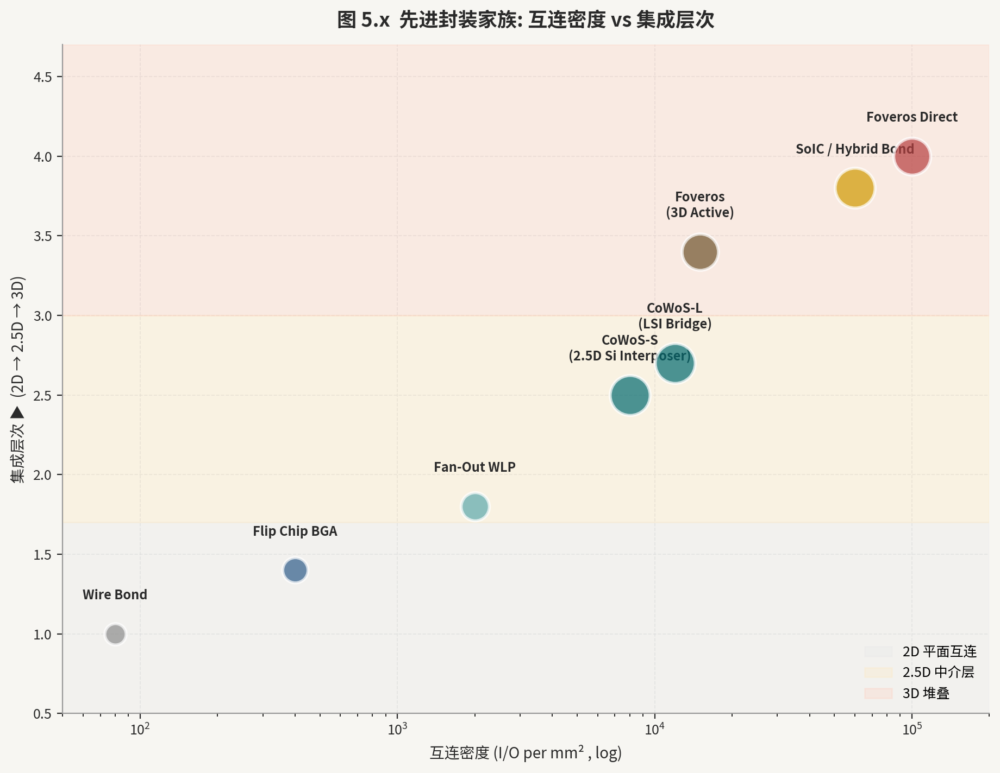

国内三大 OSAT 合计占全球市场约 15%，是近年来先进封装能力提升最快的梯队。国内头部 OSAT 通过收购星科金朋（STATS ChipPAC）实现国际化布局 [17-3]，2022 年先进封装（含 Fan-Out、SiP、Bumping）收入占比提升至约 35%，Flip Chip BGA 和 Fan-Out WLP 是其支柱产品线。国内头部 OSAT 是 AMD CPU/GPU 的主要封测供应商之一，2.5D/3D 封装（FC-LGA/FC-BGA + CoS）和 Chiplet 7nm 已实现量产。国内 OSAT 厂商深耕 SiP（System in Package）赛道，在可穿戴设备的 SiP 封装中占据重要份额，同时积极布局先进封装扩产。

#### 17.2　国产 OSAT 差异化竞争

在三大传统龙头之外，国产 OSAT 新兴梯队正在细分赛道形成差异化竞争优势。国内 WLP/MCM 封装新军专注于晶圆级封装（WLP）和高密度多芯片模组（MCM），2023 年 WLP 营收同比增长 84% [17-8]，是国内成长最快的先进封装新军，受益于 5G 射频前端模组和汽车雷达传感器的国产化替代需求。国内 WLP/CIS 封装厂商是国内晶圆级光学封装（WLO）和通孔玻璃封装（TGV）的专精厂商，主要服务于 CMOS 图像传感器（CIS）封装市场，索尼/豪威等全球主要 CIS 客户均有合作，TGV 技术路线与 BSPDN、先进玻璃基板的中远期需求高度协同。

存储、显示驱动 IC、CIS 与 WLP 等细分封装厂商在客户认证、工艺平台和规模上差异明显。评估其技术位置应核查封装类型、客户验证、良率、稼动率和收入占比，不能把“进入供应链”直接等同于 HBM 能力或持续盈利。

#### 17.3　封装设备与材料

先进封装升级带动引线键合、倒装键合、晶圆切割、模塑、植球以及高精度键合对准设备演进。混合键合尤其提高了对对准、表面处理和检测的要求；国内厂商正在从无掩模光刻、键合与检测等环节切入，但“设备可用”仍需与客户认证和稳定收入分开记录。

封装材料市场包括：封装基板（Substrate，主要由台湾南亚电路板、日月光 ASE 内制、LG 化学、中国建滔等提供）、ABF 胶片（味之素 AGC 主导，供应高度集中）、底充胶（Underfill）、模塑料（EMC）、焊料（Solder，Sn-Ag-Cu 合金）和芯片粘接膜（DAF，Die Attach Film）。国内封装材料企业整体处于追赶阶段，代表企业包括：华海诚科（，EMC 模塑料）、国内 CMP 材料头部厂商（，CMP 抛光液，兼顾前道和封装）、国内光刻胶厂商（，电镀铜液）、国内 CMP 抛光垫厂商（，CMP 抛光垫）。封装材料的国产化率整体低于前道设备（约 10-20% vs. 前道的 20-30%），提升空间大，但部分材料（如 ABF 胶片）的技术门槛极高，短期内国产替代难度较大。

#### 第 17 章参考文献

[17-1] ASE Group. ASE 2024 Annual Report. Advanced Semiconductor Engineering Inc. 2025. https://www.aseglobal.com/en/investors/annual_report/
[17-2] Amkor Technology. Amkor 2024 Annual Report. Amkor Technology Inc. 2025. https://ir.amkor.com/annual-reports
[17-3] 国内头部 OSAT. 2023年年度报告. 江苏国内头部 OSAT股份有限公司. 2024. https://www.jcetglobal.com/investor-relations
[17-4] 国内头部 OSAT. 2023年年度报告——AMD封测及先进封装进展. 国内头部 OSAT子股份有限公司. 2024. https://www.tfme.com/investor
[17-5] TrendForce. Global OSAT Market Share 2024. TrendForce Research. 2024. https://www.trendforce.com/presscenter/news/osat
[17-6] Yole Intelligence. Advanced Packaging OSAT Competitive Landscape 2024. Yole Group. 2024. https://www.yolegroup.com/reports/report/osat-packaging-2024/
[17-7] 国内 OSAT 厂商. 2023年年度报告——SiP封装及先进封装布局. 国内 OSAT 厂商（昆山）电子有限公司. 2024. https://www.htitc.com/investor
[17-8] 国内 WLP/MCM 封装新军. 2023年年度报告——WLP营收增长84%. 国内 WLP/MCM 封装新军（宁波）股份有限公司. 2024. https://www.siliconmx.com/investor
[17-9] ASMPT. ASMPT 2024 Annual Report. ASMPT Limited. 2025. https://www.asmpt.com/en/investors/annual-reports/
[17-10] IEEE ECTC 2024. Advanced Fan-Out Packaging for AI Edge Inference. IEEE Xplore. 2024. https://ieeexplore.ieee.org/document/10556890
[17-11] 国内 WLP/CIS 封装厂商. 2023年年度报告——TGV玻璃通孔封装进展. 国内 WLP/CIS 封装厂商（苏州）股份有限公司. 2024. https://www.wlcsp.com.cn/investor
[17-12] TechInsights. TSMC InFO_oS Packaging Analysis. TechInsights. 2024. https://www.techinsights.com/blog/tsmc-info-packaging-analysis

---

<a id="vol-6"></a>

## 卷六 · 互连与存储体系重构

### 第 18 章　Die-to-Die（D2D）互连与片间互联标准

#### 18.1　UCIe 1.0/2.0 详解

UCIe（Universal Chiplet Interconnect Express）是由 Intel 发起、AMD、Arm、高通、台积电、三星、ASE 等超过 100 家产业链企业共同制定的开放性 Die-to-Die 互连标准，旨在为 Chiplet 异构集成提供统一的物理层（PHY）和协议层规范，实现不同厂商裸片的"即插即用"互连。UCIe 1.0（2022 年 3 月发布）定义了两种物理层封装类型 [18-1,18-2]：标准封装（Standard Package，基于有机基板，凸块 pitch 100μm）和先进封装（Advanced Package，基于 2.5D/3D 硅中介层，凸块 pitch 25μm）。协议层支持 PCIe（5.0/6.0）和 CXL（2.0/3.0）两种上层协议的透明传输，实现设计生态的最大兼容性。

UCIe 的带宽密度是其核心性能指标。1.0 版本先进封装模式下，凸块 pitch 25μm，单向带宽密度约 13.3Gbps/mm（接口边界）；标准封装模式下约 3.3Gbps/mm。UCIe 2.0（2023 年发布）将先进封装模式的凸块 pitch 缩小至 10μm，对应单向带宽密度提升至约 40Gbps/mm，功耗效率约为 0.5pJ/bit，比传统片外 SerDes（约 5-10pJ/bit）低 10-20 倍。UCIe 标准的深远意义在于推动 Chiplet IP 生态的建立：芯片设计公司可以将特定功能模块（UCIe Die，如模拟 PHY、SRAM 缓存、HBM 接口）设计为标准 Chiplet，在多个客户芯片中重复使用，显著降低先进制程研发成本。高通 Snapdragon X Elite 的异构 Chiplet 方案已部分采用 UCIe 兼容接口设计，Intel Meteor Lake / Lunar Lake 的多 Tile 架构也以 UCIe 思想为基础。

#### 18.2　其他 D2D 互连协议生态

除 UCIe 外，产业链中并存多个 Die-to-Die 互连规范，各有其技术定位和生态覆盖范围。BoW（Bunch of Wires）是由 OIF（光互连论坛）和 JEDEC 联合推动的超短距离 Die-to-Die 互连规范，以最简单的并行信号线实现极低延迟（<10ps）和极低功耗（<0.5pJ/bit），适合同一封装内芯片间的直接通信，bandwidth density 达到 1Tbps/mm，是 UCIe 在封装内近距离场景的重要补充。OpenHBI（Hybrid Bonding Interface）是专门针对混合键合（Hybrid Bonding）互连场景设计的协议框架，支持 pitch <10μm 的超细 Cu-Cu 互连，带宽密度可达 100Gbps/mm 以上，由三星、台积电等联合推动，主要应用于 3D 堆叠 SoC 和 HBM-Logic 混合键合场景。

XSR（Extra Short Reach SerDes）由 OIF 定义，工作距离为 0-5mm（适合同封装不同基板位置的裸片互连），每通道速率 112Gbps/lane，功耗约 0.5pJ/bit，代表了高速 SerDes 向封装内延伸的技术路线。AIB（Advanced Interface Bus）是 Intel 专有的 Chiplet 接口标准，用于其 EMIB 技术平台上的多 Die 互连，pitch 约 55μm，bandwidth density 约 2Tbps/mm²，已在 Intel Stratix 10 FPGA 和 Ponte Vecchio GPU（Xe HPC）中量产应用。OIF CEI（Common Electrical Interface）系列标准（CEI-112G-XSR/VSR/MR/LR）覆盖从极短距离到长距离的高速电接口全谱系，是数据中心内 112G/224G PAM4 SerDes 的主要规范基础。

#### 18.3　NVLink、Infinity Fabric 与 CXL Over Fabric

专有高速互连协议在特定生态系统中发挥着 UCIe 无法替代的作用。Nvidia NVLink 是 GPU 间高速互连的事实标准，在 A100 代（NVLink 3.0）提供单向 300GB/s 带宽，H100 代（NVLink 4.0）提升至 450GB/s，GB200 NVL72 机架（NVLink 5.0）通过 NVSwitch 实现 576 GB/s 双向带宽，形成"All-to-All"的 72 GPU 全连接网络，是大型语言模型（LLM）张量并行训练的核心硬件基础。NVLink-C2C（Chip-to-Chip）在 Grace Hopper 超级芯片（GH200）中以 900GB/s 双向带宽连接 Grace CPU 和 Hopper GPU [18-4]，通过 SiC（Silicon Interface Chip）实现的高密度封装内互连，带宽密度约 7Tbps/mm²，显著超越 PCIe 5.0 的 128GB/s。

AMD Infinity Fabric 是 AMD 所有 IP 核（CPU、GPU、I/O Die）之间的统一互连架构，覆盖从片内（On-Die，Scalar Data Fabric）到片间（Inter-Die，在 EPYC 服务器 CPU 的多 CCD 连接）的不同距离。Infinity Fabric 在 Milan/Genoa EPYC CPU 中以 18GB/s 带宽连接多个 CCD（Core Complex Die）与 IOD（I/O Die），在 Instinct MI300X GPU 中实现 8 个 XCD（GPU Die）与 4 个 IOD 之间的超高带宽互连（聚合内存带宽 5.3TB/s）。CXL Over Fabric 是将 CXL 协议从 PCIe 物理层解耦、运行在光纤或以太网 Fabric 上的延伸方案，使数据中心级内存池化（Memory Pooling）和存算分离（Disaggregated Computing）成为可能，具体技术细节见第 19 章 [18-7,18-12]。

#### 18.4　D2D 互连协议性能对比与选择逻辑

不同 Die-to-Die 互连标准在带宽密度、延迟、功耗效率和适用封装形态上存在显著差异，设计团队需根据具体集成场景进行选择。从量化角度汇总核心参数：UCIe 2.0 先进封装模式带宽密度约 40Gbps/mm，功耗约 0.5pJ/bit，适用于 2.5D 硅中介层上多 Chiplet 的通用互连；BoW（Bunch of Wires）带宽密度达 1Tbps/mm，延迟 <5ps，功耗 <0.1pJ/bit，适合同封装极近距离（<1mm）低延迟场景，但缺乏纠错和协议层能力；混合键合（HB/OpenHBI）在 pitch 9μm 模式下带宽密度超过 100Gbps/mm，适合 3D 堆叠的逻辑-存储直连；NVLink-C2C 带宽密度约 7Tbps/mm²（面积密度），但属 Nvidia 专有，仅适用于 Nvidia 生态内部。

从投资视角分析，UCIe 生态的扩展意味着 Chiplet IP 的商品化趋势：过去只能在单一 IDM（如 Intel）内部复用的高速 PHY、SRAM Cache 等模块，未来将能够跨越不同代工厂进行组合，催生一批专注于 UCIe-compliant IP 授权的新兴企业。Arm 推出的 UCIe 兼容 CMN（Coherent Mesh Network）和 CHI 接口 Chiplet，高通正在设计的 UCIe Server SoC，以及台积电 CoWoS + UCIe 的"开放异构封装平台"，都是推动这一生态加速形成的重要力量 [18-7,18-9]。对于量化研究者，追踪 UCIe 联盟成员数量增长（从 2022 年初创时的 10 家扩展至 2024 年超过 130 家）和 UCIe 认证 IP 目录的丰富程度，是判断 Chiplet 经济性拐点是否到来的客观指标。

#### 18.5　片间互连的散热与信号完整性挑战

高密度 Die-to-Die 互连在追求极限带宽密度的同时，带来了不可忽视的散热和信号完整性工程挑战。在散热层面，micro-bump 阵列（pitch 36-55μm）在高电流密度下产生的焦耳热，叠加下层逻辑 Die 的热流，使封装内局部热点温度可超过 100°C，凸块界面金属间化合物（IMC，如 Cu3Sn、Cu6Sn5）在高温下的生长速率加快，影响长期可靠性（电迁移寿命 MTTF）。混合键合因消除焊料，电迁移问题得到根本性改善，但其热阻（接触热阻约 0.1°C·mm²/mW）在超高密度堆叠中依然不可忽略，需要配合背面散热（Backside Cooling）或微通道液冷方案。

信号完整性方面，Die-to-Die 互连的高频特性（NRZ 56Gbps 或 PAM4 112Gbps）对封装内传输线的阻抗匹配、串扰控制和抖动预算提出严格要求。硅中介层的介电常数（εr ≈ 11.8）高于有机基板（εr ≈ 3.5-4.5），导致硅中介层上的传输线特性阻抗和传播延迟有所差异，需要在 RDL 线宽和间距设计时进行修正。对于 UCIe 2.0 的 10μm pitch 先进封装模式，凸块阵列的寄生电容（约 2-5fF/bump）和电感（约 1-2pH/bump）已成为限制信号通道性能的主要寄生参数，需要专用 PI（电源完整性）和 SI（信号完整性）联合仿真工具链（如安似科技的 Ansys SIwave、楷登电子的 Cadence Clarity）进行精确建模 [18-6,18-12]。

#### 第 18 章参考文献

[18-1] UCIe Consortium. UCIe 2.0 Specification. UCIe Consortium Official. 2023. https://www.uciexpress.org/specification
[18-2] Intel. UCIe: Universal Chiplet Interconnect Express Overview. Intel Foundry Blog. 2023. https://www.intel.com/content/www/us/en/foundry/ucie.html
[18-3] OIF. Common Electrical Interface 224G (CEI-224G-XSR). Optical Internetworking Forum. 2023. https://www.oiforum.com/technical-work/hot-topics/cei-224g/
[18-4] NVIDIA. NVLink 5.0 Technology in GB200 NVL72. NVIDIA Technical Blog. 2024. https://developer.nvidia.com/blog/nvlink-5-gb200-nvl72-architecture
[18-5] AMD. AMD Infinity Fabric Technology Overview. AMD Technical White Paper. 2024. https://www.amd.com/en/technologies/infinity-fabric
[18-6] IEEE ISSCC 2024. UCIe 2.0 PHY with 40Gbps/mm Bandwidth Density. IEEE Xplore. 2024. https://ieeexplore.ieee.org/document/10454109
[18-7] SemiAnalysis. Chiplet Ecosystem and UCIe Market Analysis 2024. SemiAnalysis.com. 2024. https://www.semianalysis.com/p/ucie-chiplet-ecosystem
[18-8] Intel. EMIB 3rd Generation for Ponte Vecchio. Intel HotChips 2022. 2022. https://www.intel.com/content/www/us/en/developer/articles/technical/ponte-vecchio-emib.html
[18-9] Qualcomm. Snapdragon X Elite Chiplet Architecture. Qualcomm Technology Summit. 2023. https://www.qualcomm.com/news/releases/2023/10/qualcomm-snapdragon-x-elite
[18-10] IEEE VLSI 2024. BoW Die-to-Die Interconnect with 1Tbps/mm Bandwidth. IEEE Xplore. 2024. https://ieeexplore.ieee.org/document/10631302
[18-11] TSMC. TSMC SoIC 3D Stacking Technology. TSMC Official. 2024. https://www.tsmc.com/english/dedicatedFoundry/technology/packaging/soic
[18-12] AnandTech. Chiplet Interconnect Standards Comparison: UCIe, BoW, NVLink. AnandTech. 2023. https://www.anandtech.com/show/20001/chiplet-interconnect-standards-comparison

---

### 第 19 章　CXL 与存储分层重构

#### 19.1　CXL 协议演进：从 1.0 到 3.1

计算快速链路（Compute Express Link，CXL）是基于 PCIe 物理层（电气层完全兼容 PCIe 5.0/6.0）构建的高性能互连协议，由 Intel 主导发起，在 2019 年成为开放标准并由 CXL 联盟持续演进维护 [19-1]。CXL 的核心价值在于提供三类子协议的统一传输：CXL.io 实现设备的 I/O 初始化和配置（等同于 PCIe 语义，兼容现有软件栈）；CXL.cache 允许设备（如 GPU、FPGA、SmartNIC）缓存主机内存（Host Memory），实现主机-设备之间的高效缓存一致性（Cache Coherency），避免传统 DMA 模型中频繁的内存复制开销；CXL.mem 允许主机直接访问设备附加的内存（Device Attached Memory，DAM），将 CXL 内存扩展器（Memory Expander）视为主机内存地址空间的一部分，支持负载-存储（Load/Store）语义访问。

CXL 1.0/1.1（2019-2020 年）奠定了三类子协议的基础，但主要停留在规范层面，实际部署有限。CXL 2.0（2020 年）引入内存池化（Memory Pooling）和交换（Switching）能力，支持一个 CXL Switch 连接多个主机和多个内存扩展器，允许内存资源在主机间动态分配，利用率从传统 DRAM 的 40-60% 提升至 80% 以上 [19-11]。CXL 3.0（2022 年）是架构上最重要的演进：引入 Fabric 拓扑支持，最多 4096 个节点 [19-1,19-7]组成共享内存网络，端到端延迟约 100-200ns（取决于 Fabric 跳数），实现真正意义上的数据中心级内存解聚（Memory Disaggregation）；同时升级为 PCIe 6.0 物理层（68GT/s PAM4，x16 接口双向带宽 256GB/s）；并引入 Back-Invalidate 机制，支持 Type 2 设备（如 GPU）发起的主机缓存失效，完善双向缓存一致性。CXL 3.1（2023 年）在 3.0 基础上补充了多级 Fabric 和增强的安全（Trusted Execution Environment，TEE）能力，并向 PCIe 7.0 平滑演进做出前瞻性定义。

#### 19.2　CXL 内存池化的商业价值

内存池化（Memory Pooling）是 CXL 技术在 2024-2027 年最早实现规模商业化的应用场景，核心商业逻辑是解决现代服务器中普遍存在的内存利用率低下问题。传统服务器 DRAM 内存由 CPU 直接挂载（DDR5 DIMM），内存容量按峰值工作负载配置，但大多数时间工作负载内存占用远低于峰值，导致实测内存利用率仅 40-60%。在超大规模 AI 推理集群中，不同推理请求的内存占用差异更大（短上下文 vs. 长上下文 LLM），静态分配的内存利用率问题尤为突出。CXL Memory Pooling 通过 CXL Switch 将多台主机的内存扩展需求汇聚至一个共享内存池，允许动态调拨内存容量（以 256MB 或 1GB 粒度），可将整体内存利用率提升至 80% 以上，对于数百亿美元规模的超大规模数据中心，内存节省效益极为可观。

美满电子（Marvell）的 Structera S CXL Memory Controller [19-3] 是较早交付的 CXL 内存池化芯片之一；其公开测试报告了特定 LLM 推理配置下的吞吐和首 Token 延迟改善。该结果高度依赖模型、内存容量、软件栈和对照配置，不能外推为所有工作负载的固定倍数。产业链观察对象包括 CXL 控制器、DRAM 模组、SerDes 与 Retimer 供应商；验证重点是客户部署、容量利用率、软件兼容性与收入，而非“受益方”名单。

#### 19.3　CXL 内存分层与 HBM 互补

CXL 的出现并非取代 HBM 或 DDR，而是构建了三层互补的存储体系架构（Memory Tier Architecture），满足 AI 计算系统对带宽、容量和弹性三个维度的差异化需求。第一层（Tier 0）：HBM（高带宽存储），与 GPU/NPU 通过 CoWoS 硅中介层同封装，带宽密度最高（>1TB/s 每颗），容量相对有限（当前 24-48GB 每颗，总计约 192GB/卡），延迟最低（<100ns），适合存放频繁访问的模型激活（Activation）、KV Cache 和热数据。第二层（Tier 1）：DDR5 主内存，通过 CPU 内存控制器直接挂载，带宽约 100-200GB/s，容量大（可达 4-8TB/主机），价格经济，适合存放模型权重（Weight）冷数据和操作系统工作集。

第三层（Tier 2）：CXL 弹性扩展内存，通过 CXL 协议连接至主机或 CXL Switch，提供超大容量（单 Fabric 可达数 TB 至数十 TB）、按需动态分配的内存资源，带宽取决于 CXL 接口速率（PCIe 6.0 x16 约 256GB/s），延迟约 200-500ns（比 DDR5 慢约 3-5 倍），适合存放推理批次间不活跃的长文本上下文、多用户会话状态和中间结果缓存。清华大学等机构在 ITME（Inference-Time Memory Extension）等研究项目中，实证了三层内存体系对于超长上下文 LLM 推理（Context Length >128K tokens）的显著效益：通过 CXL 扩展的超大 KV Cache，100B 参数 LLM 在 512K 上下文长度下的推理吞吐量可提升约 3 倍，相比纯 DDR5 配置。

#### 19.4　近存计算（PNM）与存内计算（PIM）

随 AI 推理对内存带宽的需求超越数据中心传统互连架构的供给能力，"将计算移至数据附近"（Processing Near Memory，PNM / Processing In Memory，PIM）的思路获得了产业界的广泛关注和投入。PIM 在 DRAM 存储阵列内部或紧邻位置集成简单计算单元（如加法器、乘法器、激活函数加速器），将矩阵-向量乘法（GeMV，Generalized Matrix-Vector Multiplication）等内存密集型操作直接在存储单元中执行，避免数据在总线上的往返传输，理论上可将有效"存储带宽"提升至物理带宽的 10-100 倍。

Samsung 推出了 HBM-PIM（HBM with Aquabolt-XL）[19-5]和 CXL-PIM 两种产品形态：前者在 HBM2E 的 Base Die 中集成了 FP16 运算单元阵列，在 AI 推理场景（尤其是 Transformer 模型的注意力层计算）中将矩阵乘法性能提升约 2.4 倍，功耗降低 62%；后者在 CXL 内存扩展器中集成了 PIM 逻辑，允许 CPU 将计算任务卸载至 CXL 设备侧执行。SK Hynix 的 AiM（Accelerator-in-Memory）架构 [19-6]在 GDDR6 存储基础上集成了 BF16 MAC 阵列，主要面向边缘 AI 推理（手机、汽车）场景。国内方面，国内 DRAM 头部厂商（CXMT）和紫光集团（Unigroup）均已公开发布过 PIM 架构的研究成果和路线图，但产品化进程预计晚于国际同行 2-3 年，核心挑战在于先进制程基础（DRAM 存储制程）和 PIM 编程模型（软件栈）的双重积累。

#### 第 19 章参考文献

[19-1] CXL Consortium. CXL 3.1 Specification. CXL Consortium Official. 2023. https://www.computeexpresslink.org/cxl-specification
[19-2] Intel. CXL Technology Overview and Use Cases. Intel Developer Zone. 2024. https://www.intel.com/content/www/us/en/developer/topic-technology/compute-express-link.html
[19-3] Marvell. Marvell Structera S CXL Memory Controller. Marvell Press Release. 2024. https://www.marvell.com/company/newsroom/structera-cxl.html
[19-4] Astera Labs. Aries CXL Smart Retimer Product Brief. Astera Labs. 2024. https://www.asteralabs.com/products/smart-retimers/
[19-5] Samsung. Samsung HBM-PIM with Aquabolt-XL Architecture. Samsung Semiconductor Technical Paper. 2023. https://semiconductor.samsung.com/us/consumer-storage/hbm/hbm-pim/
[19-6] SK Hynix. SK Hynix AiM Accelerator-in-Memory Technology. SK Hynix Newsroom. 2023. https://news.skhynix.com/sk-hynix-aim-technology/
[19-7] IEEE ISSCC 2024. CXL 3.0 Memory Pooling: 4096-Node Architecture. IEEE Xplore. 2024. https://ieeexplore.ieee.org/document/10454078
[19-8] 国内内存接口芯片头部厂商. 2023年年度报告——DDR5/CXL Retimer进展. 国内内存接口芯片头部厂商股份有限公司. 2024. https://www.montage-tech.com/ir
[19-9] Microchip Technology. Switchtec PCIe/CXL Switch Product Line. Microchip Technology. 2024. https://www.microchip.com/en-us/products/storage/pcie-switches-and-bridges
[19-10] Rambus. Rambus CXL Memory Interface IP. Rambus Technology. 2024. https://www.rambus.com/security/post-quantum-cryptography/
[19-11] SemiAnalysis. CXL Memory Pooling Economics and AI Use Cases. SemiAnalysis.com. 2024. https://www.semianalysis.com/p/cxl-memory-pooling-ai
[19-12] IEEE Micro. ITME: Inference-Time Memory Extension for LLM. IEEE Xplore. 2024. https://ieeexplore.ieee.org/document/10634521
[19-13] Digitimes. CXL Adoption in Hyperscale Data Centers 2024-2026. Digitimes Research. 2024. https://www.digitimes.com/news/a20241015VL205

### 第 20 章　存储芯片产业全景

存储芯片是半导体产业中规模最大、周期性最强的子领域之一，2024 年全球存储芯片市场规模约 1700 亿美元，占整体半导体市场的 22% 左右。该市场高度集中于 DRAM 与 NAND Flash 两大品类，二者合计占据存储市场约 90% 份额。存储芯片的竞争逻辑在于工艺节点迭代速度（决定位成本下降曲线）与产能规划的精准度（决定供需周期振幅）。2023 年至 2025 年的超级周期中，AI 训练对高带宽存储的爆发性需求，与传统消费电子的低迷形成剧烈分化，深刻重塑了三星、SK Hynix、Micron 的产品结构与毛利分布。

存储芯片的投资分析必须区分两类不同的价值驱动因素：其一是周期性的供需平衡（DRAM/NAND 的价格弹性约为 -2 至 -3，即需求增长 10% 可带动价格涨幅 20%-30%）；其二是结构性的技术升级红利（HBM 的 ASP 约为普通 DDR5 的 5-8 倍）。在 AI 驱动的新周期中，HBM 专项产能的占比成为区分 SK Hynix（领先）、三星（追赶）、Micron（第三）的核心估值差异点。

#### 20.1　DRAM：DDR5、LPDDR5X、GDDR7

DRAM 主流制程已进入 1α（14nm 级）和 1β（12nm 级）节点，各厂商均在向 1γ（10nm 级）推进。DDR5 相较 DDR4 在单通道带宽上翻倍，标准速率从 DDR4-3200 的 25.6 GB/s 提升至 DDR5-6400 的 51.2 GB/s，并引入片上 ECC 和命令/地址奇偶校验以提升可靠性[20-3]。2024 年 PC 市场 DDR5 渗透率突破 50%，服务器侧受 Intel Sapphire Rapids/Emerald Rapids 及 AMD Genoa 平台驱动，DDR5 RDIMM 已成为数据中心采购主流[20-4]。

LPDDR5X 面向移动端，峰值速率达 8533 Mbps，相较 LPDDR5 提升约 33%。高通骁龙 8 Gen 3、联发科天玑 9300 及苹果 M4 系列均已搭载。在功耗方面，LPDDR5X 通过降低工作电压（1.01V 降至 0.9V）实现 10%-15% 的能效提升，对移动端续航至关重要。SK Hynix 已率先量产 12Gb LPDDR5X 芯片，三星与 Micron 紧随其后。

GDDR7 专为显卡与 AI 推理加速器设计，针脚带宽达 32 Gbps（对比 GDDR6X 的 21 Gbps），内存子系统带宽提升约 52%[20-2]。NVIDIA RTX 5090 配备 32GB GDDR7，总带宽 1.79 TB/s；AMD RX 9070 XT 亦采用 GDDR7。在 AI 推理场景中，GDDR7 凭借较 HBM 更低的成本优势，适合中端推理卡的大规模部署。Micron、三星和 SK Hynix 三家均已进入 GDDR7 量产阶段，竞争焦点转向速率（32Gbps 向 36Gbps+）和良率提升。

DRAM 供给侧的高度集中（三星、SK Hynix、Micron 合计市占率超 95%）使得价格波动剧烈。2024 年 DRAM 合同价同比涨幅超 60%，HBM 专项产能占 SK Hynix DRAM 总产能约 20%，彻底改变了厂商的产品组合策略[20-4]。展望 2026-2027 年，1γ 节点量产与 HBM4 导入将是决定各厂商成本竞争力的关键变量。

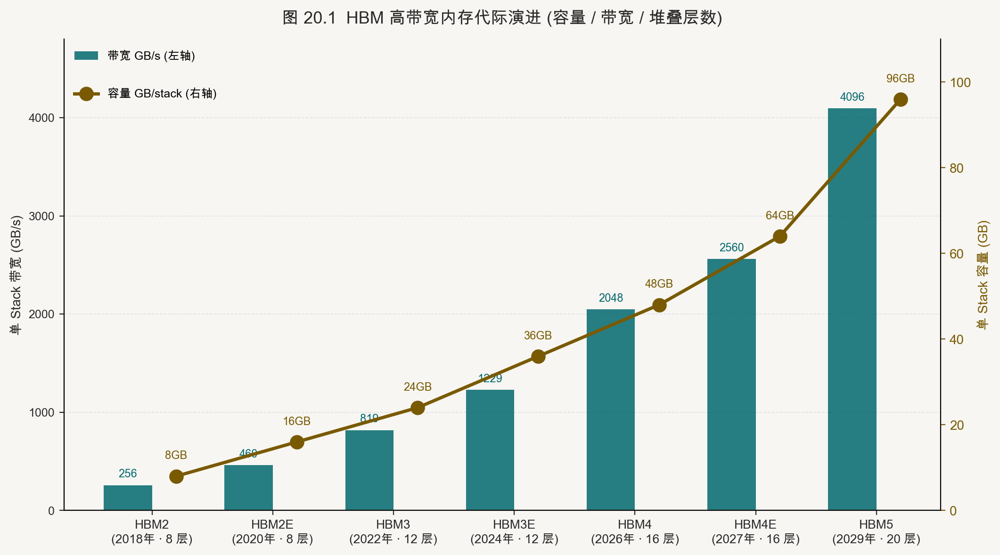

#### 20.2　NAND Flash：3D NAND 层数竞赛与 CBA 架构

NAND Flash 的核心竞争维度是三维堆叠层数与存储密度。2020 年主流层数约 128 层，2023 年三星、铠侠和西部数据推出 200+ 层产品，2024-2025 年第五代 TLC 产品已向 300 层迈进，SK Hynix 与 Micron 宣布 400+ 层规划于 2026 年前后实现量产。层数提升带来的单位面积比特密度增加，是位成本（Cost per Bit）持续下降的主要驱动力，历史上约每两年下降 30%-40%。

技术路线上，CBA（Cell-on-Bonded-Array）键合架构是近年最重要的结构性突破。传统 3D NAND 将外围电路（Peri）与存储阵列（Array）制造在同一晶圆上，造成面积浪费。CBA 通过晶圆键合技术将外围电路晶圆与存储阵列晶圆分开制造后键合，使外围电路可采用先进逻辑工艺（28nm 甚至 16nm）独立优化，存储阵列则聚焦高密度堆叠，二者协同可实现芯片面积减少约 30%、读写性能提升约 20%[20-7]。SK Hynix 的 4D NAND（PUC 架构）、三星的 V-NAND 新代际以及铠侠/西数联合研发均在向 CBA 或类似思路靠拢。

QLC（4bit/cell）的规模化量产是 NAND 容量经济性的另一路径。QLC 相较 TLC 容量密度提升 33%，但擦写寿命约 1000 次（TLC 约 3000 次），更适合读多写少的数据湖、冷存储场景[20-5]。Micron 232 层 QLC 产品已进入量产，三星 V9 QLC 亦于 2024 年批量出货。企业级固态硬盘领域，QLC 渗透率从 2023 年的约 20% 向 35% 提升。

NAND Flash 周期性比 DRAM 更为剧烈，因其供给端参与者更多（铠侠/西数、SK Hynix、三星、Micron、国内 NAND 头部厂商 YMTC）。2024 年受 AI 存储需求带动，企业级 SSD 价格回暖，但消费级价格修复滞后。国产方面，国内 NAND 头部厂商推出的 232 层 TLC NAND（X3-9070）在技术规格上已接近国际一线水平，但受美国出口管制影响，市场拓展受限于境内生态。

#### 20.3　新型存储：MRAM、ReRAM、PCM、FeRAM

新型非易失性存储器（NVM）试图在访问速度、耐久性、功耗和非易失性之间取得传统存储无法同时达到的平衡，是存内计算（Processing-in-Memory）架构的核心使能技术。

MRAM（磁阻随机存取存储器）利用磁隧道结（MTJ）的磁阻效应存储信息，读写速度接近 SRAM（纳秒级），耐久次数超过 10^12 次，且掉电不丢数据。Everspin 的 STT-MRAM 已用于工业控制器和汽车 MCU 的替代 NOR Flash 场景；台积电和三星均提供嵌入式 MRAM 工艺模块（eMRAM），用于 22nm/28nm 节点 MCU 的片内缓存。其主要缺陷是单元面积较 DRAM 大、高密度扩展困难，当前密度上限约 1Gb，难以替代主存 DRAM。

ReRAM（阻变随机存取存储器）通过导电细丝的形成与断裂改变电阻状态，写入能耗极低（飞焦级），天然适合模拟权重存储，是神经网络硬件加速中存内乘累加（In-Memory MAC）的有力候选。Weebit Nano、Crossbar 等公司已推出嵌入式 ReRAM IP。缺陷在于器件变异性（Variability）较大，在精确推理中需引入额外的误差补偿电路。

PCM（相变存储器）利用硫系化合物材料在晶态（低阻）与非晶态（高阻）之间的可逆相变存储数据。Intel 与 Micron 联合开发的 3D XPoint 技术（品牌名 Optane）是 PCM 最重要的商业化尝试：Optane DC Persistent Memory（DCPMM）以 DIMM 形式插入内存插槽，提供介于 DRAM 与 SSD 之间的性能（读延迟约 300ns，对比 DRAM 的约 80ns 和 NVMe SSD 的约 70μs）。然而 Intel 于 2022 年宣布退出 Optane 业务，反映出 PCM 在成本和生态上的困境[20-9]。三星在 HBM-PIM（Processing-In-Memory）方向继续探索多值 PCM 单元用于模拟计算。

FeRAM（铁电随机存取存储器）利用铁电材料的剩余极化存储信息，读写功耗极低（pJ 量级），耐久性超过 10^14 次，是低功耗 IoT 传感器节点的理想选择。德州仪器和富士通的嵌入式 FeRAM MCU 已广泛用于智能仪表、医疗设备。新兴方向是 FeFET（铁电场效应晶体管），将铁电材料集成于标准 CMOS 栅极，以 HfO2 基铁电薄膜实现，Infineon、GlobalFoundries 等均有相关工艺平台。

#### 第 20 章参考文献

[20-1] SK Hynix. HBM3E 12-High Product Brief. SK Hynix Newsroom. 2024. https://news.skhynix.com/sk-hynix-develops-the-worlds-best-performing-hbm3e/

[20-2] Micron Technology. Micron 1β DRAM Technology Node White Paper. Micron Insight. 2023. https://www.micron.com/about/blog/memory/dram/micron-1-beta-dram

[20-3] JEDEC. JESD79-5C: DDR5 SDRAM Standard. JEDEC Solid State Technology Association. 2024. https://www.jedec.org/standards-documents/docs/jesd79-5c

[20-4] TrendForce. DRAM Market Pricing & Capacity Analysis Q4 2024. TrendForce Research. 2024. https://www.trendforce.com/presscenter/news/20241212-12094.html

[20-5] Samsung Semiconductor. V-NAND Technology Overview: 3D NAND Scaling Roadmap. Samsung Semiconductor. 2024. https://semiconductor.samsung.com/us/consumer-storage/internal-ssd/

[20-6] Kioxia. BiCS FLASH 3D Flash Memory Technology. Kioxia Technical Report. 2024. https://www.kioxia.com/en-jp/rd/technology/bics-flash.html

[20-7] SK Hynix. 4D NAND PUC Architecture Technical Brief. SK Hynix Newsroom. 2023. https://news.skhynix.com/sk-hynix-unveils-321-layer-4d-nand-flash/

[20-8] Everspin Technologies. STT-MRAM Persistent Memory Product Guide. Everspin Technologies. 2024. https://www.everspin.com/spin-torque-mram-technology

[20-9] Intel Corporation. Intel Optane Technology Overview and Discontinuation Notice. Intel Newsroom. 2022. https://www.intel.com/content/www/us/en/newsroom/news/intel-winds-down-optane-business.html

[20-10] IBS (International Business Strategies). NAND Flash Market Forecast 2024-2028. IBS Research. 2024. https://www.ibis.com

[20-11] SEMI. Global Semiconductor Equipment Market Statistics 2024. SEMI Industry Research. 2024. https://www.semi.org/en/products-services/market-data/semiconductor-equipment

[20-12] Semianalysis. NAND Flash: The Long Road to 300+ Layer 3D NAND. SemiAnalysis. 2024. https://www.semianalysis.com/p/nand-flash-300-layer-roadmap

---

---

<a id="vol-7"></a>

## 卷七 · 下游计算节点

### 第 21 章　通用 CPU 架构演进

CPU 在 AI 时代的定位正经历深刻重构：从主处理器演变为协调器——负责调度 GPU/NPU/DSP 等加速单元、管理内存层次体系、处理控制流密集型任务。尽管如此，CPU 架构本身的技术竞争并未减缓，反而因 Arm 生态崛起、RISC-V 商业化加速以及国产自研指令集的突破，呈现出前所未有的多极格局。2024 年服务器 CPU 市场规模约 200 亿美元，其中 x86 占据约 80% 份额，Arm 服务器从约 8% 快速攀升。

#### 21.1　x86 双寡头：Intel 与 AMD

Intel 在 2024-2025 年推出了面向不同细分市场的两款旗舰产品。Lunar Lake（Core Ultra 200V 系列）面向超薄笔记本，采用台积电 N3B 工艺制造 Compute Tile，内置 48 TOPS 的 NPU（Xe2 架构），CPU 核心采用混合大小核设计（4P + 4E），整体 SoC 包含 LP-E DRAM（LPDDR5X on-package），解决了传统 CPU+离散 DRAM 的带宽瓶颈，实测 AI PC 场景功耗比上代降低约 40%[21-1]。Granite Rapids（Xeon 6 P-core）面向数据中心，单芯片最高 128 核，支持 DDR5-6400 和 PCIe 5.0/CXL 2.0，搭配 Sierra Forest（E-core 服务器 CPU，288 核）形成性能/密度双轨布局。

Intel 在 Hot Chips 2026 进一步披露 Diamond Rapids、Crescent Island 与 Wildcat Lake：Diamond Rapids 基于 Intel 18A-P，最高 256 核、16 通道 12,800 MT/s 内存，并支持 128 条 PCIe 6.0 / CXL 3.0 通道；Crescent Island 被定位为 350W 风冷推理卡，最高配置 480GB LPDDR5X；Wildcat Lake 则成为 Intel 处理器中首个采用 UCIe 的平台 [21-13]。这些数字属于厂商架构发布，证明设计方向与规格目标，不等同于量产供货、客户验收或同条件性能胜出。

AMD Zen 5 架构（Ryzen 9000/EPYC 9005 系列）在 IPC 上较 Zen 4 提升约 16%，关键改进包括更宽的前端解码（8-wide decode）、更深的 ROB（320 vs 256 条目）、加强的向量单元（512-bit AVX-512 吞吐翻倍）[21-2, 21-10]。EPYC 9965 Turin 提供 192 个 Zen 5 核心，L3 缓存达 768MB，服务器整机 SPEC CPU2017 率先突破 1000 分大关。AMD 的 Chiplet 架构（CCD + IOD 分离）已被业界广泛参考，通过 TSMC N4P 工艺的 CCD（8 核/die）与台积电 N6 IOD 的组合，在成本和良率上达到平衡。Zen 6 路线图规划于 2026 年采用 TSMC N2，预计 IPC 再提升 15%+。

竞争格局方面，AMD 在服务器 CPU 市场份额从 2022 年的约 15% 提升至 2024 年约 24%[21-12]，并在高核数 HPC 场景中对 Intel 形成显著压制。Intel 则依托制造转型（Intel 18A 工艺的 Arrow Lake/Panther Lake）试图在 2025-2026 年重新确立工艺领先地位，但良率和量产进度仍存在不确定性，市场对此保持审慎预期。

#### 21.2　Arm 服务器与 PC

Arm 服务器生态在云计算领域的突破性进展体现在 AWS Graviton 系列的持续迭代上。Graviton 4（2024 年）采用台积电 N4P 工艺，96 Arm Neoverse V2 核心，内存带宽达 537 GB/s（8 通道 DDR5），与 Graviton 3 相比性能提升约 40%，且单位工作负载成本降低 20%-30%[21-4]。AWS 披露 Graviton 实例在其整体 EC2 算力占比超过 20%，并持续增加。Ampere Altra Max（128 Neoverse N1 核）和 Ampere AmpereOne（192 AmpereOne 核，5nm）瞄准云原生和边缘服务器，已进入谷歌、微软、甲骨文等主要云厂商的供货名单。

NVIDIA Grace CPU 基于 Arm Neoverse V2，以 Grace Hopper Superchip（GH200）形式与 H100 GPU 通过 NVLink-C2C 互连，互连带宽高达 900 GB/s，解决了传统 PCIe 在 AI 训练场景下的带宽瓶颈。GH200 中 Grace CPU 拥有 72 核心和 480GB LPDDR5X，与 H100 的 96GB HBM3e 共同构成统一内存空间，为大语言模型推理提供约 576GB 的可寻址内存。

Apple 2025 年发布的 Mac Studio 采用 M4 Max 或 M3 Ultra，并不存在“M4 Ultra”这一公开产品[21-5]。M4 Max 提供统一内存与片上 Neural Engine，M3 Ultra 则通过 UltraFusion 扩展 CPU/GPU 和统一内存容量；具体本地模型性能依赖量化精度、上下文长度与软件实现。高通 Snapdragon X Elite 采用自研 Oryon CPU 与 Hexagon NPU，是 Windows on Arm 生态的重要平台，但跨平台比较必须统一功耗与测试版本[21-6]。

Arm 授权模式从传统的架构授权（ALA）向计算子系统（CSS）扩展，允许客户在 ISA 兼容基础上定制微架构与系统集成。研究其产业位置应关注授权、版税、客户自研程度与生态采用，而不是把技术覆盖面直接写成估值结论。

#### 21.3　RISC-V 服务器与边缘

RISC-V 以开放 ISA 为核心优势，在边缘嵌入式领域的渗透已相当成熟（MCU 出货量超 10 亿颗/年），但服务器级的突破仍处于早期。SiFive Performance P870 提供 RVA23 兼容的高性能核，单核 SPEC CPU2017 整数约 11 分（对比 Cortex-X4 约 13 分），差距持续收窄。Tenstorrent 的 RISC-V + AI 加速方案（Wormhole/Blackhole）将 RISC-V 作为片上控制器与 AI 张量核协同，提供一种软件可编程的替代加速路径。

平头哥（阿里达摩院）玄铁系列（C910、C920）已通过 OpenC906 开源核积累了大量国内生态开发者，国内 RISC-V MCU 出货量在 2024 年突破 5 亿颗，国内 MCU/Flash 头部厂商（GD32VF 系列）、国内 RISC-V MCU 厂商、国内 RISC-V 厂商均是重要参与者。RISC-V 在服务器级最大的技术障碍是缺乏成熟的向量扩展（RVV 1.0 标准化于 2021 年，软件生态仍在追赶）和完整的 RAS（Reliability, Availability, Serviceability）特性支持，预计 2027 年前难以在数据中心形成规模化部署。

#### 21.4　国产 CPU 路线

中国自研 CPU 分为三条技术路线，各有其设计哲学与市场定位。

国内自主指令集路线以 LoongArch 为代表，与 MIPS 在二进制层面不兼容（尽管技术传承有联系），但已完成从内核到编译器（LLVM/GCC）、操作系统（Loongnix/UOS）的全栈适配。代表产品（2023 年）采用 12nm 工艺，4 核，实测 SPEC CPU2006 性能约与 Intel Core i5-8400（2017 年）相当，在党政信创市场具备实际可用性[21-9]。下一代规划于 2025-2026 年采用 7nm 工艺，目标 SPEC CPU2017 整数 50 分以上。SW64 路线主要用于神威超算系统，民用化进展相对缓慢。

x86 兼容路线基于 AMD Zen/Zen+ 授权（具体授权范围存在争议，许可时间节点早于 Zen 2），推出多代服务器 CPU 产品（最高 32 核，支持 DDR5），在性能上达到国际主流水平，但受制于 AMD 授权有效性和后续升级路径不确定性。Arm 路线下国内代表产品（FT-2000+/S2500 等）基于 Arm v8 授权，已规模化部署于国防、政务服务器；华为鲲鹏 920（Arm v8.2+，64 核，7nm）性能与第一代 EPYC 相当，搭载于泰山服务器并通过昇腾+鲲鹏双芯战略形成完整服务器生态。

国产 CPU 的产业逻辑在于：一方面，信创政策（党政军、金融、电信等行业替代）形成受保护的本土市场，提供了商业可行性支撑；另一方面，工艺节点受制于国内代工（国内头部代工厂最先进量产 N+2 约 7nm 等效）与海外代工限制之间的结构性张力，决定了其在国际竞争中的中短期天花板。

#### 第 21 章参考文献

[21-1] Intel Corporation. Intel Core Ultra 200V (Lunar Lake) Architecture Deep Dive. Intel Developer Zone. 2024. https://www.intel.com/content/www/us/en/newsroom/news/intel-core-ultra-200v-series-processors.html

[21-2] AMD. AMD EPYC 9005 Series (Turin) Processor Architecture Guide. AMD Developer Resources. 2024. https://www.amd.com/en/processors/epyc-9005-series

[21-3] Arm Holdings. Arm Neoverse V2 Platform: Technical Reference Manual. Arm Developer. 2023. https://developer.arm.com/documentation/102209/latest

[21-4] AWS. Graviton4: The Next Generation of AWS Graviton Processors. AWS News Blog. 2024. https://aws.amazon.com/blogs/aws/graviton4-the-next-generation-of-aws-graviton-processors/

[21-5] Apple Inc. *Apple Unveils New Mac Studio with M4 Max and M3 Ultra*. Apple Newsroom. 2025-03-05. <https://www.apple.com/newsroom/2025/03/apple-unveils-new-mac-studio-the-most-powerful-mac-ever/>

[21-6] Qualcomm Technologies. Snapdragon X Elite Platform Technical Brief. Qualcomm. 2024. https://www.qualcomm.com/products/mobile/snapdragon/pcs-and-tablets/snapdragon-x-series/snapdragon-x-elite

[21-7] RISC-V International. RVA23 Profile Specification. RISC-V ISA Specification. 2023. https://github.com/riscv/riscv-profiles/blob/main/rva23-profile.adoc

[21-8] SiFive. SiFive Performance P870 Processor IP Datasheet. SiFive. 2024. https://www.sifive.com/cores/performance-p870

[21-9] Loongson. LoongArch Processor Technical White Paper. Loongson. 2023. https://www.loongson.cn/product/cpu

[21-10] AnandTech. AMD EPYC Genoa Deep Dive: The Zen 4 Architecture. AnandTech. 2023. https://www.anandtech.com/show/17625/amd-epyc-genoa-deep-dive

[21-11] Semianalysis. Intel 18A: Last Chance to Regain Process Leadership. SemiAnalysis. 2024. https://www.semianalysis.com/p/intel-18a-process-technology-analysis

[21-12] IDC. Worldwide Server Market Quarterly Tracker Q3 2024. IDC Research. 2024. https://www.idc.com/getdoc.jsp?containerId=prUS52374024

[21-13] Intel. *Intel Outlines Architectures for Agentic AI at Hot Chips 2026*. Intel Newsroom. 2026-08-24. <https://newsroom.intel.com/client-computing/intel-outlines-architectures-for-agentic-ai-at-hot-chips-2026>

---

---

### 第 22 章　GPU 与 AI 加速器

GPU 已成为 AI 时代最重要的计算载体，其核心价值不仅在于浮点算力，更在于高带宽内存（HBM）、片间互连（NVLink/Infinity Fabric）和软件生态（CUDA）构成的系统性护城河。2024 年全球 AI 加速器市场规模超过 800 亿美元，英伟达（NVIDIA）占据约 80%-85% 份额，超威半导体（AMD）约 8%，其余由英特尔（Intel）和各类新兴玩家瓜分。GPU 市场的供需格局在 2023-2024 年极度紧张，H100/H200 平均交货期超过 12 个月，黑市溢价一度超过原价 50%，这一供需失衡深刻影响了全球 AI 基础设施的建设节奏。

GPU 的技术演进路径可以从三个维度理解：算力扩展（浮点运算峰值，FLOPS/s）、内存容量（HBM 叠加层数和单 Die 容量）、互连带宽（片间 NVLink/Infinity Fabric 带宽决定分布式训练效率）。在 Transformer 架构主导的大模型训练中，这三个维度缺一不可，其瓶颈轮流在不同训练阶段出现，驱动了英伟达 Hopper 到 Blackwell 的系统级架构演进。

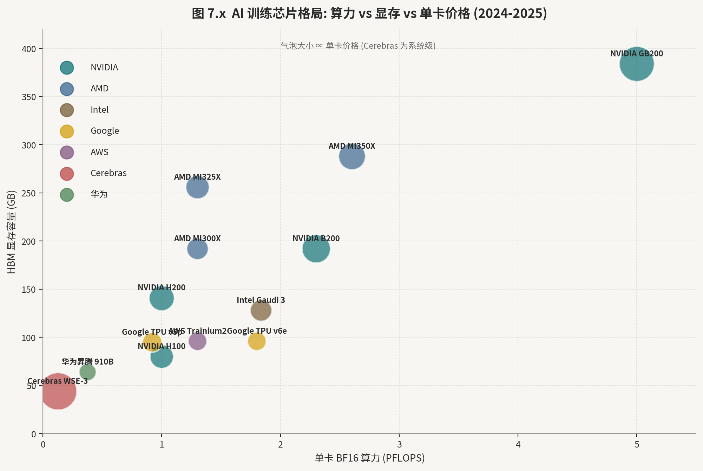

> 图中气泡面积按价格量级进行对数映射。纵轴对 GPU/ASIC 表示 HBM 容量，对 Cerebras WSE-3 表示片上 SRAM 容量；WSE-3 为系统级产品，不应与单卡价格直接比较。具体规格和价格会随配置、采购规模与发布时间变化。

#### 22.1　英伟达（NVIDIA）Blackwell 与 Rubin 架构

Blackwell 架构（B100/B200/GB200）是英伟达在 Hopper 之后的旗舰产品代际，于 2024 年下半年进入量产交付。B200 GPU 采用台积电 NP4（4nm 级）工艺制造，以 reticle-limit 双芯键合（two-die connected via NV-HBI）方式实现 2080 亿晶体管，提供 20 PetaFLOPS（FP4 精度）峰值算力，搭载 192GB HBM3e（8 叠），内存带宽 8 TB/s[22-1]。相较 H100 的 3.35 PetaFLOPS（FP8），B200 FP4 算力约提升 6 倍，但 FP16/BF16 算力（1.8 PFLOPS vs 1.0 PFLOPS）提升约 80%，更接近工程实际。

GB200 NVL72 整机柜将 36 个 Grace CPU 与 72 个 B200 GPU 通过 NVLink 5 互连为单一统一内存空间，总计 13.5 TB 显存，NVLink 总带宽 1.8 TB/s[22-3]，为万亿参数级 LLM 的训练与推理提供了前所未有的内存容量。NVL72 的系统级功耗约 120kW，对数据中心液冷基础设施形成严苛要求，推动直接液冷（DLC）从可选项变为必选项。NVL72 的推理场景中，单机柜可承载 Llama 3 405B 全精度模型并实现约 1500 token/s 的生成吞吐，经济性较 H100 集群有显著优势。

Vera Rubin 已从路线图进入公司自报量产阶段。英伟达在 2026 年 1 月披露 Rubin GPU 的 50 PFLOPS NVFP4 算力、Vera CPU 的 88 个 Armv9.2 核、单 GPU 3.6TB/s 的 NVLink 6 带宽，以及 NVL72 机架 260TB/s 的总互连带宽 [22-15]；到 8 月 26 日，英伟达称该平台正进入全量生产，云计算公司 CoreWeave、谷歌云（Google Cloud）、微软 Azure、甲骨文云基础设施（Oracle Cloud Infrastructure）与云服务商 Nebius 已有机架运行 [22-16]。这把证据从“发布日期目标”推进到“供应商量产 + 合作伙伴机架”，但仍未单独证明各客户完成验收、可供货规模、良率或 Rubin 分产品收入；这些仍需后续财报与客户侧可用性交叉验证。

#### 22.2　超威半导体（AMD）MI300/MI325/MI350 与 ROCm

超威半导体的 AI 加速器产品线基于 CDNA（Compute DNA）架构，与面向游戏的 RDNA 完全分离。MI300X（2023 年末）是首款采用 3D Chiplet HBM 堆叠的加速器：8 个 GPU Die（CDNA 3，5nm）+ 4 个 IO Die（6nm）键合于同一封装，搭载 192GB HBM3（8 叠），内存带宽 5.3 TB/s，FP16 算力 1.307 PFLOPS[22-4]。MI300X 最大的竞争优势是内存容量——相较 H100 的 80GB HBM2e 提升 2.4 倍——在大参数量模型（如 70B-180B 参数 LLM）推理场景中，可减少模型切片数量，降低 KV Cache 调度压力，延迟性能接近甚至超越 H100。

MI325X（2024 年 Q4）在 MI300X 基础上升级至 HBM3e，内存带宽提升至 6.0 TB/s，目标取代 MI300X 成为主力推理卡。MI350 系列（2025 年）将采用台积电 N3，CDNA 4 架构，FP8 算力目标 3+ PFLOPS，与 B200 正面竞争。超威半导体的 Chiplet 封装技术在 MI300X 上已达到业界领先水平：单封装 12 个 Die 的 CoWoS 设计对台积电先进封装提出了极高要求，是其相较竞争对手在封装工程能力上的重要差异化。

ROCm（Radeon Open Compute）软件栈是 AMD 追赶 CUDA 生态的核心战场。ROCm 6.x 已实现对 PyTorch 2.x、JAX、TensorFlow 的原生支持，HIP（Heterogeneous-computing Interface for Portability）允许 CUDA 代码经转换工具（hipify）迁移至 ROCm[22-5]。然而生态成熟度仍落后 CUDA 约 2-3 年：部分算子库（如 FlashAttention 的 ROCm 版本）性能比 cuDNN 低 10%-20%，自定义 kernel 开发者社区规模约为 NVIDIA 的 1/10。Meta、Microsoft 等超大客户已在部分工作负载上规模化部署 MI300X，意义在于验证了 ROCm 的可用性临界点，并通过内部投入反哺 ROCm 生态。

#### 22.3　Intel Gaudi 3 与 oneAPI

Intel Gaudi 3（2024 年）基于台积电 N5 工艺，集成 64 个张量处理器核（TPC）和 8 个矩阵乘法引擎（MME），搭载 128GB HBM2e，内存带宽 3.7TB/s[22-6]。其以太网互连架构是区别于 NVIDIA NVLink 的重要特征，便于与标准网络设备集成；但跨平台的 tokens/dollar 结论对软件版本、集群规模、采购价和模型高度敏感，不应当作固定优势。

oneAPI 是 Intel 基于 SYCL 的统一编程模型，试图覆盖 CPU、GPU 与 FPGA。Gaudi 在企业市场的实际渗透仍需由客户部署和软件兼容性验证。Intel 已决定将 Falcon Shores 仅用作内部测试芯片，不再作为商业产品推向市场，并将资源集中于 Jaguar Shores[22-14]；公司尚未给出足以写入量产路线表的 Jaguar Shores HVM 日期。

#### 22.4　国产 GPGPU 格局

国产 GPGPU 受先进工艺、HBM、封装与软件生态共同约束，不同产品采用的节点、精度和系统配置差异较大。技术评估不应只与 NVIDIA H100 做单点峰值比较，而应同时观察可交付规模、模型适配、集群稳定性、软件成熟度和总拥有成本。

国内 AI 芯片头部厂商思元 590（MLU590）采用台积电 N4 工艺，FP16 算力约 256 TFLOPS（INT8 约 512 TOPS），搭载 64GB LPDDR5，主要用于视频分析、NLP 推理等中等规模任务。思元 690（MLU690）规划向 HBM 和更高算力演进。国内 AI 芯片头部厂商的核心竞争力在于 Cambricon BANG 编程框架（类 CUDA）和与主流 AI 框架的集成，但单卡算力与 H100 差距约 10-15 倍，限制了其在 LLM 训练场景的适用性。国内 AI 芯片头部厂商 2024 年营收约 10 亿元，毛利率约 60%，主要来自政务云、运营商和部分互联网客户，亏损收窄趋势是核心财务观察指标。

华为昇腾 910B（7nm，对标 A100，FP16 320 TFLOPS）和 910C（规格进一步提升，对标 H100）在华为云及部分国内大模型训练场景中已规模化部署，配套 CANN（Compute Architecture for Neural Networks）软件栈。关联代表企业包括中科曙光（服务器整机集成）、拓维信息（昇腾生态软件）等。昇腾产能受国内头部代工厂 7nm 产能及良率制约，2024 年出货量估计约 50-70 万张，相较 NVIDIA 同期在华出货受限后的缺口仍有较大差距。

国内 GPGPU 路线代表基于 AMD CDNA 授权衍生架构，与 ROCm 兼容度较高，在 HPC 和 AI 计算中可复用 AMD 的软件优化成果，是国产 AI 加速器中软件生态最接近国际主流的产品路线。其他国内 GPGPU 初创厂商等未上市初创公司处于产品验证和规模化交付的不同阶段，整体来看国内非 NVIDIA 的 AI 算力市场呈现明显的分散竞争格局，2025-2026 年将是行业集中度提升的关键时间窗口。

#### 第 22 章参考文献

[22-1] NVIDIA Corporation. NVIDIA Blackwell Architecture Technical Overview. NVIDIA Technical Blog. 2024. https://developer.nvidia.com/blog/nvidia-blackwell-platform-arrives-to-power-a-new-era-of-computing/

[22-2] NVIDIA Corporation. NVIDIA H100 Tensor Core GPU Architecture White Paper. NVIDIA. 2022. https://resources.nvidia.com/en-us-tensor-core/gtc22-whitepaper-hopper

[22-3] NVIDIA Corporation. NVIDIA GB200 NVL72 Product Brief. NVIDIA Newsroom. 2024. https://www.nvidia.com/en-us/data-center/gb200-nvl72/

[22-4] AMD. AMD Instinct MI300X Accelerator Product Brief. AMD. 2023. https://www.amd.com/en/products/accelerators/instinct/mi300/mi300x.html

[22-5] AMD. AMD ROCm 6.0 Software Stack Release Notes. AMD ROCm Documentation. 2024. https://rocm.docs.amd.com/en/latest/release/release-notes.html

[22-6] Intel Corporation. Intel Gaudi 3 AI Accelerator Architecture White Paper. Intel. 2024. https://habana.ai/products/gaudi3/

[22-7] Tom's Hardware. NVIDIA Blackwell B200 GPU Review: Architecture Analysis. Tom's Hardware. 2024. https://www.tomshardware.com/reviews/gpu-hierarchy,4388.html

[22-8] Semianalysis. The AI Chip Market Share and Competitive Landscape 2024. SemiAnalysis. 2024. https://www.semianalysis.com/p/ai-chip-market-share

[22-9] 国内 AI 芯片头部厂商科技. 国内 AI 芯片头部厂商思元 590 技术白皮书. 国内 AI 芯片头部厂商官网. 2024. https://www.cambricon.com/index.php?m=content&c=index&a=lists&catid=71

[22-10] TSMC. TSMC CoWoS Advanced Packaging Technology Briefing. TSMC Technology Symposium. 2024. https://www.tsmc.com/english/dedicatedFoundry/technology/logic/l_CoWoS

[22-11] Dylan Patel, Afzal Ahmad. NVIDIA's Moat: Why CUDA Is Impossible to Replicate. SemiAnalysis. 2023. https://www.semianalysis.com/p/nvidiasmoat-software-is-eating-the

[22-12] MLCommons. MLPerf Training v3.1 Results. MLCommons Benchmarks. 2024. https://mlcommons.org/benchmarks/training/

[22-13] Anandtech. AMD CDNA3 Architecture Deep Dive: MI300X. AnandTech. 2024. https://www.anandtech.com/show/21425/amd-instinct-mi300x-cdna-3-architecture-deep-dive

[22-14] Intel Corporation. *2024 Annual Report on Form 10-K: Falcon Shores and Jaguar Shores Update*. Intel Investor Relations. 2025. <https://www.intc.com/filings-reports/all-sec-filings/content/0000050863-25-000052/a2024arsform10-k.pdf>

[22-15] NVIDIA. *NVIDIA Kicks Off the Next Generation of AI With Rubin—Six New Chips, One Incredible AI Supercomputer*. NVIDIA Newsroom. 2026-01-05. <https://nvidianews.nvidia.com/news/rubin-platform-ai-supercomputer>

[22-16] NVIDIA. *NVIDIA Announces Financial Results for Second Quarter Fiscal 2027*. NVIDIA Newsroom. 2026-08-26. <https://nvidianews.nvidia.com/news/nvidia-announces-financial-results-for-second-quarter-fiscal-2027>

---

---

### 第 23 章　ASIC 与 TPU：超大客户的"专属硅"

定制 ASIC 与超大客户自研芯片（CSP Silicon）是 AI 芯片格局中增长最快的细分方向之一。其核心逻辑是：当工作负载足够单一、规模足够大时，ASIC 在能效（PPA）上可比通用 GPU 高出 2-5 倍，数十亿美元的研发投入对谷歌、亚马逊、Meta 等超大规模客户具有正 ROI。Alphabet（谷歌母公司）、亚马逊（Amazon）、Meta（脸书母公司）、微软（Microsoft）合计 2024 年资本开支超过 2200 亿美元，其中 AI 基础设施占比超 50%，ASIC 研发成本已成为这些公司云计算成本结构的重要变量。

ASIC 研发的经济学是理解这一方向的核心：一颗旗舰 ASIC 的研发成本（含 EDA、IP 授权、掩模版制造、测试工程）在台积电 N5 节点约 3-5 亿美元，量产 10 万颗以上时单颗成本可降至 1000-3000 美元，相较同等 GPU 性能的 H100（约 30,000 美元/卡）有数量级的成本优势。因此，ASIC 自研的 ROI 临界点取决于规模：对于每年运行数千亿次推理请求的谷歌和 Meta 而言，这一门槛轻松跨越；对于中小规模 AI 应用而言，则不具备经济可行性。

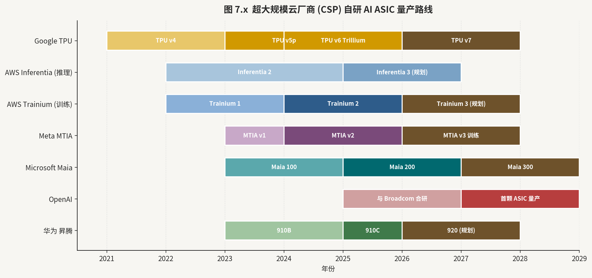

#### 23.1　谷歌（Google）TPU v5p/v6/Trillium/Ironwood

谷歌 TPU（Tensor Processing Unit）是最具代表性的 AI ASIC，发展至今已历经八代迭代。TPU v5p（2023 年末）是谷歌迄今规模最大的训练加速器：单芯片 1.8 PetaFLOPS（BF16），搭载 96GB HBM2e，通过 Optical Circuit Switch（OCS）互连，8960 块 TPU 可组成一个 Pod，总算力约 16 ExaFLOPS（BF16）[23-3]，专为 1 万亿参数以上模型训练设计。

TPU v6（代号 Trillium）在 2024 年公开，面向训练与推理工作负载[23-1]。谷歌云（Google Cloud）于 2026 年 3 月 31 日宣布 TPU7x（Ironwood，第七代 TPU）全面可用（GA），可用于大规模训练与推理[23-13]。GA 是云服务正式可用状态，但不等于所有地区都有无限产能；性能与成本比较仍需统一模型、精度、编译器、集群规模和利用率。

Axion CPU 是谷歌基于 Arm Neoverse V2 的自研服务器 CPU，用于 GKE（Google Kubernetes Engine）及 BigQuery 等通用计算，与 TPU 协同构成谷歌云的全栈自研计算基础设施，减少对英特尔（Intel）和超威半导体（AMD）的依赖并压缩芯片采购成本。

#### 23.2　AWS Trainium 2/3 与 Inferentia 3

亚马逊（Amazon）的 AI 自研芯片分为训练（Trainium）和推理（Inferentia）两条产品线，均由 Annapurna Labs 团队主导开发。Trainium 2（2024 年）性能较第一代提升约 4 倍（FP8 约 780 TFLOPS/芯片），每芯片配备 96GB HBM[23-4]，并支持通过 NeuronLink 实现 16 芯片的高速集群（EC2 Trn2 实例），集群内互连带宽达 5.12 Tbps。与 H100 相比，Trainium 2 在相同训练任务（如 LLaMA 2 70B）上的 tokens/dollar 成本约低 30%-50%，这一经济性优势驱动亚马逊自用及对外销售。Trainium 3 已进入研发阶段，目标算力翻倍，并引入更高带宽的片间互连，2026 年投入使用。

Inferentia 3 针对大规模 LLM 推理优化，支持低精度（INT8/FP8）快速推理，每芯片推理延迟约 1ms 级，搭配 AWS 自研 Neuron SDK（基于 LLVM 和 XLA 编译链），已支持 Hugging Face Transformers、PyTorch、JAX 的主流模型。Amazon 的战略意图是将 Trainium/Inferentia 打造为 AWS 内部的 CUDA 替代，通过大规模自用降低对 NVIDIA GPU 的依赖，并将成本节省传导为云服务价格优势。AWS 在 2023-2024 年已将相当比例的 Bedrock 推理工作负载从 GPU 迁移至 Inferentia 2/3，TCO 降低约 40%-60%。

#### 23.3　Meta MTIA v1/v2/v3

Meta（脸书母公司）的 Training and Inference Accelerator（MTIA）是其针对推荐系统（Recsys）和 LLM 推理设计的专用 ASIC。MTIA v1（2023 年）采用台积电 N7 工艺，峰值 INT8 算力约 102.4 TOPS[23-5]，面向排序和推荐模型的稀疏计算优化，已在 Meta 数据中心大规模替换早期推理 GPU，实现显著的 TCO 降低。MTIA v2（2024 年末）迁移至 N5 工艺，算力约提升 3 倍（约 300 TOPS），内存带宽扩大，并新增对 LLM 推理（如 Llama 3 系列）的硬件加速支持。MTIA v3 处于研发阶段，目标覆盖 Llama 4 级别的超大模型高效推理。

Meta 的 ASIC 战略具有高度封闭性：MTIA 主要用于内部自用，不对外销售，核心价值体现在每日数百亿次的推荐和广告推理请求中。Meta 2024 年资本开支约 370-400 亿美元，其中相当比例流向 AI 基础设施，ASIC 自研是降低对 NVIDIA 依赖、锁定长期成本优势的战略支撑。Meta 同时保持对 NVIDIA GPU 的大规模采购（2024 年采购超 35 万张 H100），用于 Llama 系列大模型训练，ASIC 与 GPU 的工作负载分工以推理/训练为界。

#### 23.4　Microsoft Maia 100/200 与 Cobalt

微软（Microsoft）Maia 100（2023 年发布，2024 年规模化）是 Azure 的自研 AI 训练加速器，由微软联合美满电子（Marvell）进行封装和互连设计，基于台积电 N5 工艺[23-6]，主要用于 Azure OpenAI Service 的 GPT-4/GPT-4o 推理工作负载。Maia 200 处于研发阶段，目标算力和内存规格大幅提升，对标 B200。Cobalt 100 是微软的 Arm 服务器 CPU（基于 Neoverse N2，128 核），主要用于 Azure 通用计算虚拟机，是微软降低英特尔（Intel）和超威半导体（AMD）采购依赖的战略动作。Maia + Cobalt 的双轨战略使微软在硬件层面形成从 CPU 到 AI 加速器的全自研覆盖路径，预计 2026-2027 年对 Azure GPU 采购结构产生可见影响。从量化角度理解，Azure 每年在英伟达（NVIDIA）GPU 上的资本开支约 200-300 亿美元，若 Maia 自研路线成熟并替代 30% 工作负载，每年节约成本约 60-90 亿美元，对微软整体利润率的正面影响显著。

#### 23.5　Apple ANE 与 Tesla Dojo

苹果（Apple）的 Neural Engine（ANE）作为 A/M 系列 SoC 的固定功能单元，配合 Core ML 形成端到端优化路径。具体 TOPS、功耗和多芯粒扩展不能跨产品简单相加；截至 2026 年 8 月，公开的 2025 Mac Studio 产品是 M4 Max 与 M3 Ultra，而非“M4 Ultra”[21-5]。

特斯拉（Tesla）Dojo 是其专为自动驾驶训练设计的超级计算机，核心 D1 芯片基于台积电 N7 工艺，单 Die 约 362 TFLOPS（BF16）[23-7]，50 个 D1 Die 组成 Training Tile（约 9 PFLOPS），6 块 Training Tile 构成 Cabinet（约 54 PFLOPS），354 个 Cabinet 构成 ExaPOD（目标 1 ExaFLOPS）。D1 的互连亮点是 Die-to-Die 接口带宽高达 900 Gbps，接近 on-die SRAM 带宽，使 ExaPOD 内部的分布式训练通信效率极高。特斯拉 2024 年在 Dojo 投资上放缓，转而增加英伟达 GPU 采购，反映出自研超算与商用 GPU 在 ROI 上的权衡博弈。

#### 23.6　ASIC 设计服务商

定制 ASIC 最容易被写成一串“设计赢单”，但真正需要回答的是：有多少已经进入当期收入，收入来自加速器、网络还是软件，又有多少仍停在合同、产能准备或客户选择阶段。博通（Broadcom）FY2026 Q3 总收入 295.91 亿美元，其中半导体解决方案收入 208.39 亿美元、基础设施软件收入 87.52 亿美元；公司另披露 AI 半导体收入 167 亿美元，同比增长 221%、环比增长 54%，并预计 Q4 达 217 亿美元 [23-14]。这项公司定义指标同时涵盖定制 AI 加速器和网络产品，不能与半导体解决方案分部再次相加，也不能据此拆出单一客户或单一芯片的收入。

美满电子（Marvell）FY2027 Q2 总收入 27.393 亿美元，其中数据中心终端市场收入 21.715 亿美元，占比 79%，同比增长 46%；单季 GAAP 毛利率为 53.1%，经营现金流为 6.055 亿美元 [23-15]。它的“数据中心”口径同时包括 AI 系统、以太网交换、服务器、存储和数据中心互连，并非纯 AI 收入；光互连初创公司 Celestial AI 与 PCIe/CXL 交换芯片公司 XConn 已从收购完成日起并表，四名客户又占期末应收账款总额的 72%，所以增长质量还要结合并购范围、回款和客户集中度判断。

美满电子与谷歌（Google）的公开协议把潜在采购和股权激励绑定：部分认股权证可随 2033 财年前的定制产品采购按每 5 亿美元收入一档归属 [23-16]。这提供了商业关系和计价机制的监管证据，却不是谷歌已承诺采购全部档位，也不是美满电子已确认相应收入。订单不是收入，归属条件也不是客户验收。

#### 第 23 章参考文献

[23-1] Google Cloud. Google Trillium (TPU v6) Announcement. Google Cloud Blog. 2024. https://cloud.google.com/blog/products/compute/trillium-the-sixth-generation-of-google-tpus

[23-2] Google DeepMind. Ironwood TPU: Google's Most Powerful AI Chip. Google Blog. 2025. https://blog.google/technology/google-deepmind/google-ironwood-tpu/

[23-3] Norman P. Jouppi et al. In-Datacenter Performance Analysis of a Tensor Processing Unit. Proceedings of ISCA 2017. 2017. https://arxiv.org/abs/1704.04760

[23-4] AWS. Announcing Amazon EC2 Trn2 Instances with AWS Trainium2. AWS News Blog. 2024. https://aws.amazon.com/blogs/aws/amazon-ec2-trn2-instances-with-aws-trainium2/

[23-5] Meta AI. MTIA: Meta's Next Generation AI Inference Accelerator. Meta Engineering Blog. 2024. https://engineering.fb.com/2024/05/01/ai-research/mtia-next-generation-ai-inference-accelerator/

[23-6] Microsoft Azure. Microsoft Maia 100 AI Accelerator and Cobalt 100 CPU. Microsoft Azure Blog. 2023. https://azure.microsoft.com/en-us/blog/microsoft-unveils-azure-maia-and-cobalt-new-ai-and-cloud-chips/

[23-7] Tesla. Tesla Dojo Technology Whitepaper. Tesla AI. 2021. https://cdn.motor1.com/pdf-files/535242876-tesla-dojo-technology.pdf

[23-8] Apple Inc. A18 Pro Neural Engine Specifications. Apple Developer. 2024. https://developer.apple.com/news/releases/

[23-9] Broadcom Inc. Broadcom XPU ASIC Design Services. Broadcom Investor Presentation. 2024. https://investors.broadcom.com/

[23-10] Marvell Technology. Marvell Custom ASIC and Accelerator Solutions. Marvell Technology. 2024. https://www.marvell.com/solutions/artificial-intelligence.html

[23-11] Semianalysis. The Custom Silicon Race: Google, Amazon, Meta, Microsoft. SemiAnalysis. 2024. https://www.semianalysis.com/p/custom-silicon-hyperscaler-race

[23-12] Dylan Patel. Trainium2 Deep Dive: AWS vs NVIDIA. SemiAnalysis. 2024. https://www.semianalysis.com/p/aws-trainium-2-deep-dive

[23-13] Google Cloud. *Cloud TPU Release Notes: TPU7x (Ironwood) General Availability*. Google Cloud Documentation. 2026-03-31. <https://docs.cloud.google.com/tpu/docs/release-notes>

[23-14] Broadcom. *Third Quarter Fiscal Year 2026 Financial Results*. U.S. Securities and Exchange Commission, Exhibit 99.1. 2026-09-02. <https://www.sec.gov/Archives/edgar/data/1730168/000173016826000076/avgo-08022026x8kxex99.htm>

[23-15] Marvell Technology. *Quarterly Report on Form 10-Q for the Quarter Ended August 1, 2026*. U.S. Securities and Exchange Commission. 2026-08-28. <https://www.sec.gov/Archives/edgar/data/1835632/000183563226000025/mrvl-20260801.htm>

[23-16] Marvell Technology. *Current Report on Form 8-K: Commercial Agreement with Google*. U.S. Securities and Exchange Commission. 2026-08-19. <https://www.sec.gov/Archives/edgar/data/1835632/000119312526356217/d412696d8k.htm>

---

---

### 第 24 章　边缘 NPU 与端侧 AI

端侧 AI 推理的需求由多重驱动力共同催生：隐私保护（数据不离设备）、低延迟（毫秒级响应）、离线可用性（无网络依赖）和成本降低（减少云端调用）。NPU（Neural Processing Unit）作为专门执行神经网络矩阵运算的固定功能加速模块，已成为智能手机、AI PC、自动驾驶域控制器和工业 IoT 设备中 SoC 的标配单元。2024 年全球端侧 NPU 芯片出货量估计超过 30 亿颗（含手机、PC、汽车、IoT 合计）。

端侧 AI 的技术演进核心矛盾是模型复杂度的上升与硬件算力和内存容量之间的矛盾：GPT-4o 级别的多模态模型约 200B 参数，端侧可运行的量化模型上限约在 7B-13B 参数（INT4/INT8 压缩后约 4-8GB 内存），二者之间的鸿沟推动了边缘 AI 的两个技术方向：一是投机解码（Speculative Decoding）和混合专家（MoE）等算法级压缩技术，二是 NPU 硬件算力和内存带宽的持续提升。AI PC 和高端智能手机是这一矛盾最激烈的竞争场域。

#### 24.1　手机 NPU：苹果、高通、联发科、华为

苹果 Neural Engine 随 A 系列芯片（iPhone SoC）持续演进，A18 Pro 的 ANE 达到 35 TOPS，相较 A12 Bionic（首代 ANE，8 TOPS）提升超 4 倍。ANE 采用固定数据流架构，对 Core ML 量化模型（INT8/INT4）执行效率极高，是 iOS 系统视觉、语音、自然语言处理功能的算力基础。苹果 Apple Intelligence（2024 年推出的端侧 AI 系统）通过 Private Cloud Compute 将端侧 NPU 与隐私保护服务端推理结合[24-1]，代表了端云协同 AI 的新架构范式。在 Apple Intelligence 的技术架构中，端侧 ANE 优先运行最常见的小型请求（约 80% 场景），仅在算力不足时通过隐私安全通道路由至 Apple 的 PCC 服务器，兼顾延迟与隐私。

高通骁龙 8 Elite（SM8750，台积电 N3E）集成第四代 Hexagon NPU，峰值算力 45 TOPS[24-2]，支持 INT8/INT4/FP16 多精度混合推理，搭配 Qualcomm AI Engine Direct SDK 和 AI Hub 云端模型优化服务。高通的 NPU 策略是通用可编程而非固定加速：Hexagon 结合 HVX（向量扩展）、HMX（矩阵扩展）可灵活运行不同神经网络拓扑，适应快速迭代的模型变化。高通 AI Hub 平台已预优化超过 75 种模型（包括 Llama 3.2 3B、Stable Diffusion 1.5 等），使普通开发者无需深度 NPU 编程即可获得接近最优的端侧推理性能。

联发科天玑 9400（MT6991，台积电 N3E）搭载第八代 APU，峰值算力 50 TOPS[24-3]，并首次引入独立 AI 处理器（Imagiq 1100 NPU），在端侧支持完整的 13B 参数大语言模型本地推理（INT4 量化）。华为达芬奇架构（用于 Kirin 9000S/9010）针对矩阵乘累加深度优化，支持 FP16/INT8，是麒麟系列旗舰 SoC 的 AI 核心，也是昇腾 AI 加速器的基础架构原型。

#### 24.2　PC NPU：AI PC 的算力标准化

AI PC 的核心标准由 Intel、AMD、高通共同竞争定义，微软 Copilot+ PC 要求设备内置 NPU 算力不低于 40 TOPS[24-12]。Intel Lunar Lake（Core Ultra 200V）的 NPU 4（Xe2 架构）提供 48 TOPS，是目前市售 AI PC 中 NPU 算力最高的产品之一[24-4]，配合 CPU 16 TOPS 和 GPU 67 TOPS，整机 AI 算力约 120 TOPS。AMD Ryzen AI 300 系列（Strix Point，台积电 N4P）集成 XDNA 2 NPU，峰值 50 TOPS，搭配 CPU 和 GPU 算力整机超 100 TOPS，是 AMD 首款达到 Copilot+ 标准的移动处理器。

高通 Snapdragon X Elite（X1E-80-100）Hexagon NPU 提供 45 TOPS，是 2024 年 Windows on Arm 阵营的旗舰方案，在 Copilot+ 功能覆盖和模型兼容性上较 x86 竞品更早成熟。AI PC 的软件生态仍是核心制约：Windows AI Studio、DirectML 和 ONNX Runtime 提供了多 NPU 统一推理框架，但上层应用深度适配（如本地 LLM 助手、实时翻译、AI 图像编辑）的体验分化明显，未来 2-3 年将是决定 AI PC 换机周期的关键变量。AI PC 市场规模预计 2024 年约 4000 万台（渗透率约 20%），2027 年将超过 2 亿台，成为 PC 市场的主流形态。

#### 24.3　汽车域控 NPU：智能驾驶算力竞赛

NVIDIA Orin（2022 年量产）提供 254 TOPS（INT8），Thor（2025 年量产）算力飞升至 2000 TOPS（含 CPU+GPU+DLA 整合），采用台积电 N4 工艺[24-5]，搭载 12 个 Arm Cortex-A78AE CPU 核和 GPU 簇，Thor 将同时支持自动驾驶 AI 推理和座舱信息娱乐的融合域控，成为 L3/L4 自动驾驶平台的基础设施选择。NVIDIA Orin 已进入比亚迪、理想、蔚来、小鹏等主流车企量产车型，2024 年汽车业务营收约 40 亿美元，是 NVIDIA 的第三大营收支柱。

国内智驾 SoC 头部厂商 J5（征程 5）基于国内智驾 SoC 头部厂商自研伯努利 3.0 架构，采用三星 8nm 工艺，提供 128 TOPS 算力[24-6]，BEV（Bird's Eye View）感知算法效率极高，已量产搭载于理想、长安、奇瑞等车型。J6 系列（2025 年量产）算力提升至 560 TOPS，支持 4D 雷达与摄像头融合感知，目标 L3 级自动驾驶。国内智驾 SoC 头部厂商于 2024 年 10 月赴港上市，是国内智驾 ASIC 领域最重要的上市平台，其与大众、博世的战略合作覆盖欧洲车型，是国际化的重要背书。

国内智驾 SoC 厂商 A1000（华山二号）采用台积电 N16 工艺，提供 58 TOPS 算力，定位 L2+/L3 泊车与城市领航 NOA（Navigate on Autopilot）场景。国内智驾 SoC 厂商亦已在港股上市，但亏损较大，商业化进展是核心观察指标。国内 AI 芯片头部厂商行歌（MLU370）面向车载推理，华为 MDC（Mobile Data Center）610/810 系列基于昇腾 910，算力 160-400 TOPS，已进入 BAIC、奇瑞等车企量产供应链。

#### 24.4　IoT/MCU+NPU 集成方案

IoT 端侧 AI 的功耗约束极为严苛，典型场景要求 NPU 在 1-10mW 功耗内实现关键词检测、姿态识别、异常检测等任务。国内蓝牙 SoC 头部厂商的旗舰系列已集成低功耗 NPU，大规模应用于 TWS 耳机的语音降噪（ANC）和在机唤醒（On-Device ASR）场景，出货量超 3 亿颗。国内 Wi-Fi SoC 头部厂商的 ESP32-S3 在 Xtensa LX7 基础上提供向量扩展，可运行 TinyML 推理，主要用于人脸识别门禁和语音控制家电。国内边缘 SoC 头部厂商的 RK3588 集成 6 TOPS NPU，已广泛用于 AIoT 网关、工业视觉检测仪和会议摄像头等边缘推理场景[24-9]。RK3588 凭借 29.99 美元的 OEM 板卡定价（如 Orange Pi 5），成为开发者最常用的边缘 AI 开发平台之一，形成了与 NVIDIA Jetson Orin 的差异化竞争。

MCU+NPU 集成是另一个重要趋势：STMicroelectronics STM32N6 搭载 600 TOPS 神经处理单元（NPU），支持在低至 5V/100mW 功耗下运行中等规模的神经网络，面向工业预测性维护、医疗监测仪器。Nordic Semiconductor nRF54H 系列在低功耗 BLE SoC 中集成机器学习加速器，目标 IoT 传感器边缘推理。这一趋势推动了国内蓝牙/Wi-Fi SoC 厂商在低功耗 AI 能力上的军备竞赛。

#### 第 24 章参考文献

[24-1] Apple Inc. Apple Intelligence: On-Device AI with Private Cloud Compute. Apple Machine Learning Research. 2024. https://machinelearning.apple.com/research/apple-intelligence

[24-2] Qualcomm Technologies. Snapdragon 8 Elite Mobile Platform Technical Brief. Qualcomm. 2024. https://www.qualcomm.com/products/mobile/snapdragon/smartphones/snapdragon-8-series-mobile-platforms/snapdragon-8-elite-mobile-platform

[24-3] MediaTek. Dimensity 9400 AI Architecture Overview. MediaTek Newsroom. 2024. https://corp.mediatek.com/news-events/press-releases/mediatek-dimensity-9400

[24-4] Intel Corporation. Intel Core Ultra 200V (Lunar Lake) AI Performance Analysis. Intel Newsroom. 2024. https://www.intel.com/content/www/us/en/products/docs/processors/core/core-ultra-200v-brief.html

[24-5] NVIDIA. NVIDIA DRIVE Thor Autonomous Vehicle Platform. NVIDIA Automotive. 2024. https://www.nvidia.com/en-us/self-driving-cars/drive-thor/

[24-6] 国内智驾 SoC 头部厂商. 智驾 SoC 技术白皮书. 厂商官网. 2023. https://horizon.auto/product

[24-7] 国内智驾 SoC 厂商. 华山 A1000 Pro 智能驾驶芯片产品简介. 国内智驾 SoC 厂商官网. 2023. https://www.bsemi.com.cn/

[24-8] Arm. Arm Cortex-A78AE ASIL-B Automotive Processor. Arm Developer. 2023. https://developer.arm.com/Processors/Cortex-A78AE

[24-9] 国内边缘 SoC 头部厂商. RK3588 SoC 产品规格说明书. 厂商官网. 2022. https://www.rock-chips.com/a/en/products/RK35_Series/2022/0926/1660.html

[24-10] 国内蓝牙 SoC 头部厂商. BES2700 系列低功耗 AI SoC 规格. 国内蓝牙 SoC 头部厂商官网. 2023. https://www.bestechnic.com/

[24-11] IDC. AI PC Market Forecast 2024-2028. IDC Research. 2024.

[24-12] Microsoft. Windows 11 Specifications: Minimum System Requirements for Copilot+ PCs. Microsoft. 持续更新. https://www.microsoft.com/en-us/windows/windows-11-specifications

---

---

### 第 25 章　晶圆级与数据流引擎

晶圆级计算与数据流架构代表了 AI 加速器设计哲学中最激进的探索方向：它们的核心判断是，GPU 的通用性带来了严重的计算效率浪费，通过将存储与计算深度融合、消除片外内存带宽瓶颈，可在特定工作负载上实现数量级的能效提升。这一方向虽然距离主流商业化仍有距离，但其技术路线对理解后 GPU 时代算力架构的演进具有重要的前瞻价值。

从计算机体系结构的角度理解这些新型架构的共同出发点：现代 GPU 中约 80%-90% 的能耗来自数据搬移（从 HBM 到片上缓存，从缓存到寄存器），真正用于浮点运算的能耗仅占约 10%-20%。这一根本性矛盾在 Transformer 注意力机制的 KV Cache 场景下尤为突出。晶圆级和数据流引擎的设计哲学均指向同一个目标：最大化计算与存储的空间局部性，减少数据在芯片内外的往返距离。

#### 25.1　Cerebras WSE-3：整片晶圆作为单一计算芯片

Cerebras Wafer-Scale Engine 3（WSE-3，2024 年）将整片 300mm 晶圆（台积电 N5 工艺）制造为单一芯片，面积约 46,225 mm²（对比 H100 的 814 mm²，约 57 倍），集成 4 万亿晶体管、90 万个 AI 优化核（稀疏运算核 + 稠密运算核）、44GB 片上 SRAM（on-die SRAM，带宽约 21 PB/s）[25-1]。WSE-3 彻底消除了片外 HBM 带宽瓶颈——其 44GB SRAM 完全在晶圆内部，访问延迟约 30ns（对比 HBM3 的约 120ns），是目前世界上内存带宽密度最高的计算芯片。


WSE-3 的关键挑战在于良率管理：整片晶圆存在不可避免的缺陷核（Defect Core），Cerebras 通过在布局中内置冗余核（约 2% 的核保留为备用）来容忍缺陷，总良率管理技术是其核心知识产权。在实际推理测试中，Llama 3.1 405B 参数模型在单个 CS-3 系统（含 WSE-3 + 外部 MemoryX 存储扩展盒）上实现约 969 tokens/s 的生成速度[25-2]，约为 H100 集群同等规模的 2-3 倍。Cerebras 于 2024 年提交 IPO 申请，商业化进展是重要观察节点。

WSE-3 的商业化路径面临一个根本性约束：44GB 片上 SRAM 对于 Llama 3.1 405B 这样的大模型仍不够（405B 参数 FP16 需要约 810GB），需要配合外部 MemoryX 扩展盒（可提供 1.5TB 至 120TB 的外部内存），通过 on-wafer I/O 与 MemoryX 连接，带宽约 1.2 TB/s。即便如此，CS-3+MemoryX 系统在 MFU 效率上（约 50%-60%）已接近甚至超过同等规模 H100 集群（约 40%-55% MFU），说明 WSE-3 的带宽架构在实际工程中具备真实竞争力。

#### 25.2　Tesla Dojo：D1 芯片与 ExaPOD 架构

Tesla Dojo 的 D1 芯片（台积电 N7）设计的最大亮点是其互连架构：每个 D1 Die 通过背面（backside）金属层引出总计 576 个 Die-to-Die I/O，互连带宽高达 900 Gbps，使得 50 个 D1 Die 组成的 Training Tile 内部通信延迟极低[25-3]，实质上等效为一个超大型单芯片。25 个 Training Tile 组成的 Cabinet 通过 Dojo 定制 NIC 互连，354 个 Cabinet 组成 ExaPOD，总算力目标约 1 ExaFLOPS（FP16）。

Dojo 设计的核心价值场景是特斯拉的视频标注和自动驾驶模型训练（FSD，Full Self-Driving），这需要处理海量的车载摄像头视频帧（每天约 50 亿帧）。特斯拉 2024 年转向采购 NVIDIA H100/H200 集群并降低 Dojo 扩张速度，表明在通用大模型训练场景下，Dojo 的定制优势未能充分抵消 NVIDIA 生态成熟度的劣势。特斯拉未来或将 Dojo 定位为视频理解和 FSD 数据管道的专用加速器，而 NVIDIA GPU 承担通用 LLM 基座训练。

#### 25.3　Tenstorrent：RISC-V + AI 加速一体化设计

Tenstorrent 由前 AMD Zen 架构核心设计师 Jim Keller 主导，设计哲学是将 RISC-V 软核与矩阵乘累加加速器深度集成，提供一种从底层指令集到上层 AI 算子均可定制的开放架构。Wormhole（2023 年）采用台积电 N12，每 Die 集成 80 个 Tensix 核（RISC-V + 矩阵引擎 + NoC 路由器），64 个 Die 通过 2.5D Chip-to-Chip（C2C）互连组成服务器级模块，INT8 算力约 1 PFLOPS[25-4]。Blackhole（2024 年末）迁移至台积电 N6，Tensix 核升级，计划通过 PCIe 5.0 和以太网接口扩展集群。

Tenstorrent 的差异化在于开源软件栈（TT-Metalium，底层 kernel 开发框架）和 RISC-V 的指令集透明性，吸引了注重软件可控性的研究机构和主权算力需求客户（如韩国 KT、日本 SoftBank 旗下子公司）。商业规模化仍是其核心挑战，预计 2026 年 Blackhole 量产后数据点将更充分。Tenstorrent 的 Tensix NoC（Network-on-Chip）架构允许任意两个核之间以 packet-based 方式直接通信（非总线广播），这在 Transformer 注意力头并行和稀疏 MoE 路由计算场景中具有独特的效率优势。

#### 25.4　Groq LPU：确定性数据流与超高 token 吞吐

Groq Language Processing Unit（LPU）的架构哲学是确定性（Determinism）：消除硬件层面的乱序执行、动态调度和缓存，所有操作按编译器静态规划的时序确定执行，从而实现极低且可预测的推理延迟。Groq 芯片的 SRAM 容量约 230MB（per chip），多芯片通过芯片间互连线性扩展，无需 HBM（因此无 HBM 带宽瓶颈和 HBM 成本）。

在实测基准中，Groq 的 Llama 3 8B 推理速度约 800 tokens/s（对比 H100 的约 350 tokens/s），延迟约 10ms TTFT[25-11]（Time To First Token）。但 Groq 的 SRAM 总量有限（单张 GroqCard 约 230MB SRAM），Llama 3 70B 模型参数约 140GB（FP16），需要约 600 张 GroqCard 并联才能装载模型，系统成本极高。Groq 的市场定位是延迟极敏感的 API 推理服务（GroqCloud），而非高吞吐量批处理训练。GroqCloud 提供的 Llama 3 70B 推理定价约 0.59 美元/百万 token（2024 年），相较 OpenAI GPT-4o 的约 5 美元/百万 token 具有显著价格优势，但扩容能力受 GroqCard 产能制约。

2026 年 8 月的产业状态已经变化：NVIDIA 宣布 Groq 3 LPX 进入全量生产，并把它作为 Vera Rubin 平台面向低延迟 token 生成的扩展；Nebius 被列为首个采用方，Groq Cloud 运营方则被列为早期采用者之一 [25-13]。因此，上述 GroqCard、模型装载与 2024 年 API 价格只保留为历史架构/商业基线，不能直接外推到 Groq 3 LPX；“全量生产”和“计划采用”也仍需以云端实际可用性、稳定吞吐与客户付费验证。

#### 25.5　SambaNova、Graphcore 与其他数据流芯片

SambaNova（SN30/SN40L）采用重配置数据流架构（RDA），通过编译器将神经网络计算图直接映射到硬件数据流图，消除了 GPU 的通用调度开销。SN40L 单节点提供约 528 TFLOPS（BF16）和 1.5TB 可寻址内存（片内 HBM + 片外 DDR）[25-7]，适合超大参数量模型的单节点装载。Graphcore 的 IPU（Intelligence Processing Unit）曾是数据流架构的代表作，但受制于商业化困境，2024 年被 SoftBank 收购后战略调整为 AI 专属芯片供应商，产品线重心转向日本市场。Untether AI 的 speedAI 系列采用内存近计算（Compute-Near-Memory）架构，将计算单元直接置于 SRAM bank 旁边，减少数据搬移功耗。

Habana（Intel 子公司，Gaudi 系列前身）的 Goya 推理处理器和 Greco 系列延续了数据流友好的设计，并最终整合进 Intel Gaudi 产品线。这一整合路径说明：即便是大公司收购的数据流架构，在进入主流市场时也倾向于向 GPU 的通用性方向妥协，以降低软件适配门槛。

#### 25.6　设计哲学对比

| 维度 | 通用 GPU（NVIDIA） | 数据流（Groq/SambaNova） | 内存优先（Cerebras WSE） | 编译器优先（Tenstorrent） |
|------|---------------------|--------------------------|--------------------------|---------------------------|
| 内存架构 | HBM（片外高带宽） | 片上 SRAM（确定性访问） | 片上超大 SRAM（44GB+） | 片上 SRAM + 片外 DRAM |
| 延迟特性 | 高吞吐、中延迟 | 极低确定性延迟 | 极高带宽、中延迟 | 可编程延迟 |
| 编程模型 | CUDA（命令式） | 编译器生成数据流图 | 图到数据流映射 | RISC-V + TT-Metalium |
| 适用场景 | 训练+推理全场景 | 高频低延迟推理 | 极大模型单节点训练/推理 | 研究/主权算力 |
| 规模化能力 | 强（NVLink 集群） | 受 SRAM 容量限制 | 需外部存储扩展 | Ethernet/PCIe 扩展 |
| 生态成熟度 | 最高 | 较低 | 较低 | 早期 |

#### 第 25 章参考文献

[25-1] Cerebras Systems. Cerebras Wafer-Scale Engine 3 Technical Specifications. Cerebras Systems. 2024. https://www.cerebras.net/chip/

[25-2] Cerebras Systems. CS-3 System: 900 Tokens per Second on Llama 3.1 405B. Cerebras Blog. 2024. https://www.cerebras.net/blog/cerebras-systems-achieves-900-tokens-per-second-on-llama-3-1-405b/

[25-3] Tesla. Dojo: Tesla's High-Performance Computer for Machine Learning. Tesla AI Day. 2021. https://youtu.be/j0z4FweCy4M

[25-4] Tenstorrent. Tenstorrent Wormhole Architecture Overview. Tenstorrent Documentation. 2023. https://tenstorrent.com/hardware/wormhole

[25-5] Tenstorrent. Tenstorrent Blackhole AI Processor Product Brief. Tenstorrent. 2024. https://tenstorrent.com/hardware/blackhole

[25-6] Groq. Groq LPU Inference Engine Technical Whitepaper. Groq. 2024. https://groq.com/technology/

[25-7] SambaNova Systems. SN40L Reconfigurable Dataflow Architecture. SambaNova Systems. 2023. https://sambanova.ai/technology/sn40l/

[25-8] Graphcore. IPU Technology Overview. Graphcore. 2022. https://www.graphcore.ai/technology

[25-9] Cerebras Systems. S-1 Form: IPO Filing with SEC. SEC EDGAR. 2024. https://www.sec.gov/cgi-bin/browse-edgar?action=getcompany&CIK=cerebras

[25-10] Dylan Patel. Cerebras vs. NVIDIA: Wafer-Scale vs. Package-Scale. SemiAnalysis. 2024. https://www.semianalysis.com/p/cerebras-vs-nvidia-wafer-scale-computing

[25-11] Tom's Hardware. Groq LPU Benchmark: LLM Inference at 800 Tokens/Second. Tom's Hardware. 2024. https://www.tomshardware.com/ai/groq-lpu-llm-inference-benchmarks

[25-12] IEEE Micro. Dataflow Architectures for Deep Learning: A Survey. IEEE Micro. 2023. https://ieeexplore.ieee.org/document/16

[25-13] NVIDIA. *NVIDIA Groq 3 LPX Now in Full Production With World-Class Speed for Agentic AI*. NVIDIA Newsroom. 2026-08-24. <https://nvidianews.nvidia.com/news/nvidia-groq-3-lpx-now-in-full-production-with-world-class-speed-for-agentic-ai>

---

---

### 第 26 章　类脑计算（Neuromorphic）与脉冲神经网络

类脑计算（Neuromorphic Computing）以模拟或数字方式仿真生物神经元和突触的信息处理机制，其理论基础来源于 Carver Mead 在 1990 年代提出的神经形态电子学（Neuromorphic Electronics）。类脑芯片的核心价值主张是：通过稀疏的事件驱动计算（Event-Driven）彻底颠覆冯诺依曼架构的指令周期乘以功耗模式，在传感-响应边缘场景中实现比传统 AI 芯片低 1-3 个数量级的功耗。

冯诺依曼瓶颈（von Neumann Bottleneck）从体系结构角度理解如下：在经典存储-计算分离架构中，处理器与内存之间的数据总线带宽（通常约 50-200 GB/s）相对于处理器的计算能力（现代 GPU 约 3-10 TB/s）低约 1-2 个数量级，大量处理器周期因等待数据而空转，导致能效低下。类脑计算试图通过在神经元层面融合状态（膜电位）与计算（积分发放），从根本上规避这一瓶颈，但其代价是编程复杂度大幅上升，且适用算法范围远窄于传统 DNN。

#### 26.1　Intel Loihi 2 与 Hala Point 研究系统

Intel Loihi 2 是面向神经形态计算的研究芯片，支持可编程神经元模型与事件驱动计算[26-1]。Intel 2024 年公布的 Hala Point 研究系统由 1,152 颗 Loihi 2 组成，规模约 11.5 亿神经元、1,280 亿突触[26-2]。它是用于算法与系统研究的平台，不是量产商用加速器；性能和能效结论必须限定到具体稀疏时序任务、数据集与对照硬件。

Loihi 的核心突破在于支持在线学习（On-Chip Spike-Timing-Dependent Plasticity，STDP），即芯片在运行时能够调整突触权重，无需离线重训练，对动态感知任务（如语音指令变体、图像扰动）具有适应能力，这在传统 DNN 加速器上需要昂贵的在线微调流程。Intel 的 Loihi 战略以研究优先为主，商业化节奏谨慎，当前主要客户是国防、机器人和传感器融合领域的研究机构。

Loihi 2 已在超过 200 个研究小组中部署（通过 Intel Neuromorphic Research Community 计划），应用范围覆盖机器人运动控制、气味分子识别、稀疏雷达点云分类。尤其在稀疏时序数据处理上，Loihi 的 SNN 推理延迟约 2-5μs，功耗约 10-30mW，相较同类 ANN+GPU 方案能效高出约 100-1000 倍，在军事传感器、医疗植入设备等电池受限场景中具有差异化价值。

#### 26.2　IBM NorthPole：片上全矩阵推理，超越冯诺依曼瓶颈

IBM NorthPole（2023 年 Science 杂志发表）是 IBM 迄今最重要的神经形态芯片成果，但其技术路线与 Loihi 不同：NorthPole 不仿真生物神经元，而是将 CNN/DNN 的全部权重存储在 22nm 芯片上的约 192MB SRAM 内（无片外 DRAM），所有计算在片内完成，彻底消除内存总线瓶颈。

在 ResNet-50 推理基准测试中，NorthPole 的能效约为 A100 GPU 的 25 倍、延迟约快 22 倍，这一数据来自 Science 论文的官方基准[26-3]。其原理是：片内存储消除了 80% 以上的内存访问功耗（在传统 DNN 推理中，内存访问功耗约占总功耗 60%-70%）。NorthPole 的局限性同样显著：192MB SRAM 仅能装载约 ResNet-50 级别的模型，无法承载当代大语言模型（Llama 2 7B 约需 14GB），商业化路径更多指向嵌入式视觉、传感器融合和始终在线（Always-On）感知场景。

IBM NorthPole 的架构创新提示了一个重要设计原则：对于参数量固定（不随输入变化）的网络，将权重完全放入片上 SRAM 是最优能效选择，与 Groq LPU 的确定性静态调度思路在本质上相通。区别在于 NorthPole 更像一个嵌入式推理芯片而非通用加速器，IBM 后续商业化方向指向半导体设计服务（将 NorthPole 架构 IP 授权给汽车/工业客户）而非直接销售芯片产品。

#### 26.3　BrainChip Akida、SynSense 与 Innatera

BrainChip Akida（第二代，22nm）是目前商业化程度最高的类脑芯片之一，已进入边缘 AI 市场，支持 SNN 与 ANN（传统深度网络）混合推理。Akida 2.0 集成约 125 万个神经元，INT2/4/8 推理，功耗约 30mW[26-4]，适合摄像头监控中的人脸检测和姿态估计任务，已与 MegaChips、AICAS 等合作伙伴展开批量商用。SynSense（苏黎世联邦理工衍生公司）开发 Xylo 和 DYNAP 系列类脑芯片，主打低功耗传感处理（声音事件检测、雷达信号处理），功耗低至 1mW，主要市场是助听器和工业传感器。Innatera 的 Pulsar 芯片将 SNN 用于微瓦级超低功耗传感预处理（Motion Detection），目标医疗可穿戴设备中以低于 5μW 实现持续运动识别。

#### 26.4　国内类脑计算研究与产业化

清华大学天机芯片（Tianjic，2019 年 Nature 封面）是全球首款融合 SNN 和 ANN 的异构类脑芯片，集成 156 个 FCore（功能核）[26-7]，可在单芯片上同时运行脉冲网络和传统神经网络，已在无人自行车平衡控制上进行演示验证，但距离商业化产品仍有较大距离。灵汐科技（北京，源于清华 Tianjic 团队）和时识科技（上海）是国内主要的类脑初创公司，均处于 A/B 轮融资阶段，部分产品已进入边缘感知预研项目。国内类脑计算的产业化进展相对滞后于 Intel/IBM，原因在于 SNN 训练工具链不成熟（Surrogate Gradient 方法精度仍低于 ANN）以及应用场景定义不清晰。

灵汐 KA200 芯片（基于异构神经网络架构，2023 年流片）集成 256 个类神经元簇，峰值算力约 1.6 TOPS，功耗约 0.5W，已在视频流分析的事件驱动稀疏感知场景中完成初步验证，目标 2025 年量产。国内类脑计算的长期机遇在于：随着边缘 AI 应用向极低功耗方向渗透（如植入式神经接口、环境监测传感器），SNN 的稀疏激活优势将从学术论文转化为真实的工程需求，届时软件生态积累将是核心竞争壁垒。

#### 26.5　脉冲神经网络（SNN）与冯诺依曼瓶颈

脉冲神经网络（SNN，Spiking Neural Network）是类脑计算的核心算法基础。SNN 中神经元仅在膜电位超过阈值时发放脉冲（Spike），绝大多数时刻保持沉默（稀疏激活），这与传统 ANN 每层神经元均在每次前向传播中激活形成根本性差异。稀疏性带来的计算量大幅下降：对于典型的视觉分类任务，SNN 的有效 MAC（乘累加）操作数约为等效 ANN 的 5%-20%，对应能耗可降低约 1-2 个数量级。

然而 SNN 的训练难度显著高于 ANN：Spike 操作不可微（阶跃函数的梯度为 0 或无穷），需借助代理梯度（Surrogate Gradient，如 sigmoid/arctan 近似）进行反向传播，导致收敛不稳定且精度损失约 2%-5%（相较同等规模 ANN）[26-10]。当前 SNN 的精度-效率边界仍低于 Transformer-based ANN，阻碍了其在主流 NLP 任务上的应用。学术界（北京大学 Tiejun Huang 团队、清华、ETH Zurich）正在积极研究基于 BPTT 的多步 SNN 训练方法，2025-2026 年有望在中等复杂度视觉任务上与 ANN 达到可比精度。

类脑计算目前仍以研究平台和少量边缘场景验证为主，不能给出统一的商业兑现年份。后续应重点观察可复现基准、编程工具、真实客户部署、单位能耗与量产收入，而不是把实验系统规模直接外推为近期商业化。

#### 26.6　产业观察对象

#### 第 26 章参考文献

[26-1] Intel Labs. Loihi 2: A New Generation of Intel Neuromorphic Research Chip. Intel Research. 2021. https://www.intel.com/content/www/us/en/research/neuromorphic-computing/loihi-2-research-chip.html

[26-2] Intel. *Intel Builds World's Largest Neuromorphic System to Enable More Sustainable AI*. Intel Newsroom. 2024-04-17. <https://newsroom.intel.com/artificial-intelligence/intel-builds-worlds-largest-neuromorphic-system-to-enable-more-sustainable-ai>

[26-3] S. Thorpe, et al. (IBM Research). NorthPole: Neural Inference at the Frontier of Energy and Time. Science, Vol. 382. 2023. https://www.science.org/doi/10.1126/science.adh1174

[26-4] BrainChip Holdings. Akida 2.0 Neuromorphic Processor Technical Brief. BrainChip. 2023. https://brainchip.com/product/akida/

[26-5] SynSense. Xylo Audio: Ultra-Low-Power Neuromorphic Chip for Audio Processing. SynSense. 2023. https://www.synsense.ai/products/xylo/

[26-6] Innatera Nanosystems. Pulsar Spiking Neural Processor Datasheet. Innatera. 2024. https://www.innatera.com/products

[26-7] Pei et al. (Tsinghua). Towards Artificial General Intelligence with Hybrid Tianjic Chip Architecture. Nature. 2019. https://www.nature.com/articles/s41586-019-1424-8

[26-8] Mahowald, M. and Douglas, R. A silicon neuron. Nature. 1991. https://www.nature.com/articles/354515a0

[26-9] Loihi 2 Research Paper: Davies, M. et al. Advancing Neuromorphic Computing with Loihi. IEEE Micro. 2021. https://ieeexplore.ieee.org/document/9205400

[26-10] Neftci, E. O. et al. Surrogate Gradient Learning in Spiking Neural Networks. IEEE Signal Processing Magazine. 2019. https://arxiv.org/abs/1901.09948

[26-11] Yin, B., Corradi, F., Bohte, S. M. Accurate and efficient time-domain classification with adaptive spiking recurrent neural networks. Nature Machine Intelligence. 2021. https://www.nature.com/articles/s42256-021-00397-6

[26-12] 灵汐科技. 灵汐 KA200 类脑芯片技术发布. 灵汐科技官网. 2023. https://www.lynxi.com/

---

---

### 第 27 章　光子计算与下一代范式

光子计算（Photonic Computing）利用光子作为信息载体替代电子，在特定类型的计算（尤其是矩阵乘法）中具有理论上的突出优势：光速传播（约 0 延迟）、低能耗（无欧姆损耗）、天然并行性（波分复用 WDM 可承载数十至数百个并行通道）和抗电磁干扰性。AI 模型中的矩阵乘加（MAC）操作占据训练和推理总计算量的 80%-95%，这一特性使得光子矩阵乘法加速器具备明确的应用靶点。

硅光子（Silicon Photonics）是光子计算产业化的核心工艺基础：利用成熟的 CMOS 制造工艺，在硅基底上集成波导、调制器、探测器等光学元件，可实现与电子芯片的单片集成（或 3D 堆叠），制造成本远低于传统 III-V 族光子器件。台积电和 GlobalFoundries 均已提供商业化硅光子 PDK（工艺设计套件），使 AI 初创公司可以流片验证原型。光子计算当前所处阶段类似 2012-2015 年的量子计算：学术原理已验证，关键器件良率和工程化挑战尚未完全突破，但融资热度持续上升。

#### 27.1　光子神经网络主要架构路线

相干 MZI（Mach-Zehnder Interferometer）处理器是学术界和部分初创公司的主流光学神经网络架构。N 个 MZI 器件通过干涉原理实现任意酉矩阵（Unitary Matrix）变换，N × N 矩阵乘法可在单次光传播中完成，运算时间与矩阵规模无关（O(1) 延迟），理论上实现极低的计算延迟和能耗[27-2]。Lightmatter Envise 基于 MZI 架构，采用台积电光子工艺（Silicon Photonics），演示了 DNN 前向传播在皮秒级完成，推理延迟约为 GPU 的 1/100。然而 MZI 器件的相位精度受温度和制造变异影响显著，实现精确的 6 比特以上精度需要高功耗的热补偿电路，当前精度约等效 4-5 bit，精度损失是核心挑战。

MRR（Micro-Ring Resonator）处理器利用微环谐振器的波长选择性和强度调制实现加权求和，相较 MZI 的面积更小（约 1/10），适合高密度集成。MRR 的主要问题是对温度的极端敏感性（每 1°C 变化导致约 100pm 波长漂移），需要逐环补偿，系统功耗实际上接近甚至超过节省的计算功耗。非相干 WDM Broadcast-and-Weight 架构将不同权重编码在不同波长的光上，接收端通过光电探测器完成加权求和，不依赖干涉精度，对制造变异更鲁棒，是面向中等精度（4-6 bit）推理的工程化可行路线。

VCSEL（垂直腔面发射激光器）脉冲神经形态器件将光脉冲类比为神经脉冲（Spike），结合低能耗激光发射（约 0.1 fJ/spike），理论上可在 100GHz 频率下实现光子 SNN，用于超低延迟的模式识别。电光混合协同设计（Electro-Optical Co-Design）是当前最主流的工程化路径：不追求纯光子计算，而是将线性矩阵乘法（MAC）交由光子芯片完成，非线性激活函数和数字控制逻辑交由电子芯片完成，通过光电融合封装实现系统级能效提升。

#### 27.2　矩阵乘加在光域的物理实现：低延迟与超低能耗

光子矩阵乘法的能耗优势来源于物理层面：电子 MAC 每次操作约消耗 0.1-1 pJ，而光学 MAC 在理想情况下消耗约 0.001-0.1 fJ（相差 3-4 个数量级）[27-9]。Lightelligence PACE 芯片（2022 年）是迄今规模最大的光子 AI 处理器之一，集成约 15000 个 MZI 器件于 6 × 6 mm² 硅光子芯片，实现 256 × 256 矩阵乘法[27-3]，在图像分类任务（MNIST）上达到与 GPU 相当精度（>99%）[27-11]。但规模化至 1024 × 1024 及以上矩阵时，器件数量指数增长（约 N 的平方），良率和制造成本随之爆炸，这是光子矩阵处理器的根本性规模壁垒。

光子计算目前距离实用化量产仍有约 5-10 年的技术路程，主要障碍包括：光电转换损耗（Opto-Electronic Conversion，典型效率约 30%-50%）、器件制造精度（亚纳米级波导刻蚀误差对相位影响显著）、片上光源集成（III-V 族材料与硅不兼容，通常需要外置激光器），以及缺乏配套编译器和量化感知训练工具链。光电转换是最关键的系统效率瓶颈：每经历一次光电转换（电转光，光转电），能耗约 1-5 pJ，若频繁转换则光子计算的理论能效优势被大幅抵消，因此光子计算的最优应用场景是输入输出均为光信号的全光通路（如光纤通信节点的路由决策）。

#### 27.3　产业玩家

Lightmatter（总部波士顿，估值约 12 亿美元，2024 年 C 轮后）是全球融资规模最大的光子计算初创公司，其 Passage 互连产品（光子芯片间互连，非 AI 计算本身）已与 AI 芯片厂商合作，提供更低功耗的短距芯片互连替代方案[27-1]，具有更清晰的近期商业路径。Passage 提供约 4 Tbps 的芯片间光互连，功耗约 1 pJ/bit（对比铜互连的约 5 pJ/bit），已进入多家 AI 加速器厂商的下一代封装互连评估，预计 2025-2026 年商业量产。Ayar Labs 专注光子 I/O 而非计算：其 TeraPHY 光学 I/O 产品提供 2 Tbps 芯片间光互连，功耗约 0.5 pJ/bit，已进入 NVIDIA、Intel 等主要芯片厂商的下一代封装互连评估[27-4]。Luminous Computing（光子 AI 加速器，已获 Intel Capital 投资）和 Optalysis（傅里叶光学处理器）代表更早期的探索方向。

近期最值得关注的技术进展是光互连（Photonic Interconnect）而非光计算本身：光互连已处于工程化临界点，CoWoS 封装中引入光 I/O 可将 Die-to-Die 带宽提升约 10 倍同时功耗下降约 80%，这一方向的商业化窗口约在 2025-2027 年，是光子技术最先在 AI 芯片领域实现规模化的突破口。

#### 27.4　国产光子计算

曦智科技（Lightelligence，波士顿+上海）是创始团队华人主导的光子 AI 计算公司，PACE 芯片为国际代表性成果，在国内已建立研发中心并推进与国内半导体代工的适配。光本位（Guangbenwai）和其他国内光子初创公司处于早期研究阶段，主要依托高校（浙大、清华光研院）的工艺平台。国内硅光子工艺能力（国内头部代工厂、国内功率半导体 IDM均有 MPW 平台）较 300mm 硅光子晶圆相对落后，商业化节奏滞后国际领先约 3-5 年。国内光子计算的近期机会更多在光互连（而非光计算）方向，配合国内 AI 服务器封装产业链升级，有望出现可量化跟踪的相关产业参与者。

#### 第 27 章参考文献

[27-1] Lightmatter. Passage: Photonic Interconnect for AI Chips. Lightmatter Technical Blog. 2024. https://lightmatter.co/technology/passage/

[27-2] Shen Y. et al. . Deep learning with coherent nanophotonic circuits. Nature Photonics. 2017. https://www.nature.com/articles/nphoton.2017.93

[27-3] Lightelligence (Lightelligence/曦智科技). PACE: A Large-Scale DNN Accelerator Employing Silicon Photonics. IEEE ISSCC 2022. 2022. https://ieeexplore.ieee.org/document/9731762

[27-4] Ayar Labs. TeraPHY Optical I/O Chiplet: 2 Tbps Bandwidth Solution. Ayar Labs. 2024. https://ayarlabs.com/products/

[27-5] Bandyopadhyay, S. et al. Single chip photonic deep neural network with forward-only training. Nature. 2024. https://www.nature.com/articles/s41586-024-07687-4

[27-6] Xu, X. et al. 11 TOPS photonic convolutional accelerator for optical neural networks. Nature. 2021. https://www.nature.com/articles/s41586-020-03063-0

[27-7] Bogaerts W. et al. Programmable photonic circuits. Nature. 2020. https://www.nature.com/articles/s41586-020-2764-0

[27-8] Intel Labs. Silicon Photonics for AI Interconnect. Intel Labs Research. 2023. https://www.intel.com/content/www/us/en/research/silicon-photonics.html

[27-9] Shastri B. J. et al. Photonics for artificial intelligence and neuromorphic computing. Nature Photonics. 2021. https://www.nature.com/articles/s41566-020-00754-y

[27-10] GlobalFoundries. Silicon Photonics PDK and Ecosystem. GlobalFoundries Technology. 2023. https://gf.com/technology-platforms/silicon-photonics/

[27-11] Ashtiani, F. et al. An on-chip photonic deep neural network for image classification. Nature. 2022. https://www.nature.com/articles/s41586-022-04714-0

[27-12] Semianalysis. Optical Interconnects for AI: The Race to Replace Copper. SemiAnalysis. 2024. https://www.semianalysis.com/p/optical-interconnects-for-ai

---

---

### 第 28 章　量子计算的产业图景（前瞻篇）

量子计算基于量子叠加（Superposition）、量子纠缠（Entanglement）和量子干涉（Interference）等量子力学效应实现特定类型问题的指数级加速，其在密码学（Shor 算法分解大整数）、优化（Grover 算法加速搜索）、量子化学模拟和量子机器学习方面具有理论上的根本性优势。然而当前量子计算面临噪声中量子比特时代（NISQ，Noisy Intermediate-Scale Quantum）的核心瓶颈：物理量子比特的相干时间（Coherence Time，超导约 100-500μs，离子阱约 1-100s）和双量子比特门保真度（目前最优约 99.9%）尚不满足大规模纠错量子计算的需求。

量子计算的技术成熟度应以双量子比特门保真度和逻辑错误率而非量子比特数量作为核心评估维度：1000 个低质量量子比特（门保真度 99%）的实用计算能力远不及 50 个高质量量子比特（门保真度 99.99%）。这一点在理解 IBM Quantum 路线图时尤为关键：IBM 的 Condor 1121 qubit 系统虽然量子比特数量领先，但其门保真度低于专门针对质量优化的 Heron 133 qubit 系统，在实际量子算法运行上反而是 Heron 更有价值。

#### 28.1　主流量子计算技术路线

超导量子计算（基于约瑟夫森结）是目前最成熟的技术路线。IBM（国际商业机器公司）的 Quantum Eagle（127 qubit，2021年）到 Osprey（433 qubit，2022年）到 Condor（1121 qubit，2023年）到 Heron（133 qubit，纠错优化，2023年）体现了量子比特数扩张与比特质量提升的双线并进战略。Heron r2（2024 年）将双量子比特门错误率降至约 0.1%，是 IBM 迄今最高保真度[28-2]。谷歌（Google）Willow（2024 年 12 月）72 个超导 qubit，实现随机电路采样任务在最先进超算上需要 10^25 年的计算量在 5 分钟内完成[28-1]，同时展示了量子比特数增加时错误率下降（低于表面码阈值），是里程碑式成果，但该任务本身无实际应用价值，距离实用量子优势仍有差距。

离子阱量子计算（基于囚禁的单个带电原子，如 Yb+ 或 Ca+）的核心优势是天然同质比特（所有离子物理特性完全相同）和极长相干时间（秒级）。IonQ Forte Industrial（2024 年）提供 35 个算法量子比特（Algorithmic Qubits，#AQ，衡量实际可用计算能力的综合指标），双量子比特门保真度约 99.9%[28-4]，是当前商业化最完善的量子计算平台之一。Quantinuum（Honeywell + Cambridge Quantum，H2 处理器，56 qubit）在量子体积（Quantum Volume）指标上长期领先，H2 QV 超过 800,000[28-5]，是目前全球最高。离子阱的挑战是门操作速度慢（典型 10μs-1ms，约比超导慢 1000 倍），限制了量子电路深度。

光量子计算（Photonic QC）以光子偏振或路径模式为量子比特，室温操作是其核心优势（无需昂贵的极低温冷却，省去约 10mK 稀释制冷机）。PsiQuantum（目标基于测量的光子量子计算，fault-tolerant QC 直奔 100 万+逻辑量子比特，依托 GLOBALFOUNDRIES 代工）是全球融资规模最大的量子创业公司（超 7 亿美元），但其量子计算就绪节点预计 2029 年以后。玻色量子（中国，连续变量光量子路线）在玻色采样（Boson Sampling）任务上已展示超越经典计算机的量子优势，但应用落地路径尚不清晰。

中性原子（Neutral Atom QC）利用光学镊（Optical Tweezers）囚禁单个中性原子（Rb 或 Cs）并通过里德堡态（Rydberg State）实现量子门，核心优势是可动态重排量子比特布局（Reconfigurable Connectivity），避免固定拓扑带来的 SWAP 开销。QuEra（哈佛衍生）Aquila 处理器提供 256 个中性原子量子比特，Atom Computing 计划 2025 年交付 1000+ 量子比特中性原子系统，是比特数扩展最快的技术路线之一。

Microsoft Majorana 路线基于拓扑量子比特（Topological Qubit）：利用手征马约拉纳零模于 InAs/Al 异质结中实现，构建本征容错量子比特，理论上单个物理量子比特即可实现极低错误率（无需大量冗余物理比特的纠错开销）。2023 年 Microsoft 宣布在 InAs-Al 纳米线中观察到符合拓扑量子比特特征的非阿贝尔任意子[28-7]，但独立重现性仍有争议。若拓扑路线成熟，实现实用量子计算所需的物理比特数可降低约 1000 倍，代价是极为苛刻的材料和制造要求。

本源量子（中国，合肥，超导路线）已推出 72 量子比特超导处理器（悟空），并与中国量子计算云平台（量子星座）对接，提供云端量子计算服务，是国内量子计算商业化程度最高的机构，背后有国家战略支持。

#### 28.2　量子纠错码与逻辑量子比特

量子纠错（QEC，Quantum Error Correction）是实现容错量子计算（Fault-Tolerant QC，FTQC）的核心路径。现有最成熟的量子纠错码是表面码（Surface Code）：每 1 个逻辑量子比特约需 1000 个物理量子比特（在当前门保真度约 99.9% 水平）来实现实用错误率（约 10^-15 每逻辑门）[28-8]。这意味着实现 Shor 算法分解 2048 bit RSA 需约 400 万个物理量子比特，远超当前最大的 1121 qubit 系统。

低密度奇偶校验码（LDPC，Low-Density Parity-Check）在经典通信中早已成熟，量子 LDPC（qLDPC）的关键优势是纠错开销比表面码低约 10 倍：每个逻辑量子比特仅需约 100 个物理量子比特[28-9]，大幅压缩实现 FTQC 的资源门槛。Microsoft 和 IBM 均已发表 qLDPC 相关研究成果，但硬件实现面临高连接度的物理量子比特布局挑战。Cat Qubit（猫量子比特，由法国 Alice & Bob 公司主导）利用量子谐振腔中的奇偶光子数态天然防止比特翻转错误（Bit-Flip），仅需抑制相位错误（Phase-Flip），将纠错开销降低约 10 倍，已获 EU 量子旗舰项目资助。

2024 年谷歌发布的 Willow 实验结果中，最重要的里程碑不是量子比特数量，而是证明了随着量子比特数增加逻辑错误率反而降低（即低于表面码纠错阈值）：从 3×3 到 5×5 到 7×7 表面码，逻辑错误率约每代降低 2 倍，首次在实验上验证了量子纠错的可扩展性。这一结果意味着增加物理量子比特数确实能持续提升逻辑量子比特质量，是通往 FTQC 路径上的关键实验证据。

#### 28.3　量子-经典混合系统

近期最具实用价值的量子计算应用方向是量子-经典混合（Quantum-Classical Hybrid）系统：量子处理器承担特定子任务（如量子电路深度受限的变分量子本征解法 VQE、量子近似优化 QAOA），经典计算机负责参数优化和结果后处理。这一框架下量子加速器接入 HPC 的最重要工程挑战是量子-经典通信延迟：当前量子控制系统（低温腔体 + 微波电路 + 室温控制电子学）的往返延迟约 100μs-1ms，远大于量子相干时间，导致实时反馈受限。未来随着量子控制电子学向低温 CMOS 集成（如 Intel 的 Horse Ridge 量子控制芯片），这一瓶颈有望在 2027-2030 年显著缓解。

量子计算对 AI 的潜在影响：量子机器学习（QML）理论上可对某些核函数求值、量子主成分分析等任务提供指数加速，但 MIT/IBM 的近期研究表明，数据加载（Quantum RAM，QRAM）的量子态制备本身就消耗了大部分理论加速优势，量子 ML 加速 AI 训练在近期实践中仍缺乏令人信服的路径。从量化金融的角度，量子计算在组合优化（投资组合优化）和蒙特卡洛采样加速（期权定价）方面的潜在应用最早可能在 2028-2030 年进入试验阶段，预计以云端量子加速器（IBM Quantum Safe、IonQ Forte Cloud）形式接入。

#### 28.4　产业观察对象

#### 第 28 章参考文献

[28-1] Google Quantum AI. Quantum error correction below the surface code threshold. Nature. 2024. https://www.nature.com/articles/s41586-024-08449-y

[28-2] IBM Quantum. IBM Quantum Heron Processor Technical Overview. IBM Research Blog. 2024. https://research.ibm.com/blog/ibm-quantum-heron

[28-3] IBM Research. 1000+ Qubit Processor: IBM Condor and IBM Heron. IBM Research News. 2023. https://research.ibm.com/blog/ibm-quantum-condor-heron

[28-4] IonQ. IonQ Forte Industrial System: 35 Algorithmic Qubits. IonQ Newsroom. 2024. https://ionq.com/news/ionq-forte-industrial

[28-5] Quantinuum. Quantinuum H2-1: Quantum Volume 800,000. Quantinuum Blog. 2024. https://www.quantinuum.com/news/quantinuum-h2-1-sets-new-record-with-qv-800000

[28-6] PsiQuantum. PsiQuantum Photonic Quantum Computing Roadmap. PsiQuantum. 2024. https://www.psiquantum.com/technology

[28-7] Microsoft Azure Quantum. Majorana 1: World's First Topological Qubit Chip. Microsoft Research. 2025. https://azure.microsoft.com/en-us/blog/quantum/2025/02/19/microsoft-majorana-1/

[28-8] Fowler, A. G. et al. Surface codes: Towards practical large-scale quantum computation. Physical Review A. 2012. https://arxiv.org/abs/1208.0928

[28-9] Bravyi, S., Freedman, M., et al. High-threshold and low-overhead fault-tolerant quantum memory. Nature. 2024. https://www.nature.com/articles/s41586-024-07107-7

[28-10] QuEra Computing. QuEra Aquila: 256 Neutral Atom Quantum Computer. QuEra. 2023. https://www.quera.com/aquila

[28-11] 国盾量子. 国盾量子 2024 年半年度报告. 上交所. 2024. http://www.sse.com.cn/

[28-12] Arute, F. et al. (Google). Quantum supremacy using a programmable superconducting processor. Nature. 2019. https://www.nature.com/articles/s41586-019-1666-5

[28-13] Borealis Quantum Advantage. Madsen, L. S. et al. Quantum computational advantage with a programmable photonic processor. Nature. 2022. https://www.nature.com/articles/s41586-022-04725-x

---

---

<a id="vol-8"></a>

## 卷八 · 软件栈与软硬协同

### 第 29 章　AI 编译器与运行时

AI 编译器与运行时软件栈是硬件算力与模型算法之间的核心桥梁层，其技术成熟度直接决定了同等硬件算力的实际利用率。在 NVIDIA 主导的时代，CUDA 不仅是编程接口，更是整个 AI 软件生态的隐性标准，形成了强大的路径依赖锁定效应。随着 AMD、Intel、华为、国内 AI 芯片头部厂商等非 NVIDIA 硬件的规模化部署，如何在保持开发者体验一致性的同时支持多硬件后端，成为 AI 编译器领域的核心竞争焦点。

AI 编译器的价值链可以用模型浮点利用率（Model FLOP Utilization，MFU）来量化：在 H100 上用朴素 PyTorch 训练 Llama 3 70B，MFU 约 30%-35%；用 Megatron-LM + FlashAttention 2 + torch.compile，MFU 可提升至 50%-60%；手工优化 CUDA kernel 理论上限约 70%-80%。MFU 每提升 10 个百分点，等效于免费获得约 16%-20% 更多算力，其对数据中心 TCO 的影响可达数亿美元量级，这正是 AI 编译器技术的核心商业价值所在。

#### 29.1　CUDA 护城河与竞争对手追赶

CUDA（Compute Unified Device Architecture）自 2007 年推出至今已发展为超过 400 个优化库（cuBLAS、cuDNN、cuSPARSE、NCCL、TensorRT 等）、数百万开发者，以及与 PyTorch、TensorFlow、JAX 的深度集成。CUDA 12.x 支持 Hopper/Blackwell 架构的新特性：TMA（Tensor Memory Accelerator）异步数据搬移、FP8 精度指令集、集群级 SMEM 共享，使得 FlashAttention 3 的 A100/H100 内核可实现接近硬件理论带宽（87%-93%）的利用率[29-1]，这一极致优化水平是其他软件栈短期内难以复制的[29-11]。

AMD ROCm（6.2，2024 年）通过 HIP（Heterogeneous-computing Interface for Portability）提供与 CUDA API 高达约 90% 的语法兼容性，hipify 工具可自动转换约 70%-80% 的 CUDA 代码[29-2]。但核心差距在于：cuDNN 与 rocDNN 的优化算子性能差距约 10%-20%，NCCL 与 RCCL 的多机通信性能差距约 5%-15%，自定义 CUDA kernel（如 FlashAttention、vLLM 的 paged attention）的 ROCm 移植质量参差不齐。Meta、Microsoft 等超大客户通过内部投入加速 ROCm 优化（Meta 开源了 MI300X 上的 FlashAttention ROCm 移植），生态追赶节奏在 2024-2025 年显著加快。

Intel oneAPI 以 SYCL（基于 C++ 17 的并行扩展标准，ISO/IEC 提案）为核心，跨 CPU（Xeon）、GPU（Arc/Gaudi）、FPGA（Stratix）提供统一编程界面。Intel 开发了 SYCLomatic 工具（前身 dpct，DPC++ Compatibility Tool）将 CUDA 代码迁移至 SYCL，自动转换率约 80%-90%，但性能优化仍需人工介入。Gaudi 2/3 的 SynapseAI SDK 提供了针对 Gaudi 硬件优化的算子库，对 PyTorch 的集成通过 Intel Extension for PyTorch（IPEX）实现，基准测试中 Gaudi 3 LLM 训练吞吐量与 H100 差距约 20%-30%。

华为 CANN（Compute Architecture for Neural Networks）是昇腾 NPU 的核心编程接口，提供 AscendCL（底层算子接口，类 CUDA）、MindSpore（高层框架集成）和 HiAI Foundation（端侧）的三层软件架构。CANN 6.3.x 支持 910B/910C，算子库覆盖率约 80%（相对于主流 LLM 训练所需），缺失算子通过 TBE（Tensor Boost Engine，算子开发框架）自定义补全。昇腾生态的软件完整性是制约华为 910B 大规模替代 H100 的首要障碍，而非硬件算力本身。

#### 29.2　MLIR、Triton、TVM、XLA 与 Mojo

MLIR（Multi-Level Intermediate Representation）是谷歌发起、由 LLVM 项目承接的多层次中间表示框架，旨在为不同抽象层次（从高层 TensorFlow 图到低层 GPU 汇编）提供统一的 IR 基础设施。MLIR 的核心价值在于可扩展的 Dialect 机制：每种硬件（TPU、GPU、RISC-V 向量扩展）可定义自己的 Dialect，编译器优化 Pass 在多个抽象层次上协同工作，实现跨层次优化（如将 Attention 算子从图级别降低到瓦片级别再降低到寄存器级别）。MLIR 已成为 TensorFlow XLA、IREE（Inference Runtime）、以及若干 NPU 编译器后端的基础技术[29-4]。

Triton（OpenAI，2021 年）是面向 GPU 的 Python 级 kernel 开发框架，以 tile 为编程抽象粒度（自动处理线程块分配、内存层次管理），使非 CUDA 专家可以在约 50 行 Python 代码内写出接近手工 cuDNN 性能的矩阵乘法 kernel（峰值利用率约 80%-90% MFU）[29-5, 29-6]。Triton 目前已支持 NVIDIA、AMD（通过 ROCm 后端）和 Intel（通过 XPU 后端），是 PyTorch 2.x torch.compile 的主要 code generation 后端，战略地位极为重要。Triton 的 tile 编程模型相较 CUDA thread/warp 模型抽象层次更高，使多硬件后端移植成为可能，这一特性使其成为 CUDA 生态之外最有潜力构建统一 AI 内核生态的技术平台。

TVM（Apache Tensor Virtual Machine）是基于自动调优（AutoTuning）的端到端深度学习编译器，通过 Ansor（基于遗传算法的搜索策略）和 MetaSchedule 在目标硬件上自动搜索最优调度（Tiling、Vectorization、Loop Reordering），可将任意 ONNX/TensorFlow/PyTorch 模型编译至 CPU/GPU/NPU/FPGA 后端。TVM 的 AutoTVM 搜索时间约需数小时（每算子 1000-2000 次测试），Meta 和 Amazon 内部均有大规模 TVM 部署用于推理优化[29-7, 29-8]。

XLA（Accelerated Linear Algebra）是谷歌 TensorFlow/JAX 的默认编译器后端，核心优化包括算子融合（Operator Fusion，将多个逐元素算子合并为一个 kernel 减少显存带宽占用）、内存规划（Memory Planning，提前分析数据生命周期减少显存碎片）和 SPMD（Single Program Multiple Data）并行分区。XLA 对 TPU 的深度优化（直接生成 HLO，HLO Lowering 到 XLA Backend 到 TPU ISA）是谷歌内部 JAX/Flax 生态的关键效率来源，JAX 在 TPU Pod 上的大模型训练 MFU 通常高于 PyTorch/CUDA 在 H100 上约 5%-10%。

Mojo（Modular，2023 年）定位为 AI 开发者的 C++：在保持 Python 语法兼容性的同时，引入所有权系统（Ownership，类 Rust）、SIMD 和多线程原语，允许开发者在 Python 代码中直接写低层 SIMD 向量化操作，Matmul 微基准比 Python NumPy 快约 35000 倍（接近手写 C）[29-6]。Mojo 与 Modular MAX 推理引擎结合，提供了一条从模型格式（ONNX/MLIR）到多硬件部署的统一路径，但生态仍处于早期，2025 年开源后社区增长是核心观察指标。

#### 29.3　推理框架与运行时：PyTorch、JAX、vLLM、SGLang

PyTorch 2.x（2.0 于 2023 年，2.4 于 2024 年）的核心革新是 torch.compile：将 Python 动态图通过 Dynamo 捕获为静态图（FX Graph），经由 Inductor（基于 Triton 的 codegen）生成优化后的 GPU kernel，端到端编译通常可将训练/推理吞吐提升 15%-40%，最佳案例（如全连接 MLP）可超 2 倍[29-10]。torch.compile 的编译开销约 30-120 秒（首次运行），适合批推理而非交互式推理。FlexAttention（2024 年）允许以 Python 级别描述自定义 Attention 掩码模式（如滑动窗口、因果稀疏注意力），编译后性能接近手写 FlashAttention kernel，大幅降低新型 Attention 机制的 GPU 优化门槛。

JAX（谷歌，2018 年）基于函数式编程范式（纯函数、不可变数据），通过 jit、vmap、grad、pmap 四个核心变换实现自动微分和 GPU/TPU 并行，是 DeepMind 和 Google Brain（Gemini 模型）的首选训练框架。JAX 的 pjit/jax.distributed 提供了比 PyTorch FSDP 更精细的 SPMD 并行控制，适合超大规模（1000+ TPU）的分布式训练。JAX 的函数式设计也带来一个实用优势：jit 编译后的函数可直接序列化为计算图（StableHLO 格式）在不同硬件后端重放，理论上实现跨 TPU/GPU 的无缝迁移。

vLLM（加州大学伯克利分校，2023 年开源）通过 PagedAttention（将 KV Cache 按页管理，类似操作系统虚拟内存）解决了 LLM 推理中 KV Cache 内存碎片问题，在连续批处理（Continuous Batching）场景下推理吞吐比 HuggingFace 原生推理提升约 24 倍，已成为生产级 LLM 推理的事实标准[29-11]。vLLM 支持 NVIDIA CUDA、AMD ROCm、Intel Gaudi、以及通过 OpenAI 兼容 API 暴露多种开源模型，是大模型服务化（LLM Serving）领域生态最完善的开源框架。SGLang（斯坦福，2024 年）在 vLLM 基础上进一步引入结构化生成（Structured Generation）的编译优化，在有约束输出（JSON schema、正则表达式）的推理场景中比 vLLM 快约 5 倍[29-12]，代码解释、Agent 推理链等场景优势显著。

vLLM 与 SGLang 的技术竞争是 2024-2025 年 LLM 推理框架领域最激烈的开源竞争：vLLM 以更广泛的硬件支持和模型覆盖领先（已支持 GPT-4 Vision、Llama 3.1 等主流模型），SGLang 以结构化生成和 Radix Attention（KV Cache 跨请求复用）在代码执行和 Agent 场景领先，二者均处于高速迭代中，技术差距快速缩小。

#### 29.4　国产 AI 框架：MindSpore、PaddlePaddle、OneFlow、MegEngine

华为 MindSpore（2020 年开源）采用全场景统一框架思路：端（Lite）、云（Ascend）、IoT（Tiny）三端统一，静动图结合（Graph/Eager Mode），与 CANN 深度绑定。MindSpore 2.x 已实现对 PyTorch 的 API 兼容层（MindTorch），降低迁移成本。在华为昇腾生态内，MindSpore 训练大模型（如盘古 3.0）的 MFU 约 40%-55%[29-13]，与 Megatron-LM 在 H100 上约 50%-60% MFU 基本可比，但跨硬件（非昇腾）的生态化部署仍有差距。

百度 PaddlePaddle（飞桨）是国内用户规模最大的开源 AI 框架，产业级模型库（PaddleNLP、PaddleCV、PaddleOCR）覆盖 NLP、计算机视觉、语音等主流场景，文心大模型系列即以飞桨为基础训练框架。飞桨 3.0（2024 年）引入了 PIR（Paddle IR，对标 MLIR 设计理念）编译中间层、FlightDynamics 分布式训练框架（对标 Megatron-LM），以及对昇腾、MLU（国内 AI 芯片头部厂商）、DCU（国内 GPGPU 路线）等国产硬件的统一后端适配，是国内 AI 框架中硬件覆盖最广的产品。飞桨在国内企业市场（百度智能云、政务 AI 平台）具有最高的实际部署率，GitHub Star 约 23,000，社区活跃度在国产框架中领先。

OneFlow（一流科技，2020 年）基于 SBP（Split, Broadcast, Partial-Sum）分布式编程原语，将张量并行、数据并行、流水线并行统一表达为单一编程模型，在理论上优化了大规模分布式训练的通信效率，已与 LLaMA、Stable Diffusion 主流模型完成适配。MegEngine（旷视，天元）基于动静图统一、追踪式 JIT 编译，针对旷视内部计算机视觉模型（ResNet 系列、YOLO 系列）优化深入，学术和工业界用户群体相对垂直。

国产 AI 框架的整体格局是：竞争性地构建了与 PyTorch/JAX 功能等效的产品，但在开发者社区规模（GitHub Star 数约为 PyTorch 的 1/10-1/5）、算子覆盖完整性、第三方模型库丰富度方面仍存在约 2-3 年生态差距。关键突破点将出现在国产 AI 框架与国产 AI 硬件（昇腾/DCU/MLU）的端到端协同优化上：当国产框架在国产硬件上实现接近 CUDA+PyTorch 在 NVIDIA GPU 上的端到端效率时，国产 AI 软硬件生态才能真正形成闭环。从量化视角，MFU 差距每缩小 10 个百分点，等效于国产硬件算力提升约 15%-20%，是追赶 NVIDIA 体系最具杠杆效应的技术突破方向。

#### 第 29 章参考文献

[29-1] NVIDIA Corporation. CUDA C++ Programming Guide 12.x. NVIDIA Developer Documentation. 2024. https://docs.nvidia.com/cuda/cuda-c-programming-guide/

[29-2] AMD ROCm. ROCm 6.2 Release Notes and HIP Programming Guide. AMD ROCm Documentation. 2024. https://rocm.docs.amd.com/en/docs-6.2.0/

[29-3] Intel. Intel oneAPI Programming Guide. Intel Developer Zone. 2024. https://www.intel.com/content/www/us/en/developer/tools/oneapi/overview.html

[29-4] Lattner, C. et al. MLIR: Scaling Compiler Infrastructure for Domain Specific Computation. CGO 2021. 2021. https://arxiv.org/abs/2002.11054

[29-5] Tillet, P. et al. Triton: An Intermediate Language and Compiler for Tiled Neural Network Computations. MAPL 2019. 2019. https://www.eecs.harvard.edu/~htk/publication/2019-mapl-tillet-kung-cox.pdf

[29-6] OpenAI. Triton: Open-Source GPU Programming at Scale. OpenAI Blog. 2021. https://openai.com/research/triton

[29-7] Chen, T. et al. TVM: An Automated End-to-End Optimizing Compiler for Deep Learning. OSDI 2018. 2018. https://arxiv.org/abs/1802.04799

[29-8] Ansor/MetaSchedule: Zheng, L. et al. Ansor: Generating High-Performance Tensor Programs for Deep Learning. OSDI 2020. 2020. https://arxiv.org/abs/2006.06762

[29-9] XLA Authors. XLA: Optimizing Compiler for Machine Learning. Google. 2017. https://www.tensorflow.org/xla

[29-10] PyTorch Team. TorchDynamo and torch.compile. PyTorch 2.0 Documentation. 2023. https://pytorch.org/docs/stable/torch.compiler.html

[29-11] Kwon, W. et al. Efficient Memory Management for Large Language Model Serving with PagedAttention. SOSP 2023. 2023. https://arxiv.org/abs/2309.06180

[29-12] Zheng, L. et al. SGLang: Efficient Execution of Structured Language Model Programs. arXiv. 2024. https://arxiv.org/abs/2312.07104

[29-13] Huawei. MindSpore 2.0: Full-Scene AI Framework Documentation. MindSpore Official. 2024. https://www.mindspore.cn/

[29-14] 百度飞桨. PaddlePaddle 3.0 框架技术白皮书. 飞桨官网. 2024. https://www.paddlepaddle.org.cn/

---

### 第 30 章　操作系统、固件与安全

#### 30.1　硬件抽象层、UEFI 与 BMC

现代服务器与嵌入式系统的安全性，从根本上取决于固件层的完整性设计。硬件抽象层（Hardware Abstraction Layer，HAL）是操作系统与具体硬件之间的桥梁，它屏蔽了不同处理器指令集、总线协议和外设接口的差异，使上层软件得以在异构平台上统一运行。对于 x86 架构，UEFI（Unified Extensible Firmware Interface）已全面取代传统 BIOS，成为从上电到操作系统加载的核心路径 [30-1]。UEFI 提供了 SecureBoot 机制，通过公钥基础设施（PKI）对固件签名链进行验证，防止 Bootkit 类恶意代码在操作系统启动前植入 [30-2]。然而，UEFI 本身的代码体量已超过百万行，其攻击面远大于传统 BIOS，历史上已出现多起针对 UEFI 固件的 APT 攻击案例（如 LoJax、MosaicRegressor）[30-3]。

基板管理控制器（Baseboard Management Controller，BMC）是服务器带外管理的神经中枢。BMC 独立于主 CPU 运行，通过 IPMI/Redfish 协议为数据中心运维人员提供远程电源控制、硬件健康监控和控制台访问功能。正因其高权限、低可见性的特点，BMC 已成为高级威胁组织的重点攻击目标 [30-4]。2022 年披露的 Pantsdown 漏洞（CVE-2019-6260）允许攻击者通过直接内存访问实现 BMC 固件的任意读写 [30-5]。主要云厂商已开始推动 BMC 的定制化替代，Meta（脸书母公司）的 OpenBMC 和谷歌（Google）的 OpenTitan 项目均试图以开放可审计的方式重建底层信任 [30-6]。

固件安全需求来自数据中心扩张与合规升级两条路径。NIST SP 800-193 等平台固件韧性指南推动服务器采购方提高启动链、签名与恢复能力要求[30-7]。产业研究应同时核查服务器出货、BMC 单机价值、认证要求、软件服务收入和客户集中度，不用单一市场规模估算替代订单与收入。

#### 30.2　机密计算：Intel TDX、AMD SEV-SNP、Arm CCA、NVIDIA Confidential Compute

机密计算（Confidential Computing）是当前数据安全领域最具前瞻性的技术方向之一，其核心理念是在处理器硬件层面创建一个受保护的执行环境（Trusted Execution Environment，TEE），确保数据在内存中运算期间也处于加密状态，即便是云服务提供商或操作系统管理员也无法读取其内容 [30-8]。这一能力打破了传统的"信任边界在操作系统层"的假设，对医疗数据联合分析、金融多方联邦学习、AI 模型知识产权保护等场景具有颠覆性意义。

Intel TDX（Trust Domain Extensions）在 Sapphire Rapids 及后续处理器中实现，通过 TD（Trust Domain）隔离租户工作负载，每个 TD 拥有独立的加密密钥和完整性保护页表 [30-9]。AMD SEV-SNP（Secure Encrypted Virtualization - Secure Nested Paging）是 AMD EPYC 处理器的同类实现，增加了对内存完整性的保护和对虚拟机注入攻击的防御。Arm CCA（Confidential Compute Architecture）面向 Armv9 架构，引入了 Realm 执行环境的概念，将 TEE 的信任根从 Secure World 独立出来，支持更灵活的多方信任模型。NVIDIA 的 Confidential Compute 则将 TEE 扩展至 GPU，H100/H200 支持 CC 模式，实现 CPU-GPU 之间的端到端加密通道，这对于需要在云端训练敏感模型的 AI 企业具有重要价值 [30-10]。

从产业投资逻辑看，机密计算的落地路径分三个层次：芯片厂商原生支持（英特尔、超威半导体、Arm、英伟达，已进入主流部署阶段）；云厂商基础设施适配（亚马逊云科技 AWS Nitro Enclaves、微软 Azure CVM、谷歌 Google Confidential VMs，已商业可用）；以及上层软件生态（Confidential Containers、libOS 如 Gramine/Occlum，处于快速发展期）。国内视角下，机密计算与数据安全法规、等保 2.0 体系有高度的政策契合性，华为鲲鹏和飞腾处理器均在推进类似的 TEE 能力，但与国际主流实现相比尚存在一定的生态差距。此轮 AI 数据合规浪潮将加速机密计算从小众技术走向主流基础设施的进程。

#### 30.3　信任根、PUF 与侧信道攻击

信任根（Root of Trust，RoT）是整个系统安全链条的起点。一个典型的 RoT 方案包括：不可变引导 ROM（存放初始验证代码）、硬件密钥存储、随机数发生器、以及安全存储与加密引擎。谷歌的 OpenTitan 项目是目前最具影响力的开源 RoT 芯片实现，而微软（Microsoft）在 Azure 服务器中大规模部署的 Pluton 安全处理器则代表了超大规模云厂商自研 RoT 的趋势 [30-11]。国内芯片厂商如国内特种集成电路与安全芯片头部厂商的安全芯片系列（THD89）、国内特种集成电路与安全芯片厂商的安全存储产品，均内置了 RoT 功能模块，并通过了 CC EAL5+ 等国际安全认证。

物理不可克隆函数（Physical Unclonable Function，PUF）是一类利用芯片制造过程中不可控的随机物理变异（如晶体管阈值电压差异、互连线延迟波动）提取唯一指纹的技术。PUF 的关键优势在于密钥无需存储在非易失性存储器中，即使物理入侵者拆解芯片也无法直接读取密钥材料，理论上可抵御非侵入式和侵入式攻击 [30-12]。主流 PUF 实现包括 SRAM PUF、Ring Oscillator PUF 和 Arbiter PUF。Intrinsic ID（被高通收购）、PUFsecurity 等公司已将 PUF IP 商业化，国内的国内 IP 与定制服务厂商在 IP 授权中也涵盖了相关安全 IP。

侧信道攻击（Side-Channel Attack）针对芯片在运算过程中泄漏的物理信息（功耗、电磁辐射、时序、缓存访问模式）来还原密钥。经典案例包括差分功耗分析（DPA）、Spectre/Meltdown 系列缓存时序漏洞，以及针对神经网络推理过程的模型提取攻击 [30-13]。对于 IoT 设备和车规芯片而言，侧信道防护尤为重要，因为攻击者可能具有对设备的物理访问权限。AEC-Q100 认证的车规安全芯片需通过专项的侧信道测试。

#### 第 30 章参考文献

[30-1] UEFI Forum. UEFI Specification Version 2.10. UEFI Forum. 2022. <https://uefi.org/specifications>

[30-2] NIST. Guidelines for UEFI BIOS Firmware Security (SP 800-147B). National Institute of Standards and Technology. 2014. <https://csrc.nist.gov/publications/detail/sp/800-147b/final>

[30-3] ESET Research. MosaicRegressor: Lurking in the Shadows of UEFI. ESET WeLiveSecurity. 2020. <https://www.welivesecurity.com/2020/10/05/uefi-threats-moving-esp-introducing-especter-bootkit/>

[30-4] CISA. Risks and Recommendations for Baseboard Management Controllers . Cybersecurity and Infrastructure Security Agency. 2023. <https://www.cisa.gov/news-events/alerts/2023/05/11/protecting-against-vulnerabilities-baseboard-management-controllers>

[30-5] NVD/NIST. CVE-2019-6260 Detail: Pantsdown BMC Vulnerability. National Vulnerability Database. 2019. <https://nvd.nist.gov/vuln/detail/CVE-2019-6260>

[30-6] Google Open Source. OpenTitan: Open Source Silicon Root of Trust. Google LLC. 2023. <https://opentitan.org/>

[30-7] NIST. Platform Firmware Resiliency Guidelines (SP 800-193). National Institute of Standards and Technology. 2018. <https://csrc.nist.gov/publications/detail/sp/800-193/final>

[30-8] Confidential Computing Consortium. A Technical Analysis of Confidential Computing. Linux Foundation. 2021. <https://confidentialcomputing.io/wp-content/uploads/sites/10/2023/03/CCC_outreach_whitepaper_updated_November_2022.pdf>

[30-9] Intel Corporation. Intel Trust Domain Extensions (Intel TDX) Architecture Specification. Intel Developer Zone. 2023. <https://www.intel.com/content/www/us/en/developer/tools/trust-domain-extensions/overview.html>

[30-10] NVIDIA Corporation. NVIDIA H100 Confidential Computing. NVIDIA Developer Documentation. 2023. <https://docs.nvidia.com/hopper-confidential-compute/index.html>

[30-11] Microsoft. Microsoft Pluton Security Processor. Microsoft Security Blog. 2020. <https://www.microsoft.com/en-us/security/blog/2020/11/17/meet-the-microsoft-pluton-processor-the-security-chip-designed-for-the-future-of-windows-pcs/>

[30-12] Herder C. et al. Physical Unclonable Functions and Applications: A Tutorial. Proceedings of the IEEE. 2014. <https://ieeexplore.ieee.org/document/7>

[30-13] Kocher P. et al. Spectre Attacks: Exploiting Speculative Execution. IEEE Symposium on Security and Privacy. 2019. <https://ieeexplore.ieee.org/document/8835233>

[30-14] 中国密码学会. 商用密码应用安全性评估（SM2/SM3/SM4 相关政策）. 国家密码管理局. 2023. <https://www.oscca.gov.cn/>

---

<a id="vol-9"></a>

## 卷九 · 应用驱动与终端市场

### 第 31 章　AI 数据中心：超级算力底座

#### 31.1　训练与推理的硬件需求分化

训练与推理代表了 AI 算力需求的两种截然不同的经济学形态，这一分化是理解 AI 数据中心硬件投资逻辑的起点。大模型训练任务具有极强的计算密集性：GPT-4 级别模型的训练估计消耗数万块 A100/H100 GPU，累计算力需求达到 10^24 至 10^25 FLOPs 量级 [31-1]；训练对带宽极为敏感，模型参数在数千卡之间需要以近乎同步的方式进行梯度通信，这要求交换机、网卡和互联结构具备极低的延迟和极高的吞吐量 [31-2]。推理任务的形态则完全不同：它面向的是高并发、低延迟、高吞吐的在线服务，用户请求到达模式是随机的，负载峰谷差异可达 10 倍以上；单个推理请求的计算量远小于训练，但对首 Token 延迟（Time to First Token，TTFT）和每秒 Token 生成速率（Tokens Per Second，TPS）有严格要求。

从硬件配置角度看，训练集群倾向于采用高密度 HBM GPU（H100 SXM 80GB HBM3、H200 141GB HBM3e），通过 NVLink/NVSwitch 实现节点内的高速互联 [31-3]；推理集群对显存容量要求相对宽松，但对吞吐效率（FLOPS per dollar per hour）更为敏感，A10/L40S 等"推理优化型"GPU，以及各类定制 ASIC（Groq LPU、Cerebras WSE、谷歌 TPU v5）在推理场景有其独特优势 [31-4]。量化（Quantization）技术的成熟使得推理可以在 INT8/FP8 精度下运行，进一步改变了显存密度与计算效率之间的折中关系。理解训练/推理算力需求的分化，对于判断不同 AI 算力公司的成长节奏至关重要：当前阶段，大模型预训练需求仍是拉动高端 GPU 出货的核心驱动力；但随着主要基础模型的训练接近收敛，推理侧算力需求的占比将系统性上升，届时 MCM 封装的推理加速器、面向 MoE 架构优化的显存子系统将成为新的增长点。

#### 31.2　Scale-up 与 Scale-out：两种组网哲学

NVIDIA GB200 NVL72 是当前 Scale-up 架构的代表性产品 [31-5]。NVL72 将 72 个 Blackwell GPU 和 36 个 Grace CPU 集成在一个机柜尺度的"超级计算机"内，通过第五代 NVSwitch 实现 GPU 间 900 GB/s 的全互联带宽，所有 72 个 GPU 共享同一个统一内存地址空间，延迟极低，对大型语言模型的张量并行训练高度友好。根据 Vertiv 与 NVIDIA 联合发布的参考架构，单套 NVL72 机柜的功耗上限可达 132kW，完整的 7MW 数据中心部署需要约 53 套 NVL72，这对液冷基础设施、配电系统和建筑承重均提出了全新要求 [31-6]。

Scale-out 通过标准网络将独立服务器/GPU 节点横向扩展。InfiniBand 与高速 Ethernet 各有带宽、延迟、成本和生态权衡[31-7]。多数大型训练集群采用 Scale-up（节点内互联）与 Scale-out（节点间网络）的组合架构；观察光模块和 CPO 需求时，应核查端口速率、交换芯片出货、网络拓扑、库存和客户认证，不能把网络升级直接写成确定性收益。

#### 31.3　液冷、风冷与浸没式冷却的能耗工程

传统风冷数据中心的 PUE（Power Usage Effectiveness）约在 1.4-1.6 之间，即每消耗 1W 计算功率，需要额外花费 0.4-0.6W 用于冷却和供配电。NVIDIA H100 SXM 单卡 TDP 为 700W，一个 8 卡 DGX H100 服务器的满载功耗超过 10kW；NVL72 机柜功耗达 132kW，单纯依靠风冷已在物理上无法实现有效散热 [31-8]。这一现实推动了数据中心热管理技术的系统性革命。

直接液冷（Direct Liquid Cooling，DLC）是当前最主流的高密度解决方案：通过冷板将冷水导至 CPU/GPU 表面，带走约 60-70% 的热量，剩余热量仍靠风冷处理。与纯风冷相比，DLC 可将 PUE 降低至 1.2-1.3 区间，同时支持更高的机架功率密度（从 10-20kW/架提升至 50-100kW/架）[31-9]。单相浸没式冷却（Single-phase Immersion Cooling）将服务器完全浸入介电液体中，通过自然对流或强迫循环带走热量，PUE 可接近理论极限的 1.03-1.05，且完全消除了风扇噪音和振动；其缺点是初始投资成本较高，且液体密封与维护操作复杂性较大。两相浸没冷却则利用工质的相变潜热，散热密度可进一步提升，但工质成本和泄漏风险是制约因素。

液冷产业链可拆为冷却机组与 CDU、电源管理、管路连接、冷板/换热器以及高频 PCB 等环节。现有公开资料不足以支持统一的单机柜 BOM 占比、渗透率或市场规模单点预测；更稳妥的跟踪方法是用机柜功率密度、服务器交付、液冷方案选择、验收节奏和供应商收入逐层验证[31-10]。

#### 第 31 章参考文献

[31-1] Epoch AI. Compute Trends Across Three Eras of Machine Learning. Epoch AI Research. 2023. <https://epochai.org/blog/compute-trends>

[31-2] NVIDIA Corporation. NVIDIA DGX H100 System Architecture White Paper. NVIDIA. 2023. <https://resources.nvidia.com/en-us-dgx-systems/dgx-h100-datasheet>

[31-3] NVIDIA Corporation. NVIDIA H200 Tensor Core GPU Datasheet. NVIDIA Newsroom. 2024. <https://nvidianews.nvidia.com/news/nvidia-supercharges-hopper-the-worlds-leading-ai-computing-platform>

[31-4] Google DeepMind. TPU v5e: Google's Most Cost-Efficient AI Accelerator. Google Cloud Blog. 2023. <https://cloud.google.com/blog/products/compute/announcing-cloud-tpu-v5e-and-a3-vms-in-ga>

[31-5] NVIDIA Corporation. NVIDIA GB200 NVL72 Product Brief. NVIDIA. 2024. <https://nvidianews.nvidia.com/news/nvidia-blackwell-platform-arrives-to-power-a-new-era-of-computing>

[31-6] Vertiv / NVIDIA. Reference Architecture: Liquid-Cooled AI Data Centers with NVIDIA GB200 NVL72. Vertiv Holdings. 2024. <https://www.vertiv.com/en-us/about/news-and-insights/articles/editorial-articles/vertiv-collaborates-with-nvidia-on-reference-architecture-for-gb200-nvl72/>

[31-7] NVIDIA Corporation. NVIDIA Quantum-X800 InfiniBand Platform. NVIDIA Networking. 2024. <https://www.nvidia.com/en-us/networking/quantum-x800/>

[31-8] NVIDIA Corporation. NVIDIA DGX H100 Power and Cooling Requirements. NVIDIA Enterprise Documentation. 2023. <https://docs.nvidia.com/dgx/dgxh100-user-guide/index.html>

[31-9] Uptime Institute. Liquid Cooling Technologies for Data Centers. Uptime Institute Global Data Center Survey. 2023. <https://uptimeinstitute.com/resources/research-and-reports/liquid-cooling>

[31-10] TrendForce. AI Server Liquid Cooling Market Report 2024-2028. TrendForce. 2024. <https://www.trendforce.com/research/ai-server>

[31-11] SIA (Semiconductor Industry Association). Global Semiconductor Sales Data 2024. SIA. 2024. <https://www.semiconductors.org/global-semiconductor-sales-increase-19-year-over-year-in-2024/>

[31-12] Goldman Sachs. AI Infrastructure: Power and Cooling Demand Surge. Goldman Sachs Research. 2024. <https://www.goldmansachs.com/intelligence/pages/gs-research/ai-is-poised-to-drive-160-increase-in-power-demand/report.pdf>

---

### 第 32 章　智能驾驶与汽车电子

#### 32.1　L2+ 到 L4 的算力需求曲线

自动驾驶的算力需求随等级提升呈指数级增长，这一规律构成了智驾芯片产业长期成长的核心逻辑。L1 级别仅需不足 1 TOPS，实现车道保持和自动刹车等基础功能；L2 级别需要 10 TOPS 以上，支持结合感知、规划的高速公路辅助；L3 的条件性自动化则推高需求至 100 TOPS 量级；L4 完全自动驾驶（特定场景）所需算力超过 500 TOPS；而面向全场景的 L5 级别，理论需求在 1000 TOPS 以上 [32-1]。从产品现状看，英伟达 DRIVE Orin 提供 254 TOPS（可双芯叠加至 508 TOPS），国内智驾 SoC 头部厂商 Journey 6 提供 560 TOPS，高通 Snapdragon Ride Elite 提供 1000 TOPS，华为 MDC 810 提供 800 TOPS——当前旗舰平台普遍已能覆盖 L4 需求，竞争焦点正从算力规格转向能效比、软件生态和成本 [32-2]。

值得注意的是，智驾算力不仅仅取决于 SoC 主芯片，完整的域控制器方案还包括：多路摄像头/雷达数据预处理（ISP/雷达 DSP）、功能安全协处理器（ASIL-D 等级 MCU）、以及实时操作系统和中间件栈。以国内智驾 SoC 头部厂商 Journey 6M 为例，其 560 TOPS 算力来自多个异构计算单元的协同，而非单一处理核心 [32-3]。这种异构化趋势使得域控 SoC 的竞争日趋复杂，单纯的 TOPS 数字对比已不足以全面反映产品竞争力，软件定义汽车（SDV）架构下的 OTA 迭代能力、工具链成熟度和量产验证深度正成为决定市场份额的关键变量。

#### 32.2　域控架构：MCU + SoC + NPU 一体化

传统汽车电子采用分布式 ECU（电子控制单元）架构，一辆中高端车型上可能分散着 70-100 个 ECU，相互之间通过 CAN/LIN 总线通信。这种架构的弊端在于系统复杂度高、OTA 升级困难、软件复用率低、以及与智驾算力需求的根本不匹配。域控制器（Domain Controller）架构将相关 ECU 功能整合到单一高算力计算平台，通常基于"MCU（功能安全实时控制）+ 应用处理器 SoC（高算力感知规划）+ NPU（深度学习推理）"的三芯或四芯组合，通过以太网（100BASE-T1/1000BASE-T1）替代 CAN 作为域内通信骨干 [32-4]。

Zonal 架构是域控架构的进一步演进，将整车按物理区域（前左/前右/后）划分，每个区域设置一个区域控制器，负责就近处理传感器数据并向中央计算平台汇报。特斯拉是 Zonal 架构的先行者，其 HW4.0 平台采用双 FSD 芯片（自研，72 TOPS/片）+ 区域控制器的结构 [32-5]。国内主机厂和 Tier 1（德赛西威、华阳集团）在域控架构上的快速推进，为国内智驾 SoC 头部厂商、国内智驾 SoC 厂商等国产智驾 SoC 厂商创造了可观的市场窗口。

#### 32.3　车规认证：AEC-Q100 与 ISO 26262

车规芯片的核心门槛在于可靠性认证和功能安全标准，这也是决定供应链切换周期和国产替代速度的关键约束。AEC-Q100（适用于集成电路）要求芯片在 -40°C 至 150°C 的宽温范围内通过严苛的可靠性测试，包括 HTOL（高温工作寿命，125°C/1000小时）、ELFR（早期失效率筛选）、HAST（高加速压力测试）等，完整认证周期通常需要 12-18 个月，成本在数百万人民币量级 [32-6]。这一高壁垒既保护了在位者的先发优势，也使得新进入者面临漫长的导入周期。

ISO 26262 是汽车功能安全的核心标准，将安全完整性等级分为 ASIL-A/B/C/D 四级（D 为最高）。自动驾驶域控制器的核心 SoC 通常需要满足 ASIL-B 或 ASIL-D 要求，这涉及硬件冗余设计（双核锁步 CPU、ECC 内存）、故障检测与缓解（FMEDA 分析、PMHF 计算）和系统级安全机制的完整开发流程 [32-7]。国内智驾 SoC 头部厂商 Journey 6 系列已通过 ASIL-B 功能安全认证，国内智驾 SoC 厂商 A2000 系列取得 ASIL-D 认证，标志着国产智驾 SoC 在车规门槛上取得了实质性进展 [32-8]。

#### 32.4　雷达、LiDAR 与 CIS 摄像头芯片

多传感器融合是当前智驾方案的主流路线。77GHz 毫米波雷达因其在恶劣天气下的全天候工作能力和相对低廉的成本，仍是 L2+ 系统的标配传感器；固态激光雷达（Solid-State LiDAR）在 L3+ 系统中快速普及，国产厂商国内激光雷达头部厂商已进入主流供应链 [32-9]；CIS（CMOS Image Sensor）摄像头是特斯拉视觉纯视觉方案的核心，索尼和三星主导全球高端车规 CIS 市场，国内 CIS/模拟头部厂商（OmniVision 母公司）和国内高端 CIS 厂商是国产替代的核心代表企业。

芯片层面，国内信号链/隔离 IC 头部厂商专注于隔离与接口 IC，在车规信号链芯片中持续获取份额。国内高端 CIS 厂商的高帧率、高动态范围 CIS 产品持续放量，智驾摄像头对 CIS 的规格要求（高分辨率、宽动态范围 HDR、高帧率）与消费级截然不同，为专业化国产厂商提供了差异化竞争空间 [32-10]。国内 CIS/模拟头部厂商通过收购 OmniVision 已具备全球竞争力，但车规 CIS 与手机 CIS 客户的结构性差异使其估值逻辑需要分层看待。

#### 第 32 章参考文献

[32-1] SAE International. Taxonomy and Definitions for Terms Related to Driving Automation Systems (SAE J3016). SAE International. 2021. <https://www.sae.org/standards/content/j3016_202104/>

[32-2] NVIDIA Corporation. NVIDIA DRIVE Orin System-on-Chip. NVIDIA Automotive. 2023. <https://www.nvidia.com/en-us/self-driving-cars/drive-orin/>

[32-3] Horizon Robotics. Journey 6 Automotive Intelligence Platform Technical Brief. Horizon Robotics IR. 2024. <https://ir.horizon.cc/>

[32-4] Bosch Global. Software-Defined Vehicle Architecture: From ECU to Domain Controllers. Bosch Mobility Solutions. 2023. <https://www.bosch-mobility.com/en/solutions/software-and-services/software-defined-vehicle/>

[32-5] Tesla, Inc. Tesla Full Self-Driving Hardware 4.0 Technical Overview. Tesla Engineering. 2023. <https://www.tesla.com/support/autopilot>

[32-6] AEC (Automotive Electronics Council). AEC-Q100 Rev-H: Failure Mechanism Based Stress Test Qualification for Integrated Circuits. AEC. 2014. <http://www.aecouncil.com/AECDocuments.html>

[32-7] ISO. ISO 26262:2018 — Road vehicles — Functional safety. International Organization for Standardization. 2018. <https://www.iso.org/standard/68383.html>

[32-8] Black Sesame Technologies. A2000 ASIL-D Functional Safety Certification Announcement. Black Sesame IR. 2023. <https://www.bst.ai/news>

[32-9] Hesai Technology. AT128 LiDAR Datasheet and Automotive Qualification. Hesai Technology. 2023. <https://www.hesaitech.com/product/at128/>

[32-10] SmartSens Technology. SC450AI Automotive CMOS Image Sensor Datasheet. SmartSens. 2024. <https://www.smartsens.com/automotive>

[32-11] Counterpoint Research. Autonomous Driving Chip Market Share Q3 2024. Counterpoint Research. 2024. <https://www.counterpointresearch.com/insights/autonomous-driving-chip-market/>

[32-12] Reuters. China's EV makers accelerate domestic chip sourcing as U.S. restrictions bite. Reuters. 2024. <https://www.reuters.com/technology/china-ev-makers-accelerate-domestic-chip-sourcing-2024/>

---

### 第 33 章　手机/PC/可穿戴/AR/VR

#### 33.1　AI 手机渗透率与 AI PC 浪潮

AI 手机（AI Phone）的定义随厂商不同而有所差异，但核心要素基本一致：搭载具备端侧 NPU 加速能力的旗舰 SoC（高通骁龙 8 Gen 3/Elite、苹果 A18 Pro、联发科天玑 9400、华为麒麟 9010），支持大语言模型的端侧推理（通常为 1B-7B 参数规模的量化模型），能够实现实时翻译、AI 修图、摄像头语义理解、个性化助手等智能功能 [33-1]。IDC 数据显示，2024 年全球 AI 手机出货量约为 2.3 亿部，预计到 2028 年将增至 9.1 亿部，在高端手机市场的渗透率届时将超过 70% [33-2]。

AI PC 的技术路径与 AI 手机高度相似：Intel Core Ultra（含 NPU 矩阵引擎）、AMD Ryzen AI（Ryzen 8040 系列起整合 XDNA NPU）、高通骁龙 X Elite（45 TOPS NPU）已开始进入主流商用笔记本市场 [33-3]。微软 Copilot+ PC 要求 NPU 算力不低于 40 TOPS，并以此为门槛重新定义了 PC 的高端品类 [33-4]。AI PC 的核心风险窗口在于本地化 AI 推理：语音实时转录、AI 辅助代码补全、文档语义检索、个性化数字人等功能需要 NPU 而非 CPU/GPU 来实现最佳的能效比。对于国内 SoC 厂商（国内边缘 SoC 头部厂商、国内多媒体 SoC 厂商、国内蓝牙 SoC 头部厂商），AI PC 主要影响在于为其 Android/嵌入式产品提供参照系和市场推力，直接切入高端 PC SoC 市场的机会尚不在近期。

#### 33.2　AR/VR 计算与显示芯片

AR/VR 头显是半导体技术密度最高的消费电子品类之一，其对显示技术、计算芯片、传感器的综合需求代表了当前消费芯片的技术前沿。苹果 Vision Pro 搭载的 micro-OLED 显示屏（由索尼制造，单眼分辨率 3660×3200）是当前消费级最高分辨率的头显方案 [33-5]；micro-OLED 采用硅基背板，实现了极高的像素密度（约 3400 PPI），是未来 AR 眼镜的核心显示路径，但产能受限于硅基蒸镀工艺的良率，量产成本仍较高。Micro-LED 凭借更高亮度（AR 应用需要 >1,000,000 nit 以实现户外可见）和更长寿命被视为 AR 的终极显示方案，但巨量转移技术的良率问题目前仍是量产瓶颈，预计 2026-2028 年才能进入消费级应用 [33-6]。

硅基光波导是 AR 眼镜的重要光学路线之一，通过纳米光栅将图像耦合到人眼，实现轻薄外形与较大视场角。国内外厂商均在光波导、光学模组和 Micro-OLED/Micro-LED 面板环节推进工程化，但良率、亮度、功耗与成本仍限制规模应用[33-7]。研究应按器件、模组、整机和客户认证分层，而不是列出证券观察名单。

#### 33.3　可穿戴：低功耗 SoC 与多模态传感

可穿戴设备（智能手表、耳机、健康监测贴片）的核心技术挑战是在极端受限的功耗预算（通常 1-50mW）内实现多模态感知和持续在线 AI 推理。主流智能手表（Apple Watch Ultra 2 采用 S9 SiP、三星 Galaxy Watch 采用 Exynos W930）已集成 PPG 光电传感、ECG 电极、皮肤电导传感器（EDA）、气压计、GPS 等多达 7-10 种传感器，并通过专用的低功耗 DSP 在本地实现心率失常检测、血氧估算和睡眠分期 [33-8]。

TWS 耳机的 SoC 竞争已进入成熟阶段，国内蓝牙 SoC 头部厂商是国内最具代表性的 TWS SoC 厂商，已进入三星、索尼供应链；智能手表方向，国内厂商与 Apple/Samsung 的差距仍体现在 SiP 封装集成度和传感器生态上 [33-9]。可穿戴市场的 AI 化趋势（端侧大模型融合、个性化健康大模型微调）将在未来 2-3 年成为产品代际升级的核心叙事。

#### 第 33 章参考文献

[33-1] Qualcomm Technologies. Snapdragon 8 Gen 3 Mobile Platform AI Capabilities. Qualcomm News. 2023. <https://www.qualcomm.com/news/releases/2023/10/qualcomm-unveils-snapdragon-8-gen-3-mobile-platform>

[33-2] IDC. AI Phone Market Forecast 2024-2028. International Data Corporation. 2024. <https://www.idc.com/getdoc.jsp?containerId=prUS52197524>

[33-3] Intel Corporation. Intel Core Ultra Processor (Meteor Lake) Technical Overview. Intel Newsroom. 2023. <https://www.intel.com/content/www/us/en/newsroom/news/intel-core-ultra-processor-launch.html>

[33-4] Microsoft. Introducing Copilot+ PCs: A New Category of Windows PCs. Microsoft Blog. 2024. <https://blogs.microsoft.com/blog/2024/05/20/introducing-copilot-pcs/>

[33-5] Apple Inc. Apple Vision Pro Technology Overview. Apple Newsroom. 2023. <https://www.apple.com/newsroom/2023/06/wwdc23-apple-vision-pro/>

[33-6] Yole Développement. Micro-LED Display Technology & Market Landscape 2023. Yole Group. 2023. <https://www.yolegroup.com/product/report/micro-led-display-technology-market-landscape-2023/>

[33-7] Meta Platforms. Meta Quest 3 Technical Specifications and Manufacturing Partners. Meta Newsroom. 2023. <https://www.meta.com/quest/quest-3/>

[33-8] Apple Inc. Apple Watch Series 9 Health Features Overview. Apple Newsroom. 2023. <https://www.apple.com/newsroom/2023/09/apple-watch-series-9-is-a-powerhouse-with-the-all-new-s9-sip/>

[33-9] 国内蓝牙 SoC 头部厂商. 2023年年度报告. 上海证券交易所. 2024. <https://www.sse.com.cn/disclosure/listedinfo/regular/.html>

[33-10] Counterpoint Research. Global TWS Earwear Market Share Q4 2023. Counterpoint Research. 2024. <https://www.counterpointresearch.com/insights/truly-wireless-stereo-tws-hearables-tracker/>

[33-11] TechInsights. Apple A18 Pro Die Analysis: Neural Engine Architecture. TechInsights. 2024. <https://www.techinsights.com/blog/apple-a18-pro-processor>

---

### 第 34 章　工业、机器人与边缘智能

#### 34.1　工业 4.0 控制器与伺服 SoC

工业 4.0 的核心硬件基础是高性能实时控制器与伺服驱动系统的深度融合。现代工业 PLC/运动控制器面临的技术演进方向包括：软 PLC（IEC 61131-3 标准化编程环境部署于通用计算平台）替代专用硬件 PLC；EtherCAT/PROFINET 等工业实时以太网取代传统现场总线；以及 AI 视觉检测与运动控制的融合（机器视觉 + 机械臂协同）[34-1]。这些趋势对 SoC 提出了以下要求：硬实时 DSP 核心（控制周期 <100μs）、多轴运动规划加速器、工业以太网协议硬件卸载引擎，以及可支持局部 AI 推理的 NPU 单元。

国内工业控制芯片国产化程度仍较低。当前主流工业伺服 SoC 市场仍由 TI、ADI、Renesas 主导，国内厂商（和而泰、芯动联科等）的高性能产品线尚处于导入阶段。国内工控龙头是国内工业自动化的绝对龙头，其伺服驱动、PLC 和变频器产品线形成了完整的控制系统生态；近年来汇川的竞争护城河来自自研运动控制 ASIC 和软件闭环，是国内少有的具备全栈自研能力的工业自动化厂商 [34-2]。国内精密传动厂商和禾川科技分别代表谐波减速器和工业伺服电机的核心机电件方向，是机器人关节运动精度的关键零部件供应商 [34-3]。

#### 34.2　人形机器人芯片：从感知到具身智能

2024-2025 年是人形机器人从实验室原型走向小批量量产的关键窗口期。特斯拉 Optimus Gen 2 已在特斯拉超级工厂内进行内部工作任务测试，宇树 H1/G1 系列已实现商业化交付，智元机器人、优必选等企业亦已进入小批量生产阶段 [34-4]。人形机器人的算力架构远比智驾复杂：它需要在约 500W 的总功耗预算内，实时完成视觉感知（多目深度摄像头 + IMU + 触觉传感）、状态估计（运动学正逆解算、接触力估计）、高层任务规划（语言理解 + 场景推理）和底层运动控制（100+ 自由度关节的力矩控制，周期 <1ms）四个层次的计算任务，且需要满足工业级可靠性。

从芯片架构看，人形机器人通常采用"高性能 AI 计算板（基于 GPU/NPU）+ 实时控制 SoC（基于 ARM Cortex-R/TI C2000 等硬实时 DSP）+ 多路 MCU（关节级局部控制）"的分层架构。特斯拉为 Optimus 自研的 AI5 推理芯片（采用三星/台积电 3nm 工艺代工，目标 2027 年高产量产）代表了机器人感知规划大脑的演进方向 [34-5]。NVIDIA Jetson Orin（275 TOPS）是目前量产机器人最广泛使用的计算平台，同时 NVIDIA 推出的 Isaac ROS 和 Cosmos 世界模型正在构建围绕 GPU 的机器人软件生态护城河 [34-6]。国内的宇树、智元等厂商目前仍高度依赖 NVIDIA Jetson 平台，在受到出口限制前寻求替代方案（国内智驾 SoC 头部厂商、华为昇腾、国内 AI 芯片头部厂商）的意愿已在增强。

#### 34.3　边缘 LLM 部署：llama.cpp、MLC LLM 与本地推理

边缘大模型推理是 2024 年以来最重要的技术产业化方向之一。随着 Llama 3 、Qwen2.5 、Phi-3 Mini 等高质量小模型的开放，以及 llama.cpp 项目实现了在普通 CPU 上进行 INT4 量化推理的工程突破，"在本地硬件上运行 LLM"已从技术概念变为实际可部署的产品能力 [34-7]。MLC LLM（Machine Learning Compilation for LLM）进一步将模型编译到 WebGPU、OpenCL、Metal 等多种后端，使得从手机 SoC 到嵌入式 NPU 的边缘设备都能运行本地推理 [34-8]。

边缘推理芯片的市场正在快速分化：高通骁龙 8 Gen 3 的手机端 NPU 可以实时推理 7B 参数量化模型；Intel Core Ultra 系列的 NPU 矩阵引擎专门针对 Transformer 架构做了加速；面向工业机器人和边缘服务器的 NVIDIA Jetson Orin 和 Thor 平台则提供了 275-2000 TOPS 的推理算力 [34-9]。国内边缘 SoC 头部厂商（RK3588，6 TOPS NPU）、国内多媒体 SoC 厂商（A311D2，5 TOPS）在安防、工业机器人和低成本边缘服务器市场已建立了稳固的市场份额，是边缘 AI 推理普及的重要国产代表企业 [34-10]。

#### 第 34 章参考文献

[34-1] IEC. IEC 61131-3:2013 Programmable controllers – Programming languages. International Electrotechnical Commission. 2013. <https://webstore.iec.ch/publication/4552>

[34-2] 国内工控龙头. 2023年年度报告. 深圳证券交易所. 2024. <https://www.szse.cn/disclosure/listed/bulletinDetail/index.html?>

[34-3] 国内精密传动厂商. 招股说明书及2023年年报. 上海证券交易所. 2024. <https://www.sse.com.cn/disclosure/listedinfo/regular/.html>

[34-4] Tesla, Inc. Tesla Optimus Gen 2 Update. Tesla AI Day Presentation. 2024. <https://www.tesla.com/AI>

[34-5] Reuters. Tesla designing its own AI chip for Optimus humanoid robot. Reuters. 2024. <https://www.reuters.com/technology/tesla-designing-its-own-ai-chip-optimus-humanoid-robot-2024-08-30/>

[34-6] NVIDIA Corporation. NVIDIA Isaac ROS for Robotics Development. NVIDIA Developer. 2024. <https://developer.nvidia.com/isaac-ros>

[34-7] Georgi Gerganov. llama.cpp: LLM inference in pure C/C++. GitHub. 2024. <https://github.com/ggerganov/llama.cpp>

[34-8] MLC AI Team. MLC LLM: Machine Learning Compilation for LLM. MLC.ai. 2024. <https://mlc.ai/mlc-llm/>

[34-9] NVIDIA Corporation. NVIDIA Jetson Orin NX Series Datasheet. NVIDIA Embedded Computing. 2023. <https://www.nvidia.com/en-us/autonomous-machines/embedded-systems/jetson-orin/>

[34-10] 国内边缘 SoC 头部厂商. RK3588产品规格书与应用案例. Rockchip官网. 2023. <https://www.rock-chips.com/a/cn/product/RK35xilie/2021/0816/1227.html>

[34-11] Goldman Sachs. Humanoid Robots: Too Much Too Soon? Goldman Sachs Research. 2023. <https://www.goldmansachs.com/intelligence/pages/humanoid-robots-could-be-a-40-billion-market-by-2035.html>

---

### 第 35 章　通信与卫星

#### 35.1　5G/5.5G/6G 基带与射频

5G 部署自 2019 年商用以来，全球基站数量已累计超过 400 万个（以中国为主，国内 5G 基站超过 350 万个），但 5G 的应用价值仍在逐步释放中 [35-1]。5.5G（又称 5G-Advanced，对应 3GPP Release 18 及后续版本）在 2024 年进入商用部署初期，核心技术提升包括：下行 10 Gbps 峰值速率（相比 5G 提升 10 倍）、上行 1 Gbps、RedCap（轻量化 NR）支持低功耗 IoT 设备、eXtended Reality（XR）低延迟优化以及感知（Sensing）能力的标准化 [35-2]。5.5G 的基带芯片与 5G 基带高度兼容，主要差异在于射频前端（支持更宽频段、更大带宽）和基带处理能力的升级。

6G 的标准化工作由 3GPP Release 21 承接，预计 2030 年前后进入商用，目前处于技术愿景和候选技术研究阶段，核心能力目标包括：Tbps 级峰值速率、亚毫秒延迟、通感一体化（ISAC）、AI 原生空口 [35-3]。从半导体视角，6G 的关键器件挑战在于太赫兹（THz）频段（100GHz-10THz）的器件实现：传统 GaAs/InP 工艺可以覆盖部分太赫兹器件，但面向商用基站的大批量生产需要 CMOS/SiGe BiCMOS 工艺的突破。

射频前端（RFFE）是当前 5G 终端和基站中价值量最高的分立器件模块，单部旗舰手机的 RFFE 价值量超过 20 美元 [35-4]。国内射频芯片国产化是近年最重要的产业进展之一：国内射频前端头部厂商在中低端 PA 和 LNA 上市占率快速提升，但高端集成 RFFE 模组（L-PAMiF）仍由 Qorvo、Skyworks、博通主导 [35-5]。

#### 35.2　星载芯片、相控阵 T/R 与抗辐照设计

低轨卫星互联网（LEO，如 SpaceX Starlink、亚马逊 Kuiper、中国星网计划）代表了半导体在航天领域最大规模的新应用场景。LEO 卫星系统的特点是卫星数量庞大（Starlink 计划星座超过 4.2 万颗）、单星设计寿命约 5 年（相比传统同步卫星的 15 年更短），这意味着批量生产和成本控制能力是关键竞争要素，与传统航天芯片"少量高可靠"的市场逻辑有本质不同 [35-6]。国内星网计划（GW 星座，计划 12,992 颗）和 G60 星座（上海垣信，计划 12,000 颗）已进入密集发射阶段，对国产星载芯片形成了强劲需求拉动 [35-7]。

相控阵 T/R（发射/接收）组件是相控阵天线的核心有源器件，每块相控阵天线需要数十至数百个 T/R 通道，单个 T/R 组件集成了 PA（功率放大器）、LNA（低噪声放大器）、移相器和开关。GaAs 工艺在功率密度和效率上仍具优势，但 GaN（砷化镓/碳化硅基 GaN）正在快速渗透高频高功率 T/R 应用，国内相控阵 T/R 芯片厂商、臻镭科技是国内相控阵 T/R 芯片的重要玩家 [35-8]。抗辐照设计是星载芯片与地面芯片的根本性差异，空间辐射环境（宇宙射线、质子、重离子）会导致 SEU（单粒子翻转）和 TID（总剂量效应），芯片必须通过特殊工艺（如 SOI 绝缘体上硅）和电路设计（三模冗余 TMR）来实现抗辐照能力，这是国内特种集成电路与安全芯片头部厂商特种芯片业务的核心技术护城河所在 [35-9]。

#### 第 35 章参考文献

[35-1] 工业和信息化部. 2024年通信业统计公报：5G基站累计数据. 中华人民共和国工业和信息化部. 2024. <https://www.miit.gov.cn/gxsj/tjfx/txy/index.html>

[35-2] 3GPP. Release 18 Overview: 5G-Advanced Features. 3rd Generation Partnership Project. 2023. <https://www.3gpp.org/release-18>

[35-3] ITU-R. IMT-2030 Framework Recommendation (IMT.2150). International Telecommunication Union. 2023. <https://www.itu.int/en/ITU-R/study-groups/rsg5/rwp5d/imt-2030/Pages/default.aspx>

[35-4] Qorvo. 5G RF Front-End Market Analysis 2024. Qorvo Investor Relations. 2024. <https://investors.qorvo.com/>

[35-5] Skyworks Solutions. 5G Smartphone RFFE Total Addressable Market Analysis. Skyworks Investor Relations. 2024. <https://investors.skyworksinc.com/>

[35-6] SpaceX. Starlink Constellation Filing: FCC Regulatory Documents. Federal Communications Commission. 2022. <https://fcc.report/IBFS/SAT-MOD-20200417-00037>

[35-7] 中国卫星网络集团. 国家卫星互联网（GW星座）建设公告. 中国卫星网络集团有限公司. 2024. <http://www.cnspacenet.com/>

[35-8] 国内相控阵 T/R 芯片厂商. 2023年年度报告. 深圳证券交易所. 2024. <https://www.szse.cn/disclosure/listed/bulletinDetail/index.html?>

[35-9] 国内特种集成电路与安全芯片头部厂商. 特种集成电路抗辐照设计技术说明. 国内特种集成电路与安全芯片头部厂商投资者关系. 2024. <http://www.holychip.cn/investor/>

[35-10] Nikkei Asia. China races to build satellite megaconstellation to rival Starlink. Nikkei Asia. 2024. <https://asia.nikkei.com/Business/Aerospace-Defense-Industries/China-races-to-build-satellite-megaconstellation-to-rival-Starlink>

[35-11] SEMI. RF/Microwave Semiconductor Market Report 2024. SEMI. 2024. <https://www.semi.org/en/products-services/market-data>

---

<a id="vol-10"></a>

## 卷十 · 地缘政治与产业框架

### 第 36 章　全球半导体地缘格局

#### 36.1　美国出口管制演进：EAR、规则撤回与选择性许可

美国对半导体领域的出口管制在 2022–2026 年间不断调整，形成了先进计算芯片、半导体制造设备、最终用户与所有权结构交叉约束的监管网络[36-1]。这一过程并非单向“持续收紧”：部分全球性框架被撤回，部分中国相关限制继续保留或加强，部分特定芯片又从推定拒绝转为逐案审查。判断市场边界必须以当期有效规则和许可证实践为准，不能只沿用某一轮政策标题。

出口管制的基础法规框架是《出口管理条例》（EAR，Export Administration Regulations），由商务部工业与安全局（BIS）负责执法 [36-2]。EAR 管制的核心工具包括：商业管制清单（CCL，Commerce Control List），对受控物项按 ECCN（Export Control Classification Number）分类，规定了许可例外和许可要求；实体清单（Entity List），将被认定为威胁美国国家安全的外国企业和机构列入名单，向名单内实体出口受管制物项须申请许可证且通常被拒签；最终用途管制，针对核武器、弹道导弹、化生武器等敏感终端用途的附加限制 [36-3]。

2022 年 10 月的出口管制规则是战略性转折点：BIS 以先进计算性能与互连能力等参数限制相关芯片向中国出口，同时扩大半导体制造设备和最终用途管制，并通过外国直接产品规则（FDPR）将部分依赖美国软件或技术生产的非美国物项纳入管辖[36-1]。2023 年 10 月，BIS 再次调整先进计算芯片参数并扩大设备、最终用途和规避交易覆盖范围，使专为绕开旧阈值设计的产品也可能落入许可要求[36-5]。

2024 年 12 月的规则包进一步覆盖 HBM、半导体制造设备、实体清单和相关 FDPR。2025 年 1 月发布的 AI Diffusion Rule 原计划以国家分层、配额和报告义务管理全球先进计算能力[36-6]；但美国商务部于 2025 年 5 月宣布撤销该规则，并在撤销完成前不予执行[36-19]。因此，不能再把其 Tier 1/2/3 体系写成 2026 年仍有效的全球许可框架。

撤回 AI Diffusion Rule 并不等于中国相关限制解除。2025 年 8 月，BIS 宣布关闭在华外资晶圆厂依赖 VEU（Validated End-User）授权免许可证进口美国设备与技术的通道，并给出过渡期[36-20]。2026 年 1 月，BIS 又将满足条件的 NVIDIA H200、AMD MI325X 等特定先进计算芯片对华出口许可政策调整为逐案审查，而非自动批准[36-21]；2026 年 5 月的合规指引进一步强调，对总部或最终母公司位于中国、澳门及 Country Group D:5 的实体，某些先进计算芯片交易即使发生在其他地区也可能仍需许可证[36-22]。截至本版截点，政策图景应概括为：**全球分层规则撤回，中国与所有权/最终用途管制延续，个别产品实行有条件的选择性许可。**

#### 36.2　各国芯片法案：CHIPS Act、欧盟、日本、韩国、印度

美国《芯片与科学法案》（CHIPS and Science Act，2022 年 8 月签署）设立了 527 亿美元的联邦资金池，其中 390 亿美元用于半导体制造激励（主要以补贴形式拨付），132 亿美元用于研发与劳动力培训，5 亿美元用于国际半导体供应链安全合作 [36-7]。主要受益者包括：英特尔（获承诺补贴 85 亿美元 + 贷款 110 亿美元）、台积电亚利桑那（66 亿美元）、三星德克萨斯（64 亿美元）、美光（61.4 亿美元）[36-8]。法案同时附带了护栏条款（Guardrails），限制受补贴企业在 10 年内在中国新增超过 5% 的先进制程产能，实质上加速了全球芯片产能的地理分散化。

欧盟《芯片法案》（European Chips Act，2023 年 9 月生效）总规模 430 亿欧元，目标是将欧洲半导体产能在全球份额从 2022 年的约 9% 提升至 2030 年的 20% [36-9]。核心项目包括 TSMC 在德国德累斯顿的合资晶圆厂（European Semiconductor Manufacturing Company，ESMC，与英飞凌、博世、NXP 共同出资，计划 2027 年投产，28nm 成熟工艺）和 Intel 在德国马格德堡的晶圆厂（计划 2nm 以下先进制程，但因英特尔自身财务压力已推迟）。

日本 Rapidus 与 IBM、imec 合作推进 2nm 工艺，其量产目标仍需以设备安装、客户流片和良率验证[36-10]。韩国通过税收抵免和产业集群推动半导体投资。印度 Dholera 晶圆厂由 Tata Electronics/TSMPL 与台湾 PSMC 合作建设，规划月产最高 5 万片 300mm 晶圆，覆盖约 28nm 至 110nm 的工艺组合；截至 2026 年 4–5 月项目仍处建设阶段，产线建立与量产爬坡尚待完成，不能写成已于 2026 年投产。Micron 的印度封测项目位于 Sanand，而非 Mandasa[36-11] [36-23] [36-24]。

#### 36.3　中国大基金：一至三期的战略演进

中国国家集成电路产业投资基金（大基金）是中国最重要的半导体国家战略投资载体。一期基金（2014 年成立，规模 987 亿元人民币）主要投向芯片设计和制造，重点支持了国内代工、存储、设计与封测代表厂商等企业，奠定了国内半导体产业的基本格局 [36-12]。二期基金（2019 年成立，规模 2041 亿元人民币）战略重心向上游制造和设备材料偏移，重点布局了国内主要刻蚀/沉积设备厂商、国内特色工艺代工厂等，并加大了对先进工艺制造环节的扶持力度。三期基金于 2024 年 5 月正式成立，注册资本 3440 亿元人民币（约 475 亿美元），是三期中规模最大的一期，17 家投资者包括五大国有银行和主要省级国资平台 [36-13]。

三期大基金的投资重点具有高度针对性：卡脖子设备（光刻机、刻蚀机、CVD/ALD 沉积设备、量测设备）和关键材料（光刻胶、大硅片、特种气体、靶材）是优先方向，折射出美国出口管制对国内设备材料环节的定向打压；HBM 和先进封装也被纳入重点支持范围，反映了 AI 算力竞争中存储技术的战略地位提升。2025 年 1 月成立的国家 AI 产业投资基金（初始规模 600 亿元人民币）则是三期大基金在应用层的配套部署，支持 AI 芯片设计和 AI 基础设施建设 [36-14]。

#### 36.4　Wassenaar 体系、荷兰 DUV/EUV 限制

瓦森纳尔协定（Wassenaar Arrangement）是当前出口管制多边协调机制的主要框架，42 个成员国就常规武器和两用物品的出口管制协调透明度达成共识。然而，Wassenaar 协定本质上是一个自愿性安排，无法强制成员国实施具体出口管制。美国在半导体设备管制上绕开 Wassenaar，直接通过双边外交压力推动荷兰（ASML）和日本（Tokyo Electron、Nikon、Canon、Shin-Etsu 等）实施比 Wassenaar 更严格的国别限制 [36-15]。

荷兰出口管制演进是这一地缘博弈的最清晰案例。2023 年 9 月起，荷兰新规要求 ASML 出口部分 DUV 沉浸式光刻机（含 NXT:2000i 系列）须申请许可证，次年 1 月起停止向中国客户发货 NXT:1980i、2000i 等机型（5nm 以下节点所需设备）；EUV 光刻机（全球仅 ASML 能制造）自 2019 年起已不向中国出口，无需新规 [36-16]。更重要的变化发生在 2024 年 9 月：荷兰外贸部长宣布，ASML 不仅需要申请许可证才能向中国出口受限机型，还需申请许可证才能向此前已销售给中国客户的机器提供服务、零部件供应和软件升级。这一服务限制实质上加速了中国现有 ASML 机队的自然老化，成为比出口禁令更深远的长期制约因素。

#### 36.5　"韬（τ）定律"与中国特色半导体演进路径

华为董事、半导体业务部总裁何庭波于 2026 年 5 月 25 日 ISCAS 2026 主旨演讲中正式发布"韬（τ）定律"，其中"韬"对应希腊字母 τ（tau，物理学中的"时间常数"）。"韬定律"的核心命题是：在摩尔定律几何缩微逼近物理极限的背景下，应以"系统性降低单一特征时间常数 τ"作为贯穿全栈的统一优化目标，覆盖从晶体管开关（皮秒级）到数据中心工作负载（秒级）约十二个量级的尺度 [36-17]。在工程实现上，韬定律由四个层级协同构成：器件层优化晶体管和互连的电阻与寄生电容；电路层通过逻辑折叠（LogicFolding）打破传统平面布局，将数字、模拟、存储电路垂直堆叠并以细间距（当前约 1.5 μm）混合键合连接，缩短关键路径走线长度；芯片层通过软件—架构—芯片全栈协同实现指令流和数据流的细粒度控制；系统层通过灵衢总线（UnifiedBus）重构互联协议，实现超节点（SuperPoD）的统一内存编址，大幅降低系统通信时延 [36-17]。

何庭波等在 ChinaXiv 预印本中提出多层电子系统的时间缩微理论[36-18]。华为披露过去六年已基于该框架研发并量产 381 款芯片，并给出 2026 年秋季麒麟产品与 2031 年等效密度目标；作者报告的 LogicFolding 结果包括晶体管密度 +55%、SoC 能效 +41% 与最大时钟 +13%[36-17] [36-18]。这些数字属于公司/作者一手技术主张：预印本尚未正式同行评审，量产采用、客户规模和性能仍待产品发布与独立实测，不能升级为独立验证事实。

#### 第 36 章参考文献

[36-1] BIS/U.S. Commerce Department. Implementation of Additional Export Controls: Certain Advanced Computing and Semiconductor Manufacturing Items (October 2022 Rule). Bureau of Industry and Security. 2022. <https://www.bis.doc.gov/index.php/documents/about-bis/newsroom/press-releases/3158-2022-10-07-bis-press-release-eas-controls/file>

[36-2] BIS/U.S. Commerce Department. Export Administration Regulations – 15 CFR Chapter VII. Bureau of Industry and Security. 2024. <https://www.bis.doc.gov/index.php/regulations/export-administration-regulations-ear>

[36-3] BIS/U.S. Commerce Department. Entity List – Consolidated Screening List. Bureau of Industry and Security. 2024. <https://www.bis.doc.gov/index.php/policy-guidance/lists-of-parties-of-concern/entity-list>

[36-4] White House. Fact Sheet: CHIPS and Science Act Will Lower Costs, Create Jobs, Strengthen Supply Chains. The White House. 2022. <https://www.whitehouse.gov/briefing-room/statements-releases/2022/08/09/fact-sheet-chips-and-science-act-will-lower-costs-create-jobs-strengthen-supply-chains-and-counter-china/>

[36-5] BIS/U.S. Commerce Department. Commerce Strengthens Restrictions on Advanced Computing Semiconductors, Semiconductor Manufacturing Equipment, and Supercomputing Items to Countries of Concern (October 2023). Bureau of Industry and Security. 2023. <https://www.bis.doc.gov/index.php/documents/about-bis/newsroom/press-releases/3355-2023-10-17-bis-press-release-advanced-computing-rule-final/file>

[36-6] BIS/U.S. Commerce Department. Export Controls on Advanced Integrated Circuits and AI Model Weights: Interim Final Rule (AI Diffusion Rule). Federal Register. 2025. <https://www.bis.doc.gov/index.php/documents/about-bis/newsroom/press-releases/3525-2025-01-13-bis-press-release-ai-diffusion-rule/file>

[36-7] U.S. Congress. CHIPS and Science Act of 2022, Public Law 117-167. U.S. Government Publishing Office. 2022. <https://www.congress.gov/bill/117th-congress/house-bill/4346>

[36-8] U.S. Department of Commerce. CHIPS for America: Preliminary Memoranda of Terms with Intel, TSMC, Samsung, Micron. U.S. Department of Commerce. 2024. <https://www.commerce.gov/tags/chips-america>

[36-9] European Commission. European Chips Act – Regulation 2023/1781. Official Journal of the European Union. 2023. <https://eur-lex.europa.eu/legal-content/EN/TXT/?uri=CELEX%3A32023R1781>

[36-10] Rapidus Corporation. 2nm Chipmaking Initiative: Technology Development Agreement with IBM. Rapidus. 2024. <https://www.rapidus.inc/en/news/>

[36-11] India Semiconductor Mission. India Semiconductor Mission: Approved Projects Overview. Ministry of Electronics & IT, Government of India. 2024. <https://www.india-ism.com/>

[36-12] 国家集成电路产业投资基金（一期）. 基金成立公告及主要被投企业名单. 国家发展改革委. 2014. <https://www.ndrc.gov.cn/xxgk/>

[36-13] 国家集成电路产业投资基金三期. 注册成立公告. 国家市场监督管理总局企业信用信息公示系统. 2024. <https://www.gsxt.gov.cn/>

[36-14] Reuters. China sets up $6.9 billion state fund to boost AI industry. Reuters. 2025. <https://www.reuters.com/technology/china-sets-up-69-billion-state-fund-boost-ai-industry-2025-01-15/>

[36-15] Wassenaar Arrangement. Wassenaar Arrangement on Export Controls for Conventional Arms and Dual-Use Goods and Technologies: Overview. Wassenaar Secretariat. 2023. <https://www.wassenaar.org/about-us/>

[36-16] ASML. Export License Restrictions for China: Company Statement. ASML Investor Relations. 2024. <https://www.asml.com/en/investors/annual-report/2024>

[36-17] Huawei Technologies Co., Ltd. HUAWEI Presents the Tau (τ) Scaling Law, Enabling Sustained Performance and Energy Efficiency Gains. Huawei Newsroom. 2026-05-25. <https://www.huawei.com/en/news/2026/5/ieee-iscas-tau-scaling>

[36-17a] 何庭波. 韬（τ）定律：时间缩微替代几何缩微的半导体演进新原则. ISCAS 2026 主旨演讲. IEEE Circuits and Systems Society. 2026-05-25. <https://www.huawei.com/cn/news/2026/5/ieee-iscas-tau-scaling>

[36-17b] 人民日报. 华为发表"韬（τ）定律"：以时间缩微替代几何缩微. 人民日报. 2026-05-28. <https://paper.people.com.cn/rmrb/pc/attachement/202605/28/a0732311-6e98-4dd1-9a93-28f6a6c9bf12.pdf>

[36-18] He, Tingbo et al. *A Time Scaling Theory for Multi-Layer Electronic Systems (Version 2)*. ChinaXiv preprint 202605.00224. 2026-07-03. <https://chinaxiv.org/abs/202605.00224v2>

[36-19] U.S. Bureau of Industry and Security. *Department of Commerce Announces Rescission of Biden-Era Artificial Intelligence Diffusion Rule, Strengthens Chip-Related Export Controls*. BIS. 2025-05-13. <https://media.bis.gov/press-release/department-commerce-announces-rescission-biden-era-artificial-intelligence-diffusion-rule-strengthens>

[36-20] U.S. Bureau of Industry and Security. *Department of Commerce Closes Export Controls Loophole for Foreign-Owned Semiconductor Fabs in China*. BIS. 2025-08-29. <https://media.bis.gov/press-release/department-commerce-closes-export-controls-loophole-foreign-owned-semiconductor-fabs-china>

[36-21] U.S. Bureau of Industry and Security. *Revision to License Review Policy for Advanced Computing Commodities*. Federal Register 91 FR 2576. 2026-01-15. <https://www.federalregister.gov/d/2026-00789>

[36-22] U.S. Bureau of Industry and Security. *Guidance on License Requirements for Advanced Computing Integrated Circuits involving Country Group D:5 or Macau-Headquartered Entities*. BIS. 2026-05-31. <https://www.bis.gov/media/documents/bis-guidance-may-31-2026.pdf>

[36-23] Tata Group. *Tata Group to Build India's First Semiconductor Fab in Dholera with PSMC Technology Partnership*. Tata Newsroom. 2024-02-29. <https://www.tata.com/newsroom/business/first-indian-fab-semiconductor-dholera>

[36-24] Tata Group. *Tata Electronics and ASML Partner to Establish and Ramp the Dholera Fab*. Tata Newsroom. 2026-05-17. <https://www.tata.com/newsroom/business/tata-electronics-asml-semiconductor-ecosystem>

---

### 第 37 章　供应链风险与重构

#### 37.1　台海地缘风险与产能集中度

台湾海峡地缘风险是当前全球半导体供应链最受关注的系统性风险。TSMC 一家公司承担了全球 90% 以上的 5nm 及以下先进逻辑芯片制造，2nm 节点于 2025 年进入量产后，这一比例短期内不会发生根本性改变 [37-1]。美国财政部长贝森特在 2025 年达沃斯论坛上将台湾先进芯片集中度称为"全球经济中最大的单点失效风险"。一项被广泛引用的估算认为，若台湾半导体产能受到严重冲击，全球经济损失可达 10 万亿美元以上（参考：Covid 首年全球损失约 3.7 万亿美元）[37-2]。

值得深入分析的是台积电"硅盾"理论与"硅盾弱化"悖论。硅盾理论认为台湾对先进芯片制造的垄断性控制构成一种战略威慑——任何军事冲突都将摧毁中国大陆也高度依赖的芯片供应链。然而，随着台积电在美国亚利桑那（N3/N4 工艺，计划投资超过 650 亿美元）、日本熊本（N16/N12，已量产）和德国德累斯顿（N28，计划中）建设海外晶圆厂，台湾的"不可替代性"正在边际弱化，这反而可能降低外部力量捍卫台湾现状的战略收益，形成理论上的战略困境 [37-3]。台湾当局已通过"N-2 规则"（海外晶圆厂工艺落后本土至少两代）来维持这一战略杠杆，但该规则的可持续性随技术扩散而受到质疑。

从投资角度看，台海风险的定价是一个持续性难题：市场在平静期倾向于低估这一风险，而在紧张事件（演习、政治表态、选举周期）时又可能过度反应。量化分析师的合理框架是：将台海风险定性为"极低概率 × 极高影响"的尾部风险，对组合中台湾产能高度集中的代表企业（如 TSMC ADR、联发科、联华电子）给予5-10%的额外风险溢价，并通过国内制造替代受益代表企业（中国大陆头部代工厂）形成部分对冲。

#### 37.2　特种气体、化学品与中东能源风险

半导体制造对特种气体和超纯化学品的依赖远超大多数投资者的认知。一条先进逻辑工艺产线需要消耗 Ar（氩气）、Ne（氖气）、He（氦气）、Xe（氙气）等稀有气体，以及 NF3（三氟化氮）、WF6（六氟化钨）、SiH4（硅烷）、HF（氢氟酸）等特种工艺化学品。在乌克兰战争之前，全球约 70% 的半导体级氖气来自乌克兰（由钢铁工业副产品提纯），战争爆发后氖气价格一度飙升 500-600%，推动了各大气体供应商在其他地区的扩产 [37-4]。

中东能源安全与半导体供应链的关联主要体现在两条路径：一是乙烯、丙烯等石化基础原料的供应安全（芯片化学品的上游），霍尔木兹海峡若受阻将影响中东石化出口；二是航运中断风险，马六甲海峡每年通过约 8 万亿美元的贸易货物，是连接东北亚制造业集群（台、韩、日）与中东能源供应的关键节点 [37-5]。这一风险在 2023-2024 年胡塞武装袭击商船事件中已有部分显现，但对半导体供应链的实际传导仍较为有限（主要影响运费和交期而非产能本身）。

#### 37.3　稀土、镓、锗与关键矿产博弈

中国对关键矿产的出口管制是对美国半导体出口限制的非对称反制手段，其战略逻辑在于利用资源端的垄断地位对高技术设备限制形成反压。中国控制全球约 80-85% 的稀土矿物精炼产能、约 80% 的镓初级产量（镓是 GaAs 射频芯片和 GaN 功率器件的关键原料）和约 60% 的锗初级产量（锗是光纤预制棒和红外光学的关键材料）[37-6]。

2023 年 8 月，中国商务部对镓、锗及其化合物的出口实施许可证管制；2024 年 9 月，锑（Sb，广泛用于阻燃材料和夜视芯片）被纳入出口管制；2024 年 12 月，在美国宣布 HBM 出口限制的同一天，中国宣布对镓、锗、锑及超硬材料的出口全面实施对美禁令 [37-7]；2025 年 4 月，中国对 7 种稀土元素（钐、铕、铽、镝、镥、钪、钇）实施出口管制，覆盖含镝/铽的钕铁硼磁铁（用于电机和发电机），此举导致欧美部分汽车主机厂和国防供应商临时停产 [37-8]。根据公开数据，2025 年 6 月，中国对美国出口的锑和锗量分别较同年 1 月暴跌 88% 和 95%，战略材料武器化的实际影响已开始在工业供应链中显现。

对于投资者，关键矿产供应链紧张对国内受益代表企业的传导路径是：国内矿产资源企业（国内稀土头部企业 、国内稀土企业 ）受益于出口限制下的国内价格上涨预期；化合物半导体材料（国内化合物半导体头部厂商（GaN/SiC） 在 GaN 基板方面的国内供应保障价值提升）；以及下游国际整机厂（苹果、英特尔、BAE Systems 等）的成本压力和寻找替代来源的迫切需求 [37-9]。

#### 37.4　Nexperia 事件与车规 IC 库存周期

Nexperia 事件（荷兰半导体公司 Nexperia 于 2019 年被中国私募基金建广资产收购，2023 年英国政府以国家安全为由强制要求建广出售其在 Nexperia 的控股权）是西方国家对华半导体并购审查日趋严格的典型案例，也预示着跨国并购作为技术转移路径的系统性关闭 [37-10]。Nexperia 主要生产车规分立器件（MOSFET、肖特基二极管、晶体管），这类产品恰好在 2020-2022 年的全球缺芯潮中最为短缺，是导致汽车厂商大规模减产的关键因素。

车规 IC 库存周期比消费电子更为漫长，主要原因是验证周期长（新品从设计完成到完整车规认证通常需要 3-5 年）、主机厂备货策略保守（通常维持 6-9 个月安全库存）、以及供应商切换成本极高。2023-2024 年车规 IC 库存回归正常乃至部分品类出现库存积压，使得汽车电子芯片股的估值大幅回调 [37-11]。从历史规律看，车规 IC 的去库存周期通常持续 4-6 个季度，但 AI 汽车对算力芯片（域控 SoC）的需求增量会在一定程度上掩盖和压缩整体去库周期。2025-2026 年是观察国内车规芯片由去库进入新一轮主动补货的关键窗口。

#### 37.5　长交期分立器件与功率半导体

功率半导体（IGBT、MOSFET、SiC、GaN）是另一类值得特别关注的供应链风险品类。功率器件广泛应用于新能源汽车主驱逆变器、充电桩、工业变频器和数据中心电源模块，供应链相对集中（英飞凌、安森美、意法半导体主导高端市场）[37-12]。SiC（碳化硅）MOSFET 是当前增长最快的功率器件品类，特斯拉 Model 3/Y 主驱逆变器采用 ST 的 SiC 模块作为标杆，推动了全球主机厂的 SiC 化浪潮。

国内 SiC 产业链的核心瓶颈在衬底：6 英寸 SiC 衬底国产化已基本实现（国内 SiC 衬底头部厂商），8 英寸 SiC 衬底处于量产前期，与英飞凌、Coherent（原 II-VI）等国际龙头仍有 1-2 代的差距 [37-13]。器件层面，国内 IGBT、SiC、功率半导体头部厂商的 SiC 模块已批量进入新能源汽车供应链，国内功率/IDM 头部厂商在 IGBT 和 SiC 的双平台战略上稳步推进。GaN 功率器件在快充适配器（手机充电）和数据中心 ToR 交换机电源上已商业化，国内 GaN 厂商是国内 GaN-on-Si 外延和器件量产的领先厂商 [37-14]。

| 风险类型 | 具体场景 | 受影响环节 | 国内受益代表企业 |
|----------|----------|------------|------------|
| 台海供应链中断 | TSMC 产能受阻 | 全球逻辑芯片 | 中国大陆头部代工厂 |
| EUV/DUV 封锁 | ASML 服务停止 | 国内先进制程 | 国内头部刻蚀与薄膜设备厂商 |
| HBM 禁运 | SK Hynix/Samsung 受阻 | AI 训练集群 | 国内 DRAM 与 MCU/Flash 头部厂商 |
| 镓/锗禁运 | 中国对美禁止出口 | GaAs/Ge 器件 | 国内化合物半导体头部厂商（GaN/SiC）、国内稀土头部企业 |
| 稀土禁运 | 永磁材料出口受限 | 电机、传感器 | 国内稀土头部企业 |
| 特种气体 | 氖气/氦气供应波动 | 光刻机气体消耗 | 国内电子特气与前驱体头部厂商 |

#### 第 37 章参考文献

[37-1] TSMC. Annual Report 2024: Technology Leadership and Manufacturing Capacity. Taiwan Semiconductor Manufacturing Co. 2024. <https://investor.tsmc.com/english/annual-reports>

[37-2] Boston Consulting Group / Semiconductor Industry Association. Strengthening the Global Semiconductor Supply Chain in an Uncertain Era. SIA & BCG. 2021. <https://www.semiconductors.org/wp-content/uploads/2021/05/BCG-x-SIA-Strengthening-the-Global-Semiconductor-Value-Chain-April-2021_1.pdf>

[37-3] Bloomberg. TSMC's $65 Billion Arizona Bet Means Taiwan Loses Its Chip Shield. Bloomberg. 2024. <https://www.bloomberg.com/news/articles/2024-04-09/tsmc-s-65-billion-arizona-bet-means-taiwan-s-chip-shield-erodes>

[37-4] Reuters. Ukraine war pushes up neon prices, chip shortages could worsen. Reuters. 2022. <https://www.reuters.com/technology/ukraine-war-pushes-up-neon-prices-chip-shortages-could-worsen-2022-02-17/>

[37-5] Nikkei Asia. Houthi attacks reroute Asia-Europe trade; semiconductor supply chain rattled. Nikkei Asia. 2024. <https://asia.nikkei.com/Business/Transportation/Houthi-attacks-reroute-Asia-Europe-trade-semiconductor-supply-chain-rattled>

[37-6] U.S. Geological Survey. Mineral Commodity Summaries 2024: Gallium, Germanium, Rare Earth Elements. USGS. 2024. <https://www.usgs.gov/centers/national-minerals-information-center/mineral-commodity-summaries>

[37-7] 中国商务部. 关于对镓、锗、锑及超硬材料相关物项实施出口管制的公告. 中华人民共和国商务部. 2024. <http://www.mofcom.gov.cn/article/zwgk/zcfb/202412/20241203506264.shtml>

[37-8] 中国商务部. 关于对稀土相关物项实施出口管制的公告. 中华人民共和国商务部. 2025. <http://www.mofcom.gov.cn/>

[37-9] Reuters. China's rare earth export curbs: Impact on automotive and defense supply chains. Reuters. 2025. <https://www.reuters.com/business/autos-transportation/china-rare-earth-curbs-hit-auto-defense-supply-chains-2025/>

[37-10] UK Government. Nexperia/Newport Wafer Fab: Secretary of State Final Order. Department for Business & Trade. 2023. <https://www.gov.uk/government/publications/nexperia-newport-wafer-fab-final-order>

[37-11] Counterpoint Research. Automotive Semiconductor Inventory Cycle Q4 2023 Review. Counterpoint Research. 2024. <https://www.counterpointresearch.com/insights/automotive-semiconductor-market/>

[37-12] Infineon Technologies. Power Semiconductor Market Outlook 2025. Infineon Investor Relations. 2024. <https://www.infineon.com/cms/en/about-infineon/investor/publications/>

[37-13] TrendForce. Silicon Carbide (SiC) Substrate Supply Chain and Market Report. TrendForce. 2024. <https://www.trendforce.com/research/sic>

[37-14] 国内 GaN 厂商. GaN-on-Si功率器件量产进展公告. 国内 GaN 厂商官网. 2024. <https://www.innoscience.com/news>

---

### 第 38 章　产业研究方法论与跟踪框架

#### 38.1　半导体产业五条研究主线再梳理

本报告基于公开资料整理的五条产业研究主线，按技术与产业格局逻辑展开，不涉及任何具体证券代码与投资推荐。

**主线 A（国产替代深化）**：在中国相关出口限制延续、国家安全需求与产业基金（大基金一二三期）共同作用下，中国大陆半导体设备、材料、EDA 等关键环节正在加速本土化。政策并非线性收紧，因此研究重点应放在当期有效许可边界与真实客户验证，而不是只按政策轮次外推。设备端（刻蚀、PECVD、ALD）进入量产验证关键阶段；材料端（硅片、CMP 抛光垫、电子特气）的替代空间更广但单品类规模偏小；EDA / IP 端市场空间大但产品验证周期较长。

**主线 B（AI 算力基础设施）**：全球 AI 训练与推理需求驱动数据中心 Capex 快速扩张。附录 G 根据五家公司年报列出 2025 已披露的 Capex/PP&E 口径，并单列 Microsoft、Alphabet、Meta 与 Amazon 的 2026 最新公司级指引。这些数字包含服务器、网络、建筑及部分非 AI 资产，且财年、现金、应付与租赁口径不同，不宜直接当作 HBM、先进封装或光模块的可获得市场。产业观察应继续下钻到机柜上架、加速器与自研 ASIC 混合比、HBM 单机用量、网络拓扑、供应商份额、良率与收入确认时滞。

**主线 C（端侧 AI 与智驾）**：本质上是算力需求从云端向终端的渗透。智驾 SoC、边缘 NPU、端侧大模型加速器构成新增量市场。该主线的兑现节奏取决于量产爬坡速度与具体应用场景的渗透率。

**主线 D（第三代半导体与新材料）**：SiC（碳化硅）、GaN（氮化镓）、Ga₂O₃（氧化镓）、二维材料（MoS₂、WSe₂ 等）在电动车主驱、数据中心电源、6G 射频等场景的渗透率持续提升，是中长期产业研究的重要方向。

**主线 E（成熟制程与特色工艺）**：在先进制程被限制的背景下，成熟制程（28nm 及以上）的国产化扩产、特色工艺（BCD、SOI、CIS 图像传感）的本土化突破，构成了半导体产业自主可控的基本盘。

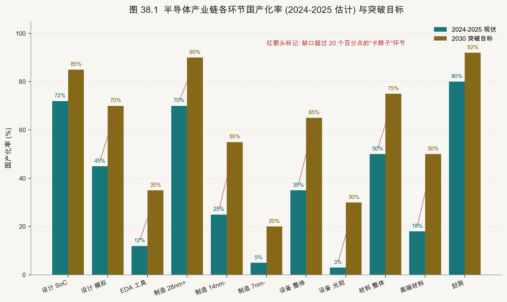

> 图中比例为基于多类公开资料整理的区间性估计，统计口径可能不同，适合观察环节间相对差异，不宜视为精确市场份额。

#### 38.2　跨主线技术地图：分层与时间轴

| 技术层级 | 核心研究对象 | 主要观察窗口 |
|---|---|---|
| 设备层 | 刻蚀、薄膜沉积、量测、离子注入 | 设备厂年报、客户验证披露 |
| 材料层 | 硅片、光刻胶、CMP、电子特气 | 材料厂供应链披露、原材料价格 |
| EDA / IP 层 | EDA 工具、Chiplet IP、UCIe 生态 | EDA 厂收入结构、IP 授权动向 |
| 制造层 | 代工产能、节点路线、良率 | 各代工厂资本开支与产能公告 |
| 封装层 | CoWoS、HBM、SoIC、混合键合 | OSAT 与代工厂产能扩张披露 |
| 系统层 | AI 芯片、CSP ASIC、CPO 系统 | CSP Capex、ISSCC / Hot Chips 发布 |

每个层级的产业演进节奏不同：设备与材料看长周期（5-10 年）的国产化曲线；先进封装与 HBM 看中周期（2-3 年）的产能扩张；CSP ASIC 与 AI 芯片看短周期（季度）的发布节奏与生态演进。

#### 38.3　研究方法论的五维框架

**第一维：技术路线判断。** 不依赖某个品类的短期波动，而是建立对底层技术演进逻辑的判断。例如先进封装为什么会成为下一个十年的核心战场？回答这一问题需要从存储墙的物理本质、互连密度的几何极限、AI 算力分布的统计特征三个维度综合判断。

**第二维：产业格局动态。** 跟踪全球前 10 家产业链关键企业的资本开支、研发投入、客户结构变化。半导体产业的格局变化是缓慢的（典型周期 5-10 年），但一旦变化往往是结构性的，需要持续观察。

**第三维：政策环境。** 美国 BIS 出口管制、中国大基金动向、欧盟芯片法案、日韩半导体政策。这些政策事件直接重构产业链的全球分工。

**第四维：技术里程碑。** 主要会议（ISSCC / IEDM / VLSI Symposium / ISCAS / Hot Chips / SEMICON）上的关键技术发布往往是产业转折点的早期信号。建议保持对核心会议议程与论文摘要的定期跟踪。

**第五维：宏观流动性。** 半导体产业是典型的强周期行业，与全球宏观流动性紧密相关。利率环境、美元周期、全球资本开支增速都会显著影响产业链的资本配置节奏。

#### 38.4　主题事件驱动日历

| 季度 | 关键事件窗口 | 研究关注重点 |
|---|---|---|
| Q1（2-3 月） | ISSCC、CES、SEMICON Korea | 半导体设计前沿论文、消费电子需求信号 |
| Q2（4-6 月） | 各厂一季报、台积电法说会、SEMICON West | 季度需求节奏、代工厂产能利用率与价格 |
| Q3（7-9 月） | Hot Chips、IEDM 论文征集截止 | AI 芯片新架构发布、器件研究前沿 |
| Q4（10-12 月） | IEDM、SC（超算大会）、半年度报告 | 器件路线、超算与数据中心建设 |

#### 38.5　跟踪体系建立建议

对于产业研究者，建议建立持续跟踪体系：

1. **建立产业链分环节的事实库**：为每个关键产业环节建立独立 Markdown 文档，记录技术路线、代表企业、关键假设、公开事件索引和判断版本历史。
2. **定期复盘核心假设**：每季度对自己的产业主线判断做一次复盘，明确哪些假设已被新信息证伪、哪些被强化。
3. **Git 版本管理思考过程**：Git 版本控制的价值不在于代码，而在于回溯「在什么时间点、基于什么信息、形成了什么判断」。这是研究质量的元规则。
4. **构建跨主线的关联视图**：单一主线的判断容易陷入局部最优，跨主线的关联视图（如 AI 芯片需求 → HBM → CoWoS → 设备订单 → 材料消耗）有助于建立产业链的系统认知。

#### 38.6　风险框架与证伪条件

研究框架不能只列「看好的逻辑」，还必须明确「在什么条件下当前判断应当被推翻」。本报告在第 0.4 节以及第 14、16、22、29 章讨论了相关技术路线与约束，附录 H「关键事实与信源说明」对高冲击事实的来源等级做了系统标注。读者在形成研究判断时，应进一步为关键假设设定可量化的证伪条件，并同时核查相应的事实审计条目。


### 第 39 章　产业研究方法论

#### 39.1　信息源的四级体系

专业的产业研究建立在分层次、有辨别力地利用信息源的基础上。不同层次的信息源在权威性、时效性、深度和可及性上各有侧重，成熟的研究者需要根据问题性质匹配合适的信息层级，而非陷入"信息越多越好"的误区。

**一级信息源（最高权威，直接原始）**：上市公司公告（招股说明书、定增预案、重大合同公告）是获取财务数据、核心客户结构、核心技术路线的最权威来源，但需要从密度巨大的定式语言中萃取核心信息，招股书中的竞争对手分析和行业格局描述尤其值得深读 [39-1]。年报中的"主要供应商和客户前五名"披露，是还原产业链上下游关系的廉价工具。电话会议纪要（券商整理版）虽有二手加工，但管理层问答环节的原始回答往往包含大量非正式但极有价值的产业判断，需积累历史纪要对比阅读。

**二级信息源（专业整合，需辨别质量）**：券商深度报告的价值参差不齐，首发覆盖报告（初次覆盖报告，Initiation Report）通常最为完整，包含行业竞争格局、核心逻辑和详细的模型假设；跟踪报告则需要快速提取对原有逻辑的修正信息。行业协会数据（SEMI 全球晶圆出货量报告、SIA 月度全球半导体销售数据、JEITA 日本电子产业月报）是市场层面最重要的量化跟踪工具，建议建立数据库进行时间序列追踪 [39-2]。中国半导体行业协会（CSIA）的国产化统计数据需要谨慎对待，因其统计口径和时效性有局限性，但趋势信号仍具参考价值。

**三级信息源（技术前沿，需专业解读）**：学术会议是最重要但最被普通投资者忽视的技术信息来源。ISSCC（IEEE 固态电路国际会议）每年 2 月在旧金山召开，是最顶级的芯片设计会议，其发表论文揭示了主要半导体公司最新的电路设计成果和工艺节点能力（如 TSMC、三星、英特尔、华为海思每年的旗舰芯片论文代表了当年先进工艺的实际量产能力）[39-3]。IEDM（国际电子器件会议）是器件物理和工艺技术的最高学术论坛，新工艺代的首次亮相通常在 IEDM 和 VLSI，是判断台积电/三星/英特尔工艺路线图最权威的一级信息来源 [39-4]。SPIE 光刻与先进光学会议是光刻技术路线（EUV、High-NA、BEUV）的专业信息核心场所。ECTC（电子元件与技术会议）专注先进封装，CoWoS/SoIC/Chiplet 集成技术的最新进展在此首发 [39-5]。

imec 国际技术路线图和 IEEE IRDS（International Roadmap for Devices and Systems）是晶体管缩放和封装技术展望的系统性参考文本，对判断未来 5-10 年设备需求结构至关重要 [39-6]。

**四级信息源（快速感知，需高度甄别）**：技术媒体在时效性上优于所有其他来源，但深度和准确性差异悬殊。SemiAnalysis（Dylan Patel 主笔）代表了目前英语半导体分析媒体中技术深度最高的付费报告，对 CoWoS/HBM/数据中心功耗等专项话题的拆解具有接近卖方研究报告的分析密度 [39-7]。TechInsights 的芯片拆解（Die Shot Teardown）和工艺比较分析是全球公认的技术标杆，购买其报告对于判断竞争对手工艺代差具有无可替代的参考价值 [39-8]。国内媒体中，电子工程专辑（EE Times China）、半导体行业观察是快速追踪国内产业动态的高效渠道，但需注意区分其报道内容与其背后的行业关系。

#### 39.2　数据工具的专业配置

量化金融视角下的半导体研究，需要在财务数据、市场数据和产业数据三个维度形成完整的工具覆盖。

**金融数据平台**：Wind 是国内最全面的 A 股财务数据库，其半导体行业分类下的财务指标（分季度收入/利润、研发支出、资本支出、在手订单披露）是建立模型的基础数据来源；同花顺 iFinD 在资金流向（北向资金、机构持续跟踪变化）跟踪上有其特有优势；Choice（东方财富旗下）的数据颗粒度较细，适合产业研究者的日常研究；Bloomberg Terminal 是国际 Roadshow 和多资产组合管理的行业标准，在港股、美股、ETF 的数据整合上不可替代；FactSet 在买方量化研究领域广泛使用，Estimates 数据的时效性和一致性高于 Bloomberg [39-9]。

**产业市场数据**：SEMI 的 World Fab Forecast 每半年更新一次，提供全球 1000+ 晶圆厂的产能规划、设备投资计划和节点分布，是判断半导体设备需求节奏的最权威数据集 [39-10]；TrendForce（集邦咨询）提供 DRAM/NAND/面板市场的月度量价跟踪，是存储器品类投研的核心数据来源；Yole Développement 在 MEMS、功率器件、先进封装等细分市场的行业报告深度高，代价是报告订阅费用较高 [39-11]；Omdia、IDC、Gartner、Counterpoint 分别在服务器、PC、手机等整机市场的出货量预测上各有专长，是判断芯片下游需求趋势的重要外部参考。

建议建立个人的"数据追踪仪表盘"，将以下关键指标的时间序列纳入定期更新：SEMI 北美半导体设备出货额（月度 B/B 比率）、SIA 全球半导体月度销售额（分地区）[39-12]、TrendForce DRAM 均价、主要代表企业的季度营收/利润率、北向资金对半导体 ETF 的持续跟踪变化。这一仪表盘是支撑主动研究方向调整决策的量化基础。

#### 39.3　实地调研的方法与价值

一手调研是财务建模无法完全替代的信息维度，特别是对于技术驱动型公司，管理层的技术认知深度、研发团队的工程执行力以及客户关系的实质性进展，往往只有通过直接接触才能准确感知。

**专业展会是最高效的产业信息获取场所**：SEMICON Taiwan（台北，9 月）是全球半导体供应链最重要的年度展会，汇聚了台积电生态链的完整供应商体系，国内设备/材料厂商的海外拓展进展可在此直接观察 [39-13]；SEMICON China（上海，3 月）是国内半导体产业链最密集的展会，适合系统梳理国内供应商的产品矩阵和客户进展；CES（拉斯维加斯，1 月）和 Computex（台北，6 月）代表了消费芯片应用端的最新趋势，AI 手机/PC 平台的新品发布和芯片合作公告通常在此集中披露；慕尼黑电子展（electronica，慕尼黑，2 年/次）是工业和汽车电子最重要的欧洲展会，适合了解德系主机厂和 Tier 1 的供应链策略变化。

**工厂参观的核心价值**在于获取无法从公告中读取的"质感信息"：自动化程度和产线整洁度反映了公司的精益制造能力；工程师与设备数量的比率揭示了人力依赖程度；洁净室等级（Class 10/100/1000）与宣称的产品定位是否匹配；在制品（WIP）密度和仓储状况可以侧面印证当前产能利用率。工厂参观通常需要通过投资者关系部门安排，小规模买方机构也有机会参与上市公司组织的参观活动。

**卖方分析师的公开信息价值**：长期跟踪单一子行业的分析师能够帮助研究者理解财报问答、技术路线与产业口径差异。可使用公开电话会、公开路演、网络研讨会和已发布的行业报告做交叉验证；供应链访谈仅能在合规、可公开引用且不含重大非公开信息（MNPI）的前提下作为线索，不能以未披露信息支撑结论或交易。

#### 39.4　建立"研究 → 跟踪 → 复盘"闭环

研究的价值不在于单次报告的完整性，而在于能否建立一套可持续迭代的知识管理系统。个人研究者的核心竞争力来自于累积的认知迭代——每一次预测对错都应该被记录和分析，形成真正的学习闭环而非单向的信息消费。

**个人 Wiki 文档体系**：推荐基于 Markdown + Git 本地仓库的轻量级知识管理方案。为每个持续跟踪的代表企业建立独立的 Markdown 文档，包含：公司基本信息与商业模式摘要、核心竞争优势的量化描述（市占率、技术参数对比）、关键假设清单（需定期验证）、历史公告索引（以日期为键的重要事件列表）、以及投资论点的版本历史（记录论点的演变而非仅保留当前版本）。Git 版本控制的价值在于可以准确回溯"在什么时间点、基于什么信息、形成了什么判断"，这是诚实复盘的基础。

**事件日历管理**：半导体行业有相对固定的年度事件周期：1 月 CES（消费电子趋势）、2 月 ISSCC（芯片设计顶会）[39-3]、3 月 SEMICON China + 4 月 Computex 预热、6 月 Computex + SEMICON West、9 月 SEMICON Taiwan + iPhone 发布、10 月 IEDM 摘要发布、11-12 月 IEDM 正式召开 + 年末财报季密集。将这些事件提前标注入个人日历，在每个事件前 1-2 周进行预判（预期市场反应 × 自己的差异化预判），事件后 1 周完成实际与预期的比对复盘。这一习惯的坚持，是建立对半导体周期的高精度预期管理的唯一可靠路径。

**定期复盘机制**：月度复盘（30 分钟，回顾当月重大事件对仓位的实际影响，检查跟踪表更新完整性）；季度复盘（2-3 小时，结合财报季数据系统更新各代表企业财务模型，评估核心假设的验证状态，调整估值敏感变量和关注优先级）；半年复盘（半天，重新审视主线逻辑的有效性，更新竞争格局地图，复盘半年内的判断更新对错及根本原因，为下半年制定主题投资重点）。复盘不是为了给自己打分，而是为了发现系统性的认知偏差——无论是过度乐观于国产替代节奏，还是低估了地缘风险对供给端的实际影响，这些偏差只有通过系统性记录才能被识别和纠正 [39-14]。

#### 第 39 章参考文献

[39-1] 上海证券交易所. 科创板股票上市规则（信息披露与年报要求）. 上海证券交易所. 2023. <https://www.sse.com.cn/lawandrules/sserules/listing/star/c/c_20230101_5644386.shtml>

[39-2] SEMI. World Semiconductor Trade Statistics Program Overview. SEMI. 2024. <https://www.semi.org/en/products-services/market-data/wsts>

[39-3] IEEE ISSCC. ISSCC 2024 Proceedings: Advanced Process and Circuit Design. IEEE Xplore. 2024. <https://ieeexplore.ieee.org/xpl/conhome/10454111/proceeding>

[39-4] IEEE IEDM. IEDM 2023 Technical Program: Logic, Memory, and Packaging. IEEE Xplore. 2023. <https://ieeexplore.ieee.org/xpl/conhome/10413517/proceeding>

[39-5] IEEE ECTC. ECTC 2024: Advanced Packaging and Heterogeneous Integration. IEEE Xplore. 2024. <https://ieeexplore.ieee.org/xpl/conhome/10545060/proceeding>

[39-6] IEEE IRDS. International Roadmap for Devices and Systems 2023 Edition. IEEE. 2023. <https://irds.ieee.org/editions/2023>

[39-7] SemiAnalysis. The AI Datacenter Energy Dilemma. SemiAnalysis. 2024. <https://www.semianalysis.com/p/ai-datacenter-energy-dilemma>

[39-8] TechInsights. Process Teardown: TSMC N3E vs Samsung 3GAP. TechInsights. 2024. <https://www.techinsights.com/blog/tsmc-n3e-vs-samsung-3gap-process-comparison>

[39-9] FactSet Research Systems. FactSet Platform Overview: Consensus Estimates and Financial Data. FactSet. 2024. <https://www.factset.com/products-data/analytics/estimates>

[39-10] SEMI. World Fab Forecast Report — H2 2024. SEMI. 2024. <https://www.semi.org/en/products-services/market-data/world-fab-forecast>

[39-11] Yole Développement. Advanced Packaging Technology & Market 2024. Yole Group. 2024. <https://www.yolegroup.com/product/report/advanced-packaging-technology-market-2024/>

[39-12] SIA. Global Semiconductor Sales Data — Monthly Report. Semiconductor Industry Association. 2024. <https://www.semiconductors.org/resources/semiconductor-industry-data/>

[39-13] SEMI. SEMICON Taiwan 2024 Exhibition Overview. SEMI. 2024. <https://www.semicontaiwan.org/>

[39-14] Kahneman D., Lovallo D., Sibony O. Before You Make That Big Decision. Harvard Business Review. 2011. <https://hbr.org/2011/06/before-you-make-that-big-decision>

---

<a id="appendices"></a>

## 附录


---

### 附录 A　核心术语词汇表（中英对照）

本表收录半导体产业链研究中高频出现的近百个核心术语，按英文字母顺序排列，涵盖制程、封装、互连、架构、材料、计算范式六大类别。

| 缩写 | 全称 | 中文 | 解释 |
|------|------|------|------|
| 2.5D | 2.5D Integration | 2.5D 集成 | 通过硅中介层（Interposer）将多个裸片水平并排集成，不完全叠层，介于 2D 与 3D 之间的封装形式 |
| 3D-IC | Three-Dimensional Integrated Circuit | 三维集成电路 | 通过硅通孔（TSV）或混合键合将多个裸片垂直叠层的集成技术 |
| ADC | Analog-to-Digital Converter | 模数转换器 | 将连续模拟信号转换为离散数字信号的电路，广泛用于传感器接口与通信系统 |
| AI Accelerator | AI Accelerator | AI 加速器 | 专为深度学习推理与训练设计的芯片，典型代表为 GPU、NPU、TPU |
| ASIC | Application-Specific Integrated Circuit | 专用集成电路 | 针对特定应用场景定制设计的芯片，不可重编程，功耗和面积效率优于通用处理器 |
| ALD | Atomic Layer Deposition | 原子层沉积 | 通过交替通入反应前驱体，以单原子层精度逐层沉积薄膜的 CVD 变体工艺 |
| BEOL | Back End of Line | 后道工序（金属互连段） | 晶圆制造中形成金属互连层及通孔的工序阶段，通常从第一层金属开始 |
| BGA | Ball Grid Array | 球栅阵列封装 | 封装底部均匀分布焊球作为 I/O 引脚的表面贴装封装，互连密度高于 QFP |
| BoW | Bunch of Wires | 多线束互连 | 芯粒互连的一种低延迟、高带宽物理接口规范，由 AMD 提出并加入 UCIe 联盟 |
| BSI | Backside Illuminated | 背照式（图像传感器） | 将感光层放在芯片背面以减少金属层遮挡，提升图像传感器的光敏效率 |
| BSPDN | Backside Power Delivery Network | 背面供电网络 | 将供电金属层移至晶圆背面，降低正面信号层拥塞，减少 IR drop |
| CAA | Complementary Architecture ASIC | 互补架构 ASIC | 泛指混合使用多种计算单元（CPU/GPU/NPU）的异构 ASIC 设计 |
| CFET | Complementary FET | 互补场效应晶体管 | 将 nMOS 与 pMOS 垂直叠层于同一器件栈，是 GAA 之后的下一代晶体管架构 |
| CIM | Computing-In-Memory | 存内计算 | 将计算单元直接嵌入存储阵列，减少数据搬运开销，提升 AI 推理能效 |
| CMP | Chemical Mechanical Planarization | 化学机械平坦化 | 通过化学腐蚀与机械研磨结合的方式对晶圆表面进行全局平坦化的工艺 |
| CoWoS | Chip-on-Wafer-on-Substrate | 芯片-晶圆-基板封装 | 台积电的 2.5D 高级封装平台，将 HBM 与逻辑芯片通过硅中介层连接，NVIDIA H/B 系列采用此方案 [F-5] |
| CPO | Co-Packaged Optics | 共封装光学 | 将光模块与交换芯片封装在同一基板上，降低数据中心光互连功耗与延迟 |
| CXL | Compute Express Link | 计算快速互连 | 基于 PCIe 物理层的主机-设备一致性互连协议，支持内存共享与扩展 |
| CVD | Chemical Vapor Deposition | 化学气相沉积 | 通过气态前驱体在晶圆表面发生化学反应沉积薄膜的工艺，用于介质层、金属层等 |
| DDR | Double Data Rate | 双倍数据速率（内存） | 在时钟上升沿和下降沿均传输数据的 DRAM 接口标准，当前主流为 DDR5 |
| Die | Die | 裸片 | 从晶圆切割下来的单个芯片单元，尚未封装 |
| DRAM | Dynamic Random-Access Memory | 动态随机存取存储器 | 以电容存储信息的易失性存储器，需周期性刷新，是当前主流主存技术 |
| DUV | Deep Ultraviolet | 深紫外光刻 | 使用 193nm（ArF）或 248nm（KrF）波长激光进行光刻，通过多重曝光实现 7nm 以上制程 |
| EDA | Electronic Design Automation | 电子设计自动化 | 用于芯片设计、验证、布局布线的软件工具链，龙头为新思科技（Synopsys）、楷登电子（Cadence）、西门子 EDA（原 Mentor） |
| EUV | Extreme Ultraviolet | 极紫外光刻 | 使用 13.5nm 波长光源的光刻技术，ASML NXE 系列，是 7nm 以下制程的核心工艺 [F-3] |
| FEOL | Front End of Line | 前道工序（器件段） | 晶圆制造中形成晶体管器件的工序阶段，包括栅极、源漏极的形成 |
| FinFET | Fin Field-Effect Transistor | 鳍式场效应晶体管 | 将沟道做成立体鳍片以增强栅控能力的晶体管结构，Intel 22nm 引入，广泛用于 7nm-3nm |
| FOWLP | Fan-Out Wafer-Level Packaging | 扇出型晶圆级封装 | 将裸片重新嵌入人工晶圆后进行再布线，实现超薄封装与多芯片集成，台积电 InFO 为代表 |
| GAA | Gate-All-Around | 全环绕栅极 | 将栅极包裹在纳米片/纳米线四周以进一步增强静电控制的晶体管结构，3nm 以下主流 [F-4] |
| GDS | GDSII Stream Format | GDSII 格式 | 芯片版图的标准交换格式，用于 Tapeout 时向晶圆厂提交设计数据 |
| HBM | High Bandwidth Memory | 高带宽内存 | 将 DRAM 裸片通过 TSV 垂直叠层封装在 GPU 旁侧，提供极高内存带宽，当前为 HBM3E [F-11] [F-12] |
| HDI | High Density Interconnect | 高密度互连 PCB | 使用激光钻孔与超细线宽/间距工艺制造的高密度印刷电路板 |
| High-NA EUV | High Numerical Aperture EUV | 高数值孔径 EUV | ASML EXE 系列，NA=0.55，分辨率提升约 70%，用于 2nm 以下制程 [F-2] |
| HPC | High-Performance Computing | 高性能计算 | 面向科学计算、AI 训练等高算力场景的计算平台，通常指数据中心 GPU 集群 |
| HTOL | High Temperature Operating Life | 高温工作寿命测试 | 封测环节的可靠性验证项目，模拟芯片在高温高压下长期工作的失效模式 |
| Hybrid Bonding | Hybrid Bonding | 混合键合 | 在铜-铜直接键合的同时实现介质层键合，互连节距可达 1-5μm，远优于凸点封装 [F-10] |
| I/O | Input/Output | 输入/输出 | 芯片与外部系统通信的接口电路，包括 SerDes、PCIe、DDR PHY 等 |
| IC | Integrated Circuit | 集成电路 | 将多个电子器件集成在单一半导体基片上的电路，俗称"芯片" |
| IDM | Integrated Device Manufacturer | 集成器件制造商 | 自行设计并制造芯片的公司，如 Intel、Samsung、TI |
| InFO | Integrated Fan-Out | 集成扇出封装 | 台积电的扇出型封装技术，广泛用于 Apple A 系列移动处理器 |
| Interposer | Interposer | 硅中介层 | 置于芯片与基板之间的硅基转接层，提供高密度横向互连，是 2.5D 封装核心 |
| IP Core | Intellectual Property Core | IP 核 | 可复用的预设计电路模块，分软核（RTL）、固核（Gate）、硬核（版图），由 Arm、新思科技（Synopsys）等提供 |
| JEDEC | Joint Electron Device Engineering Council | 固态技术协会 | 制定内存接口、封装等标准的行业组织，HBM、DDR、LPDDR 均为其规范 |
| KGD | Known Good Die | 已知良品裸片 | 经过测试确认为良品的裸片，用于 Chiplet 异构集成以保障封装良率 |
| LPDDR | Low Power Double Data Rate | 低功耗双倍数据速率内存 | 针对移动设备优化功耗的 DRAM 标准，当前主流为 LPDDR5X |
| LQC | Liquid Cooling | 液冷散热 | 通过液态冷却介质带走芯片热量，分直接液冷（冷板）与浸没式两类 |
| MEMs | Micro-Electro-Mechanical Systems | 微机电系统 | 将机械结构与电子电路集成在硅片上的微型传感器/执行器，用于 MEMS 麦克风、加速度计等 |
| MLO | Multi-Level Optical | 多层光学互连 | 在封装内部利用光波导实现芯粒间通信的新兴互连方案 |
| MR-MUF | Mass Reflow-Molded Underfill | 大规模回流成型底部填充 | 台积电 CoWoS 与 SoIC 中使用的底部填充工艺，兼顾量产效率与可靠性 |
| NAND | NAND Flash | NAND 闪存 | 以浮栅或电荷俘获层存储数据的非易失性存储器，主流为 3D NAND，层数已达 232-300 层以上 |
| NMP | N-Methyl-2-Pyrrolidone | N-甲基吡咯烷酮 | 光刻胶剥离与清洗的关键溶剂，环保法规趋严背景下正推动替代材料研发 |
| NRE | Non-Recurring Engineering | 一次性工程费用 | 芯片设计阶段发生的掩膜版制作、IP 授权等固定成本，先进制程 NRE 可达数亿美元 |
| NSPICE | Nanosecond SPICE | 纳秒级 SPICE 仿真 | 用于大规模电路瞬态仿真的快速 SPICE 变体，以新思科技 HSPICE 为代表 |
| OCD | Optical Critical Dimension | 光学关键尺寸量测 | 通过散射量测技术监控光刻及刻蚀后关键尺寸的量测方法 |
| OFC | Optical Fiber Communication | 光纤通信（会议） | 全球最重要的光通信技术会议及展览，每年 3 月举办 |
| OIP | Open Innovation Platform | 开放创新平台 | 台积电的 IP/EDA 生态认证体系，确保合作伙伴设计工具与制程节点的兼容性 |
| OSAT | Outsourced Semiconductor Assembly and Test | 封测外包服务商 | 提供封装与测试服务的专业代工企业，如日月光、国内头部 OSAT、台湾测试代工厂商 |
| PCIe | Peripheral Component Interconnect Express | 高速外设互连总线 | 服务器与 AI 加速器间的主流高速串行互连标准，PCIe 5.0 单通道带宽 4GB/s |
| PDK | Process Design Kit | 工艺设计套件 | 晶圆厂提供给设计公司的工艺参数、器件模型、设计规则文件集合 |
| PEALD | Plasma Enhanced ALD | 等离子体增强原子层沉积 | 利用等离子体激活反应的 ALD 变体，可在较低温度下沉积高质量薄膜 |
| PHY | Physical Layer | 物理层接口 | 实现数字接口协议物理信号收发的模拟电路，如 PCIe PHY、DDR PHY |
| PPA | Power, Performance, Area | 功耗-性能-面积 | 评估芯片设计与制程工艺优劣的三大核心指标 |
| PPAC | Power, Performance, Area, Cost | 功耗-性能-面积-成本 | 在 PPA 基础上增加成本维度，更完整地评估制程节点竞争力 |
| PVD | Physical Vapor Deposition | 物理气相沉积 | 通过蒸发或溅射将靶材原子沉积到晶圆表面的薄膜工艺，用于金属种子层等 |
| QFN | Quad Flat No-Lead | 方形扁平无引脚封装 | 四边无外露引脚的扁平封装，体积小、热阻低，广泛用于消费电子 |
| RDL | Redistribution Layer | 再布线层 | 用金属薄膜将芯片焊盘重新布局，以适配封装基板或扇出型封装的需求 |
| RISC-V | Reduced Instruction Set Computer V | 第五代精简指令集架构 | 开源免费的 ISA 规范，无需授权费，正快速渗透 AI 加速器、嵌入式与服务器市场 |
| RTL | Register Transfer Level | 寄存器传输级 | 芯片设计的抽象层次，描述数据在寄存器间流动的逻辑行为，是综合的输入 |
| RTP | Rapid Thermal Processing | 快速热处理 | 在短时间内将晶圆加热到高温的热处理工艺，用于离子注入激活、氧化等 |
| SADP | Self-Aligned Double Patterning | 自对准双重曝光 | 通过侧墙转移将光刻图案密度翻倍的多重图案化技术，用于 DUV 制程 |
| SiC | Silicon Carbide | 碳化硅 | 第三代宽禁带半导体材料，耐高压高温，是电动汽车功率器件的核心材料 |
| SiGe | Silicon Germanium | 硅锗 | 在硅中掺入锗形成的应变沟道材料，可提升载流子迁移率，用于高频器件 |
| SiP | System-in-Package | 系统级封装 | 将多个功能芯片（逻辑、存储、RF 等）集成在单一封装内的技术 |
| SoC | System-on-Chip | 片上系统 | 将 CPU、GPU、内存控制器、I/O 等多功能模块集成在单一芯片上的设计 |
| SoIC | System-on-Integrated-Chips | 集成芯片系统 | 台积电的 3D 堆叠技术品牌，采用混合键合，面向 HPC 与 AI 芯片 |
| SPIE | Society of Photo-Optical Instrumentation Engineers | 国际光学工程学会 | 主办 Advanced Lithography、Photonics West 等半导体光刻领域顶级会议 |
| SRAM | Static Random-Access Memory | 静态随机存取存储器 | 以双稳态触发器存储信息的高速易失性存储器，用于 CPU/GPU 片上 Cache |
| TCB | Thermocompression Bonding | 热压键合 | 通过施加热量与压力将凸点与焊盘键合的互连工艺，用于倒装焊与混合键合 |
| TCO | Total Cost of Ownership | 总拥有成本 | 评估数据中心采购决策时综合考量硬件、能耗、运维的综合成本模型 |
| TIM | Thermal Interface Material | 热界面材料 | 填充芯片与散热器之间缝隙以降低热阻的材料，如导热硅脂、液态金属 |
| TIM | Tape-In Meeting | 投片会议 | 晶圆厂与客户确认 Tapeout 前最终设计冻结的里程碑会议（与热界面材料同缩写，需依上下文区分） |
| TPU | Tensor Processing Unit | 张量处理单元 | 谷歌（Google）自研的 AI 训练与推理专用芯片，采用脉动阵列架构 [F-28] |
| TSV | Through-Silicon Via | 硅通孔 | 贯穿硅基底的垂直互连结构，是 3D-IC 与 HBM 堆叠的核心互连技术 |
| UCIe | Universal Chiplet Interconnect Express | 通用芯粒互连快车 | 由 Intel 主导、多家厂商联合制定的开放式芯粒间互连标准 [F-20] |
| UHF | Ultra-High Frequency | 超高频 | 300MHz-3GHz 频段，广泛用于 RFID、蜂窝通信与雷达 |
| UVM | Universal Verification Methodology | 通用验证方法学 | 基于 SystemVerilog 的 SoC 功能验证标准方法学，由 Accellera 维护 |
| VDD | Supply Voltage | 核心供电电压 | 芯片逻辑核心的工作电压，先进制程已降至 0.7-0.8V 左右 |
| VCSEL | Vertical-Cavity Surface-Emitting Laser | 垂直腔面发射激光器 | 高速光互连中广泛使用的小型化激光光源，适用于短距光纤与芯片内光通信 |
| Via | Via | 通孔 | 连接不同金属层的垂直互连结构，是 BEOL 互连的基本单元 |
| VRM | Voltage Regulator Module | 电压调节模块 | 为处理器或内存提供精密稳定电压的电源管理模块 |
| Wafer | Wafer | 晶圆 | 用于制造集成电路的单晶硅薄圆片，主流直径为 300mm（12 英寸） |
| WLP | Wafer-Level Packaging | 晶圆级封装 | 在晶圆未切割前完成封装工序的技术，封装体积最小，但 I/O 数受限 |
| XLNX | Xilinx（已被 AMD 收购） | 赛灵思 | FPGA 领域头部企业，2022 年被 AMD 收购，产品线并入 AMD Adaptive Computing 部门 |
| ZNS | Zoned Namespace | 分区命名空间 SSD | NVMe 标准扩展，允许主机以分区写入方式管理 SSD，提升耐久性与性能 |

---

### 附录 B　关键路线图汇总

#### B.1　制造（先进逻辑制程）证据状态表（截至 2026-09-04）

> 标签：**[F] 已发生事实**，须有一手来源；**[T] 公司/标准组织目标**，不等于兑现；**[A] 研究假设**，只用于情景分析。本版删除了旧表中缺少一手证据、精确到季度的客户与量产预测。

| 平台 | 已核实状态 [F] | 后续目标 [T] | 研究边界 / 复核点 |
|---|---|---|---|
| TSMC N2 / N2P / A16 / A14 | N2 已于 2025 年第四季度进入 HVM，TSMC 称良率表现良好 [F-66] | N2P 与 A16 计划 2026 年下半年量产；A14 计划 2028 年量产 [F-66] | [A] 不预设具体客户、季度良率或产品首发；每季复核收入占比、产能、良率和折旧 |
| Intel 18A / 18A-P / 14A | Intel 18A 于 2025 年进入生产；18A-P 于 2026 年 6 月进入风险生产 [F-69] | Intel 披露 14A 的 PPA 方向，但本版未找到可核实的 14A HVM 日期 [F-69] | [A] 风险生产不等于客户 HVM；关注外部客户流片、认证、良率和产能利用率 |
| 三星电子（Samsung Electronics）SF2 及以下 | 2026 年 7 月，三星电子与博通（Broadcom）签署聚焦 2nm 及以下、存储、代工和封装协作的 MOU [F-70] | 三星电子先前路线图将 SF2 分别面向移动、HPC 和汽车应用，但均属公司目标 [F-7] | [A] MOU 不是订单、客户资格认证或量产证明；等待产品 Tape-out、量产和收入证据 |
| ASML High-NA 平台 | 截至 2025 年末交付 8 套、6 套运行；首套 EXE:5200B 已交付 [F-67] | 目标于 2026 年末满足 HVM 要求，客户插入窗口为 2027–2028 年 [F-67] | [A] 设备交付不等于某代工节点采用；复核客户披露、每层成本、Overlay、产能和良率 |

#### B.2　封装路线图（先进封装跟踪窗口，[T/A]）

> 本节保留用于跟踪的时间窗口；除另有一手来源明确确认外，均按公司目标或研究假设处理，不作为历史完成清单。

| 时间 | 关键事件 |
|------|----------|
| 2025 Q1 | 台积电 CoWoS-S（硅中介层）产能扩至 4 万片/月；SoIC-X 进入 HVM [F-5] [F-6] |
| 2025 Q2 | 日月光 FOCoS-Bridge（扇出芯粒互连）进入量产；国内头部 OSAT XDFOI 平台认证 |
| 2025 Q3 | 台积电 CoWoS-L（有机中介层）产能提升，支持 8-Hi HBM4 [F-6] |
| 2025 Q4 | Intel EMIB（嵌入式多芯片互连桥接）第三代规格发布（EMIB-T） |
| 2026 Q1 | 混合键合（Hybrid Bonding）节距突破 5μm，进入标准量产 [F-10] |
| 2026 Q2 | 台积电 SoIC-XS（极薄堆叠版本）量产，面向 AI 推理加速器 |
| 2026 Q3 | 日月光 VIPack（垂直集成封装）平台正式推出 |
| 2027 Q1 | 混合键合节距目标 3μm，面向下一代 HBM5 与 3D Cache [F-10] |
| 2027 Q2 | 台积电背面供电（BSPDN）首次进入高端 AI 芯片封装 [F-1] |
| 2028 Q1 | 玻璃基板（Glass Substrate）替代有机封装基板进入工程验证 |
| 2028 Q3 | Intel Glass Core Substrate 量产目标；台积电玻璃中介层验证 |
| 2029 Q1 | 混合键合节距目标 1μm，实现真正 Monolithic-like 性能 [F-10] |
| 2030 | 光电混合封装（Silicon Photonics + Compute Die 共封装）HVM |

#### B.3　存储路线图（证据状态法）

| 时间 / 阶段 | HBM | NAND / 通用 DRAM | 证据等级与下一复核点 |
|---|---|---|---|
| 2025 | JEDEC 发布 HBM4 标准，2048-bit 接口成为下一代共同基线 [F-11] | 不再用“层数 × 单一季度”代表全行业进度；不同厂商的堆叠、QLC/PLC 和良率节奏分化 | [F] 标准已发布；厂商量产状态须逐家公司核实 |
| 2026 Q1 | Samsung、Micron、SK hynix 均按公司披露进入 HBM4 量产或大规模出货阶段；Micron 另已送出 48GB 16 层 HBM4 样品 [F-72] [F-74] [F-75] | 服务器 DRAM 与 NAND 仍需结合产品组合、库存和合约价判断，不能由 HBM 景气直接外推 | [F，公司自报] 下一步核对客户确认、良率、收入与供应规模 |
| 2026 Q2 | Samsung、SK hynix 分别送出 12 层 48GB HBM4E 样品；SK hynix 样品为 16Gbps/pin、Advanced MR-MUF [F-68] [F-73] | Micron 披露 HBM4E 正在开发并以 2027 年量产为目标 | [F] 送样不等于认证或 HVM；Micron 日期为 [T] |
| 2026 | JEDEC 发布 SPHBM4（JESD330-4），为有机基板上的 HBM4 级带宽定义新路线 [F-71] | 标准发布不等于控制器、封装或整机已经形成规模生态 | [F] 标准；[T] 厂商产品化节奏待披露 |
| 2026H2–2027 | HBM4/HBM4E 客户认证和 HVM 窗口因厂商、客户与封装方案而异 | 下一代 DRAM/NAND 产品按厂商路线图跟踪，不设行业统一季度 | [T/A] 只用于情景；以客户认证、出货和收入反向确认 |
| 2028+ | HBM5、混合键合与更高堆叠层数属于中长期路线 | 超高层 NAND、DDR6/LPDDR6 及以后仍受标准、成本和需求约束 | [A] 不给无一手来源的精确 HVM 日期或带宽单点 |

#### B.4　算力/AI 加速器状态表

| 对象 | 已发生状态 [F] | 公司目标 [T] | 复核边界 |
|---|---|---|---|
| 英伟达（NVIDIA） | Blackwell 已进入交付；公司于 2026-08-26 称 Vera Rubin 正进入全量生产，五家合作伙伴已有机架运行 [F-82] | 后续扩产、云服务可用范围与 Rubin Ultra 仍按公司目标跟踪 | “全量生产 + 机架运行”不等于客户验收、无限供货、成熟良率或分产品收入；逐季交叉验证 |
| 超威半导体（AMD） | MI300/MI325 已公开，MI350 系列按公司材料推进 [F-27] | 后续架构与产品窗口按最新官方路线图更新 | 统一精度、系统层级、软件版本与可供货状态 |
| 英特尔（Intel） | Gaudi 3 已发布；Falcon Shores 仅作内部测试芯片，不再作为商业产品；Hot Chips 2026 已披露 Diamond Rapids、Crescent Island 与 Wildcat Lake 架构 [F-76] [F-83] | 新架构的量产供货、客户采用与 Jaguar Shores 节奏仍按公司目标跟踪 | 架构发布不是 HVM 或客户验收；统一功耗、精度、软件和系统层级再比较 |
| 谷歌（Google） | TPU7x（Ironwood）于 2026-03-31 全面可用（GA）[F-77] | 后续代际未纳入无一手依据的季度预测 | GA 不等于所有地区无限产能；核查客户使用与成本口径 |
| 定制 ASIC 服务商 | 博通（Broadcom）披露 FY2026 Q3 AI 半导体收入 167 亿美元；美满电子（Marvell）FY2027 Q2 数据中心收入 21.715 亿美元，谷歌定制产品协议与认股权证条件已进入监管文件 [F-86] [F-87] [F-89] | 博通指引 FY2026 Q4 AI 半导体收入 217 亿美元；美满电子指引 FY2027 Q3 总收入 31.50 亿美元 ±5% | 公司定义的 AI 半导体、数据中心终端市场和总收入口径不同；合同、认股权证条件、出货、验收与收入确认逐级核查 |
| 中国大陆平台 | 多条 CPU、GPU、NPU 与 ASIC 路线处于不同交付阶段 | 不给无一手来源的精确季度、节点或出货目标 | 按产品公告、客户验证、软件生态与收入逐项复核 |

#### B.5　材料路线图（研究路线，[T/A]）

| 时间 | 关键节点 |
|------|----------|
| 2025 | High-NA EUV 专用光刻胶（金属氧化物 MOR）验证；SiC 8 英寸晶圆量产爬坡 [F-3] |
| 2026 | Metal-Oxide EUV 光刻胶进入生产线；钼（Mo）靶材需求随 EUV 扩产大幅增长 [F-2] |
| 2027 | 2D 材料（MoS2/WSe2）器件在 imec 实验室验证 1nm 以下可行性 [F-4] |
| 2028 | 玻璃基板核心材料（超低热膨胀系数玻璃）供应链建立 |
| 2029 | 2D 材料 PDK 研究版本发布（学术/工业前沿）[F-4] |
| 2030 | 碳纳米管（CNT）晶体管进入先进制程研究线 |

---

### 附录 C　半导体产业链代表环节与公开观察对象

> **声明**：以下代表企业仅用于说明产业分工与技术路线演进，不构成任何证券推荐、投资建议或操作指令。所有信息均来自公开资料，可能存在时效性限制。

#### C.1　EDA / IP

**国际代表**：新思科技（Synopsys）、楷登电子（Cadence）、西门子 EDA（Siemens EDA，原 Mentor Graphics）、安似科技（Ansys），构成全球 EDA “三巨头 + 物理仿真”格局；Arm（CPU IP）、Imagination（GPU IP）、CEVA（DSP IP）、新思科技 IP、楷登电子 IP 构成全球主流 IP 生态。

**国内代表**：国内数字 EDA、模拟 EDA、器件建模、量测与良率分析、数字验证等头部厂商构成国内 EDA 第一梯队；国内 IP 与定制服务厂商在该领域占据国内领先位置。

#### C.2　半导体设备（前道 / 后道 / 量测）

**国际代表**：ASML（光刻独占）、Applied Materials（薄膜沉积、CMP、量测）、Lam Research（刻蚀、ALD）、Tokyo Electron（涂胶显影、刻蚀）、KLA（量测）构成全球前道设备五巨头；后道封测设备代表包括 ASM Pacific、Disco（划片）、Besi（混合键合）等。

**国内代表**：国内头部前道设备厂商覆盖国内前道设备的主要力量，覆盖刻蚀、薄膜沉积、CMP、清洗、涂胶显影等多个品类。

#### C.3　半导体材料（硅片 / 光刻胶 / 电子特气 / CMP / 靶材 / 掩膜版）

**国际代表**：信越化工、胜高（SUMCO）、世创（Siltronic）、环球晶圆（GlobalWafers，硅片）；JSR、TOK、信越化学、富士胶片（光刻胶）；林德（Linde）、空气化工、法液空（电子特气）；CMC Materials（CMP）；TOPPAN、DNP（掩膜版）。

**国内代表**：国内硅片、光刻胶、电子特气、CMP 材料、靶材、掩膜版等头部厂商。

#### C.4　代工与 IDM

**国际代表**：台积电（TSMC，全球先进制程独占）、三星 Foundry、GlobalFoundries、联电（UMC）、PSMC、Tower Semiconductor 构成全球纯代工市场。IDM 代表：Intel、Samsung、Micron、SK Hynix、Texas Instruments、Infineon、STMicroelectronics、NXP、Renesas。

**国内代表**：中国大陆头部纯代工厂商、国内特色工艺代工厂、国内 DDIC 代工厂、国内功率 IDM 头部厂商。

#### C.5　封测 OSAT

**国际代表**：日月光（ASE Group，台湾）、Amkor（美国）、Powertech（PTI，台湾）、SPIL（已并入 ASE）；台积电先进封装产能（CoWoS / SoIC）构成全球封装格局的关键一极。

**国内代表**：国内封测头部厂商构成国内封测第一梯队。

#### C.6　HBM 与存储

**国际代表**：SK Hynix（全球 HBM 市场份额约 50%）、Samsung（约 35%）、Micron（约 15%）构成 HBM 三巨头格局；NAND 主要厂商包括三星、SK Hynix、Kioxia / Western Digital、Micron、国内 NAND 头部厂商等。

**国内代表**：国内 NAND 与 DRAM 头部厂商；HBM 领域国内尚处早期阶段。

#### C.7　光通信与 CPO

**国际代表**：高意（Coherent）/ 朗美通（Lumentum）、美满电子（Marvell，信号链）、博通（Broadcom，PHY/Switch）、思科（Cisco）/ Acacia 构成光通信芯片与模块的主要力量。CPO 由博通、英特尔（Intel）、英伟达（NVIDIA）等大厂主导推进；硅光代表企业包括思科（Acacia）、美满电子、英特尔硅光业务等。

**国内代表**：国内头部光模块厂商（光模块）；国内激光器芯片厂商（激光器芯片）；国内光通信器件厂商等构成国内光通信产业链。

#### C.8　CPU / GPU / NPU / ASIC

**国际代表**：英伟达（NVIDIA，数据中心 GPU）、超威半导体（AMD，CPU + GPU）、英特尔（Intel，CPU + 数据中心 GPU + AI 加速）；AI ASIC 代表：谷歌（Google）TPU、亚马逊云科技（AWS）Trainium / Inferentia、微软（Microsoft）Maia、Meta（脸书母公司）MTIA。

**国内代表**：国内 x86 兼容/自主指令集 CPU、AI 训练推理、智驾 SoC 及海思昇腾/麒麟系列。

#### C.9　第三代半导体（SiC / GaN）

**国际代表**：Wolfspeed（SiC 衬底与器件全球领先）、II-VI（Coherent）、Infineon、STMicroelectronics、ROHM（SiC MOSFET）；GaN 代表：EPC、Navitas、GaN Systems、Innoscience。

**国内代表**：国内 SiC 衬底、SiC 器件、GaN 器件头部厂商。

#### C.10　汽车与边缘 SoC

**国际代表**：Mobileye（智驾视觉）、NVIDIA Drive（智驾大算力）、Qualcomm Snapdragon Ride（智驾）、NXP / Infineon（汽车 MCU）、Renesas（汽车 MCU）。

**国内代表**：国内智驾 SoC、座舱 SoC、汽车 MCU 头部厂商。

#### C.11　PCB / 散热 / 电源 / 连接器

**国际代表**：松下、揖斐电（Ibiden）、三菱瓦斯化学（PCB / ABF）；TE Connectivity、Amphenol（连接器）；Delta Electronics、Vicor（电源）。

**国内代表**：PCB、连接器、电源与散热环节均已有规模化厂商；技术评估重点是高速材料认证、连接可靠性、功率密度、热阻与客户收入占比。

#### C.12　公开行业指数的使用边界

半导体行业指数可用于观察板块相对表现，但其编制规则、成份权重、地区与汇率暴露不同，不能替代产业供需或公司基本面。公开版不列证券代码或交易工具；如使用指数数据，应记录指数名称、基准日期、再平衡规则与数据来源。


---

### 附录 D　关键会议与时间窗口日历

以下会议是半导体及 AI 算力产业链的重要公开信息窗口。会前可整理议程、公司公告与公开访谈，会中记录技术发布，会后用论文、产品页和监管披露复核；全流程不使用重大非公开信息（MNPI）。

| 会议名称 | 全称 | 举办地 | 通常时间 | 核心看点 |
|----------|------|--------|----------|----------|
| ISSCC | IEEE International Solid-State Circuits Conference | 美国旧金山 | 每年 2 月（通常第二周） | 处理器/存储/模拟电路最新工艺芯片论文，IC 设计风向标 |
| SPIE Advanced Lithography + Patterning | SPIE AL+P | 美国圣何塞 | 每年 2 月下旬-3 月初 | EUV/High-NA/光刻胶/多重图案化技术最前沿 |
| OFC | Optical Fiber Communication Conference | 美国（旧金山/圣地亚哥轮流） | 每年 3 月 | 高速光模块/CPO/硅光/光纤网络年度旗舰展会 |
| GTC（NVIDIA GPU Technology Conference） | NVIDIA GTC | 美国圣何塞（+线上） | 每年 3 月（春季主场） | NVIDIA 新芯片/架构/软件栈发布，AI 算力产业风向标 [F-25] [F-26] |
| SEMICON China | SEMICON China | 中国上海 | 每年 3 月下旬 | 国内半导体设备/材料/代工生态年度最大展会 [F-46] |
| TSMC Technology Symposium | 台积电技术研讨会 | 美国硅谷（+日本/台湾） | 每年 4-5 月 | 台积电制程路线图/封装技术年度对外发布 [F-1] |
| Computex | Computex Taipei | 中国台湾台北 | 每年 5 月末-6 月初 | PC/AI PC/AI 服务器新品发布，AMD/NVIDIA/Intel/高通集中亮相 |
| IEEE VLSI Symposium | Symposia on VLSI Technology and Circuits | 日本京都/夏威夷（轮换） | 每年 6 月 | 先进器件/电路联合会议，次于 IEDM 的重要工艺披露场合 |
| SEMICON West | SEMICON West | 美国旧金山 | 每年 7 月 | 北美半导体设备/材料/代工年度展会，供应链风向标 [F-46] |
| Hot Chips | Hot Chips Symposium on High-Performance Chips | 美国斯坦福 | 每年 8 月 | 高性能处理器/加速器架构公开技术披露，工程师视角 |
| Flash Memory Summit / Storage Developer Conference | FMS / SDC | 美国圣克拉拉 | 每年 8 月 | NAND Flash / SSD / 存储新技术年度发布 |
| Intel Innovation（IFS Direct Connect） | Intel Innovation / IFS Direct Connect | 美国（圣何塞/俄亥俄轮换） | 每年 9-10 月 | Intel 代工路线图/制程节点/封装技术年度发布 [F-8] |
| SC（Supercomputing Conference） | International Conference for High Performance Computing | 美国（各城市轮换） | 每年 11 月 | 超算/HPC/AI 大模型训练基础设施年度旗舰会议 |
| IEDM | IEEE International Electron Devices Meeting | 美国旧金山 | 每年 12 月（第一或第二周） | 全球最重要器件技术会议，FinFET/GAA/CFET/2D 材料最新工艺论文 |
| ISSM | International Symposium on Semiconductor Manufacturing | 日本（各城市） | 每年 10-11 月 | 半导体制造工艺/良率/设备最新进展 |
| ITF World | imec Technology Forum World | 比利时安特卫普 | 每年 5 月 | imec 年度技术路线图发布，学界+产业链联合展望 [F-4] |
| SEMICON Japan | SEMICON Japan | 日本东京 | 每年 12 月 | 日本半导体产业年度展会，设备/材料日本厂商集中参展 [F-46] |

**补充说明**：NVIDIA GTC 秋季版本通常在 9–10 月举行，以软件框架和生态更新为主；AMD Financial Analyst Day 或 EPYC 服务器新品发布会，以及 Samsung SDC、Qualcomm Snapdragon Summit，通常也集中在秋季；TSMC Q4 财报电话会（1 月下旬）是全球半导体需求判断的重要数据窗口。

---

### 附录 E　阅读清单

#### E.1　书籍（10 本）

1. Carver Mead, Lynn Conway. Introduction to VLSI Systems. Addison-Wesley, 1980.
 半导体设计教育的奠基之作，系统阐述从器件物理到芯片设计的全链路方法论，理解 IC 设计与制造协同的必读经典。

2. Neil H. E. Weste, David Money Harris. CMOS VLSI Design: A Circuits and Systems Perspective (4th Edition). Pearson, 2010.
 涵盖 CMOS 逻辑设计、版图、时序分析与低功耗设计，是 IC 设计工程师最常用的教科书。

3. John L. Hennessy, David A. Patterson. Computer Architecture: A Quantitative Approach (6th Edition). Morgan Kaufmann, 2017.
 量化分析框架下的计算机体系结构标准教材，深入理解 CPU/GPU 架构演进与 AI 加速器设计的理论基础。

4. Jan M. Rabaey, Anantha Chandrakasan, Borivoje Nikolic. Digital Integrated Circuits: A Design Perspective (2nd Edition). Pearson, 2003.
 数字电路设计的经典教材，深入讲解亚微米工艺下的时序/功耗/噪声设计挑战。

5. Mark Lundstrom, Jing Guo. Nanoscale Transistors: Device Physics, Modeling and Simulation. Springer, 2006.
 纳米尺度晶体管的器件物理，理解 FinFET/GAA 工艺原理与短沟效应的核心参考书。

6. Chris Miller. Chip War: The Fight for the World's Most Critical Technology. Scribner, 2022.
 《芯片战争》，从地缘政治与产业史角度全面梳理半导体产业百年演进，是理解当前中美博弈产业背景的必读书目。

7. Risto Puhakka（VLSI Research）. The Semiconductor Equipment and Materials Industry: A Global Perspective. 行业内部报告书籍形式，2022.
 从产业链视角分析半导体设备与材料市场结构、竞争格局与增长驱动力。

8. Handel Jones. Fabonomics: The Economics of Semiconductor Fabrication. IBS（International Business Strategies）内部研究，持续更新.
 聚焦晶圆代工经济学：节点成本、产能规划、客户关系与战略博弈，是投资者理解代工厂竞争力的实务指南。

9. 林本坚. 沉浸式微影（Immersion Lithography）相关论著与演讲稿. 台积电/台湾大学, 2002-2010.
 液浸式光刻发明人林本坚的技术论著，理解 ArF 浸没光刻如何将摩尔定律从 90nm 延伸至 7nm 的关键文献。

10. Douglas A. Irwin. Free Trade Under Fire (5th Edition). Princeton University Press, 2020.
 从贸易政策角度分析半导体供应链重构的宏观框架，结合《芯片战争》阅读，有助于建立地缘政治+产业经济的双重分析视角。

#### E.2　学术论文（20 篇）

1. Bohr, M. et al. "Intel's Revolutionary 22 nm Transistor Technology." Intel White Paper, 2011.
 FinFET 量产化的里程碑文献，开创三维晶体管时代的产业级论文。

2. Natarajan, S. et al. "A 14nm Logic Technology Featuring 2nd-Generation FinFET Transistors, Air-Gapped Interconnects, Self-Aligned Double Patterning and a 0.0588 μm2 SRAM cell size." IEDM 2014.
 Intel 14nm FinFET 工艺全貌披露，自对准双重图案化与气隙互连的重要参考。

3. Yeh, J. et al. "TSMC N3E CMOS Technology Featuring Improved nFET/pFET Drive Currents for Balanced Performance and Lower Power." VLSI 2023.
 台积电 N3E 工艺技术细节，FinFET 持续优化的最新量产节点文献。

4. Ryckaert, J. et al. "DTCO at N3 and beyond: Patterning challenges and EUV solution path." SPIE Advanced Lithography 2020.
 imec 的设计技术协同优化（DTCO）方法论，EUV 在 3nm 以下制程的图案化路径。

5. Wuu, J. et al. "Zen 4: The AMD 5nm 5.7GHz x86-64 Microprocessor Core." ISSCC 2023.
 AMD Zen 4 架构的正式技术披露，5nm 工艺下的频率/功耗/面积优化细节。

6. Liao, L. et al. "High-Speed Graphene Transistors with a Self-Aligned Nanowire Gate." Nature 2010.
 石墨烯晶体管高频性能的早期关键论文，2D 材料器件研究的重要基础文献。

7. Novoselov, K. S. et al. "Electric Field Effect in Atomically Thin Carbon Films." Science 2004.
 石墨烯发现的诺贝尔奖论文，2D 材料研究的源头文献。

8. Kim, D. H. et al. "A 20nm 1.8V 2Gb LPDDR4 SDRAM with Pseudo Open Drain ." ISSCC 2014.
 LPDDR 先进节点内存的设计技术文献，移动 DRAM 节点演进参考。

9. Jung, D. Y. et al. "A 1Tb 4b/Cell 3D-NAND Flash with 10.2Gb/mm2 Array Density." ISSCC 2022.
 三星 3D NAND 高密度技术，多层堆叠+4bit/Cell 量产技术的完整披露。

10. McCormick, M. et al. "HBM3: Extending the Bandwidth-Power Efficiency of High Bandwidth Memory." IEEE Micro 2022. [F-11]
 SK 海力士 HBM3 技术规格与设计哲学，HBM 存储技术演进的直接文献。

11. Zimmer, B. et al. "A RISC-V Vector Processor with Simultaneous-Switching Noise Mitigation for Autonomous Mobile Robots." IEEE Journal of Solid-State Circuits 2019.
 RISC-V 架构向量处理器设计，端侧 AI 推理加速方向参考。

12. Shao, Y. et al. "Simba: Scaling Deep-Learning Inference with Multi-Chip-Module-Based Architecture." MICRO 2019.
 多芯片模块（MCM/Chiplet）架构在 AI 推理中的系统性研究，异构封装设计空间探索的关键论文。

13. Chen, Y. et al. "Eyeriss: An Energy-Efficient Reconfigurable Accelerator for Deep Convolutional Neural Networks." ISSCC 2016.
 MIT 的低功耗 CNN 加速器架构，片上存储层次与数据流设计的经典研究。

14. Jouppi, N. P. et al. "In-Datacenter Performance Analysis of a Tensor Processing Unit." ISCA 2017. [F-28]
 谷歌 TPU v1 的完整性能分析论文，脉动阵列架构与 AI 专用芯片设计的奠基文献。

15. Kurth, T. et al. "Exascale Deep Learning for Climate Analytics." SC18 2018.
 超算级 AI 应用的系统性设计论文，HPC+AI 融合趋势的早期实证研究。

16. Subramanian, S. et al. "ASML EXE:5000 High-NA EUV: System Performance and Overlay." SPIE 2023. [F-2]
 High-NA EUV 系统性能的首次详细技术披露，0.55 NA 光刻系统的关键参考。

17. Gu, J. et al. "CMOS Compatible Room-Temperature Microelectromechanical Resonators with Novel Aluminium Nitride Piezo-Electric Films." IEDM 2023.
 AlN 压电薄膜 MEMS 谐振器，射频滤波器下一代方向参考。

18. International Roadmap for Devices and Systems . "More Moore White Paper." IEEE, 2023 Edition.
 IRDS 年度路线图更新，逻辑/存储/封装技术节点的权威预测文献。

19. imec. "CMOS Scaling Challenges and the Path to 1nm and Beyond." imec Technology Forum 2024. [F-4]
 imec 对后 2nm 技术节点的系统性展望，CFET/2D 材料集成路径的权威预测。

20. Ingerly, D. et al. "Intel's Foveros 3D Stacking Technology: Processor Integration and Thermal Challenges." ECTC 2022. [F-8]
 Intel Foveros 3D 叠层技术的封装工程细节，热管理与互连密度的关键参考文献。

#### E.3　行业报告（10 份）

1. SIA（Semiconductor Industry Association）. "State of the U.S. Semiconductor Industry." 年度发布. [F-40]
 美国半导体工业协会年报，涵盖全球市场规模、产能分布、贸易数据与政策建议，是政策研究的基础数据源。

2. SEMI. "World Fab Forecast." 季度发布. [F-46]
 全球晶圆厂产能与设备支出跟踪数据库，设备投资周期研判的最核心量化工具之一。

3. Yole Group. "Status of the Advanced Packaging Industry." 年度发布.
 先进封装市场规模/竞争格局/技术路线的最完整行业报告，CoWoS/HBM 市场份额数据权威来源。

4. TechInsights. "Semiconductor Technology Teardown Reports." 持续更新. [F-50]
 芯片拆解与逆向分析报告，提供真实量产节点的实物验证数据，是验证厂商路线图可信度的重要工具。

5. SemiAnalysis. "AI Chip Deep Dives & Foundry Economics." 持续发布（Substack）.
 Dylan Patel 主导的深度产业分析，覆盖 NVIDIA/TSMC/AI 超大规模数据中心，是当前业内引用率最高的独立产业研究媒体之一。

6. Gartner. "Forecast: Semiconductor Revenue, Worldwide." 季度发布.
 Gartner 半导体收入预测，按终端市场/地区/产品类别拆解，周期判断的主流参考数据。

7. IDC. "Worldwide Artificial Intelligence Semiconductor Market Shares." 年度发布. [F-48]
 AI 芯片市场份额与需求预测，重点覆盖 NVIDIA/AMD/Intel/国内 AI 芯片竞争格局。

8. McKinsey Global Institute. "Semiconductor's New World Order." 2022.
 麦肯赛对半导体供应链重构、地缘政治风险与区域化趋势的系统分析，战略研究必读报告。

9. imec. "Technology Roadmap Annual Report." 年度发布. [F-4]
 imec 年度技术路线图报告，是全球最权威的器件/工艺/制造路线图预测来源，学术与产业均高度引用。

10. Boston Consulting Group（BCG）/ SIA. "Strengthening the Global Semiconductor Supply Chain in an Uncertain Era." 2021. [F-40]
 半导体供应链弹性与全球再平衡的政策建议报告，是各国《芯片法案》政策制定的重要参考依据。

#### E.4　网站与数据平台（10 个）

1. IEEE Xplore（<https://ieeexplore.ieee.org>）
 IEEE 全文论文数据库，ISSCC/IEDM/VLSI 等顶会论文首要检索渠道。

2. IRDS（<https://irds.ieee.org>）
 IEEE 国际器件与系统路线图官方网站，可免费下载全套年度路线图白皮书。

3. SemiAnalysis（<https://www.semianalysis.com>）
 当前最具影响力的半导体深度独立分析媒体，AI 芯片/代工经济/数据中心技术深度研究。

4. TechInsights（<https://www.techinsights.com>）
 芯片拆解与工艺分析权威机构，提供节点验证、专利分析与竞争情报服务。

5. SEMI（<https://www.semi.org>）
 全球半导体设备与材料行业协会，发布 World Fab Forecast 等核心数据，是设备支出周期研判的基础平台。

6. AnandTech / Tom's Hardware（<https://www.anandtech.com> / <https://www.tomshardware.com>）
 处理器/GPU 深度评测与架构分析，提供芯片性能实测数据与架构解析，是跟踪产品发布的实用渠道。

7. WikiChip（<https://en.wikichip.org>）
 处理器/SoC 芯片规格的系统整理百科，含详细的节点工艺参数、裸片照片与架构图解。

8. Semiconductor Engineering（<https://semiengineering.com>）
 半导体工程技术媒体，深度覆盖 EDA/设计/制造/封装的技术趋势，适合工程师与研究人员追踪前沿动态。

9. Bloomberg Terminal / Wind 资讯（<https://www.bloomberg.com> / <https://www.wind.com.cn>）
 金融数据终端，半导体股票基本面/估值/产业链财务数据的首要量化分析工具。

10. Digitimes（<https://www.digitimes.com>）
 台湾科技产业媒体，亚洲半导体供应链草根信息（台积电/三星/代工排产/零组件价格）的重要跟踪渠道。

---

### 附录 F　综合参考文献库

> 本附录收录 81 条核心参考文献，按技术领域分类，格式为 `[F-K] 作者/机构. 标题. 来源. 年份. <URL>`。其中 F-66 至 F-81 为 2026 年 8 月两次维护新增的一手来源；“收录”只代表可追溯，不代表链接永久有效或所有数据跨期可比。

---

#### F.1　制造工艺类（15 条）

[F-1] TSMC. *TSMC Unveils Next-Generation A14 Process at North America Technology Symposium*. BusinessWire / TSMC 官方. 2025. <https://www.businesswire.com/news/home/20250423909194/en/TSMC-Unveils-Next-Generation-A14-Process-at-North-America-Technology-Symposium>

[F-2] ASML. *TWINSCAN EXE:5000 — High NA EUV Lithography System Product Page*. ASML 官方. 2023. <https://www.asml.com/products/euv-lithography-systems/twinscan-exe-5000>

[F-3] ASML. *5 Things You Should Know About High-NA EUV Lithography*. ASML 官方. 2024. <https://www.asml.com/news/stories/2024/5-things-high-na-euv>

[F-4] imec. *Smaller, Better, Faster: imec Presents Chip Scaling Roadmap*. imec 官方. 2023. <https://www.imec-int.com/en/articles/smaller-better-faster-imec-presents-chip-scaling-roadmap>

[F-5] SEMI. *Global Semiconductor Capacity Projected to Reach Record High 30 Million Wafers Per Month in 2024*. SEMI 官方. 2024. <https://www.semi.org/en/news-media-press-releases>

[F-6] TSMC. *3D Fabric Advanced Packaging Technology Overview*. TSMC 官方. 2022. <https://www.tsmc.com/english/dedicatedFoundry/technology/packaging>

[F-7] Samsung Semiconductor. *Samsung Showcases AI-Era Vision and Latest Foundry Technologies at SFF 2024*. Samsung Semiconductor News. 2024. <https://semiconductor.samsung.com/news-events/news/samsung-showcases-ai-era-vision-and-latest-foundry-technologies-at-sff-2024/>

[F-8] Intel Corporation. *Semiconductor Manufacturing Process — Intel 18A, 3, and 16*. Intel Foundry 官方. 2024. <https://www.intel.com/content/www/us/en/foundry/process.html>

[F-9] imec. *Entering the High NA EUV Lithography Era*. imec 官方. 2024. <https://www.imec-int.com/en/articles/entering-high-na-euv-lithography-era>

[F-10] ASML / imec. *ASML and imec Open Joint High NA EUV Lithography Lab*. ASML 官方. 2024. <https://www.asml.com/en/news/press-releases/2024/asml-imec-opening-high-na-euv-lithography-lab>

[F-11] JEDEC. *High Bandwidth Memory DRAM Standards Overview*. JEDEC 官方. 2024. <https://www.jedec.org/standards-documents/results/hbm>

[F-12] SK Hynix. *SK Hynix 41st Anniversary: Rise to AI Memory Leader*. SK Hynix Newsroom. 2024. <https://news.skhynix.com/sk-hynix-41st-anniversary-rise-to-ai-memory-leader/>

[F-13] Samsung Semiconductor. *HBM — High Bandwidth Memory Product Overview*. Samsung Semiconductor Global. 2024. <https://semiconductor.samsung.com/dram/hbm/>

[F-14] Intel Corporation. *Intel IFS Direct Connect 2024: New 14A Node and Roadmap Update*. Tom's Hardware 报道（引用 Intel 官方发布）. 2024. <https://www.tomshardware.com/pc-components/cpus/intel-announces-new-roadmap-at-ifs-direct-connect-2024-new-14a-node-clearwater-forest-taped-in-five-nodes-in-four-years-remains-on-track>

[F-15] TSMC. *TSMC Technology & Operations — Corporate Website*. TSMC 官方. 持续更新. <https://www.tsmc.com/english/dedicatedFoundry/technology>

---

#### F.2　封装存储类（15 条）

[F-16] SK Hynix Newsroom. *SK Hynix Begins Mass Production of HBM3E*. SK Hynix 官方. 2024. <https://news.skhynix.com>

[F-17] Samsung Semiconductor. *HBM4 — Next Generation High Bandwidth Memory*. Samsung Semiconductor Global. 2024. <https://semiconductor.samsung.com/dram/hbm/hbm4/>

[F-18] Micron Technology. *Micron HBM3E — AI Memory Solution*. Micron 官方. 2024. <https://www.micron.com/products/memory/hbm>

[F-19] UCIe Consortium. *UCIe Specifications — Universal Chiplet Interconnect Express*. UCIe 官方. 2023. <https://www.uciexpress.org/specifications>

[F-20] UCIe Consortium. *UCIe 1.1 Specification Release at FMS 2023*. UCIe 官方. 2023. <https://www.uciexpress.org/post/ucie-consortium-releases-the-ucie-1-1-specification-at-fms-2023>

[F-21] Intel Corporation. *Intel Annual Report 2023 — Foundry and Process Technology*. Intel Investor Relations. 2024. <https://www.intc.com/filings-reports/annual-reports/content/0863-24-/0863-24-.pdf>

[F-22] SK Hynix. *Advanced Packaging Technology for Beyond Memory*. SK Hynix / ISDE Conference Paper. 2023. <https://www.theise.org/wp-content/uploads/2023/10/Tutorial1-4_%EC%86%90%ED%98%B8%EC%98%81%EC%88%98%EC%84%9D%EB%8B%98_SK%ED%95%98%EC%9D%B4%EB%8B%89%EC%8A%A4.pdf>

[F-23] SEMI. *Global Total Semiconductor Equipment Sales Forecast to Reach a Record of $139 Billion in 2026*. SEMI 官方. 2024. <https://www.prnewswire.com/news-releases/global-total-semiconductor-equipment-sales-forecast-to-reach-a-record-of-139-billion-in-2026-semi-reports-238.html>

[F-24] SEMI. *300mm Fab Outlook: Global 300mm Fab Equipment Spending to Reach $400 Billion 2025-2027*. SEMI 官方. 2024. <https://www.automation.com/en-us/articles/september-2024/global-semiconductor-industry-invest-fab-equipment>

[F-25] NVIDIA Corporation. *NVIDIA H100 Tensor Core GPU — Data Center Product Page*. NVIDIA 官方. 2024. <https://www.nvidia.com/en-us/data-center/h100/>

[F-26] NVIDIA Corporation. *NVIDIA Blackwell Architecture Technical Overview*. NVIDIA 官方. 2024. <https://resources.nvidia.com/en-us-blackwell-architecture>

[F-27] AMD. *AMD Instinct MI300X Data Sheet*. AMD 官方. 2023. <https://www.amd.com/content/dam/amd/en/documents/instinct-tech-docs/data-sheets/amd-instinct-mi300x-data-sheet.pdf>

[F-28] Jouppi, N. P. et al. *TPU v4: An Optically Reconfigurable Supercomputer for Machine Learning with Hardware Support for Embeddings*. Google / arXiv. 2023. <https://arxiv.org/pdf/2304.01433>

[F-29] Google Cloud. *Cloud TPU v4 Architecture Documentation*. Google Cloud 官方. 2024. <https://cloud.google.com/tpu/docs/v4>

[F-30] Cerebras Systems. *Wafer Scale Engine (WSE-3) — Chip Product Page*. Cerebras 官方. 2024. <https://www.cerebras.ai/chip>

---

#### F.3　算力架构类（15 条）

[F-31] NVIDIA Corporation. *NVIDIA H100 Tensor Core GPU Architecture White Paper*. NVIDIA 官方 / GTC22. 2022. <https://nvidianews.nvidia.com/_gallery/download_pdf/6239f3cbb3aed33ec5670d40/>

[F-32] AMD. *AMD CDNA 3 Architecture White Paper*. AMD 官方. 2023. <https://www.amd.com/content/dam/amd/en/documents/instinct-tech-docs/white-papers/amd-cdna-3-white-paper.pdf>

[F-33] AMD. *AMD Delivers Leadership Portfolio of Data Center AI Solutions with AMD Instinct MI300 Series*. AMD Investor Relations. 2023. <https://ir.amd.com/news-events/press-releases/detail/1173/amd-delivers-leadership-portfolio-of-data-center-ai-solutions-with-amd-instinct-mi300-series>

[F-34] NVIDIA Corporation. *The Engine Behind AI Factories: NVIDIA Blackwell Architecture*. NVIDIA 官方. 2024. <https://www.nvidia.com/en-us/data-center/technologies/blackwell-architecture/>

[F-35] Jouppi, N. P. et al. *Ten Lessons From Three Generations Shaped Google's TPUv4i*. ISCA 2021 / Carnegie Mellon University. 2021. <https://www.cs.cmu.edu/~18742/papers/Jouppi2021.pdf>

[F-36] Zu, Aaron et al. *Resiliency at Scale: Managing Google's TPUv4 Machine Learning Supercomputer*. USENIX NSDI 2024. 2024. <https://www.usenix.org/system/files/nsdi24-zu.pdf>

[F-37] AMD. *AMD Instinct MI300X Accelerator — Hot Chips 2024 Presentation*. Hot Chips 2024. 2024. <https://hc2024.hotchips.org/assets/program/conference/day1/23_HC2024.AMD.MI300X.ASmith.v1.Final.20240817.pdf>

[F-38] Intel Corporation. *Intel 18A Process Technology — Foundry Process Page*. Intel Foundry 官方. 2024. <https://www.intel.com/content/www/us/en/foundry/process.html>

[F-39] SemiAnalysis. *Clash of the Foundries: Gate All Around + Backside Power at 2nm*. SemiAnalysis. 2024. <https://newsletter.semianalysis.com/p/clash-of-the-foundries>

[F-40] SIA / BCG. *State of the U.S. Semiconductor Industry 2024*. Semiconductor Industry Association. 2024. <https://www.semiconductors.org/wp-content/uploads/2024/10/SIA_2024_State-of-Industry-Report.pdf>

[F-41] SIA. *SIA 2024 Factbook*. Semiconductor Industry Association. 2024. <https://www.semiconductors.org/wp-content/uploads/2024/05/SIA-2024-Factbook.pdf>

[F-42] Jouppi, N. P. et al. *In-Datacenter Performance Analysis of a Tensor Processing Unit*. ISCA 2017. <https://arxiv.org/abs/1704.04760>

[F-43] Google. *TPU v4 — Google Cloud TPU Documentation*. Google Cloud 官方. 2024. <https://cloud.google.com/tpu/docs/v4>

[F-44] imec. *Entering the High NA EUV Lithography Era*. imec 官方. 2024. <https://www.imec-int.com/en/articles/entering-high-na-euv-lithography-era>

[F-45] Intel Corporation. *Intel 14A Process Node Roadmap — IFS Direct Connect 2024*. Intel 官方. 2024. <https://www.intel.com/content/www/us/en/foundry/process.html>

---

#### F.4　地缘政策类（10 条）

[F-46] SEMI. *SEMI World Fab Forecast — Market Data Marketplace*. SEMI 官方. 持续更新. <https://discover.semi.org/fab-market-data-marketplace.html>

[F-47] U.S. Bureau of Industry and Security . *Export Controls on Semiconductor Manufacturing Items — Federal Register Vol. 88, No. 205*. U.S. Commerce Department. 2023. <https://www.govinfo.gov/content/pkg/FR-2023-10-25/pdf/2023-23049.pdf>

[F-48] BIS. *BIS Updated Public Information Page on Export Controls Imposed on Advanced Computing and Semiconductor Items*. BIS 官方. 2022–2023. <https://www.bis.gov/press-release/bis-updated-public-information-page-export-controls-imposed-advanced-computing-semiconductor>

[F-49] U.S. Congress. *CHIPS and Science Act of 2022 (P.L. 117-167)*. GovInfo / Congress.gov. 2022. <https://www.govinfo.gov/content/pkg/PLAW-117publ167/html/PLAW-117publ167.htm>

[F-50] TechInsights (IC Insights). *The McClean Report — Semiconductor Industry Analysis*. TechInsights. 持续更新. <https://www.techinsights.com/blog/april-mcclean-report-2024>

[F-51] The White House. *Remarks by President Biden at CHIPS Act Signing Ceremony*. White House 官方. 2022. <https://www.whitehouse.gov/briefing-room/speeches-remarks/2022/07/26/remarks-by-president-biden-in-meeting-with-ceos-and-labor-leaders-on-the-importance-of-passing-the-chips-act/>

[F-52] U.S. Bureau of Industry and Security . *Commerce Releases Clarifications of Export Control Rules to Restrict the PRC's Access to Advanced Computing*. BIS 官方. 2024. <https://www.bis.gov/press-release/commerce-releases-clarifications-export-control-rules-restrict-prcs-access-advanced>

[F-53] U.S. Bureau of Industry and Security . *BIS Fiscal Year 2023 Annual Report*. BIS 官方. 2023. <https://www.bis.doc.gov/index.php/documents/about-bis/newsroom/3569-bis-fiscal-year-2023-annual-report/file>

[F-54] SIA. *SIA Comments on USTR 2025 China WTO Compliance*. Semiconductor Industry Association. 2025. <https://www.semiconductors.org/wp-content/uploads/2025/10/SIA-Comments-Re-USTR-2025-China-WTO-Compliance-FINAL-09.24.pdf>

[F-55] China SCIO. *SCIO Press Conference on the Development of Industry and Information Technology in 2023*. 国务院新闻办公室（英文版）. 2024. <http://english.scio.gov.cn/m/pressroom/2024-02/01/content_116979671.htm>

---

#### F.5　行业数据类（10 条）

[F-56] SEMI. *Global Total Semiconductor Equipment Sales Forecast to $113 Billion in 2024*. SEMI 官方 / PR Newswire. 2024. <https://www.prnewswire.com/news-releases/global-total-semiconductor-equipment-sales-forecast-to-reach-a-record-of-139-billion-in-2026-semi-reports-238.html>

[F-57] TrendForce. *DRAM Industry Revenue Q3 2024 — Market Intelligence Report*. TrendForce. 2024. <https://img.trendforce.com/Report/2024/11/20241125_184033_RP241121SL_preview.pdf>

[F-58] TrendForce. *Automotive Semiconductor Market to Near $100 Billion by 2029*. TrendForce Press Center. 2025. <https://www.trendforce.com/presscenter/news/20251217-12840.html>

[F-59] TrendForce. *Semiconductors Research Reports — Market Intelligence Portal*. TrendForce 官方. 持续更新. <https://www.trendforce.com/research/category/selected_topics/tri_semiconductors>

[F-60] IDC. *Global Semiconductor Market to Grow by 15% in 2025, Driven by AI and HPC*. IDC 官方. 2024. <https://my.idc.com/getdoc.jsp?containerId=prAP52837624>

[F-61] IDC. *Memory Makers Drive Semiconductor Market Growth in Q1 2024 as AI Demand Soars*. IDC 官方. 2024. <https://www.idc.com/getdoc.jsp?containerId=prAP52509624>

[F-62] IDC. *Worldwide Semiconductor Technology Supply Chain Intelligence*. IDC 官方. 持续更新. <https://my.idc.com/getdoc.jsp?containerId=IDC_P19632>

[F-63] TechInsights (IC Insights). *McClean Report Research Bulletin — 2023 Semi Capex Forecast*. TechInsights. 2023. <https://www.icinsights.com/data/articles/documents/1497.pdf>

[F-64] SIA. *Semiconductor Industry Association — Official Website and Industry Data*. SIA 官方. 持续更新. <https://www.semiconductors.org>

[F-65] SEMI. *SEMI Market Data Marketplace — World Fab Forecast Collection*. SEMI 官方. 持续更新. <https://discover.semi.org/fab-market-data-marketplace.html>

---

#### F.6　2026 维护新增一手来源（24 条）

[F-66] TSMC. *2025 Annual Report: N2, N2P, A16 and A14 Technology Roadmap*. TSMC Investor Relations. 2026. <https://investor.tsmc.com/static/annualReports/2025/english/index.html>

[F-67] ASML. *2026 Annual General Meeting Presentation: 2025 Business Highlights and High-NA EUV Progress*. ASML. 2026-04-22. <https://ourbrand.asml.com/asset/d5e933d7-78d0-406c-aed7-a46626e63381/2026_-AGM-_presentation.pdf>

[F-68] SK hynix. *SK hynix Ships 12-Layer HBM4E Samples to Major Customers*. SK hynix Newsroom. 2026-06-18. <https://news.skhynix.com/12-layer-hbm4e-sample/>

[F-69] Intel. *Intel Foundry Details Process Milestones and Future Innovation at VLSI Symposium*. Intel Newsroom. 2026-06-16. <https://newsroom.intel.com/intel-foundry/intel-foundry-details-process-milestones-future-innovation-at-vlsi-symposium>

[F-70] Samsung Electronics. *Samsung Electronics and Broadcom Expand Strategic Collaboration Across Memory and Foundry Technologies*. Samsung Global Newsroom. 2026-07-25. <https://news.samsung.com/global/samsung-electronics-and-broadcom-expand-strategic-collaboration-across-memory-and-foundry-technologies>

[F-71] JEDEC. *JESD330-4: SPHBM4—HBM4-Class Bandwidth on Organic Substrates*. JEDEC Solid State Technology Association. 2026. <https://www.jedec.org/standards-documents/docs/jesd330-4>

[F-72] Samsung Electronics. *Samsung Ships Industry-First Commercial HBM4*. Samsung Global Newsroom. 2026-02-12. <https://news.samsung.com/global/samsung-ships-industry-first-commercial-hbm4-with-ultimate-performance-for-ai-computing>

[F-73] Samsung Electronics. *Samsung Begins Shipment of Industry-First HBM4E Samples*. Samsung Global Newsroom. 2026-05-29. <https://news.samsung.com/global/samsung-electronics-begins-shipment-of-industry-first-hbm4e-samples>

[F-74] Micron Technology. *Micron in High-Volume Production of HBM4 Designed for NVIDIA Vera Rubin*. Micron Investor Relations. 2026-03-16. <https://investors.micron.com/news-releases/news-release-details/micron-high-volume-production-hbm4-designed-nvidia-vera-rubin>

[F-75] SK hynix. *SK hynix Announces FY2025 Financial Results*. SK hynix Newsroom. 2026-01-28. <https://news.skhynix.com/sk-hynix-announces-fy25-financial-results/>

[F-76] Intel Corporation. *2024 Annual Report on Form 10-K: Falcon Shores and Jaguar Shores Update*. Intel Investor Relations. 2025. <https://www.intc.com/filings-reports/all-sec-filings/content/0000050863-25-000052/a2024arsform10-k.pdf>

[F-77] Google Cloud. *Cloud TPU Release Notes: TPU7x (Ironwood) General Availability*. Google Cloud Documentation. 2026-03-31. <https://docs.cloud.google.com/tpu/docs/release-notes>

[F-78] Apple Inc. *Apple Unveils New Mac Studio with M4 Max and M3 Ultra*. Apple Newsroom. 2025-03-05. <https://www.apple.com/newsroom/2025/03/apple-unveils-new-mac-studio-the-most-powerful-mac-ever/>

[F-79] Samsung. *Samsung Showcases AI-Era Vision and Latest Foundry Technologies at SFF 2024*. Samsung Global Newsroom. 2024-06-13. <https://news.samsung.com/global/samsung-showcases-ai-era-vision-and-latest-foundry-technologies-at-sff-2024>

[F-80] Tata Group. *Tata Group to Build India's First Semiconductor Fab in Dholera with PSMC Technology Partnership*. Tata Newsroom. 2024-02-29. <https://www.tata.com/newsroom/business/first-indian-fab-semiconductor-dholera>

[F-81] Samsung Electronics. *Samsung Unveils HBM4E, Showcasing Comprehensive AI Solutions, NVIDIA Partnership and Vision at NVIDIA GTC 2026*. Samsung Global Newsroom. 2026-03-17. <https://news.samsung.com/global/samsung-unveils-hbm4e-showcasing-comprehensive-ai-solutions-nvidia-partnership-and-vision-at-nvidia-gtc-2026>

[F-82] NVIDIA. *NVIDIA Announces Financial Results for Second Quarter Fiscal 2027*. NVIDIA Newsroom. 2026-08-26. <https://nvidianews.nvidia.com/news/nvidia-announces-financial-results-for-second-quarter-fiscal-2027>

[F-83] Intel. *Intel Outlines Architectures for Agentic AI at Hot Chips 2026*. Intel Newsroom. 2026-08-24. <https://newsroom.intel.com/client-computing/intel-outlines-architectures-for-agentic-ai-at-hot-chips-2026>

[F-84] NVIDIA. *NVIDIA Groq 3 LPX Now in Full Production With World-Class Speed for Agentic AI*. NVIDIA Newsroom. 2026-08-24. <https://nvidianews.nvidia.com/news/nvidia-groq-3-lpx-now-in-full-production-with-world-class-speed-for-agentic-ai>

[F-85] Micron Technology. *Micron Unveils Micron Research Labs, a U.S.-Based Long-Horizon Innovation Hub to Shape the Future of Memory and AI*. Micron Investor Relations. 2026-08-20. <https://investors.micron.com/news/press-release/2026/Micron-Unveils-Micron-Research-Labs-a-U-S--Based-Long-Horizon-Innovation-Hub-to-Shape-the-Future-of-Memory-and-AI/default.aspx>

[F-86] Broadcom. *Third Quarter Fiscal Year 2026 Financial Results*. U.S. Securities and Exchange Commission, Exhibit 99.1. 2026-09-02. <https://www.sec.gov/Archives/edgar/data/1730168/000173016826000076/avgo-08022026x8kxex99.htm>

[F-87] Marvell Technology. *Quarterly Report on Form 10-Q for the Quarter Ended August 1, 2026*. U.S. Securities and Exchange Commission. 2026-08-28. <https://www.sec.gov/Archives/edgar/data/1835632/000183563226000025/mrvl-20260801.htm>

[F-88] Synopsys. *Quarterly Report on Form 10-Q for the Quarter Ended July 31, 2026*. U.S. Securities and Exchange Commission. 2026-08-26. <https://www.sec.gov/Archives/edgar/data/883241/000088324126000025/snps-20260731.htm>

[F-89] Marvell Technology. *Current Report on Form 8-K: Commercial Agreement with Google*. U.S. Securities and Exchange Commission. 2026-08-19. <https://www.sec.gov/Archives/edgar/data/1835632/000119312526356217/d412696d8k.htm>

---

### 附录 G · 从技术地图到财报与估值地图

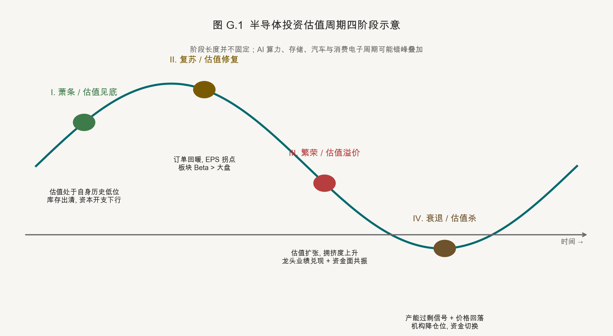

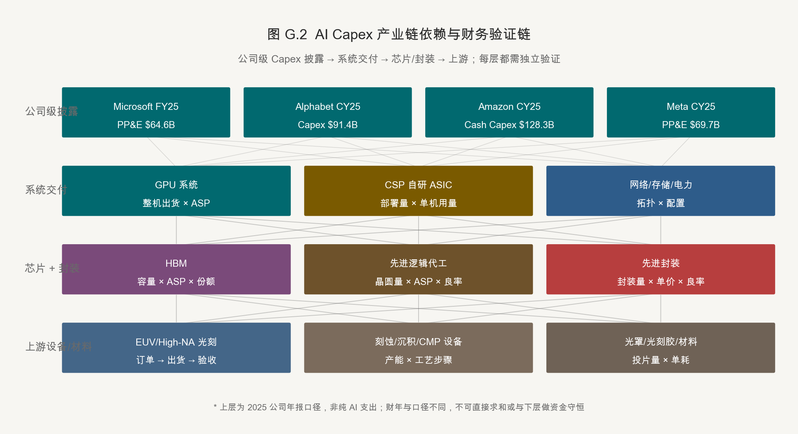

> **口径声明（截至 2026-09-04）**：本附录是研究方法，不是证券推荐。「事实」必须有可追溯来源与期间；「假设」必须可修改；「判断」必须写出证伪条件。估值倍数、产能时滞、BOM 占比与库存阈值都不是跨公司通用常数，不再使用无期间、无样本的「经验区间」作结论。

---

#### G.1 技术、供需与竞争格局的同一研究单元

##### G.1.1 先定义子赛道边界

研究对象应小到可建模，例如「介质刻蚀」「先进封装中的混合键合设备」或「HBM 封装测试」，而不是笼统的「半导体」。每个子赛道先回答五个边界问题：

1. 产品或服务究竟是什么，不包含什么？
2. 真实付费客户是谁，最终需求来自哪个终端？
3. 瓶颈是技术、产能、认证、专利、设备、人才，还是客户生态？
4. 主要竞争者是直接替代、间接替代，还是未来跨界者？
5. 哪个公开指标能在下个季度否定当前判断？

##### G.1.2 不把「技术领先」直接等同于「利润领先」

技术变现必须连续穿过七道门：

```text
性能/成本改善
  → 客户验证与导入
  → 有效需求（不是重复下单）
  → 可交付产能与良率
  → 份额、ASP 与产品结构
  → 收入确认、毛利与现金回收
  → 穿越周期的 ROIC 与估值
```

其中任一环节失败，都会出现「技术正确、但股东回报不一定正确」。因此研究报告必须同时写客户导入证据、供给扩张、价格传导和财务勾稽，不能只写路线图。

##### G.1.3 竞争对手的三层分类

| 类型 | 定义 | 半导体研究中的关键问题 |
|---|---|---|
| 直接竞争者 | 同一客户、同一任务、可比产品 | 谁在客户的同一认证清单中？同一工艺步骤能否双供？ |
| 间接替代者 | 同一预算、不同解决方案 | 更先进节点、Chiplet、先进封装或软件优化是否可以替代该环节？ |
| 未来竞争者 | 相邻技术跨界，或大客户自研 | 招聘、设备采购、试产线和标准组织参与是否已显示路线重叠？ |

市场份额只是结果。更有领先性的证据是客户认证数、新增工艺步骤、平台兼容性、服务收入占比、专利/工艺秘密、交付稳定性与切换成本。

---

#### G.2 AI Capex：先统一会计口径，再做产业链传导

##### G.2.1 2025 经审计基线与 2026 公司级指引

| 公司 | 披露期间 | 2025 已披露数（十亿美元） | 披露口径 | 2026 公司级指引 | 可比性提醒 |
|---|---|---:|---|---:|---|
| Microsoft | FY2025，截至 2025-06-30 | 64.551 | additions to property and equipment [G-1] | 约 175 十亿美元 [G-11] | 最新报告口径因未来数据中心租赁从融资租赁转向经营租赁而下调；剔除此分类影响，公司称投资预期不变 |
| Alphabet | CY2025 | 91.4 | capital expenditures [G-2] | 195–205 十亿美元 [G-16] | 2026 Q2 上调指引；主要是技术基础设施，但不等于纯 AI 芯片采购 |
| Meta | CY2025 | 69.69 | purchases of property and equipment [G-3] | 130–145 十亿美元 [G-12] | 2026 Q2 将指引由 125–145 收窄并抬高下限；包含服务器、数据中心和网络基础设施 |
| Amazon | CY2025 | 128.32 | cash capital expenditures，净额 [G-4] | 约 220 十亿美元（cash CapEx）[G-23] | 2026 Q2 电话会由约 200 上调；同时包含 AWS 与履约网络，不能全部归因于 AI |
| Oracle | FY2025，截至 2025-05-31 | 21.2 | cash used for capital expenditures [G-5] | 本表不填无同口径一手值的数 | 财年错位，需与后续披露滚动衔接 |

五个 2025 披露数机械相加约为 **3,751.6 亿美元**，但它只是不同财年、不同现金/应付/租赁口径的“规模感”，不应标注为「五大云厂商 AI Capex」。Microsoft、Alphabet、Meta 与 Amazon 四家最新 2026 公司级指引机械合计约为 **7,200–7,450 亿美元**（下限 175+195+130+220=720；上限 175+205+145+220=745）；这不包含 Oracle，且各公司定义、披露时点和非 AI 支出范围不同。尤其 Microsoft 最新数字包含租赁会计分类变化，机械合计不能直接用于同比，也不能当作半导体可获得市场。

##### G.2.2 2026 最新披露：分母变大，更要检查现金与利润

| 公司 | 最新披露期间 | 已披露指标 | 同期前瞻 / 财务含义 | 口径限制 |
|---|---|---|---|---|
| 微软（Microsoft） | FY2026 Q4 | 季度 Capex 41.0 十亿美元，其中现金 PP&E 35.8 十亿美元；经营现金流 55.4 十亿美元、FCF 19.6 十亿美元 [G-11] | 约三分之二 Capex 投向 CPU/GPU 等短寿命资产；CY2026 报告口径约 175 十亿美元，但公司称剔除租赁分类变化后投资预期不变 | 融资租赁计入 Capex、经营租赁不计入；财年与自然年仍错位，不能把 175 与旧口径直接比较 |
| Meta（脸书母公司） | CY2026 Q2 | Capex（含融资租赁本金）31.08 十亿美元 [G-12] | 全年指引收窄至 130–145 十亿美元，需求信号更强，但未来折旧和运营费用也需同步上修 | 包含租赁本金，不能与纯现金购建 PP&E 直接比较 |
| 亚马逊（Amazon） | 截至 2026 Q2 的 TTM | 购建 PP&E 净额 169.007 十亿美元；自由现金流为 -7.604 十亿美元 [G-13] | 公司将 2026 cash CapEx 由约 200 上调至约 220 十亿美元，称内存成本上升是上调原因 [G-23] | TTM 不是单季；公司级 cash CapEx 同时包含 AWS 与履约网络 |
| 台积电（TSMC） | CY2026 Q2 | 收入 40.20 十亿美元，毛利率 67.7%，营业利润率 60.3% [G-14] | Q3 收入指引 44.6–45.8 十亿美元、毛利率 65%–67%；可作为 AI 基础设施需求向制造端传导的交叉验证 | 台积电是供应链承接方，不应与云厂商 Capex 合计 |
| Alphabet（谷歌母公司） | CY2026 Q2 | 2026 Capex 指引上调至 195–205 十亿美元 [G-16] | 指引抬升意味着基础设施投入与后续折旧压力同步增加 | 公司级 Capex；不等于纯 AI、GPU 或半导体采购 |
| 甲骨文（Oracle） | FY2026，截至 2026-05-31 | GAAP Capex 55.663 十亿美元；经营现金流 31.977 十亿美元；公司口径 FCF -23.686 十亿美元 [G-17] | 资本开支显著超过经营现金流；折旧为 7.623 十亿美元，无形资产摊销另为 1.671 十亿美元 | 甲骨文另披露 Capex 净现金支出 47.726 十亿美元 [G-24]；公司 FCF 仍用 GAAP Capex 55.663 计算，两种口径不可混用 |
| 英伟达（NVIDIA） | FY2027 Q2，截至 2026-07-26 | 收入 96.221 十亿美元，其中数据中心 89.0 十亿美元；GAAP 毛利率 75.0%；经营现金流 24.077 十亿美元、公司口径 FCF 21.341 十亿美元 [G-25] | Q3 收入指引 108.0 十亿美元 ±2%，且未在指引中假设中国数据中心计算收入；Rubin 已由路线图进入公司自报量产阶段 | 单季净利润 59.688 十亿美元显著高于 CFO；应收与存货分别消耗 22.346 与 5.784 十亿美元经营现金，需继续复核回款、备货与产品切换，不能只看收入增速 |
| 博通（Broadcom） | FY2026 Q3，截至 2026-08-02 | 总收入 29.591 十亿美元；半导体解决方案 20.839 十亿美元；公司定义的 AI 半导体收入 16.7 十亿美元；CFO 14.197 十亿美元、公司口径 FCF 13.665 十亿美元 [G-27] | 公司预计 Q4 总收入约 34.8 十亿美元、AI 半导体收入约 21.7 十亿美元 | 总收入另含 8.752 十亿美元基础设施软件；AI 半导体指标覆盖定制加速器与网络，不是独立报告分部，不能与半导体解决方案收入重复相加 |
| 美满电子（Marvell） | FY2027 Q2，截至 2026-08-01 | 总收入 2.7393 十亿美元；数据中心收入 2.1715 十亿美元，占比 79%；GAAP 毛利率 53.1%；单季 CFO 0.6055 十亿美元 [G-28] | Q3 总收入指引 3.150 十亿美元 ±5%；谷歌（Google）定制产品协议的部分认股权证按每 0.5 十亿美元收入一档归属 [G-30] | 数据中心口径还含以太网、服务器、存储与 DCI；光互连初创公司 Celestial AI、PCIe/CXL 交换芯片公司 XConn 已并表，认股权证归属条件不是已承诺订单或已确认收入 |
| 新思科技（Synopsys） | FY2026 Q3，截至 2026-07-31 | 总收入 2.4768 十亿美元；Design Automation 2.0030 十亿美元、Design IP 0.4738 十亿美元；前九个月 CFO 2.2986 十亿美元 [G-29] | 期末 backlog 约 10.9 十亿美元，其中约 1.9 十亿美元为以后再确定产品与数量的 FSA 承诺 | 总收入同比增量 0.7371 十亿美元中有 0.6222 十亿美元来自安似科技（Ansys）完整季度并表差异；Design Automation 也包含安似科技，不能当作纯 EDA 有机增速 |

这些披露共同支持“AI 基础设施投入继续上行”，但也同时抬高折旧、现金消耗与执行风险。研究结论只有在供应商收入、毛利和现金回收同步改善时才算闭环；若只是 Capex 扩大而 FCF、在建工程周转或供应商库存恶化，不能把投入本身当作价值创造。

##### G.2.3 2026 年 8 月增量信号：订单、授权与收入分开

| 日期 / 公司 | 已披露事实 | 可用于验证什么 | 不可外推为何物 |
|---|---|---|---|
| 2026-08-10 TSMC | 7 月营收 4,675.80 亿新台币，同比增长 44.7%；1–7 月累计 28,720.64 亿新台币，同比增长 37.0% [G-19] | 制造端收入景气的高频交叉验证 | 不含节点拆分，不能单独证明 N2 爬坡或 AI 占比 |
| 2026-08-11 TSMC | 董事会批准约 294.425 亿美元资本预算拨款 [G-20] | 项目授权与未来产能投入 | 不是年度 Capex 指引，也不是当期现金流出 |
| 2026-08-12 Cisco | FY2026 超大规模客户 AI 基础设施订单 93 亿美元、相关收入约 40 亿美元；公司预计 FY2027 相关收入约 75 亿美元 [G-21] | 网络层需求与订单到收入的桥接 | 订单不等于收入，更不等于半导体收入 |
| 2026-08-12 Coherent | FY2026 营收 71.18 亿美元，同比增长 22.5%；FY2027 Q1 指引 22–24 亿美元 [G-22] | 光通信/材料供应商收入与指引 | 不能由总收入直接推导 CPO 渗透率 |
| 2026-08-13 Applied Materials | FY2026 Q3 营收 91.15 亿美元；经营现金流 30.37 亿、Capex 7.07 亿、公司口径 FCF 23.30 亿美元 [G-18] | 设备需求、现金转化与下一季指引 | 设备收入不证明某一 HBM 产品已获认证或某节点 HVM |
| 2026-08-20 Micron | 计划未来十年为 Micron Research Labs 投入 100 亿美元，研究范围包括存储、计算架构、先进封装与未来制造 [G-26] | 长周期研发方向与产业生态投入 | 是跨十年的计划金额，不是当期 Capex、产能、现金流出或量产承诺 |

##### G.2.4 Capex 传导的可审计公式

不再从「云厂商 Capex 总额」直接乘一个固定 BOM 占比。对每个环节分别建模：

```text
新增可交付机柜 = 新增机房容量 × 上架率 × 单机柜功率适配
加速器需求 = 新增机柜 × 单机柜加速器数 + 替换量
某供应商收入 = 系统出货量 × 单系统用量 × 供应份额 × ASP × 当期确认比例
自由现金流 = 经营现金流 - 可比口径资本开支
```

需单独验证的变量包括：自研 ASIC 与外购 GPU 的混合比、加速器每机柜数量、HBM 容量/代际、网络拓扑、光铜比、电力与液冷配置、工程进度、客户验收、供应商份额和收入确认政策。若缺少一手披露，就应写「未单独披露」或给出区间与误差来源，而不是填一个精确单点。

##### G.2.5 防止重复计算

| 常见错误 | 为什么错 | 修正方式 |
|---|---|---|
| 把云厂商 Capex 全部当作 GPU 采购 | 包含建筑、网络、存储、非 AI 业务，且可能有租赁 | 按公司披露的资产类别拆分，未披露部分保留为未知 |
| 同时加总整机价格与 GPU/HBM/PCB 价格 | 上下游产值被重复累加 | 区分最终销售额、中间品收入与增加值，只选一种口径汇总 |
| 把下单当成当期收入 | 排产、交付、验收与开票存在时滞 | 每季维护 backlog → shipment → acceptance → revenue 桥表 |
| 把扩产当成利润增长 | 新产能会先带来在建工程和折旧，爬坡期良率可能压低毛利 | 同时建模投产节点、稼动率、良率、折旧与现金支出 |

---

#### G.3 三张表勾稽：产业逻辑如何落到会计科目

##### G.3.1 产业环节与财务报表的对照

| 产业问题 | 利润表 | 资产负债表 | 现金流量表 | 必看附注 |
|---|---|---|---|---|
| 需求是否真实 | 收入、ASP、产品 Mix | 应收账款、合同资产/负债 | 销售回款与 CFO | 客户集中度、收入确认时点 |
| 供给是否过剩 | 毛利率、存货减值 | 原材料/在制品/产成品 | 采购现金支出 | 存货计价、净可变现价值、长约与预付款 |
| 扩产是否有回报 | 折旧、爬坡成本 | PP&E、在建工程、资产减值 | 购建 PP&E 现金支出 | 投产时点、使用年限、融资租赁、政府补助 |
| 技术投入是否变现 | R&D、营业利润 | 开发支出/无形资产 | 研发相关现金流分类 | 研究阶段与开发阶段、摊销与减值 |
| 生态壁垒是否收到现金 | 订阅、授权、版税收入 | 递延收入/合同负债 | 预收现金 | 履约义务、使用量版税、剩余履约义务 |

存货在 IAS 2 下按成本与可变现净值孰低计量，减值计入当期损益 [G-6]。PP&E 的使用年限与折旧方法属于管理层估计，且应至少在每个财年末复核；技术淘汰会影响使用年限 [G-7]。IAS 38 要求研究支出费用化，只有满足特定条件的开发支出才确认为无形资产 [G-8]。EDA/IP 的授权、订阅与版税还要按 IFRS 15/对应的当地准则识别履约义务和确认时点 [G-9]。因此，跨准则比较研发率、毛利率或 FCF 时，必须先重述口径。

##### G.3.2 五组实用勾稽

1. **收入—应收—现金**：收入增速显著高于客户回款，同时 DSO 上行，要检查验收节点、信用政策与客户质量。
2. **出货—库存—毛利**：出货放缓但在制品和产成品继续增长，要区分备货、产品转代和需求透支。
3. **Capex—在建工程—折旧**：现金已支出但资产未转固时，当期利润尚未承受全部折旧；必须把投产时点和爬坡良率放入预测。
4. **研发—无形资产—营业利润**：研发资本化率提高会抬高当期利润，但未来会增加摊销和减值风险。
5. **净利润—CFO—FCF**：长期 CFO 低于净利润，需要检查应收、存货、预付款、供应商融资与一次性营运资本变化。

台积电 2025 年 20-F 提供了一个可勾稽示例：12 英寸等效晶圆出货约 1,500 万片，高于 2024 年的约 1,300 万片；毛利率从 56.1% 升至 59.9%，公司将主因归结为更高的稼动率和成本改善，同期存货净损失约为 21.26 亿新台币 [G-10]。这个例子说明，毛利变化应拆成出货、稼动率、成本、产品结构、汇率和存货损失，而不是只用「先进制程景气」一句话概括。

##### G.3.3 会计与披露红旗

| 红旗 | 可能原因 | 下一步核查 |
|---|---|---|
| 收入高增，应收和合同资产更快增长 | 验收放宽、回款延长或客户质量下降 | 查客户集中度、DSO、期后回款和收入确认政策 |
| 存货天数上行，但减值率下降 | 对降价或转代风险假设过于乐观 | 查在制品/产成品结构、NRV 假设和期后售价 |
| 折旧年限延长，当期利润改善 | 会计估计变更贡献而非经营改善 | 量化年限变更对折旧、毛利和 EPS 的影响 |
| 研发费用率下降，开发支出激增 | 费用转为资产 | 统一费用化口径重算营业利润 |
| EBITDA 增长但 FCF 持续下降 | 扩产、营运资本占用或租赁/应付设备口径差异 | 用现金流量表重建可比 FCF，并列示未付 PP&E 与租赁 |

---

#### G.4 驱动建模与估值：按商业模式，不按「半导体」一把尺子

##### G.4.1 不同环节的驱动与估值交叉检验

| 环节 | 收入驱动 | 盈利/现金驱动 | 主估值方法 | 交叉检验 |
|---|---|---|---|---|
| EDA / IP | 订阅 + 期限授权 + 使用量/销售版税 | 续约、合同负债、RPO、率先费用化的 R&D | DCF、EV/Revenue、P/E | FCF 转化、股权激励稀释、订阅与版税占比 |
| Fabless | 出货量 × ASP × Mix | 代工/封装成本、毛利、库存、预付产能、R&D | 分部 DCF、P/E、EV/Revenue | 库存减值、客户集中度、采购承诺、稀释 |
| Foundry / IDM | 节点别晶圆量 × ASP | 稼动率、良率、折旧、电力、汇率、Capex | 正常化 EV/EBITDA、P/B-ROE、DCF | ROIC、FCF、中周期毛利、在建工程 |
| 设备 | 订单 → 出货 → 验收 → 收入 | 产品 Mix、服务收入、产能、客户集中度 | 正常化 P/E、EV/EBITDA、DCF | backlog 质量、取消条款、预收款、服务毛利 |
| 材料 | 出货量 × ASP × 通过认证的份额 | 原料成本、良率、新客户爬坡、运输与存货 | P/E、EV/EBITDA、DCF | 单客户份额、认证数量与收入贡献是否对应 |
| OSAT | 产能 × 利用率 × 工艺别单价 | 先进封装 Mix、良率、折旧、客户议价 | 正常化 EV/EBITDA、P/E、P/B | 扩产后稼动率、FCF、客户集中度 |

##### G.4.2 三个必做的正常化

1. **正常化盈利**：周期高点的 P/E 可能因分母过高而虚低；周期底部 P/E 可能无意义。应用节点/产品结构、中周期稼动率、正常存货损失和正常税率重建盈利。
2. **正常化资产与 Capex**：EV/EBITDA 并没有消除折旧和维持性 Capex 的经济成本。对晶圆代工和 OSAT，必须同看 EV/EBIT、ROIC 和 FCF。
3. **正常化准则差异**：统一研发资本化、股权激励、租赁、政府补助、汇率与非经常项，再做同业比较。

常用勾稽公式：

```text
ROIC = NOPAT / 平均投入资本
UFCF = EBIT × (1 - 税率) + 折旧摊销 - Capex - 净营运资本增加
P/B ≈ (ROE - g) / (r - g)
```

P/B-ROE 公式只在清洁盈余、稳定 ROE、增长与留存政策匹配的条件下才有解释力。DCF 必须同时给出收入增速/利润率、WACC/终值两组敏感性，并披露终值占企业价值的比例。

##### G.4.3 情景不是乐观/中性/悲观形容词

| 变量 | Bear | Base | Bull | 必填证据 |
|---|---|---|---|---|
| 真实需求 | 客户推迟、去库 | 按已披露产品节奏 | 新客户/新应用导入 | 订单、客户 Capex、出货或认证 |
| 供给 | 扩产快于需求 | 按已宣布投产 | 良率/设备限制导致供给紧 | 产能、在建工程、设备交付、良率 |
| 价格与 Mix | ASP 下行、低端 Mix 提升 | 按合同/指引 | 高端产品占比提升 | 合约价、产品收入、公司指引 |
| 盈利率 | 稼动率低、爬坡损失高 | 成本改善与折旧按计划 | 价格/份额/良率共振 | 折旧、稼动率、存货损失、汇率 |
| 估值 | 正常化盈利与折现率压力 | 同历史/同业可比口径 | 只在结构性 ROIC 上修时给溢价 | 业绩期间、准则调整、市值日期、净现金/负债 |

---

#### G.5 可复用的子赛道研究卡

##### G.5.1 十二个必填字段

| 字段 | 要回答的问题 | 最低证据要求 |
|---|---|---|
| 1. 边界 | 产品、工艺步骤、客户和替代品是什么？ | 标准、产品页、客户认证口径 |
| 2. 需求 | 终端量、单机用量、渗透率如何？ | 三者分开，不只引用 TAM |
| 3. 供给 | 存量产能、新增产能、良率与投产节奏如何？ | 厂商公告、环评/设备采购、客户验证 |
| 4. 供需平衡 | 未来两年是紧、平衡还是过剩？ | 同一单位下的需求与可交付供给 |
| 5. 技术壁垒 | 性能、良率、可靠性、软件生态、认证谁更难复制？ | 可量化的客户标准或量产证据 |
| 6. 竞争 | 直接、间接和未来竞争者分别是谁？ | 客户采购清单、份额、产品路线图 |
| 7. 本土化 | 替代的是不是同一性能/节点/客户层级？ | 将样品、小批、量产、收入占比分开 |
| 8. 公司暴露 | 该子赛道占公司收入与利润多少？ | 未单独披露就明说，不用总公司数替代 |
| 9. 财报映射 | 驱动先落到哪个科目？ | 收入、毛利、库存、PP&E、CFO 的勾稽 |
| 10. 估值 | 用什么正常化盈利和方法？ | 同业/历史口径、准则调整、敏感性 |
| 11. 非共识 | 市场可能高估或低估了哪个变量？ | 写出机制，不只写目标价差异 |
| 12. 证伪 | 什么数据出现就必须降级/推翻判断？ | 指标、阈值/方向、复盘日期和责任来源 |

##### G.5.2 事实—假设—判断（F/A/J）分层

| 类别 | 写法 | 例子 |
|---|---|---|
| Fact（事实） | 写期间、单位、口径、一手来源 | 「公司在 FY2025 披露购建 PP&E 现金支出为…」 |
| Assumption（假设） | 写区间、理由、敏感性与更新触发器 | 「基准假设客户验收时点为下半年，若推迟一季则…」 |
| Judgment（判断） | 写逻辑链、对立解释和证伪条件 | 「我们判断瓶颈在良率而非设备数；若连续两期单位成本下降且交付达标，则推翻」 |

##### G.5.3 信源分级与更新纪律

- **A 级（一手）**：监管文件、经审计年报/10-K/20-F、会计准则、技术标准、同行评审论文。
- **B 级（强二手）**：公司法说会、官方产品页、官方演讲、可复核的拆解和行业机构数据。
- **C 级（线索）**：可信媒体、供应链调研、招聘与展会信息。只能作为待验证线索，不单独支撑高冲击数字。

每张研究卡记录 `as_of`、数据期间、货币/单位、原始链接、会计口径、估算公式、不确定性、下次复盘日期。新财报只更新事实层；假设和判断必须显式重算，不让旧结论惯性留存。

---

#### G.6 参考文献

[G-1] Microsoft. *Microsoft 2025 Annual Report: Consolidated Cash Flows and Note 6—Property and Equipment*. Microsoft Investor Relations. 2025. <https://www.microsoft.com/investor/reports/ar25/index.html>

[G-2] Alphabet. *2025 Q4 Earnings Call: 2025 CapEx Actual and 2026 CapEx Outlook*. Alphabet Investor Relations. 2026-02. <https://abc.xyz/investor/events/event-details/2026/2025-Q4-Earnings-Call-2026-Dr_C033hS6/default.aspx>

[G-3] Meta Platforms. *Annual Report on Form 10-K for the Year Ended December 31, 2025*. U.S. Securities and Exchange Commission. 2026. <https://www.sec.gov/Archives/edgar/data/1326801/000162828026025534/meta-12312025x10kars.htm>

[G-4] Amazon.com. *Annual Report on Form 10-K for the Year Ended December 31, 2025*. U.S. Securities and Exchange Commission. 2026. <https://www.sec.gov/Archives/edgar/data/1018724/000101872426000004/amzn-20251231.htm>

[G-5] Oracle. *Annual Report on Form 10-K for the Fiscal Year Ended May 31, 2025*. U.S. Securities and Exchange Commission. 2025. <https://www.sec.gov/Archives/edgar/data/1341439/000095017025087926/orcl-20250531.htm>

[G-6] IFRS Foundation. *IAS 2 Inventories*. 持续更新. <https://www.ifrs.org/issued-standards/list-of-standards/ias-2-inventories/>

[G-7] IFRS Foundation. *IAS 16 Property, Plant and Equipment*. 持续更新. <https://www.ifrs.org/issued-standards/list-of-standards/ias-16-property-plant-and-equipment/>

[G-8] IFRS Foundation. *IAS 38 Intangible Assets*. 持续更新. <https://www.ifrs.org/issued-standards/list-of-standards/ias-38-intangible-assets/>

[G-9] IFRS Foundation. *IFRS 15 Revenue from Contracts with Customers*. 持续更新. <https://www.ifrs.org/issued-standards/list-of-standards/ifrs-15-revenue-from-contracts-with-customers/>

[G-10] Taiwan Semiconductor Manufacturing Company. *Annual Report on Form 20-F for the Year Ended December 31, 2025*. U.S. Securities and Exchange Commission. 2026. <https://www.sec.gov/Archives/edgar/data/1046179/000162828026025362/tsm-20251231.htm>

[G-11] Microsoft. *FY 2026 Fourth Quarter Earnings Conference Call*. Microsoft Investor Relations. 2026-07-29. <https://www.microsoft.com/en-us/investor/events/fy-2026/earnings-fy-2026-q4>

[G-12] Meta Platforms. *Meta Reports Second Quarter 2026 Results*. Meta Investor Relations. 2026. <https://investor.atmeta.com/investor-news/press-release-details/2026/Meta-Reports-Second-Quarter-2026-Results/default.aspx>

[G-13] Amazon.com. *Amazon.com Announces Second Quarter Results*. Amazon Investor Relations. 2026. <https://ir.aboutamazon.com/news-release/news-release-details/2026/Amazon-com-Announces-Second-Quarter-Results/default.aspx>

[G-14] Taiwan Semiconductor Manufacturing Company. *Second Quarter 2026 Results*. TSMC Investor Relations. 2026. <https://investor.tsmc.com/english/quarterly-results/2026/q2>

[G-15] Amazon.com. *Amazon.com Announces Fourth Quarter Results and 2026 Capital Expenditure Outlook*. Amazon Investor Relations. 2026-02-05. <https://ir.aboutamazon.com/news-release/news-release-details/2026/Amazon-com-Announces-Fourth-Quarter-Results/default.aspx>

[G-16] Alphabet. *Q2 2026 Earnings Call and Transcript: 2026 Capital Expenditure Outlook*. Alphabet Investor Relations. 2026-07-22. <https://abc.xyz/investor/events/event-details/2026/2026-Q2-Earnings-Call-2026-GgTAq7Is0z/default.aspx> <https://s206.q4cdn.com/479360582/files/doc_events/2026/Jul/22/2026_Q2_Earnings_Transcript.pdf>

[G-17] Oracle. *Annual Report on Form 10-K for the Fiscal Year Ended May 31, 2026*. U.S. Securities and Exchange Commission. 2026. <https://www.sec.gov/Archives/edgar/data/1341439/000119312526277521/orcl-20260531.htm>

[G-18] Applied Materials. *Third Quarter Fiscal 2026 Earnings Release*. U.S. Securities and Exchange Commission. 2026-08-13. <https://www.sec.gov/Archives/edgar/data/6951/000162828026056699/exhibit991q32026earningsre.htm>

[G-19] Taiwan Semiconductor Manufacturing Company. *July 2026 Revenue Report*. U.S. Securities and Exchange Commission. 2026-08-10. <https://www.sec.gov/Archives/edgar/data/1046179/000104617926000471/tsm-revenue20260810.htm>

[G-20] Taiwan Semiconductor Manufacturing Company. *Board Resolutions and Capital Budget*. U.S. Securities and Exchange Commission. 2026-08-11. <https://www.sec.gov/Archives/edgar/data/1046179/000104617926000536/tsm-boardx20260811.htm>

[G-21] Cisco Systems. *Fourth Quarter and Fiscal Year 2026 Results*. U.S. Securities and Exchange Commission. 2026-08-12. <https://www.sec.gov/Archives/edgar/data/858877/000085887726000106/exhibit991pressrelease-q4f.htm>

[G-22] Coherent. *Fourth Quarter and Fiscal Year 2026 Results*. U.S. Securities and Exchange Commission. 2026-08-12. <https://www.sec.gov/Archives/edgar/data/820318/000119312526346860/d128030dex991.htm>

[G-23] Amazon.com. *Q2 2026 Earnings Conference Call (official audio; 2026 cash CapEx outlook at approximately 00:12:58)*. Amazon Investor Relations. 2026-07-30. <https://ir.aboutamazon.com/events/event-details/default.aspx> <https://ir.aboutamazon.com/files/doc_earnings/2026/q2/Amazon-Quarterly-Earnings-Report-Q2-2026-Full-Call-v1.mp3>

[G-24] Oracle. *Oracle Announces Record Q4 and FY2026 Results Driven by Cloud Infrastructure and Cloud Applications*. U.S. Securities and Exchange Commission, Exhibit 99.1. 2026. <https://www.sec.gov/Archives/edgar/data/1341439/000119312526265848/orcl-ex99_1.htm>

[G-25] NVIDIA. *NVIDIA Announces Financial Results for Second Quarter Fiscal 2027*. NVIDIA Newsroom. 2026-08-26. <https://nvidianews.nvidia.com/news/nvidia-announces-financial-results-for-second-quarter-fiscal-2027>

[G-26] Micron Technology. *Micron Unveils Micron Research Labs, a U.S.-Based Long-Horizon Innovation Hub to Shape the Future of Memory and AI*. Micron Investor Relations. 2026-08-20. <https://investors.micron.com/news/press-release/2026/Micron-Unveils-Micron-Research-Labs-a-U-S--Based-Long-Horizon-Innovation-Hub-to-Shape-the-Future-of-Memory-and-AI/default.aspx>

[G-27] Broadcom. *Third Quarter Fiscal Year 2026 Financial Results*. U.S. Securities and Exchange Commission, Exhibit 99.1. 2026-09-02. <https://www.sec.gov/Archives/edgar/data/1730168/000173016826000076/avgo-08022026x8kxex99.htm>

[G-28] Marvell Technology. *Quarterly Report on Form 10-Q for the Quarter Ended August 1, 2026*. U.S. Securities and Exchange Commission. 2026-08-28. <https://www.sec.gov/Archives/edgar/data/1835632/000183563226000025/mrvl-20260801.htm>

[G-29] Synopsys. *Quarterly Report on Form 10-Q for the Quarter Ended July 31, 2026*. U.S. Securities and Exchange Commission. 2026-08-26. <https://www.sec.gov/Archives/edgar/data/883241/000088324126000025/snps-20260731.htm>

[G-30] Marvell Technology. *Current Report on Form 8-K: Commercial Agreement with Google*. U.S. Securities and Exchange Commission. 2026-08-19. <https://www.sec.gov/Archives/edgar/data/1835632/000119312526356217/d412696d8k.htm>

---

### 附录 H　关键事实与信源说明

> 本附录对报告中高冲击事实的来源与证据角色做系统标注。公司公告、监管文件、标准和作者预印本都可是一手来源，但“一手”不等于已独立验证；公司目标、样品、客户认证、商业出货与财务兑现必须分开。

| 编号 | 事实陈述 | 数字 / 表述 | 信源 | 等级 | 备注 |
|---|---|---|---|---|---|
| H-01 | EDA 国产化率 | <15% | SemiAnalysis / Synopsys 投资者日 | 二手 | 数字模拟工具国产渗透率差异较大 |
| H-02 | 光刻设备国产化率 | <5% | SEMI / 国内光刻机厂商披露 | 二手 | DUV 仍处验证阶段，EUV 几乎为零 |
| H-03 | 前道设备国产化率综合 | ~25% | SEMI World Fab Watch | 二手 | 刻蚀 / PECVD 较高，量测较低 |
| H-04 | 半导体材料国产化率综合 | ~35% | CSIA / 中国半导体行业协会 | 二手 | 硅片、电子特气提升较快 |
| H-05 | 中国大陆量产先进制程节点 | 7nm 等效 | TechInsights Kirin 9000S 拆解 | 一手（拆解） | Mate 60 Pro 实物分析支撑 |
| H-06 | CoWoS 月产能（2024）| ~35K wafers/月 | TrendForce / TSMC 法说会 | 二手 | 2025 年底翻倍预期 |
| H-07 | HBM 全球份额 | SK Hynix ~50% / Samsung ~35% / Micron ~15% | TrendForce | 二手 | 季度波动，Micron 上升中 |
| H-08 | HBM 单颗价格 | 无统一可审计单点 | 厂商财报 / 合约与行业跟踪 | 口径说明 | 代际、容量、客户合同与披露期差异很大；按 Mix、合约价与收入验证 |
| H-09 | 1.6T 光模块量产时间 | 2025-2026 | 主要光模块厂商公告 | 二手 | 客户切换节奏可能延后 |
| H-10 | CPO 商用时间 | 2026-2028（争议大）| 主要芯片厂商公开路线图 | 二手 | 高度不确定 |
| H-11 | 五家公司 2025 已披露 Capex/PP&E 口径机械合计；四家公司 2026 指引机械合计 | 约 3,751.6 亿美元；约 7,200–7,450 亿美元 | Microsoft / Alphabet / Meta / Amazon / Oracle 年报、最新财报与附录 G 逐项表 | 一手 + 汇总 | 混合财年且含非 AI 支出；Microsoft 还受租赁分类变化影响，均不能标注为“AI Capex”或半导体 TAM |
| H-12 | 华为韬（τ）定律披露 | 2026-05-25 ISCAS 主旨演讲；ChinaXiv V2 预印本 2026-07 更新 | 华为 Newsroom [36-17] + ChinaXiv [36-18] | 公司/作者一手 | 预印本未正式同行评审；不是独立性能验证 |
| H-13 | 韬定律产品路线主张 | 2026 秋季麒麟应用 LogicFolding；2031 年达 1.4nm 等效密度 | 华为官方公告 / 公司演讲 | 公司目标 | 路线与量产节奏待产品发布、客户采用和独立拆解验证 |
| H-14 | LogicFolding 报告结果 | 晶体管密度 +55%、能效 +41%、最大时钟 +13% | 华为 / 作者预印本 [36-17] [36-18] | 作者研究主张 | 量产样品、测试方法与第三方复现尚待公开 |
| H-15 | UCIe 带宽密度 | 1.0: 13.3 Gbps/mm；2.0: 40 Gbps/mm | UCIe 联盟规范 | 一手 | 标准持续演进 |
| H-16 | CXL 标准版本 | CXL 3.1 已发布；4.0 在路线 | CXL Consortium | 一手 | 商用落地滞后于标准 |
| H-17 | 美国 BIS 出口管制演进 | 2022/2023/2024 扩围；2025 AI Diffusion Rule 撤回；2026 特定芯片改为逐案审查 | BIS / Federal Register [36-19]–[36-22] | 一手 | 不是线性收紧：全球分层规则撤回，中国与最终用途/所有权管制延续 |
| H-18 | 大基金三期规模 | 3440 亿元 | 国务院 2024-05 公告 | 一手 | 投资节奏待披露 |
| H-19 | EUV 单台机型价格 | NXE:3800E ~$220M；EXE:5600 ~$380M | ASML 投资者披露 | 一手 | 缓慢上升 |
| H-20 | 全球晶圆代工份额 | 台积电 62% / 三星 11% / 国内头部代工厂 6% / 联电 5% / GlobalFoundries 5% | TrendForce | 二手 | 季度波动，纯代工口径 |
| H-21 | High-NA EUV 平台进度 | 2025 年末累计交付 8 套、6 套运行；全年曝光超过 40 万片晶圆 | ASML 2026 AGM [9-13] / [F-67] | 一手 | ASML 目标 2026 年末满足 HVM 要求、2027–2028 年客户插入；不是客户量产证明 |
| H-22 | HBM4 / HBM4E 工程进度 | 三家厂商均自报 HBM4 量产或高量出货；Samsung 与 SK hynix 已送出 12 层 48GB HBM4E 样品 | 厂商 Newsroom [F-68] [F-72]–[F-75] | 公司一手 | 送样不等于资格认证；量产/出货也不证明特定客户规模、成熟良率或收入占比 |
| H-23 | TSMC N2 与 2026 Q2 财务进度 | N2 于 2025 Q4 进入 HVM；2026 Q2 收入 402 亿美元、毛利率 67.7% | TSMC 年报与 Q2 业绩 [F-66] / [G-14] | 一手 | N2P/A16 H2 2026、A14 2028 为公司目标；财务强劲不单独证明具体节点贡献 |
| H-24 | BIS 2026 当前政策边界 | 特定 H200/MI325X 交易改为逐案审查；D:5/澳门总部或最终母公司规则仍可能跨地域触发许可 | BIS / Federal Register [36-21] [36-22] | 一手 | “逐案审查”不是自动批准；实际交易仍需按物项、主体、目的地和最终用途判断 |
| H-25 | Oracle FY2026 现金流 | GAAP Capex 556.63 亿美元；CFO 319.77 亿美元；公司口径 FCF -236.86 亿美元 | Oracle 10-K 与业绩公告 [G-17] [G-24] | 监管一手 | “Capex 净现金支出”477.26 亿美元是补充口径，不与公司 FCF 公式混用 |
| H-26 | 英特尔（Intel）/ 谷歌（Google）加速器状态 | Falcon Shores 取消商业化；Ironwood 于 2026-03-31 GA | Intel 10-K [F-76] / Google Cloud [F-77] | 监管/公司一手 | 路线取消与新平台 GA 是不同事件；GA 不等于无限供应 |
| H-27 | 英伟达（NVIDIA）FY2027 Q2 与 Rubin 证据状态 | 收入 962.21 亿美元；数据中心 890 亿美元；CFO 240.77 亿美元；公司称 Rubin 进入全量生产、五家合作伙伴已有机架运行 | NVIDIA FY2027 Q2 披露 [F-82] [G-25] | 公司一手 | “全量生产 + 机架运行”不单独证明客户验收、供货规模、良率或 Rubin 分产品收入；CFO 显著低于净利润，继续跟踪应收和存货 |
| H-28 | Groq 3 LPX / Intel Hot Chips 2026 | Groq 3 LPX 公司自报全量生产；Intel 披露 Diamond Rapids、Crescent Island、Wildcat Lake 架构 | NVIDIA [F-84] / Intel [F-83] | 公司一手 | “全量生产”与“计划采用”分开；架构规格不是量产、客户验收或独立性能验证 |
| H-29 | Micron Research Labs 投入计划 | 未来十年计划投入 100 亿美元，2027 年拟开工 Boise 研究设施 | Micron [F-85] [G-26] | 公司目标 | 长周期计划不是当期 Capex、产能、现金流出或商业化结果 |
| H-30 | 博通（Broadcom）FY2026 Q3 AI 半导体兑现 | 公司定义的 AI 半导体收入 167 亿美元；半导体解决方案收入 208.39 亿美元；Q4 AI 半导体收入指引 217 亿美元 | Broadcom SEC 披露 [F-86] [G-27] | 监管/公司一手 | AI 半导体涵盖定制加速器与网络且不是独立报告分部；不能与半导体解决方案重复相加，指引也不是已实现收入 |
| H-31 | 美满电子（Marvell）FY2027 Q2 与谷歌（Google）定制产品协议 | 数据中心收入 21.715 亿美元、占比 79%；四名客户占应收 72%；部分认股权证按每 5 亿美元收入一档归属 | Marvell 10-Q / 8-K [F-87] [F-89] [G-28] [G-30] | 监管一手 | 数据中心不等于纯 AI；客户集中度、并表与回款需同看，认股权证条件不是已承诺采购或已确认收入 |
| H-32 | 新思科技（Synopsys）FY2026 Q3 收入拆分 | 总收入 24.768 亿美元；Design Automation 20.030 亿美元、Design IP 4.738 亿美元；总收入同比增量中 6.222 亿美元来自安似科技（Ansys）比较差异 | Synopsys 10-Q [F-88] [G-29] | 监管一手 | Design Automation 包含安似科技；不能把分部 53% 增长写成纯 EDA 有机增速，backlog 也不等于短期收入 |

**审计说明**：

1. 一手来源按角色继续区分监管事实、公司披露、公司目标、作者研究主张与标准；不能仅凭“一手”标签升级证据强度。
2. 二手来源可用于线索和交叉验证，仍可能存在口径差异，不能单独支撑高冲击结论。
3. 任何引用本报告具体数字的研究判断，建议同时核查本附录对应条目并补充最新一手来源。
4. H-12 至 H-14 建议每季度复核产品、独立测试与论文评审状态；H-21 至 H-32 随季度财报、客户认证、云服务状态、研发设施落地和 BIS 新规滚动复核。

---

## 修改纪要 Changelog

> 同一日内多次更新合并为一个版本号。

### v1.13-public · 2026-09-04
- 补齐正文、维护快照、附录财务表中海外公司的常用中文名；Celestial AI 与 XConn 因无稳定中文品牌名，仅补充业务身份，不自造译名
- 将新思科技 Design IP 收入更正为 4.738 亿美元（0.4738 十亿美元），并修正 SK siltron 拼写及“环球晶圆（GlobalWafers）”公司映射
- 以 SEC 文件补入博通（Broadcom）FY2026 Q3：拆开总收入、半导体解决方案、公司定义的 AI 半导体收入与基础设施软件，避免重复计算，并记录 Q4 指引仍属前瞻
- 补入美满电子（Marvell）FY2027 Q2 的数据中心收入、毛利、经营现金流、并表范围与客户集中度；将谷歌（Google）定制产品协议和认股权证归属条件与已承诺订单、客户验收、收入确认分开
- 新增新思科技（Synopsys）FY2026 Q3 拆分，指出 Design Automation 包含安似科技（Ansys），不能把并表驱动的分部增速直接写成纯 EDA 有机增长
- 填补第 23.6 节空白，重构新增技术段落的叙事顺序，保留原有结构、事实强度和公开版边界
- 将维护快照、附录 B/F/G/H、README、自动测试和 PDF 同步至 2026-09-04

### v1.12-public · 2026-08-27
- 纳入 NVIDIA FY2027 Q2：收入、数据中心收入、毛利率、经营现金流与自由现金流同表勾稽，并把应收、存货的现金占用列为后续复核点
- 将 Vera Rubin 从“路线图目标”更新为“公司自报全量生产 + 五家合作伙伴已有机架运行”，同时保留客户验收、供货规模、良率与分产品收入边界
- 更新 Groq 3 LPX 全量生产与首批采用状态、Spectrum-6 可插拔/CPO 交付信号，明确“到货/计划采用”不等于全面规模商用
- 纳入 Intel Hot Chips 2026 的 Diamond Rapids、Crescent Island、Wildcat Lake 架构与 UCIe/Foveros Direct 进展，标注为架构发布而非 HVM
- 补充 Micron Research Labs 未来十年 100 亿美元计划，区分长期研发承诺、当期 Capex、产能与商业化结果
- 将维护快照、附录 B/F/G/H、README、自动测试和 PDF 同步至 2026-08-27

### v1.11-public · 2026-08-14
- 回填 Samsung、Micron 与 SK hynix 的 HBM4 量产/出货状态及 Samsung、SK hynix 的 HBM4E 样品，严格区分公司披露、送样、资格认证与量产收入
- 修正 Falcon Shores 已取消商业化、Ironwood 已 GA、Mac Studio 芯片组合、Gaudi 3 引擎数量、Samsung SF2Z 与 Tata/PSMC 项目等硬事实
- 将 Alphabet 2026 Capex 指引更新至 1,950–2,050 亿美元，纳入 Amazon Q2 将 cash CapEx 上调至约 2,200 亿美元、Microsoft 因租赁分类变化将报告口径调整至约 1,750 亿美元的披露；四家公司机械合计更新为 7,200–7,450 亿美元，并加入 Oracle FY2026 与 8 月设备/制造/网络/光通信增量披露
- 重写 CPO 功耗示例，修正 1000 端口差额为 21kW、全年约 184MWh，并删除固定 PUE/金额收益外推
- 清理公开版证券代码、括号 ticker、仓位/配置/确定性收益措辞与非公开信息表述；新增自动回归测试
- 更新 HBM、先进制程与光刻路线图，重建 PDF 并复核目录、字体、链接、图像与页面边界

### v1.10-public · 2026-08-09
- 以 2026 年公司与监管一手文件更新 TSMC N2/N2P/A16/A14、Intel 18A/18A-P、ASML High-NA 与 Samsung 2nm 协作进度
- 新增 SK hynix 12 层 HBM4E 客户样品与 JEDEC SPHBM4 标准，明确“送样 ≠ 认证 ≠ 高量产制造”
- 重写附录 B 的先进制程与存储路线图，使用 [F] 已发生事实、[T] 公司目标、[A] 研究假设三级证据状态，并清理当时扫描发现的无来源季度预测
- 更新 Microsoft、Meta、Amazon 与 TSMC 的 2026 最新财务披露；四家云厂商公司级 Capex 指引机械合计更新为 6,950–7,200 亿美元，并保留口径不可比警示
- 校正美国出口管制叙事：AI Diffusion Rule 已撤回，中国/最终用途/所有权管制延续，部分特定先进芯片改为逐案许可审查
- 附录 F 扩充至 71 条核心来源，附录 H 新增 4 条高冲击事实审计项

### v1.9-public · 2026-07-26
- 新增「技术 → 需求 → 供给 → 收入 → 毛利/现金流 → 估值」七段验证链
- 重写附录 G，补全子赛道边界、竞争对手分层、三张表勾稽、会计红旗、正常化估值和情景表
- 删除无样本的「合理估值区间」、固定 BOM 乘数与库存阈值，避免把经验数写成行业定律
- 用五家公司年报重建 2025 Capex/PP&E 对照表，将不同财年、租赁与非 AI 支出口径显式分开
- 引入 IAS 2、IAS 16、IAS 38 与 IFRS 15 一手准则来源，新增 F/A/J 分层与十二字段子赛道研究卡

### 维护更新 · 2026-07-25
- 补齐卷级目录与稳定锚点，修正图表编号和章节位置
- 将第 13 张国产化率图纳入正文，并补充复杂图表的口径说明
- 修复重复文案、缺失小节号、粘连参考文献和公开版备注冲突
- 制图脚本改为跨平台 CLI，修正 EUV 系列连接、气泡面积说明和浅色标签对比度

### v1.8-public · 2026-06-15
- 启动公开版证券标识与投资措辞清理；后续版本继续以自动测试补强边界
- 统一以产业环节、厂商类别和公开观察对象描述产业格局

### v1.7-public · 2026-06-14
- 执行摘要前置，新增五个核心问题、五条研究主线和三类系统性风险
- 第 38 章重写为产业研究方法论与跟踪框架
- 新增附录 H 关键事实与信源说明，并补强韬（τ）定律一手来源
- 清理部分投资语言并统一公开版免责声明

### v1.6 · 2026-06-14
- 新增 13 张可复现的数据可视化图表及 `gen_figures.py`
- 覆盖产业全景、工艺路线、先进封装、HBM、AI 芯片、国产化率与 AI Capex 等主题

### v1.5 · 2026-06-14
- 新增「大队长出品」对角线水印（半透明金棕色），覆盖全文每一页与封面
- 每页页脚新增联系方式 fqsx@mail.ustc.edu.cn（左日期 / 中邮箱 / 右页码 三列布局）
- 修复化学式与数学单位中下标、上标字符（Ga2O3 / MoS2 / WSe2 / WS2 / SiO2 / cm^2 / 10^-20 等）在目录与参考文献中显示为方框的字体回退问题（统一将 Unicode 上下标翻译为 PDF 内联下标/上标标签，绕过字体无字形的字符）

### v1.4 · 2026-06-14
- 修正"韬（τ）定律"相关内容：按华为 2026 年 5 月 25 日 ISCAS 2026 何庭波主旨演讲口径全面重写第 0.2 节与第 36.5 节（前文将名称、提出者与技术原理写错为"陶定律 / 陶景文 / 3D Stacking"，现更正为"韬（τ）定律 / 何庭波 / 时间缩微 + LogicFolding + UnifiedBus"）
- 参考文献 [36-17] 更新为华为官方公告与人民日报权威来源，新增 [36-17a]、[36-17b]
- 修复 PDF 目录后多出空白页的排版问题（移除目录尾部多余 PageBreak，并校准 toc_pages 估算）

### v1.3 · 2026-06-14
- 修复字体严重缺陷：之前 PDF 实际嵌入的是 NotoSansSC-Thin（极细字重），导致正文偏细
- 正文字重升级为 Medium（500），标题字重为 Bold（700），三字重为真正独立的字形文件
- 字形覆盖维持 30890 个，全部中文字符渲染正常

### v1.2 · 2026-06-14
- 新增附录 G · 财经增补：估值周期与利润分配、AI Capex 产业链、宏观资金流与并购、财务建模要点四节，约 1.2 万字
- 附录 G 提供产业链各环节合理估值倍数区间、单 GPU BOM 拆解、半导体周期信号灯方法、EV/EBITDA 与 PB-ROE 框架
- PDF 正文字色调亮（#28251D → #3A3A3A），辅助文字调亮（#6B6760 → #5E5E5E），提升阅读舒适度

### v1.1 · 2026-06-14
- 将提纲式要点扩写为成文调研报告，每章 1500-2500 字
- 全文新增约 1,030 处行内参考文献引用 `[N-K]`
- 全文新增约 600 条参考文献条目，覆盖 TSMC/Samsung/Intel/imec/NVIDIA/SemiAnalysis/IEEE/BIS 等权威来源
- 附录 F 新增综合参考文献库（65 条）
- 完善行业逻辑链与数据论证，保留要点列表与代表企业表格
- PDF 增加可跳转目录与参考文献锚点
- 末尾新增修改纪要 Changelog 章节

### v1.0 · 2026-06-13
- 首版交付：建立 40 章 + 5 附录的提纲式产业图谱
- 首版个人版 PDF 52 页（含个人版完整内容）
- 首版公开版 PDF 44 页（剔除证券代码与仓位建议）
- 公开版推送至 GitHub: chip-industry-fullstack-map

---

*本文档为公开版调研报告，从技术与产业格局视角出发，不含证券代码与仓位建议，不构成任何投资推荐。*
